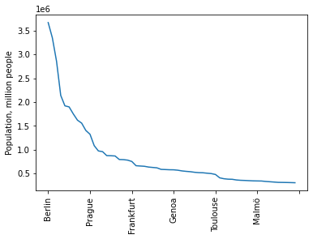
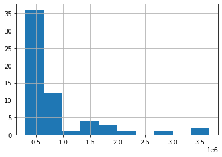

# The Battle of Neighborhoods in Europe: Choosing A City For Relocation
### By Sergei Perfilyev. June 2021
This notebook has been created for completing my capstone project for IBM/Coursera Applied Data Science specialization.

The code below is to implement the following tasks:
1. Collect, clean and prepare necessary data for our analysis. We are using several Python libraries including `Requests` for loading webpages, `BeautifulSoap` for parsing HTML, `Pandas` for tabular data processing, and etc. The objects to explore are: major European cities and top-ranked European universities. 
2. Obtain geographical coordinates of various objects for further analysis. This is done with `GeoPy` library via HERE.COM API geocoder.
3. Visualize the results of our analysis using `Foluim` library for building geographical maps.
4. For the cities of interest, load info on recommended venues and their categorical distribution. This will be done with Foursquare REST API.
5. Prepare the data for processing and apply a clustering algorithm in order to group cities in partitions. We are using K-meand clustering method and `scikit-learn` Python package.

## 1.1. Install and import libraries for data preparation and processing


```python
# Install BeautifulSoup library, we'll use it for HTML parsing
!conda install -c conda-forge bs4 --yes
```

    Collecting package metadata (current_repodata.json): done
    Solving environment: done
    
    # All requested packages already installed.
    


```python
from bs4 import BeautifulSoup
import requests as rq
from requests.auth import HTTPDigestAuth
import json
import pandas as pd
import numpy as np
import re
from sklearn.cluster import KMeans
```


```python
# Read my keys, passwords and secrets for various APIs and websites
with open('my_secrets.json', 'r') as infile:
    my_secrets = json.load(infile)
```


```python
# Define a function to handle http responses
def get_html(response: rq.models.Response):
    if response.status_code // 100 == 2:
        print('HTTP request OK!')
        return response.text
    else:
        print('HTTP request failed!')
        return None
```

## 1.2. Prepare a dataset of European Union (EU) member countries


```python
# Let's get data from Eurostat official website
url_countries = "https://ec.europa.eu/eurostat/statistics-explained/index.php/Glossary:Country_codes"
html_countries = get_html(rq.get(url_countries))

# Parse web page and create a data frame containing all countries in the European Union (EU)
if html_countries:
    soup = BeautifulSoup(html_countries)
    cells = [cell.text.strip() for cell in soup.find('table').find_all('td')]
    df_countries = pd.DataFrame(data={'Code': cells[1::2], 'Country': cells[0::2]})
    df_countries.sort_values(by=['Country'], inplace=True, ignore_index=True)
    df_countries.Code = df_countries.Code.apply(lambda x: re.sub(r'[()]', '', x))
    df_countries.loc[df_countries.Country == 'Czechia', 'Country'] = 'Czech Republic'
    df_countries.set_index('Country', inplace=True)
```

    HTTP request OK!


```python
df_countries
```


<div>
<style scoped>
    .dataframe tbody tr th:only-of-type {
        vertical-align: middle;
    }

    .dataframe tbody tr th {
        vertical-align: top;
    }

    .dataframe thead th {
        text-align: right;
    }
</style>
<table border="1" class="dataframe">
  <thead>
    <tr style="text-align: right;">
      <th></th>
      <th>Code</th>
    </tr>
    <tr>
      <th>Country</th>
      <th></th>
    </tr>
  </thead>
  <tbody>
    <tr>
      <th>Austria</th>
      <td>AT</td>
    </tr>
    <tr>
      <th>Belgium</th>
      <td>BE</td>
    </tr>
    <tr>
      <th>Bulgaria</th>
      <td>BG</td>
    </tr>
    <tr>
      <th>Croatia</th>
      <td>HR</td>
    </tr>
    <tr>
      <th>Cyprus</th>
      <td>CY</td>
    </tr>
    <tr>
      <th>Czech Republic</th>
      <td>CZ</td>
    </tr>
    <tr>
      <th>Denmark</th>
      <td>DK</td>
    </tr>
    <tr>
      <th>Estonia</th>
      <td>EE</td>
    </tr>
    <tr>
      <th>Finland</th>
      <td>FI</td>
    </tr>
    <tr>
      <th>France</th>
      <td>FR</td>
    </tr>
    <tr>
      <th>Germany</th>
      <td>DE</td>
    </tr>
    <tr>
      <th>Greece</th>
      <td>EL</td>
    </tr>
    <tr>
      <th>Hungary</th>
      <td>HU</td>
    </tr>
    <tr>
      <th>Ireland</th>
      <td>IE</td>
    </tr>
    <tr>
      <th>Italy</th>
      <td>IT</td>
    </tr>
    <tr>
      <th>Latvia</th>
      <td>LV</td>
    </tr>
    <tr>
      <th>Lithuania</th>
      <td>LT</td>
    </tr>
    <tr>
      <th>Luxembourg</th>
      <td>LU</td>
    </tr>
    <tr>
      <th>Malta</th>
      <td>MT</td>
    </tr>
    <tr>
      <th>Netherlands</th>
      <td>NL</td>
    </tr>
    <tr>
      <th>Poland</th>
      <td>PL</td>
    </tr>
    <tr>
      <th>Portugal</th>
      <td>PT</td>
    </tr>
    <tr>
      <th>Romania</th>
      <td>RO</td>
    </tr>
    <tr>
      <th>Slovakia</th>
      <td>SK</td>
    </tr>
    <tr>
      <th>Slovenia</th>
      <td>SI</td>
    </tr>
    <tr>
      <th>Spain</th>
      <td>ES</td>
    </tr>
    <tr>
      <th>Sweden</th>
      <td>SE</td>
    </tr>
  </tbody>
</table>
</div>


## 1.3. Prepare a dataset of EU top universities


```python
# Define a function to request data from Times Higher Educations's website
# Use my credentials for authentication
request_TimesHE = lambda url: rq.get(
    url,
    auth=HTTPDigestAuth(my_secrets['TIMES_HE']['LOGIN'], my_secrets['TIMES_HE']['PASSWORD']),
    headers={'user-agent': 'Mozilla/5.0'}
)
```


```python
# Let's get data from Times Higher Education's website
url_univ = "https://www.timeshighereducation.com/student/best-universities/best-universities-europe"
html_univ = get_html(request_TimesHE(url_univ))

# Parse web page and create a data frame containing top european universities
if html_univ:
    univs = BeautifulSoup(html_univ).find('table').find_all('tr')
    df_univs = pd.DataFrame()
    for row in univs[1::]:
        row_cells = [cell.text.strip() for cell in row.find_all('td')]
        row_cells = row_cells[1:4] + [row.find('a').get('href')]
        df_univs = df_univs.append([row_cells], ignore_index=True)
    df_univs.columns = ['Rank', 'University', 'Country', 'URL']
    df_univs.set_index('Country', inplace=True)
    print(df_univs.shape)
```

    HTTP request OK!
    (531, 3)


```python
df_univs.head(10)
```


<div>
<style scoped>
    .dataframe tbody tr th:only-of-type {
        vertical-align: middle;
    }

    .dataframe tbody tr th {
        vertical-align: top;
    }

    .dataframe thead th {
        text-align: right;
    }
</style>
<table border="1" class="dataframe">
  <thead>
    <tr style="text-align: right;">
      <th></th>
      <th>Rank</th>
      <th>University</th>
      <th>URL</th>
    </tr>
    <tr>
      <th>Country</th>
      <th></th>
      <th></th>
      <th></th>
    </tr>
  </thead>
  <tbody>
    <tr>
      <th>United Kingdom</th>
      <td>1</td>
      <td>University of Oxford</td>
      <td>https://www.timeshighereducation.com/world-uni...</td>
    </tr>
    <tr>
      <th>United Kingdom</th>
      <td>2</td>
      <td>University of Cambridge</td>
      <td>https://www.timeshighereducation.com/world-uni...</td>
    </tr>
    <tr>
      <th>United Kingdom</th>
      <td>3</td>
      <td>Imperial College London</td>
      <td>https://www.timeshighereducation.com/world-uni...</td>
    </tr>
    <tr>
      <th>Switzerland</th>
      <td>4</td>
      <td>ETH Zurich</td>
      <td>https://www.timeshighereducation.com/world-uni...</td>
    </tr>
    <tr>
      <th>United Kingdom</th>
      <td>5</td>
      <td>UCL</td>
      <td>https://www.timeshighereducation.com/world-uni...</td>
    </tr>
    <tr>
      <th>United Kingdom</th>
      <td>6</td>
      <td>London School of Economics and Political Science</td>
      <td>https://www.timeshighereducation.com/world-uni...</td>
    </tr>
    <tr>
      <th>United Kingdom</th>
      <td>7</td>
      <td>University of Edinburgh</td>
      <td>https://www.timeshighereducation.com/world-uni...</td>
    </tr>
    <tr>
      <th>Germany</th>
      <td>8</td>
      <td>LMU Munich</td>
      <td>https://www.timeshighereducation.com/world-uni...</td>
    </tr>
    <tr>
      <th>United Kingdom</th>
      <td>9</td>
      <td>King’s College London</td>
      <td>https://www.timeshighereducation.com/world-uni...</td>
    </tr>
    <tr>
      <th>Sweden</th>
      <td>10</td>
      <td>Karolinska Institute</td>
      <td>https://www.timeshighereducation.com/world-uni...</td>
    </tr>
  </tbody>
</table>
</div>


```python
df_univs.tail(10)
```


<div>
<style scoped>
    .dataframe tbody tr th:only-of-type {
        vertical-align: middle;
    }

    .dataframe tbody tr th {
        vertical-align: top;
    }

    .dataframe thead th {
        text-align: right;
    }
</style>
<table border="1" class="dataframe">
  <thead>
    <tr style="text-align: right;">
      <th></th>
      <th>Rank</th>
      <th>University</th>
      <th>URL</th>
    </tr>
    <tr>
      <th>Country</th>
      <th></th>
      <th></th>
      <th></th>
    </tr>
  </thead>
  <tbody>
    <tr>
      <th>Lithuania</th>
      <td>=418</td>
      <td>Vytautas Magnus University</td>
      <td>https://www.timeshighereducation.com/world-uni...</td>
    </tr>
    <tr>
      <th>Poland</th>
      <td>=418</td>
      <td>Warsaw University of Life Sciences – SGGW</td>
      <td>https://www.timeshighereducation.com/world-uni...</td>
    </tr>
    <tr>
      <th>Poland</th>
      <td>=418</td>
      <td>Warsaw University of Technology</td>
      <td>https://www.timeshighereducation.com/world-uni...</td>
    </tr>
    <tr>
      <th>Czech Republic</th>
      <td>=418</td>
      <td>University of West Bohemia</td>
      <td>https://www.timeshighereducation.com/world-uni...</td>
    </tr>
    <tr>
      <th>Poland</th>
      <td>=418</td>
      <td>Wrocław University of Environmental and Life S...</td>
      <td>https://www.timeshighereducation.com/world-uni...</td>
    </tr>
    <tr>
      <th>Poland</th>
      <td>=418</td>
      <td>Wrocław University of Science and Technology</td>
      <td>https://www.timeshighereducation.com/world-uni...</td>
    </tr>
    <tr>
      <th>Poland</th>
      <td>=418</td>
      <td>University of Wrocław</td>
      <td>https://www.timeshighereducation.com/world-uni...</td>
    </tr>
    <tr>
      <th>Ukraine</th>
      <td>=418</td>
      <td>Yuriy Fedkovych Chernivtsi National University</td>
      <td>https://www.timeshighereducation.com/world-uni...</td>
    </tr>
    <tr>
      <th>Croatia</th>
      <td>=418</td>
      <td>University of Zagreb</td>
      <td>https://www.timeshighereducation.com/world-uni...</td>
    </tr>
    <tr>
      <th>Slovakia</th>
      <td>=418</td>
      <td>University of Žilina</td>
      <td>https://www.timeshighereducation.com/world-uni...</td>
    </tr>
  </tbody>
</table>
</div>


```python
# Select top universities from the countries included in the EU
TOP_TO_SEARCH = 200
df_eu_univs = df_countries.join(df_univs, how='inner').reset_index()
df_eu_univs.Rank = pd.to_numeric(df_eu_univs.Rank.str.replace('=', ''))
df_eu_univs = df_eu_univs.sort_values(by='Rank', ignore_index=True).head(TOP_TO_SEARCH)
df_eu_univs.head(10)
```


<div>
<style scoped>
    .dataframe tbody tr th:only-of-type {
        vertical-align: middle;
    }

    .dataframe tbody tr th {
        vertical-align: top;
    }

    .dataframe thead th {
        text-align: right;
    }
</style>
<table border="1" class="dataframe">
  <thead>
    <tr style="text-align: right;">
      <th></th>
      <th>Country</th>
      <th>Code</th>
      <th>Rank</th>
      <th>University</th>
      <th>URL</th>
    </tr>
  </thead>
  <tbody>
    <tr>
      <th>0</th>
      <td>Germany</td>
      <td>DE</td>
      <td>8</td>
      <td>LMU Munich</td>
      <td>https://www.timeshighereducation.com/world-uni...</td>
    </tr>
    <tr>
      <th>1</th>
      <td>Sweden</td>
      <td>SE</td>
      <td>10</td>
      <td>Karolinska Institute</td>
      <td>https://www.timeshighereducation.com/world-uni...</td>
    </tr>
    <tr>
      <th>2</th>
      <td>Germany</td>
      <td>DE</td>
      <td>11</td>
      <td>Technical University of Munich</td>
      <td>https://www.timeshighereducation.com/world-uni...</td>
    </tr>
    <tr>
      <th>3</th>
      <td>Germany</td>
      <td>DE</td>
      <td>12</td>
      <td>Heidelberg University</td>
      <td>https://www.timeshighereducation.com/world-uni...</td>
    </tr>
    <tr>
      <th>4</th>
      <td>Belgium</td>
      <td>BE</td>
      <td>14</td>
      <td>KU Leuven</td>
      <td>https://www.timeshighereducation.com/world-uni...</td>
    </tr>
    <tr>
      <th>5</th>
      <td>France</td>
      <td>FR</td>
      <td>15</td>
      <td>Paris Sciences et Lettres – PSL Research Unive...</td>
      <td>https://www.timeshighereducation.com/world-uni...</td>
    </tr>
    <tr>
      <th>6</th>
      <td>Netherlands</td>
      <td>NL</td>
      <td>17</td>
      <td>Wageningen University &amp; Research</td>
      <td>https://www.timeshighereducation.com/world-uni...</td>
    </tr>
    <tr>
      <th>7</th>
      <td>Netherlands</td>
      <td>NL</td>
      <td>18</td>
      <td>University of Amsterdam</td>
      <td>https://www.timeshighereducation.com/world-uni...</td>
    </tr>
    <tr>
      <th>8</th>
      <td>Netherlands</td>
      <td>NL</td>
      <td>19</td>
      <td>Leiden University</td>
      <td>https://www.timeshighereducation.com/world-uni...</td>
    </tr>
    <tr>
      <th>9</th>
      <td>Netherlands</td>
      <td>NL</td>
      <td>20</td>
      <td>Erasmus University Rotterdam</td>
      <td>https://www.timeshighereducation.com/world-uni...</td>
    </tr>
  </tbody>
</table>
</div>


```python
df_eu_univs.tail(10)
```


<div>
<style scoped>
    .dataframe tbody tr th:only-of-type {
        vertical-align: middle;
    }

    .dataframe tbody tr th {
        vertical-align: top;
    }

    .dataframe thead th {
        text-align: right;
    }
</style>
<table border="1" class="dataframe">
  <thead>
    <tr style="text-align: right;">
      <th></th>
      <th>Country</th>
      <th>Code</th>
      <th>Rank</th>
      <th>University</th>
      <th>URL</th>
    </tr>
  </thead>
  <tbody>
    <tr>
      <th>190</th>
      <td>Czech Republic</td>
      <td>CZ</td>
      <td>279</td>
      <td>Masaryk University</td>
      <td>https://www.timeshighereducation.com/world-uni...</td>
    </tr>
    <tr>
      <th>191</th>
      <td>Greece</td>
      <td>EL</td>
      <td>279</td>
      <td>University of Thessaly</td>
      <td>https://www.timeshighereducation.com/world-uni...</td>
    </tr>
    <tr>
      <th>192</th>
      <td>Greece</td>
      <td>EL</td>
      <td>279</td>
      <td>Athens University of Economics and Business</td>
      <td>https://www.timeshighereducation.com/world-uni...</td>
    </tr>
    <tr>
      <th>193</th>
      <td>Austria</td>
      <td>AT</td>
      <td>279</td>
      <td>Johannes Kepler University of Linz</td>
      <td>https://www.timeshighereducation.com/world-uni...</td>
    </tr>
    <tr>
      <th>194</th>
      <td>Austria</td>
      <td>AT</td>
      <td>279</td>
      <td>University of Graz</td>
      <td>https://www.timeshighereducation.com/world-uni...</td>
    </tr>
    <tr>
      <th>195</th>
      <td>Germany</td>
      <td>DE</td>
      <td>279</td>
      <td>Hamburg University of Technology</td>
      <td>https://www.timeshighereducation.com/world-uni...</td>
    </tr>
    <tr>
      <th>196</th>
      <td>Germany</td>
      <td>DE</td>
      <td>279</td>
      <td>University of Kaiserslautern</td>
      <td>https://www.timeshighereducation.com/world-uni...</td>
    </tr>
    <tr>
      <th>197</th>
      <td>Portugal</td>
      <td>PT</td>
      <td>279</td>
      <td>University of Aveiro</td>
      <td>https://www.timeshighereducation.com/world-uni...</td>
    </tr>
    <tr>
      <th>198</th>
      <td>Portugal</td>
      <td>PT</td>
      <td>279</td>
      <td>University of Beira Interior</td>
      <td>https://www.timeshighereducation.com/world-uni...</td>
    </tr>
    <tr>
      <th>199</th>
      <td>Portugal</td>
      <td>PT</td>
      <td>279</td>
      <td>University of Coimbra</td>
      <td>https://www.timeshighereducation.com/world-uni...</td>
    </tr>
  </tbody>
</table>
</div>


```python
df_eu_univs.drop(df_eu_univs.columns[0], axis=1, inplace=True)
df_eu_univs.to_csv('top_eu_univs.csv')
```


```python
# Parse detailed webpages and get addresses of all universities into a list of strings
details = [''] * df_eu_univs.shape[0]
for i in df_eu_univs.index:
    html_univ_detail = get_html(request_TimesHE(df_eu_univs.loc[i, "URL"]))
    if html_univ_detail:
        print(i, ': Details downloaded OK!')
        soup = BeautifulSoup(html_univ_detail)
        details[i] = soup.find(class_="institution-info__contact-detail institution-info__contact-detail--address").text.strip()
    else:
        print(i, ': Could not download details!')
```

    HTTP request OK!
    0 : Details downloaded OK!
    HTTP request OK!
    1 : Details downloaded OK!
    HTTP request OK!
    2 : Details downloaded OK!
    HTTP request OK!
    3 : Details downloaded OK!
    HTTP request OK!
    4 : Details downloaded OK!
    HTTP request OK!
    5 : Details downloaded OK!
    HTTP request OK!
    6 : Details downloaded OK!
    HTTP request OK!
    7 : Details downloaded OK!
    HTTP request OK!
    8 : Details downloaded OK!
    HTTP request OK!
    9 : Details downloaded OK!
    HTTP request OK!
    10 : Details downloaded OK!
    HTTP request OK!
    11 : Details downloaded OK!
    HTTP request OK!
    12 : Details downloaded OK!
    HTTP request OK!
    13 : Details downloaded OK!
    HTTP request OK!
    14 : Details downloaded OK!
    HTTP request OK!
    15 : Details downloaded OK!
    HTTP request OK!
    16 : Details downloaded OK!
    HTTP request OK!
    17 : Details downloaded OK!
    HTTP request OK!
    18 : Details downloaded OK!
    HTTP request OK!
    19 : Details downloaded OK!
    HTTP request OK!
    20 : Details downloaded OK!
    HTTP request OK!
    21 : Details downloaded OK!
    HTTP request OK!
    22 : Details downloaded OK!
    HTTP request OK!
    23 : Details downloaded OK!
    HTTP request OK!
    24 : Details downloaded OK!
    HTTP request OK!
    25 : Details downloaded OK!
    HTTP request OK!
    26 : Details downloaded OK!
    HTTP request OK!
    27 : Details downloaded OK!
    HTTP request OK!
    28 : Details downloaded OK!
    HTTP request OK!
    29 : Details downloaded OK!
    HTTP request OK!
    30 : Details downloaded OK!
    HTTP request OK!
    31 : Details downloaded OK!
    HTTP request OK!
    32 : Details downloaded OK!
    HTTP request OK!
    33 : Details downloaded OK!
    HTTP request OK!
    34 : Details downloaded OK!
    HTTP request OK!
    35 : Details downloaded OK!
    HTTP request OK!
    36 : Details downloaded OK!
    HTTP request OK!
    37 : Details downloaded OK!
    HTTP request OK!
    38 : Details downloaded OK!
    HTTP request OK!
    39 : Details downloaded OK!
    HTTP request OK!
    40 : Details downloaded OK!
    HTTP request OK!
    41 : Details downloaded OK!
    HTTP request OK!
    42 : Details downloaded OK!
    HTTP request OK!
    43 : Details downloaded OK!
    HTTP request OK!
    44 : Details downloaded OK!
    HTTP request OK!
    45 : Details downloaded OK!
    HTTP request OK!
    46 : Details downloaded OK!
    HTTP request OK!
    47 : Details downloaded OK!
    HTTP request OK!
    48 : Details downloaded OK!
    HTTP request OK!
    49 : Details downloaded OK!
    HTTP request OK!
    50 : Details downloaded OK!
    HTTP request OK!
    51 : Details downloaded OK!
    HTTP request OK!
    52 : Details downloaded OK!
    HTTP request OK!
    53 : Details downloaded OK!
    HTTP request OK!
    54 : Details downloaded OK!
    HTTP request OK!
    55 : Details downloaded OK!
    HTTP request OK!
    56 : Details downloaded OK!
    HTTP request OK!
    57 : Details downloaded OK!
    HTTP request OK!
    58 : Details downloaded OK!
    HTTP request OK!
    59 : Details downloaded OK!
    HTTP request OK!
    60 : Details downloaded OK!
    HTTP request OK!
    61 : Details downloaded OK!
    HTTP request OK!
    62 : Details downloaded OK!
    HTTP request OK!
    63 : Details downloaded OK!
    HTTP request OK!
    64 : Details downloaded OK!
    HTTP request OK!
    65 : Details downloaded OK!
    HTTP request OK!
    66 : Details downloaded OK!
    HTTP request OK!
    67 : Details downloaded OK!
    HTTP request OK!
    68 : Details downloaded OK!
    HTTP request OK!
    69 : Details downloaded OK!
    HTTP request OK!
    70 : Details downloaded OK!
    HTTP request OK!
    71 : Details downloaded OK!
    HTTP request OK!
    72 : Details downloaded OK!
    HTTP request OK!
    73 : Details downloaded OK!
    HTTP request OK!
    74 : Details downloaded OK!
    HTTP request OK!
    75 : Details downloaded OK!
    HTTP request OK!
    76 : Details downloaded OK!
    HTTP request OK!
    77 : Details downloaded OK!
    HTTP request OK!
    78 : Details downloaded OK!
    HTTP request OK!
    79 : Details downloaded OK!
    HTTP request OK!
    80 : Details downloaded OK!
    HTTP request OK!
    81 : Details downloaded OK!
    HTTP request OK!
    82 : Details downloaded OK!
    HTTP request OK!
    83 : Details downloaded OK!
    HTTP request OK!
    84 : Details downloaded OK!
    HTTP request OK!
    85 : Details downloaded OK!
    HTTP request OK!
    86 : Details downloaded OK!
    HTTP request OK!
    87 : Details downloaded OK!
    HTTP request OK!
    88 : Details downloaded OK!
    HTTP request OK!
    89 : Details downloaded OK!
    HTTP request OK!
    90 : Details downloaded OK!
    HTTP request OK!
    91 : Details downloaded OK!
    HTTP request OK!
    92 : Details downloaded OK!
    HTTP request OK!
    93 : Details downloaded OK!
    HTTP request OK!
    94 : Details downloaded OK!
    HTTP request OK!
    95 : Details downloaded OK!
    HTTP request OK!
    96 : Details downloaded OK!
    HTTP request OK!
    97 : Details downloaded OK!
    HTTP request OK!
    98 : Details downloaded OK!
    HTTP request OK!
    99 : Details downloaded OK!
    HTTP request OK!
    100 : Details downloaded OK!
    HTTP request OK!
    101 : Details downloaded OK!
    HTTP request OK!
    102 : Details downloaded OK!
    HTTP request OK!
    103 : Details downloaded OK!
    HTTP request OK!
    104 : Details downloaded OK!
    HTTP request OK!
    105 : Details downloaded OK!
    HTTP request OK!
    106 : Details downloaded OK!
    HTTP request OK!
    107 : Details downloaded OK!
    HTTP request OK!
    108 : Details downloaded OK!
    HTTP request OK!
    109 : Details downloaded OK!
    HTTP request OK!
    110 : Details downloaded OK!
    HTTP request OK!
    111 : Details downloaded OK!
    HTTP request OK!
    112 : Details downloaded OK!
    HTTP request OK!
    113 : Details downloaded OK!
    HTTP request OK!
    114 : Details downloaded OK!
    HTTP request OK!
    115 : Details downloaded OK!
    HTTP request OK!
    116 : Details downloaded OK!
    HTTP request OK!
    117 : Details downloaded OK!
    HTTP request OK!
    118 : Details downloaded OK!
    HTTP request OK!
    119 : Details downloaded OK!
    HTTP request OK!
    120 : Details downloaded OK!
    HTTP request OK!
    121 : Details downloaded OK!
    HTTP request OK!
    122 : Details downloaded OK!
    HTTP request OK!
    123 : Details downloaded OK!
    HTTP request OK!
    124 : Details downloaded OK!
    HTTP request OK!
    125 : Details downloaded OK!
    HTTP request OK!
    126 : Details downloaded OK!
    HTTP request OK!
    127 : Details downloaded OK!
    HTTP request OK!
    128 : Details downloaded OK!
    HTTP request OK!
    129 : Details downloaded OK!
    HTTP request OK!
    130 : Details downloaded OK!
    HTTP request OK!
    131 : Details downloaded OK!
    HTTP request OK!
    132 : Details downloaded OK!
    HTTP request OK!
    133 : Details downloaded OK!
    HTTP request OK!
    134 : Details downloaded OK!
    HTTP request OK!
    135 : Details downloaded OK!
    HTTP request OK!
    136 : Details downloaded OK!
    HTTP request OK!
    137 : Details downloaded OK!
    HTTP request OK!
    138 : Details downloaded OK!
    HTTP request OK!
    139 : Details downloaded OK!
    HTTP request OK!
    140 : Details downloaded OK!
    HTTP request OK!
    141 : Details downloaded OK!
    HTTP request OK!
    142 : Details downloaded OK!
    HTTP request OK!
    143 : Details downloaded OK!
    HTTP request OK!
    144 : Details downloaded OK!
    HTTP request OK!
    145 : Details downloaded OK!
    HTTP request OK!
    146 : Details downloaded OK!
    HTTP request OK!
    147 : Details downloaded OK!
    HTTP request OK!
    148 : Details downloaded OK!
    HTTP request OK!
    149 : Details downloaded OK!
    HTTP request OK!
    150 : Details downloaded OK!
    HTTP request OK!
    151 : Details downloaded OK!
    HTTP request OK!
    152 : Details downloaded OK!
    HTTP request OK!
    153 : Details downloaded OK!
    HTTP request OK!
    154 : Details downloaded OK!
    HTTP request OK!
    155 : Details downloaded OK!
    HTTP request OK!
    156 : Details downloaded OK!
    HTTP request OK!
    157 : Details downloaded OK!
    HTTP request OK!
    158 : Details downloaded OK!
    HTTP request OK!
    159 : Details downloaded OK!
    HTTP request OK!
    160 : Details downloaded OK!
    HTTP request OK!
    161 : Details downloaded OK!
    HTTP request OK!
    162 : Details downloaded OK!
    HTTP request OK!
    163 : Details downloaded OK!
    HTTP request OK!
    164 : Details downloaded OK!
    HTTP request OK!
    165 : Details downloaded OK!
    HTTP request OK!
    166 : Details downloaded OK!
    HTTP request OK!
    167 : Details downloaded OK!
    HTTP request OK!
    168 : Details downloaded OK!
    HTTP request OK!
    169 : Details downloaded OK!
    HTTP request OK!
    170 : Details downloaded OK!
    HTTP request OK!
    171 : Details downloaded OK!
    HTTP request OK!
    172 : Details downloaded OK!
    HTTP request OK!
    173 : Details downloaded OK!
    HTTP request OK!
    174 : Details downloaded OK!
    HTTP request OK!
    175 : Details downloaded OK!
    HTTP request OK!
    176 : Details downloaded OK!
    HTTP request OK!
    177 : Details downloaded OK!
    HTTP request OK!
    178 : Details downloaded OK!
    HTTP request OK!
    179 : Details downloaded OK!
    HTTP request OK!
    180 : Details downloaded OK!
    HTTP request OK!
    181 : Details downloaded OK!
    HTTP request OK!
    182 : Details downloaded OK!
    HTTP request OK!
    183 : Details downloaded OK!
    HTTP request OK!
    184 : Details downloaded OK!
    HTTP request OK!
    185 : Details downloaded OK!
    HTTP request OK!
    186 : Details downloaded OK!
    HTTP request OK!
    187 : Details downloaded OK!
    HTTP request OK!
    188 : Details downloaded OK!
    HTTP request OK!
    189 : Details downloaded OK!
    HTTP request OK!
    190 : Details downloaded OK!
    HTTP request OK!
    191 : Details downloaded OK!
    HTTP request OK!
    192 : Details downloaded OK!
    HTTP request OK!
    193 : Details downloaded OK!
    HTTP request OK!
    194 : Details downloaded OK!
    HTTP request OK!
    195 : Details downloaded OK!
    HTTP request OK!
    196 : Details downloaded OK!
    HTTP request OK!
    197 : Details downloaded OK!
    HTTP request OK!
    198 : Details downloaded OK!
    HTTP request OK!
    199 : Details downloaded OK!


```python
print(details)
```

    ['Geschwister-Scholl-Platz 1, Munich, 80539, Germany', 'SE-171 77, Stockholm, Sweden', 'Arcisstraße 21, Munich, D-80333, Germany', '310 E. Market Street, Tiffin, Ohio, 44883, United States', 'Oude Markt 13, Leuven, 3000, Belgium', '60 rue Mazarine, Paris, 75006, France', 'Droevendaalsesteeg 4, Building nr. 104, Wageningen, 6702 PB, Netherlands', 'P.O. Box 19268, 1000 GG Amsterdam, Netherlands', 'PO Box 9500, Leiden, 2300, Netherlands', 'Burgemeester Oudlaan 50, Rotterdam, 3062 PA, Netherlands', 'Charitéplatz 1, 10117 Berlin, Germany', 'P.O Box 80125, TC Utrecht, 3508, Netherlands', 'Postbus 5, 2600 AA Delft, Netherlands', 'Geschwister-Scholl-Platz, Tubingen, 72074, Germany', 'Unter den Linden 6, D-10099 Berlin, Germany', 'PO Box 72, 9700 AB Groningen, Netherlands', 'Fahnenbergplatz, 79085 Freiburg, Germany', 'Nørregade 10 Postboks 2177, 1017 København K, Denmark', 'Route de Saclay, Palaiseau, 91128, France', "21 Rue de l'Ecole-de-Medecine, Paris, 75006, France", 'P.O. Box 4, (Yliopistonkatu 3), 00014, Finland', 'Sint-Pietersnieuwstraat, B - 9000 Ghent, Belgium', 'Box 117, 221 00 Lund, Sweden', 'Nordre Ringgade 1 8000 Aarhus C, DK - Denmark, Denmark', 'Templergraben 55, 52056 Aachen, Germany', 'P.O. Box 256, SE-751 05, Uppsala, Sweden', 'Regina Pacis Weg 3, D-53012 Bonn, Germany', 'De Boelelaan 1105, Amsterdam, 1081 HV, Netherlands', 'Kaiserswerther Str. 16-18, 14195 Berlin, Germany', 'Postbus 616, Maastricht, 6200 MD, Netherlands', 'Wilhelmsplatz, 37073 Göttingen, Germany', 'Mittelweg 177, 20148 Hamburg, Germany', '85 boulevard Saint-Germain, cedex 06, Paris, Ile-de-France, 75006, France', 'Comeniuslaan 4, 6525 HP Nijmegen, Netherlands', 'Sanderring 2, Würzburg, 97070, Germany', 'Straße des 17. Juni 135, D-10623 Berlin, Germany', 'Helmholtzstraße 16, Ulm, 89081, Germany', 'Schloss, 68131 Mannheim, Germany', 'Universitätsstraße 24, Cologne, 50931, Germany', 'D-01062 Dresden, Germany', 'Placa de la Merce 10-12, Barcelona, 08002, Spain', 'Postfach 10 01 31, D-33501 Bielefeld, Germany', "1 Place de l'Université, Louvain-la-Neuve, B-1348, Belgium", 'Universitätsring 1 1010, Vienna, Austria', 'Via Zamboni 33, Bologna, 40126, Italy', 'Prinsstraat 13, 2000 Antwerpen, Belgium', 'Piazza Martiri della Libertà,, Pisa, 56127, Italy', 'Espace Technologique, Bat. Discovery - RD 128 - 2e é, Saint-Aubin, 91190, France', 'Piazza dei Cavalieri, 7, Pisa, 56126, Italy', 'Placa Civica, Campus de la UAB, Barcelona, 08193, Spain', 'SE-106 91, Stockholm, Sweden', 'Postbus 513, Eindhoven, 5600, Netherlands', 'Anker Engelunds Vej 1, 2800 Kgs. Lyngby, Denmark', 'PO Box 100, SE-405 30, Gothenburg, Sweden', 'Schlossplatz 2, 48149 Munster, Germany', 'Schlossplatz 4, Erlangen, 91054, Germany', 'Gr. Via de les Corts Catalanes, 585, Barcelona, 08007, Spain', 'Piazzale Aldo Moro 5, Rome, 00185, Italy', '19 place Marguerite Perey F-91120, Palaiseau, France', 'Universitätsstraße 2, Essen, 45141, Germany', 'Warandelaan 2, AB Tilburg, 5037, Netherlands', 'PO Box 217, 7500 AE Enschede, Netherlands', 'Schloss Hohenheim 1, 70599 Stuttgart, Germany', 'Kaiserstraße 12, Karlsruhe, 76131, Germany', 'Avenue Franklin Roosevelt 50, 1050 Bruxelles, Belgium', "2, avenue de l'Université, L-4365 Esch-sur-Alzette, Luxembourg", 'Universitätsring 1 1010, Vienna, Austria', 'PO Box 18000, Aalto, 00076, Finland', 'Maskingränd 2, Göteborg, 412 58, Sweden', 'Universitätsplatz 3, A - 8010 Graz, Austria', 'Solbjerg Plads 3, DK-2000 Frederiksberg, Denmark', 'Fredrik Bajers Vej 5 P.O. Box 159, DK - 9100 Aalborg, Denmark', 'SE-100 44, Stockholm, Sweden', 'Innrain 52, A-6020 Innsbruck, Austria', 'Campusvej 55 DK-5230, Odense M, Denmark', 'Universitätsstraße 10, Konstanz, 78464, Germany', 'Fürstengraben 1, Jena, 07743, Germany', 'Grueneburgplatz 1/2nd floor, 60323 Frankfurt, Germany', 'Pleinlaan 2, 1050 Brussel, Belgium', 'Via 8 Febbraio 2, Padova, 35122, Italy', 'Via Olgettina 58, Milano, 20123, Italy', 'Jacobs University Bremen Campus Ring 1, 28759 Bremen, Germany', 'Ülikooli 18, Tartu, 50090, Estonia', 'Am Neuen Palais 10, 14469 Potsdam, Germany', 'Christian-Albrechts-Platz 4, 24118 Kiel, Germany', "45 Rue d'Ulm, Cedex 05, Paris, 75230, France", '6-8 avenue Blaise-Pascal Cité Descartes, 77455 Champs-sur-Marne, Marne-la-Vallée, France', 'Universitätsstraße 150, 44801 Bochum, Germany', 'Pamplona, Navarra, 31009, Spain', 'Domstraße 11, Greifswald, 17489, Germany', '163 rue Auguste Broussonnet, 34090 Montpellier, France', 'Karolinenplatz 5, Darmstadt, 64289, Germany', 'Innstraße 41, D-94032 Passau, Germany', 'Biegenstraße 10, D-35032 Marburg, Germany', 'Madrid, 28049, Spain', 'Universitätsstraße 65-67, 9020 Klagenfurt am Wörthersee, Austria', 'Pentti Kaiteran katu 1, 90570 Oulu, Finland', 'Saarstr. 21 D 55122, Mainz, Germany', 'Via Calepina, 14, Trento, 38122, Italy', 'Kalevantie 4, Tampere, 33100, Finland', '30 Archbishop Kyprianos Str, 3036 Lemesos, Cyprus', 'Fakultetsgatan 1, Örebro SE 70182, Sweden', 'Universitätsstraße 30, 95440 Bayreuth, Germany', 'Place du 20-Août 7, Liege, 4000, Belgium', 'Keplerstraße 7, Stuttgart, 70174, Germany', 'SE-901 87, Umea, Sweden', 'Via Festa del Perdono 7, Milano, 20122, Italy', 'SLU, P.O. Box 7070, SE-750 07, Sweden', 'Via Festa del Perdono 7, Milano, 20122, Italy', 'Rethymnon, Crete, 74100, Greece', 'Jardin du Pharo, 58, bd Charles Livon, Marseille, 13284, France', "621 Central Avenue, Saint Martin d'Heres, 38400, France", 'La Chantrerie 4 rue Alfred Kastler, BP 20722, Nantes, Cedex 3, 44307, France', '55 avenue de Paris, Versailles, 78035, France', 'Campus de Campolide, 1099-085 Lisboa, Portugal', 'Palma de Cima, 1649-023 Lisbon, Portugal', 'Turku, 20014, Finland', 'Yliopistonkatu 34, Lappeenranta, 53850, Finland', 'Innrain 52, A-6020 Innsbruck, Austria', 'Martelarenlaan 42, 3500 Hasselt, Belgium', 'Via Festa del Perdono 7, Milano, 20122, Italy', 'Piazza Umberto I, Bari, 70121, Italy', 'C/ Isaac Peral, Madrid, 58 - 28040, Spain', 'Praça Gomes Teixeira, Porto, 4099-002, Portugal', 'Karlsplatz 13, 1040 Vienna, Austria', '30 Panepistimiou Ave, 106 79 Athens, Greece', "Via dell'Artigliere 8, Verona, 37129, Italy", 'Piazza Guerrazzi, Benevento, 82100, Italy', 'Via Giovanni Paolo II, 132, Fisciano Salerno, 84084, Italy', 'Via Cracovia snc, Rome, 00133, Italy', 'Via Giovanni Amendola, 126/B, Bari, 70126, Italy', 'Ülloi út 26, H - 1085 Budapest, Hungary', 'Linkoping, SE-581 83, Sweden', 'Lungarno Pacinotti 43, Pisa, 56126, Italy', 'Strada Nuova 65, Pavia, 27100, Italy', 'Corso Umberto I 40, Napoli, 80138, Italy', 'Via Università 4, Modena, 41121, Italy', 'Avda. Blasco Ibáñez 13, Valencia, 46010, Spain', 'Piazza Universita, 1, Bozen-Bolzano, 39100, Italy', 'P.zza S.Marco 4, Firenze, Florence, 50121, Italy', 'Piazza del Mercato, 15, Brescia, 25121, Italy', 'Via Giuseppe Verdi 8, Turin, 10124, Italy', 'Via Balbi, 5, Genova, 16126, Italy', 'via Banchi di Sotto 55, Siena, 53100, Italy', '146 rue Léo Saignat, S 61292, Bordeaux, 33 076, France', 'PO Box 35, FI-40014, Finland', 'Yliopistokatu 2 P.O. Box 111, FI-80101 Joensuu, Finland', '1 rue de la Noë, Nantes, Pays de la Loire, 44321, France', '41 Allées Jules Guesde, 31013 Toulouse, France', '42 Rue Scheffer, Paris, 75116, France', 'Bibliothekstraße 1, Bremen, 28359, Germany', 'Ovocný trh 3-5, Prague 1, 116 36, Czech Republic', 'August-Schmidt-Straße 4, Dortmund, 44227, Germany', 'Ludwigstraße 23, 35390 Giessen, Germany', '9 rue Charles Fourier, Evry, 91011, France', 'Piazza Università, 2, Catania, 95131, Italy', 'via Ludovico Ariosto, 35, Ferrara, 44121, Italy', '27 Rue Saint Guillaume, 75337 Paris, France', 'Piazza Pugliatti, 1, Messina, 98122, Italy', 'Corso Duca degli Abruzzi 24, Torino, 10129, Italy', 'Piazza Università 21, Sassari, Italy', 'Piazzale Europa 1, Trieste, 34127, Italy', 'Via S.M. in Gradi n.4, Viterbo, 01100, Italy', 'Via Aurelio Saffi 2, Urbino, 61029, Italy', 'Alameda da Universidade Cidade Universitária, 1649 - 004 Lisboa, Portugal', 'Avda. de Séneca, 2, Ciudad Universitaria, Madrid, 28040, Spain', "Palazzo Camponeschi, 2 Piazza Santa Margherita, L'Aquila, Abruzzo, 67100, Italy", '43 Blvd du 11 Novembre 1918, 69622 Villeurbanne cedex, Lyon, France', 'ul. Golebia 24, Krakow, 31-007, Poland', 'Plateau de Moulon, 3 rue Joliot-Curie, F-91192 Gif-sur-Yvette, France', 'Rechbauerstraße 12, 8010 Graz, Austria', 'Grand Château 28, avenue Valrose, BP 2135, Nice cedex 2, 06103, France', 'Welfengarten 1, Hannover, D-30167, Germany', 'Via Ravasi, 2, Varese, Lombardia, 21100, Italy', '1 Panepistimiou Avenue, Aglantzia, Nicosia, Cyprus', '4 rue Blaise Pascal CS 90032, F-67081 Strasbourg cedex, France', '8 Krízkovskeho, Olomouc, 771 47, Czech Republic', '34 cours Léopold, CS 25233, Nancy, 54052, France', '1, quai de Tourville, BP 13522, Nantes, 44035, France', '20 avenue Albert Einstein, 69621 Villeurbanne, France', 'Msida MSD 2080, Malta', '12 place du Panthéon, 75231 Paris, France', 'P.O. Box 1186, 45110 Ioannina, Greece', '42, rue Paul Duez, Lille, 59000, France', 'Heroon Polytechniou 9, 15780 Zografou, Greece', 'Cra. de Valldemossa, Palma, Baleares, 07122, Spain', 'Raina bulvaris 19, Riga, LV 1586, Latvia', 'Avenida de las Universidades,, 24, Bizkaia, 48007, Spain', 'Via Palladio 8, Udine, 33100, Italy', 'Piazza Tancredi, Lecce (LE), 73100, Italy', 'Žerotínovo námestí 9 Rektorát, Brno-mesto, Brno, Czech Republic', 'Argonafton & Filellinon, 38221 Volos, Greece', '76, Patission Str., GR10434 Athens, Greece', 'Altenberger Straße 69, A-4040 Linz, Austria', 'Universitätsplatz 3, A - 8010 Graz, Austria', 'Am Schwarzenberg, Hamburg, 21073, Germany', 'Gottlieb-Daimler-Strasse, Kaiserslautern, 67663, Germany', 'Aveiro, 3810-193, Portugal', 'Convento de Sto. Antonio, 6201-001 Covilha, Portugal', 'Paço das Escolas, Coimbra, 3004-531, Portugal']


```python
# Append addresses as a new column to the dataset
df_eu_univs['Address'] = details
df_eu_univs.head()
```


<div>
<style scoped>
    .dataframe tbody tr th:only-of-type {
        vertical-align: middle;
    }

    .dataframe tbody tr th {
        vertical-align: top;
    }

    .dataframe thead th {
        text-align: right;
    }
</style>
<table border="1" class="dataframe">
  <thead>
    <tr style="text-align: right;">
      <th></th>
      <th>Code</th>
      <th>Rank</th>
      <th>University</th>
      <th>URL</th>
      <th>Address</th>
    </tr>
  </thead>
  <tbody>
    <tr>
      <th>0</th>
      <td>DE</td>
      <td>8</td>
      <td>LMU Munich</td>
      <td>https://www.timeshighereducation.com/world-uni...</td>
      <td>Geschwister-Scholl-Platz 1, Munich, 80539, Ger...</td>
    </tr>
    <tr>
      <th>1</th>
      <td>SE</td>
      <td>10</td>
      <td>Karolinska Institute</td>
      <td>https://www.timeshighereducation.com/world-uni...</td>
      <td>SE-171 77, Stockholm, Sweden</td>
    </tr>
    <tr>
      <th>2</th>
      <td>DE</td>
      <td>11</td>
      <td>Technical University of Munich</td>
      <td>https://www.timeshighereducation.com/world-uni...</td>
      <td>Arcisstraße 21, Munich, D-80333, Germany</td>
    </tr>
    <tr>
      <th>3</th>
      <td>DE</td>
      <td>12</td>
      <td>Heidelberg University</td>
      <td>https://www.timeshighereducation.com/world-uni...</td>
      <td>310 E. Market Street, Tiffin, Ohio, 44883, Uni...</td>
    </tr>
    <tr>
      <th>4</th>
      <td>BE</td>
      <td>14</td>
      <td>KU Leuven</td>
      <td>https://www.timeshighereducation.com/world-uni...</td>
      <td>Oude Markt 13, Leuven, 3000, Belgium</td>
    </tr>
  </tbody>
</table>
</div>


```python
df_eu_univs.tail()
```


<div>
<style scoped>
    .dataframe tbody tr th:only-of-type {
        vertical-align: middle;
    }

    .dataframe tbody tr th {
        vertical-align: top;
    }

    .dataframe thead th {
        text-align: right;
    }
</style>
<table border="1" class="dataframe">
  <thead>
    <tr style="text-align: right;">
      <th></th>
      <th>Code</th>
      <th>Rank</th>
      <th>University</th>
      <th>URL</th>
      <th>Address</th>
    </tr>
  </thead>
  <tbody>
    <tr>
      <th>195</th>
      <td>DE</td>
      <td>279</td>
      <td>Hamburg University of Technology</td>
      <td>https://www.timeshighereducation.com/world-uni...</td>
      <td>Am Schwarzenberg, Hamburg, 21073, Germany</td>
    </tr>
    <tr>
      <th>196</th>
      <td>DE</td>
      <td>279</td>
      <td>University of Kaiserslautern</td>
      <td>https://www.timeshighereducation.com/world-uni...</td>
      <td>Gottlieb-Daimler-Strasse, Kaiserslautern, 6766...</td>
    </tr>
    <tr>
      <th>197</th>
      <td>PT</td>
      <td>279</td>
      <td>University of Aveiro</td>
      <td>https://www.timeshighereducation.com/world-uni...</td>
      <td>Aveiro, 3810-193, Portugal</td>
    </tr>
    <tr>
      <th>198</th>
      <td>PT</td>
      <td>279</td>
      <td>University of Beira Interior</td>
      <td>https://www.timeshighereducation.com/world-uni...</td>
      <td>Convento de Sto. Antonio, 6201-001 Covilha, Po...</td>
    </tr>
    <tr>
      <th>199</th>
      <td>PT</td>
      <td>279</td>
      <td>University of Coimbra</td>
      <td>https://www.timeshighereducation.com/world-uni...</td>
      <td>Paço das Escolas, Coimbra, 3004-531, Portugal</td>
    </tr>
  </tbody>
</table>
</div>


```python
df_eu_univs.to_csv('top_eu_univs.csv')
#df_eu_univs = pd.read_csv('top_eu_univs.csv')
```

## 1.4. Prepare a dataset of EU major cities


```python
# Create list of cities in EU (parse Wikipedia page)
url_cities = "https://en.wikipedia.org/wiki/List_of_cities_in_the_European_Union_by_population_within_city_limits"
html_cities = get_html(rq.get(url_cities))

if html_cities:
    cities = BeautifulSoup(html_cities).find('table')
    df_cities = pd.DataFrame()
    for row in cities.find_all('tr')[1::]:
        cells = [c.text.strip() for c in row.find_all('td')[1:4]]
        df_cities = df_cities.append([cells], ignore_index=True)
    df_cities.columns = ['City', 'Country', 'Population']
    df_cities.Population = pd.to_numeric(df_cities.Population.str.replace(',', ''))
    print(df_cities.dtypes)
    print(df_cities.shape)
```

    HTTP request OK!
    City          object
    Country       object
    Population     int64
    dtype: object
    (93, 3)


```python
df_cities.head(10)
```


<div>
<style scoped>
    .dataframe tbody tr th:only-of-type {
        vertical-align: middle;
    }

    .dataframe tbody tr th {
        vertical-align: top;
    }

    .dataframe thead th {
        text-align: right;
    }
</style>
<table border="1" class="dataframe">
  <thead>
    <tr style="text-align: right;">
      <th></th>
      <th>City</th>
      <th>Country</th>
      <th>Population</th>
    </tr>
  </thead>
  <tbody>
    <tr>
      <th>0</th>
      <td>Berlin</td>
      <td>Germany</td>
      <td>3669495</td>
    </tr>
    <tr>
      <th>1</th>
      <td>Madrid</td>
      <td>Spain</td>
      <td>3348536</td>
    </tr>
    <tr>
      <th>2</th>
      <td>Rome</td>
      <td>Italy</td>
      <td>2856133</td>
    </tr>
    <tr>
      <th>3</th>
      <td>Bucharest</td>
      <td>Romania</td>
      <td>2155240</td>
    </tr>
    <tr>
      <th>4</th>
      <td>Paris</td>
      <td>France</td>
      <td>2140526</td>
    </tr>
    <tr>
      <th>5</th>
      <td>Vienna</td>
      <td>Austria</td>
      <td>1921153</td>
    </tr>
    <tr>
      <th>6</th>
      <td>Hamburg</td>
      <td>Germany</td>
      <td>1899160</td>
    </tr>
    <tr>
      <th>7</th>
      <td>Warsaw</td>
      <td>Poland</td>
      <td>1793579</td>
    </tr>
    <tr>
      <th>8</th>
      <td>Budapest</td>
      <td>Hungary</td>
      <td>1752286</td>
    </tr>
    <tr>
      <th>9</th>
      <td>Barcelona</td>
      <td>Spain</td>
      <td>1620343</td>
    </tr>
  </tbody>
</table>
</div>


```python
df_cities.tail(10)
```


<div>
<style scoped>
    .dataframe tbody tr th:only-of-type {
        vertical-align: middle;
    }

    .dataframe tbody tr th {
        vertical-align: top;
    }

    .dataframe thead th {
        text-align: right;
    }
</style>
<table border="1" class="dataframe">
  <thead>
    <tr style="text-align: right;">
      <th></th>
      <th>City</th>
      <th>Country</th>
      <th>Population</th>
    </tr>
  </thead>
  <tbody>
    <tr>
      <th>83</th>
      <td>Cluj-Napoca</td>
      <td>Romania</td>
      <td>324960</td>
    </tr>
    <tr>
      <th>84</th>
      <td>Bari</td>
      <td>Italy</td>
      <td>320862</td>
    </tr>
    <tr>
      <th>85</th>
      <td>Constanța</td>
      <td>Romania</td>
      <td>317832</td>
    </tr>
    <tr>
      <th>86</th>
      <td>Münster</td>
      <td>Germany</td>
      <td>314319</td>
    </tr>
    <tr>
      <th>87</th>
      <td>Karlsruhe</td>
      <td>Germany</td>
      <td>313092</td>
    </tr>
    <tr>
      <th>88</th>
      <td>Catania</td>
      <td>Italy</td>
      <td>311584</td>
    </tr>
    <tr>
      <th>89</th>
      <td>Mannheim</td>
      <td>Germany</td>
      <td>309370</td>
    </tr>
    <tr>
      <th>90</th>
      <td>Nantes</td>
      <td>France</td>
      <td>306694</td>
    </tr>
    <tr>
      <th>91</th>
      <td>Craiova</td>
      <td>Romania</td>
      <td>305386</td>
    </tr>
    <tr>
      <th>92</th>
      <td>Galați</td>
      <td>Romania</td>
      <td>304050</td>
    </tr>
  </tbody>
</table>
</div>


## 2.1. Geocode our datasets: cities


```python
# Install and import libraries for geocoding
!conda install -c conda-forge geopy --yes
from geopy.geocoders import Here
from geopy import distance
from geopy.location import Location
```

    Collecting package metadata (current_repodata.json): done
    Solving environment: done
    
    ## Package Plan ##
    
      environment location: /home/jupyterlab/conda/envs/python
    
      added / updated specs:
        - geopy
    
    
    The following packages will be downloaded:
    
        package                    |            build
        ---------------------------|-----------------
        geographiclib-1.52         |     pyhd8ed1ab_0          35 KB  conda-forge
        geopy-2.1.0                |     pyhd3deb0d_0          64 KB  conda-forge
        ------------------------------------------------------------
                                               Total:          99 KB
    
    The following NEW packages will be INSTALLED:
    
      geographiclib      conda-forge/noarch::geographiclib-1.52-pyhd8ed1ab_0
      geopy              conda-forge/noarch::geopy-2.1.0-pyhd3deb0d_0
    
    
    
    Downloading and Extracting Packages
    geographiclib-1.52   | 35 KB     | ##################################### | 100% 
    geopy-2.1.0          | 64 KB     | ##################################### | 100% 
    Preparing transaction: done
    Verifying transaction: done
    Executing transaction: done


```python
# Initialize a geocoder
geocoder = Here(apikey=my_secrets['HERE']['API_KEY'])
```


```python
# Obtain pair of geo coords (Lat, Lon) for a chosen object defined by a name
# Return (None, None) if geocoder fails
def get_location(location_name: str):
    location = geocoder.geocode(location_name)
    if location is None:
        print('Cannot geocode specified object:', location_name)
        return (None, None)
    else:
        print(f"{location.address} = {location.latitude}, {location.longitude}")
        return (location.latitude, location.longitude)
```


```python
# Obtain geo coords (Lat, Lon) for a chosen dataframe, append two columns 'Lat' and 'Lon'
def geocode_dataframe(df_to_modify, address_fields):
    geo_lats, geo_lons = zip(*[
        get_location(','.join([df_to_modify.loc[i, f] for f in address_fields])) for i in df_to_modify.index
    ])
    df_to_modify['Lat'] = geo_lats[:]
    df_to_modify['Lon'] = geo_lons[:]
```


```python
# Geocode all EU cities
geocode_dataframe(df_cities, address_fields = ['City', 'Country'])
```

    Berlin, Deutschland, Berlin, Berlin 10117, DEU = 52.51605, 13.37691
    Madrid, Comunidad de Madrid, España, Madrid, Comunidad de Madrid 28014, ESP = 40.41956, -3.69196
    Roma, Lazio, Italia, Roma, Lazio 00185, ITA = 41.90323, 12.49566
    București, România, București 030171, ROU = 44.4343, 26.10298
    Paris, Île-de-France, France, Paris, Île-de-France 75001, FRA = 48.85718, 2.34141
    Wien, Österreich, Wien, Wien 1010, AUT = 48.20263, 16.36843
    Hamburg, Deutschland, Hamburg, Hamburg 20354, DEU = 53.55562, 9.98746
    Warszawa, Woj. Mazowieckie, Polska, Warszawa, Woj. Mazowieckie 00-941, POL = 52.2356, 21.01038
    Budapest, Magyarország, Budapest, Budapest 1061, HUN = 47.49973, 19.05508
    Barcelona, Catalunya, Espanya, Barcelona, Catalunya 08007, ESP = 41.38804, 2.17001
    München, Bayern, Deutschland, München, Bayern 80331, DEU = 48.13642, 11.57755
    Milano, Lombardia, Italia, Milano, Lombardia 20121, ITA = 45.46796, 9.18178
    Praha, Hlavní město Praha, Česká Republika, Praha, Hlavní město Praha 120 00, CZE = 50.07913, 14.43303
    София, България, София 1000, BGR = 42.69719, 23.32433
    Köln, Nordrhein-Westfalen, Deutschland, Köln, Nordrhein-Westfalen 50667, DEU = 50.94168, 6.95517
    Stockholm, Stockholms län, Sverige, Stockholm, Stockholms län 111 53, SWE = 59.33258, 18.06683
    Napoli, Campania, Italia, Napoli, Campania 80133, ITA = 40.84016, 14.25222
    Torino, Piemonte, Italia, Torino, Piemonte 10123, ITA = 45.06236, 7.67994
    Amsterdam, Noord-Holland, Nederland, Amsterdam, Noord-Holland 1011 MG, NLD = 52.36994, 4.90788
    Marseille, Provence-Alpes-Côte d'Azur, France, Marseille, Provence-Alpes-Côte d'Azur 13001, FRA = 43.29338, 5.37132
    Zagreb, Hrvatska, Zagreb 10000, HRV = 45.80724, 15.96757
    København, Hovedstaden, Danmark, København, Hovedstaden 1620, DNK = 55.67567, 12.56756
    València, Comunitat Valenciana, Espanya, València, Comunitat Valenciana 46002, ESP = 39.46895, -0.37686
    Kraków, Woj. Małopolskie, Polska, Kraków, Woj. Małopolskie 31-109, POL = 50.06045, 19.93243
    Frankfurt am Main, Hessen, Deutschland, Frankfurt am Main, Hessen 60311, DEU = 50.11208, 8.68342
    Sevilla, Andalucía, España, Sevilla, Andalucía 41001, ESP = 37.38788, -6.00197
    Łódź, Woj. Łódzkie, Polska, Łódź, Woj. Łódzkie 90-136, POL = 51.77234, 19.47502
    Zaragoza, Aragón, España, Zaragoza, Aragón 50001, ESP = 41.65184, -0.88114
    Αθήνα, Αττική, Ελληνικη Δημοκρατια, Αθήνα, Αττική 106 71, GRC = 37.97614, 23.7364
    Palermo, Sicilia, Italia, Palermo, Sicilia 90133, ITA = 38.12207, 13.36112
    Helsinki, Etelä-Suomi, Suomi, Helsinki, Etelä-Suomi 00100, FIN = 60.17116, 24.93266
    Rotterdam, Zuid-Holland, Nederland, Rotterdam, Zuid-Holland 3011, NLD = 51.91439, 4.48717
    Wrocław, Woj. Dolnośląskie, Polska, Wrocław, Woj. Dolnośląskie 50-075, POL = 51.10825, 17.02692
    Stuttgart, Baden-Württemberg, Deutschland, Stuttgart, Baden-Württemberg 70178, DEU = 48.76779, 9.17203
    Rīga, Latvija, Rīga 1050, LVA = 56.94599, 24.11487
    Düsseldorf, Nordrhein-Westfalen, Deutschland, Düsseldorf, Nordrhein-Westfalen 40217, DEU = 51.21564, 6.77662
    Vilnius, Vilniaus Apskritis, Lietuva, Vilnius, Vilniaus Apskritis 01108, LTU = 54.69063, 25.26981
    Leipzig, Sachsen, Deutschland, Leipzig, Sachsen 04103, DEU = 51.3452, 12.38594
    Dortmund, Nordrhein-Westfalen, Deutschland, Dortmund, Nordrhein-Westfalen 44137, DEU = 51.51661, 7.4583
    Essen, Nordrhein-Westfalen, Deutschland, Essen, Nordrhein-Westfalen 45127, DEU = 51.45183, 7.01109
    Göteborg, Västra Götalands län, Sverige, Göteborg, Västra Götalands län 411 38, SWE = 57.70068, 11.96823
    Genova, Liguria, Italia, Genova, Liguria 16122, ITA = 44.41048, 8.93917
    Málaga, Andalucía, España, Málaga, Andalucía 29015, ESP = 36.71847, -4.41965
    Bremen, Deutschland, Bremen, Bremen 28195, DEU = 53.07537, 8.80454
    Dresden, Sachsen, Deutschland, Dresden, Sachsen 01067, DEU = 51.05364, 13.74082
    Dublin, Ireland, Dublin D01, IRL = 53.34807, -6.24827
    Den Haag, Zuid-Holland, Nederland, Den Haag, Zuid-Holland 2514, NLD = 52.08409, 4.31732
    Hannover, Niedersachsen, Deutschland, Hannover, Niedersachsen 30159, DEU = 52.37228, 9.73816
    Poznań, Woj. Wielkopolskie, Polska, Poznań, Woj. Wielkopolskie 61-758, POL = 52.40947, 16.93828
    Antwerpen, Vlaanderen, België, Antwerpen, Vlaanderen 2000, BEL = 51.22213, 4.39769
    Nürnberg, Bayern, Deutschland, Nürnberg, Bayern 90403, DEU = 49.45435, 11.0735
    Lyon, Auvergne-Rhône-Alpes, France, Lyon, Auvergne-Rhône-Alpes 69002, FRA = 45.75917, 4.82966
    Lisboa, Portugal, Lisboa 1050-115, PRT = 38.72639, -9.14949
    Duisburg, Nordrhein-Westfalen, Deutschland, Duisburg, Nordrhein-Westfalen 47051, DEU = 51.43148, 6.76356
    Toulouse, Occitanie, France, Toulouse, Occitanie 31000, FRA = 43.60579, 1.44864
    Gdańsk, Woj. Pomorskie, Polska, Gdańsk, Woj. Pomorskie 80-846, POL = 54.35311, 18.65106
    Murcia, Región de Murcia, España, Murcia, Región de Murcia 30004, ESP = 37.98309, -1.13139
    Tallinn, Eesti, Tallinn 10148, EST = 59.43642, 24.75258
    Bratislava, Bratislavský kraj, Slovenská Republika, Bratislava, Bratislavský kraj 811 06, SVK = 48.14924, 17.10699
    Palma, Illes Balears, Espanya, Palma, Illes Balears 07012, ESP = 39.57149, 2.64694
    Szczecin, Woj. Zachodniopomorskie, Polska, Szczecin, Woj. Zachodniopomorskie 70-562, POL = 53.42521, 14.55549
    Bologna, Emilia Romagna, Italia, Bologna, Emilia Romagna 40121, ITA = 44.50485, 11.34507
    Brno, Jihomoravský kraj, Česká Republika, Brno, Jihomoravský kraj 602 00, CZE = 49.19728, 16.60368
    Iași, România, Iași, ROU = 47.1594, 27.58733
    Firenze, Toscana, Italia, Firenze, Toscana 50129, ITA = 43.78238, 11.25502
    Las Palmas de Gran Canaria, Islas Canarias, España, Las Palmas de Gran Canaria, Islas Canarias 35010, ESP = 28.13026, -15.43973
    Bochum, Nordrhein-Westfalen, Deutschland, Bochum, Nordrhein-Westfalen 44787, DEU = 51.488, 7.21399
    Utrecht, Nederland, Utrecht, Utrecht 3511, NLD = 52.08979, 5.11415
    Wuppertal, Nordrhein-Westfalen, Deutschland, Wuppertal, Nordrhein-Westfalen 42275, DEU = 51.27165, 7.19678
    Aarhus, Midtjylland, Danmark, Aarhus, Midtjylland 8000, DNK = 56.15302, 10.20487
    Bydgoszcz, Woj. Kujawsko-Pomorskie, Polska, Bydgoszcz, Woj. Kujawsko-Pomorskie 85-023, POL = 53.11931, 18.0081
    Пловдив, България, Пловдив 4000, BGR = 42.13586, 24.74906
    Bilbao, País Vasco, España, Bilbao, País Vasco 48014, ESP = 43.2689, -2.9453
    Malmö, Skåne län, Sverige, Malmö, Skåne län 211 43, SWE = 55.5967, 13.0011
    Nice, Provence-Alpes-Côte d'Azur, France, Nice, Provence-Alpes-Côte d'Azur 06300, FRA = 43.70029, 7.27766
    Lublin, Woj. Lubelskie, Polska, Lublin, Woj. Lubelskie 20-115, POL = 51.24789, 22.56598
    Варна, България, Варна 9002, BGR = 43.20631, 27.92524
    Bielefeld, Nordrhein-Westfalen, Deutschland, Bielefeld, Nordrhein-Westfalen 33604, DEU = 52.01548, 8.53232
    Alicante, Comunidad Valenciana, España, Alicante, Comunidad Valenciana 03001, ESP = 38.3441, -0.48043
    Timișoara, România, Timișoara 300002, ROU = 45.75346, 21.22334
    Bonn, Nordrhein-Westfalen, Deutschland, Bonn, Nordrhein-Westfalen 53113, DEU = 50.73243, 7.10187
    Córdoba, Andalucía, España, Córdoba, Andalucía 14009, ESP = 37.87064, -4.77862
    Θεσσαλονίκη, Κεντρική Μακεδονία, Ελληνικη Δημοκρατια, Θεσσαλονίκη, Κεντρική Μακεδονία 546 30, GRC = 40.63957, 22.9371
    Cluj-Napoca, România, Cluj-Napoca 400002, ROU = 46.7687, 23.58503
    Bari, Puglia, Italia, Bari, Puglia 70122, ITA = 41.12588, 16.86666
    Constanța, România, Constanța, ROU = 44.17827, 28.65116
    Münster, Nordrhein-Westfalen, Deutschland, Münster, Nordrhein-Westfalen 48143, DEU = 51.96302, 7.61782
    Karlsruhe, Baden-Württemberg, Deutschland, Karlsruhe, Baden-Württemberg 76131, DEU = 49.01094, 8.40846
    Catania, Sicilia, Italia, Catania, Sicilia 95123, ITA = 37.51136, 15.06752
    Mannheim, Baden-Württemberg, Deutschland, Mannheim, Baden-Württemberg 68161, DEU = 49.48651, 8.46679
    Nantes, Pays de la Loire, France, Nantes, Pays de la Loire 44000, FRA = 47.21812, -1.55306
    Craiova, România, Craiova, ROU = 44.3202, 23.79895
    Galați, România, Galați, ROU = 45.43369, 28.05476


```python
df_cities.head(10)
```


<div>
<style scoped>
    .dataframe tbody tr th:only-of-type {
        vertical-align: middle;
    }

    .dataframe tbody tr th {
        vertical-align: top;
    }

    .dataframe thead th {
        text-align: right;
    }
</style>
<table border="1" class="dataframe">
  <thead>
    <tr style="text-align: right;">
      <th></th>
      <th>City</th>
      <th>Country</th>
      <th>Population</th>
      <th>Lat</th>
      <th>Lon</th>
    </tr>
  </thead>
  <tbody>
    <tr>
      <th>0</th>
      <td>Berlin</td>
      <td>Germany</td>
      <td>3669495</td>
      <td>52.51605</td>
      <td>13.37691</td>
    </tr>
    <tr>
      <th>1</th>
      <td>Madrid</td>
      <td>Spain</td>
      <td>3348536</td>
      <td>40.41956</td>
      <td>-3.69196</td>
    </tr>
    <tr>
      <th>2</th>
      <td>Rome</td>
      <td>Italy</td>
      <td>2856133</td>
      <td>41.90323</td>
      <td>12.49566</td>
    </tr>
    <tr>
      <th>3</th>
      <td>Bucharest</td>
      <td>Romania</td>
      <td>2155240</td>
      <td>44.43430</td>
      <td>26.10298</td>
    </tr>
    <tr>
      <th>4</th>
      <td>Paris</td>
      <td>France</td>
      <td>2140526</td>
      <td>48.85718</td>
      <td>2.34141</td>
    </tr>
    <tr>
      <th>5</th>
      <td>Vienna</td>
      <td>Austria</td>
      <td>1921153</td>
      <td>48.20263</td>
      <td>16.36843</td>
    </tr>
    <tr>
      <th>6</th>
      <td>Hamburg</td>
      <td>Germany</td>
      <td>1899160</td>
      <td>53.55562</td>
      <td>9.98746</td>
    </tr>
    <tr>
      <th>7</th>
      <td>Warsaw</td>
      <td>Poland</td>
      <td>1793579</td>
      <td>52.23560</td>
      <td>21.01038</td>
    </tr>
    <tr>
      <th>8</th>
      <td>Budapest</td>
      <td>Hungary</td>
      <td>1752286</td>
      <td>47.49973</td>
      <td>19.05508</td>
    </tr>
    <tr>
      <th>9</th>
      <td>Barcelona</td>
      <td>Spain</td>
      <td>1620343</td>
      <td>41.38804</td>
      <td>2.17001</td>
    </tr>
  </tbody>
</table>
</div>


```python
df_cities.tail(10)
```


<div>
<style scoped>
    .dataframe tbody tr th:only-of-type {
        vertical-align: middle;
    }

    .dataframe tbody tr th {
        vertical-align: top;
    }

    .dataframe thead th {
        text-align: right;
    }
</style>
<table border="1" class="dataframe">
  <thead>
    <tr style="text-align: right;">
      <th></th>
      <th>City</th>
      <th>Country</th>
      <th>Population</th>
      <th>Lat</th>
      <th>Lon</th>
    </tr>
  </thead>
  <tbody>
    <tr>
      <th>83</th>
      <td>Cluj-Napoca</td>
      <td>Romania</td>
      <td>324960</td>
      <td>46.76870</td>
      <td>23.58503</td>
    </tr>
    <tr>
      <th>84</th>
      <td>Bari</td>
      <td>Italy</td>
      <td>320862</td>
      <td>41.12588</td>
      <td>16.86666</td>
    </tr>
    <tr>
      <th>85</th>
      <td>Constanța</td>
      <td>Romania</td>
      <td>317832</td>
      <td>44.17827</td>
      <td>28.65116</td>
    </tr>
    <tr>
      <th>86</th>
      <td>Münster</td>
      <td>Germany</td>
      <td>314319</td>
      <td>51.96302</td>
      <td>7.61782</td>
    </tr>
    <tr>
      <th>87</th>
      <td>Karlsruhe</td>
      <td>Germany</td>
      <td>313092</td>
      <td>49.01094</td>
      <td>8.40846</td>
    </tr>
    <tr>
      <th>88</th>
      <td>Catania</td>
      <td>Italy</td>
      <td>311584</td>
      <td>37.51136</td>
      <td>15.06752</td>
    </tr>
    <tr>
      <th>89</th>
      <td>Mannheim</td>
      <td>Germany</td>
      <td>309370</td>
      <td>49.48651</td>
      <td>8.46679</td>
    </tr>
    <tr>
      <th>90</th>
      <td>Nantes</td>
      <td>France</td>
      <td>306694</td>
      <td>47.21812</td>
      <td>-1.55306</td>
    </tr>
    <tr>
      <th>91</th>
      <td>Craiova</td>
      <td>Romania</td>
      <td>305386</td>
      <td>44.32020</td>
      <td>23.79895</td>
    </tr>
    <tr>
      <th>92</th>
      <td>Galați</td>
      <td>Romania</td>
      <td>304050</td>
      <td>45.43369</td>
      <td>28.05476</td>
    </tr>
  </tbody>
</table>
</div>


```python
df_cities.to_csv('top_eu_cities.csv')
```

## 2.2. Geocode our datasets: universities


```python
# Geocode all EU universities
df_eu_univs = pd.read_csv('top_eu_univs.csv')
geocode_dataframe(df_eu_univs, address_fields = ['Address'])
```

    Geschwister-Scholl-Platz 1, 80539 München, Deutschland, München, Bayern 80539, DEU = 48.1505, 11.5803
    121 77, Stockholm, Stockholms län, Sverige, Stockholm, Stockholms län 121 77, SWE = 59.29349, 18.08222
    Arcisstraße 21, 80333 München, Deutschland, München, Bayern 80333, DEU = 48.14885, 11.568
    310 E Market St, Tiffin, OH 44883, United States, Tiffin, OH 44883, USA = 41.11633, -83.16853
    Oude Markt 13, 3000 Leuven, België, Leuven, Vlaanderen 3000, BEL = 50.87794, 4.70032
    60 Rue Mazarine, 75006 Paris, France, Paris, Île-de-France 75006, FRA = 48.85468, 2.3376
    Droevendaalsesteeg 4, 6708 PB Wageningen, Nederland, Wageningen, Gelderland 6708 PB, NLD = 51.98633, 5.66794
    Cannot geocode specified object: P.O. Box 19268, 1000 GG Amsterdam, Netherlands
    Cannot geocode specified object: PO Box 9500, Leiden, 2300, Netherlands
    Burgemeester Oudlaan 50, 3062 PA Rotterdam, Nederland, Rotterdam, Zuid-Holland 3062 PA, NLD = 51.91906, 4.52516
    Charitéplatz 1, 10117 Berlin, Deutschland, Berlin, Berlin 10117, DEU = 52.52364, 13.37821
    Cannot geocode specified object: P.O Box 80125, TC Utrecht, 3508, Netherlands
    Delft, Zuid-Holland, Nederland, Delft, Zuid-Holland 2611 RV, NLD = 52.00878, 4.36535
    Geschwister-Scholl-Platz, 72074 Tübingen, Deutschland, Tübingen, Baden-Württemberg 72074, DEU = 48.52435, 9.05997
    Unter den Linden 6, 10117 Berlin, Deutschland, Berlin, Berlin 10117, DEU = 52.51762, 13.39376
    Groningen, Nederland, Groningen, Groningen 9711, NLD = 53.21687, 6.57394
    Fahnenbergplatz, 79098 Freiburg im Breisgau, Deutschland, Freiburg im Breisgau, Baden-Württemberg 79098, DEU = 47.9986, 7.84848
    Nørregade 10, 1165 København K, Danmark, København K, Hovedstaden 1165, DNK = 55.68012, 12.57151
    Route de Saclay, 91120 Palaiseau, France, Palaiseau, Île-de-France 91120, FRA = 48.71895, 2.21719
    21 Rue de l'École de Médecine, 75006 Paris, France, Paris, Île-de-France 75006, FRA = 48.85123, 2.34038
    Box, Sipoo, Etelä-Suomi, Suomi, Sipoo, Etelä-Suomi 01190, FIN = 60.30898, 25.39256
    Sint-Pietersnieuwstraat, 9000 Gent, België, Gent, Vlaanderen 9000, BEL = 51.04475, 3.72653
    Lund, Västerbottens län, Sverige, Lund, Västerbottens län 931 97, SWE = 64.74951, 20.89238
    Nordre Ringgade 1, 8000 Aarhus C, Danmark, Aarhus C, Midtjylland 8000, DNK = 56.17104, 10.19937
    Templergraben 55, 52062 Aachen, Deutschland, Aachen, Nordrhein-Westfalen 52062, DEU = 50.77764, 6.07794
    Uppsala, Västerås, Västmanlands län, Sverige, Västerås, Västmanlands län 725 95, SWE = 59.65727, 16.69322
    Regina-Pacis-Weg 3, 53113 Bonn, Deutschland, Bonn, Nordrhein-Westfalen 53113, DEU = 50.73404, 7.10384
    De Boelelaan 1105, 1081 HV Amsterdam, Nederland, Amsterdam, Noord-Holland 1081 HV, NLD = 52.33459, 4.86648
    Kaiserswerther Straße 16, 14195 Berlin, Deutschland, Berlin, Berlin 14195, DEU = 52.44797, 13.286
    Maastricht, Limburg, Nederland, Maastricht, Limburg 6211 LE, NLD = 50.84982, 5.68829
    Wilhelmsplatz, 37073 Göttingen, Deutschland, Göttingen, Niedersachsen 37073, DEU = 51.53381, 9.93857
    Mittelweg 177, 20148 Hamburg, Deutschland, Hamburg, Hamburg 20148, DEU = 53.56399, 9.99506
    85 Boulevard Saint-Germain, 75006 Paris, France, Paris, Île-de-France 75006, FRA = 48.85191, 2.3401
    Comeniuslaan 4, 6525 HP Nijmegen, Nederland, Nijmegen, Gelderland 6525 HP, NLD = 51.81963, 5.85692
    Sanderring 2, 97070 Würzburg, Deutschland, Würzburg, Bayern 97070, DEU = 49.78818, 9.93524
    Straße des 17. Juni 135, 10623 Berlin, Deutschland, Berlin, Berlin 10623, DEU = 52.51231, 13.32698
    Helmholtzstraße 16, 89081 Ulm, Deutschland, Ulm, Baden-Württemberg 89081, DEU = 48.42521, 9.96286
    Schlossergasse, 68305 Mannheim, Deutschland, Mannheim, Baden-Württemberg 68305, DEU = 49.51322, 8.48993
    Universitätsstraße 24, 50931 Köln, Deutschland, Köln, Nordrhein-Westfalen 50931, DEU = 50.93029, 6.92742
    Dresden, Sachsen, Deutschland, Dresden, Sachsen 01067, DEU = 51.05364, 13.74082
    Plaça de la Mercè, 4, 08002 Barcelona (Barcelona), Espanya, Barcelona, Catalunya 08002, ESP = 41.37898, 2.17924
    Cannot geocode specified object: Postfach 10 01 31, D-33501 Bielefeld, Germany
    Place de l'Université 1, 1348 Ottignies-Louvain-la-Neuve, Belgique, Ottignies-Louvain-la-Neuve, Wallonie 1348, BEL = 50.6698128, 4.6155308
    Universitätsring 1, 1010 Wien, Österreich, Wien, Wien 1010, AUT = 48.21301, 16.36086
    Via Luigi Zamboni, 33, 40126 Bologna BO, Italia, Bologna, Emilia Romagna 40126, ITA = 44.49691, 11.35241
    Prinsstraat 13, 2000 Antwerpen, België, Antwerpen, Vlaanderen 2000, BEL = 51.2221428, 4.4097577
    Piazza Martiri della Libertà, 56127 Pisa PI, Italia, Pisa, Toscana 56127, ITA = 43.7204, 10.40404
    Saint-Aubin, Île-de-France, France, Saint-Aubin, Île-de-France 91190, FRA = 48.71482, 2.14084
    Piazza dei Cavalieri, 7, 56126 Pisa PI, Italia, Pisa, Toscana 56126, ITA = 43.71964, 10.40029
    Plaça Cívica, 08193 Cerdanyola del Vallès (Barcelona), Espanya, Cerdanyola del Vallès, Catalunya 08193, ESP = 41.50243, 2.10474
    196 91, Kungsängen, Stockholms län, Sverige, Kungsängen, Stockholms län 196 91, SWE = 59.47845, 17.77873
    Eindhoven, Noord-Brabant, Nederland, Eindhoven, Noord-Brabant 5611 CB, NLD = 51.43598, 5.48533
    Anker Engelunds Vej 1, 2800 Kongens Lyngby, Danmark, Kongens Lyngby, Hovedstaden 2800, DNK = 55.7857163, 12.5225252
    425 30, Göteborg, Västra Götalands län, Sverige, Göteborg, Västra Götalands län 425 30, SWE = 57.79101, 11.99663
    Schlossplatz 2, 48149 Münster, Deutschland, Münster, Nordrhein-Westfalen 48149, DEU = 51.96361, 7.61314
    Schloßplatz 4, 91054 Erlangen, Deutschland, Erlangen, Bayern 91054, DEU = 49.59788, 11.00453
    Gran Via de les Corts Catalanes, 585, 08007 Barcelona (Barcelona), Espanya, Barcelona, Catalunya 08007, ESP = 41.38654, 2.16401
    Piazzale Aldo Moro, 3, 00185 Roma RM, Italia, Roma, Lazio 00185, ITA = 41.9015, 12.51243
    1 Place Marguerite Perey, 91120 Palaiseau, France, Palaiseau, Île-de-France 91120, FRA = 48.71404, 2.20095
    Universitätsstraße 2, 45141 Essen, Deutschland, Essen, Nordrhein-Westfalen 45141, DEU = 51.46313, 7.00332
    Warandelaan 2, 5037 AB Tilburg, Nederland, Tilburg, Noord-Brabant 5037 AB, NLD = 51.56327, 5.04171
    Enschede, Overijssel, Nederland, Enschede, Overijssel 7514, NLD = 52.22361, 6.89551
    Schloß Hohenheim 1, 70599 Stuttgart, Deutschland, Stuttgart, Baden-Württemberg 70599, DEU = 48.71188, 9.21407
    Kaiserstraße 12, 76131 Karlsruhe, Deutschland, Karlsruhe, Baden-Württemberg 76131, DEU = 49.0095, 8.4114
    Avenue Franklin Roosevelt 50, 1050 Bruxelles, Belgique, Bruxelles, Bruxelles 1050, BEL = 50.81172, 4.38108
    2 Avenue de l'Université, L-4365 Esch-sur-Alzette, Luxembourg, Esch-sur-Alzette, Luxembourg 4365, LUX = 49.50441, 5.94886
    Universitätsring 1, 1010 Wien, Österreich, Wien, Wien 1010, AUT = 48.21301, 16.36086
    Box, Sipoo, Etelä-Suomi, Suomi, Sipoo, Etelä-Suomi 01190, FIN = 60.30898, 25.39256
    Maskingränd 2, SE-412 58 Göteborg, Sverige, Göteborg, Västra Götalands län 412 58, SWE = 57.6882, 11.97859
    Universitätsplatz 3, 8010 Graz, Österreich, Graz, Steiermark 8010, AUT = 47.0776, 15.44954
    Solbjerg Plads 3, 2000 Frederiksberg, Danmark, Frederiksberg, Hovedstaden 2000, DNK = 55.68155, 12.53045
    Fredrik Bajers Vej 5, 9220 Aalborg Øst, Danmark, Aalborg Øst, Nordjylland 9220, DNK = 57.01502, 9.98686
    120 44, Stockholm, Stockholms län, Sverige, Stockholm, Stockholms län 120 44, SWE = 59.29266, 18.02925
    Innrain 52, 6020 Innsbruck, Österreich, Innsbruck, Tirol 6020, AUT = 47.26292, 11.38442
    Campusvej 55, 5230 Odense M, Danmark, Odense M, Syddanmark 5230, DNK = 55.36832, 10.42772
    Universitätsstraße 10, 78464 Konstanz, Deutschland, Konstanz, Baden-Württemberg 78464, DEU = 47.68953, 9.18823
    Fürstengraben 1, 07743 Jena, Deutschland, Jena, Thüringen 07743, DEU = 50.92977, 11.58959
    Grüneburgweg 1, 60322 Frankfurt am Main, Deutschland, Frankfurt am Main, Hessen 60322, DEU = 50.12073, 8.67549
    Pleinlaan 2, 1050 Elsene, België, Elsene, Brussel 1050, BEL = 50.82301, 4.39262
    Via 8 Febbraio 1848, 2, 35121 Padova PD, Italia, Padova, Veneto 35121, ITA = 45.40667, 11.87691
    Via Olgettina, 58, 20132 Milano MI, Italia, Milano, Lombardia 20132, ITA = 45.5069, 9.26745
    Campus Ring 1, 28759 Bremen, Deutschland, Bremen, Bremen 28759, DEU = 53.16843, 8.64876
    Ülikooli 18, Tartu, 50090 Tartu Maakond, Eesti, Tartu 50090, EST = 58.38107, 26.71993
    Am Neuen Palais 10, 14469 Potsdam, Deutschland, Potsdam, Brandenburg 14469, DEU = 52.40064, 13.01365
    Christian-Albrechts-Platz 4, 24118 Kiel, Deutschland, Kiel, Schleswig-Holstein 24118, DEU = 54.33881, 10.12262
    45 Rue d'Ulm, 75005 Paris, France, Paris, Île-de-France 75005, FRA = 48.84229, 2.34429
    6 Avenue Blaise Pascal, 77420 Champs-sur-Marne, France, Champs-sur-Marne, Île-de-France 77420, FRA = 48.84058, 2.58697
    Universitätsstraße 150, 44801 Bochum, Deutschland, Bochum, Nordrhein-Westfalen 44801, DEU = 51.44589, 7.26046
    Avenida de Navarra, 31009 Pamplona (Navarra), España, Pamplona, Comunidad Foral de Navarra 31009, ESP = 42.7992, -1.64776
    Domstraße 11, 17489 Greifswald, Deutschland, Greifswald, Mecklenburg-Vorpommern 17489, DEU = 54.09501, 13.37469
    163 Rue Auguste Broussonnet, 34090 Montpellier, France, Montpellier, Occitanie 34090, FRA = 43.61584, 3.87204
    Karolinenplatz 5, 64289 Darmstadt, Deutschland, Darmstadt, Hessen 64289, DEU = 49.8746998, 8.6554584
    Innstraße 41, 94032 Passau, Deutschland, Passau, Bayern 94032, DEU = 48.56653, 13.44961
    Biegenstraße 10, 35037 Marburg, Deutschland, Marburg, Hessen 35037, DEU = 50.81023, 8.77399
    28049, Comunidad de Madrid, España, Comunidad de Madrid 28049, ESP = 40.56456, -3.70194
    Universitätsstraße 65, 9020 Klagenfurt am Wörthersee, Österreich, Klagenfurt am Wörthersee, Kärnten 9020, AUT = 46.61671, 14.26494
    Pentti Kaiteran katu 1, FI-90570 Oulu, Suomi, Oulu, Pohjois-Suomi 90570, FIN = 65.05691, 25.46811
    Saarstraße 21D, 55122 Mainz, Deutschland, Mainz, Rheinland-Pfalz 55122, DEU = 49.99585, 8.24637
    Via Calepina, 14, 38122 Trento TN, Italia, Trento, Trentino-Alto Adige 38122, ITA = 46.06685, 11.12305
    Kalevantie 4, FI-33100 Tampere, Suomi, Tampere, Länsi- ja Sisä-Suomi 33100, FIN = 61.49432, 23.78018
    3036, Lemesos, Chypre, Lemesos 3036, CYP = 34.67465, 33.04547
    Fakultetsgatan 1, SE-702 81 Örebro, Sverige, Örebro, Örebro län 702 81, SWE = 59.25471, 15.24844
    Universitätsstraße 30, 95447 Bayreuth, Deutschland, Bayreuth, Bayern 95447, DEU = 49.92629, 11.587
    Place du Vingt Août 7, 4000 Liège, Belgique, Liège, Wallonie 4000, BEL = 50.64078, 5.57634
    Keplerstraße 7, 70174 Stuttgart, Deutschland, Stuttgart, Baden-Württemberg 70174, DEU = 48.78156, 9.17473
    Cannot geocode specified object: SE-901 87, Umea, Sweden
    Via Festa del Perdono, 7, 20122 Milano MI, Italia, Milano, Lombardia 20122, ITA = 45.46036, 9.19399
    Cannot geocode specified object: SLU, P.O. Box 7070, SE-750 07, Sweden
    Via Festa del Perdono, 7, 20122 Milano MI, Italia, Milano, Lombardia 20122, ITA = 45.46036, 9.19399
    741 00, Κρήτη, Ελληνικη Δημοκρατια, Κρήτη 741 00, GRC = 35.31655, 24.50966
    58 Boulevard Charles Livon, 13007 Marseille, France, Marseille, Provence-Alpes-Côte d'Azur 13007, FRA = 43.29215, 5.35912
    Rue Anatole France, 38400 Saint-Martin-d'Hères, France, Saint-Martin-d'Hères, Auvergne-Rhône-Alpes 38400, FRA = 45.18366, 5.75224
    4 Rue Alfred Kastler, 44300 Nantes, France, Nantes, Pays de la Loire 44300, FRA = 47.28195, -1.52002
    55 Avenue de Paris, 78000 Versailles, France, Versailles, Île-de-France 78000, FRA = 48.79955, 2.14153
    Campus de Campolide, 1099-085 Lisboa, Portugal, Lisboa 1099-085, PRT = 38.7339, -9.15997
    Caminho de Palma de Cima 21, 1600-178 Lisboa, Portugal, Lisboa 1600-178, PRT = 38.74784, -9.16717
    Turku, Lounais-Suomi, Suomi, Turku, Lounais-Suomi 20100, FIN = 60.4528, 22.25155
    53650, Lappeenranta, Etelä-Suomi, Suomi, Lappeenranta, Etelä-Suomi 53650, FIN = 61.0137, 28.15952
    Innrain 52, 6020 Innsbruck, Österreich, Innsbruck, Tirol 6020, AUT = 47.26292, 11.38442
    Martelarenlaan 42, 3500 Hasselt, België, Hasselt, Vlaanderen 3500, BEL = 50.93364, 5.34233
    Via Festa del Perdono, 7, 20122 Milano MI, Italia, Milano, Lombardia 20122, ITA = 45.46036, 9.19399
    Piazza Umberto I, 70121 Bari BA, Italia, Bari, Puglia 70121, ITA = 41.12001, 16.8708
    Calle de Isaac Peral, 58, 28040 Madrid (Madrid), España, Madrid, Comunidad de Madrid 28040, ESP = 40.44215, -3.71859
    Praça de Gomes Teixeira 2, 4050-290 Porto, Portugal, Porto 4050-290, PRT = 41.1473723, -8.6151288
    Karlsplatz 13, 1040 Wien, Österreich, Wien, Wien 1040, AUT = 48.19898, 16.3699
    30 Πανεπιστημίου, 106 79 Αθήνα, Ελληνικη Δημοκρατια, Αθήνα, Αττική 106 79, GRC = 37.9805689, 23.7329373
    Via dell'Artigliere, 8, 37129 Verona VR, Italia, Verona, Veneto 37129, ITA = 45.43855, 11.00403
    Benevento, Campania, Italia, Benevento, Campania 82100, ITA = 41.12995, 14.78553
    Via Giovanni Paolo II, 106, 84084 Fisciano SA, Italia, Fisciano, Campania 84084, ITA = 40.77727, 14.78501
    Via Cracovia, 00133 Roma RM, Italia, Roma, Lazio 00133, ITA = 41.85156, 12.62991
    Via Giovanni Amendola, 126, 70126 Bari BA, Italia, Bari, Puglia 70126, ITA = 41.11163, 16.88271
    Üllői út 26, Budapest 1088, Magyarország, Budapest, Budapest 1088, HUN = 47.48715, 19.06738
    Linköping, Östergötlands län, Sverige, Linköping, Östergötlands län 582 23, SWE = 58.41109, 15.62565
    Lungarno Antonio Pacinotti, 43, 56126 Pisa PI, Italia, Pisa, Toscana 56126, ITA = 43.71665, 10.39882
    Corso Strada Nuova, 65, 27100 Pavia PV, Italia, Pavia, Lombardia 27100, ITA = 45.18675, 9.15586
    Corso Umberto I, 40, 80138 Napoli NA, Italia, Napoli, Campania 80138, ITA = 40.84525, 14.25771
    Via dell'Università, 4, 41121 Modena MO, Italia, Modena, Emilia Romagna 41121, ITA = 44.64435, 10.92815
    Avenida Blasco Ibáñez, 13, 46010 Valencia (Valencia), España, Valencia, Comunidad Valenciana 46010, ESP = 39.4793, -0.36413
    Piazza Università, 1, 39100 Bolzano BZ, Italia, Bolzano, Trentino-Alto Adige 39100, ITA = 46.49849, 11.35073
    Piazza di San Marco, 4, 50121 Firenze FI, Italia, Firenze, Toscana 50121, ITA = 43.77782, 11.25944
    Piazza del Mercato, 15, 25122 Brescia BS, Italia, Brescia, Lombardia 25122, ITA = 45.53785, 10.21769
    Via Giuseppe Verdi, 8, 10124 Torino TO, Italia, Torino, Piemonte 10124, ITA = 45.0691567, 7.6900353
    Via Balbi, 5, 16124 Genova GE, Italia, Genova, Liguria 16124, ITA = 44.41485, 8.92662
    Banchi di Sotto, 55, 53100 Siena SI, Italia, Siena, Toscana 53100, ITA = 43.31914, 11.33277
    146 Rue Léo Saignat, 33000 Bordeaux, France, Bordeaux, Nouvelle-Aquitaine 33000, FRA = 44.82704, -0.60078
    Box, Sipoo, Etelä-Suomi, Suomi, Sipoo, Etelä-Suomi 01190, FIN = 60.30898, 25.39256
    Yliopistokatu 2, FI-80100 Joensuu, Suomi, Joensuu, Itä-Suomi 80100, FIN = 62.60361, 29.74763
    1 Rue de la Noë, 44300 Nantes, France, Nantes, Pays de la Loire 44300, FRA = 47.2482139, -1.5508602
    41 Allées Jules Guesde, 31000 Toulouse, France, Toulouse, Occitanie 31000, FRA = 43.59501, 1.45131
    42 Rue Scheffer, 75116 Paris, France, Paris, Île-de-France 75116, FRA = 48.8625, 2.28159
    Bibliothekstraße 1, 28359 Bremen, Deutschland, Bremen, Bremen 28359, DEU = 53.10609, 8.85241
    Ovocný Trh, 110 00 Praha, Česká Republika, Praha, Hlavní město Praha 110 00, CZE = 50.08658, 14.42478
    August-Schmidt-Straße 4, 44227 Dortmund, Deutschland, Dortmund, Nordrhein-Westfalen 44227, DEU = 51.48443, 7.41402
    Ludwigstraße 23, 35390 Gießen, Deutschland, Gießen, Hessen 35390, DEU = 50.58053, 8.67705
    9 Rue Charles Fourier, 91000 Évry-Courcouronnes, France, Évry-Courcouronnes, Île-de-France 91000, FRA = 48.62424, 2.44478
    Piazza dell'Università, 2, 95131 Catania CT, Italia, Catania, Sicilia 95131, ITA = 37.5039, 15.08735
    Via Ludovico Ariosto, 35, 44121 Ferrara FE, Italia, Ferrara, Emilia Romagna 44121, ITA = 44.8422, 11.61619
    27 Rue Saint-Guillaume, 75007 Paris, France, Paris, Île-de-France 75007, FRA = 48.85413, 2.3284
    Piazza Salvatore Pugliatti, 98122 Messina ME, Italia, Messina, Sicilia 98122, ITA = 38.18915, 15.55237
    Corso Duca degli Abruzzi, 24, 10129 Torino TO, Italia, Torino, Piemonte 10129, ITA = 45.06244, 7.66234
    Piazza Università, 21, 07100 Sassari SS, Italia, Sassari, Sardegna 07100, ITA = 40.72499, 8.55992
    Piazzale Europa, 1, 34127 Trieste TS, Italia, Trieste, Friuli-Venezia Giulia 34127, ITA = 45.65871, 13.79335
    Via Santa Maria in Gradi, 4, 01100 Viterbo VT, Italia, Viterbo, Lazio 01100, ITA = 42.41321, 12.11185
    Via Aurelio Saffi, 2, 61029 Urbino PU, Italia, Urbino, Marche 61029, ITA = 43.72326, 12.63685
    Alameda da Universidade, 1649-004 Lisboa, Portugal, Lisboa 1649-004, PRT = 38.75247, -9.15896
    Avenida de Séneca, 2, 28040 Madrid (Madrid), España, Madrid, Comunidad de Madrid 28040, ESP = 40.43694, -3.72474
    Piazza Santa Margherita, 1, 67100 L'Aquila AQ, Italia, L'Aquila, Abruzzo 67100, ITA = 42.35145, 13.39772
    43 Boulevard du 11 Novembre 1918, 69100 Villeurbanne, France, Villeurbanne, Auvergne-Rhône-Alpes 69100, FRA = 45.7791, 4.86573
    ulica Gołębia 24, 31-007 Kraków, Polska, Kraków, Woj. Małopolskie 31-007, POL = 50.0609578, 19.9334482
    3 Rue Joliot-Curie, 91190 Gif-sur-Yvette, France, Gif-sur-Yvette, Île-de-France 91190, FRA = 48.70961, 2.16401
    Rechbauerstraße 12, 8010 Graz, Österreich, Graz, Steiermark 8010, AUT = 47.06818, 15.4494
    28 Avenue Valrose, 06100 Nice, France, Nice, Provence-Alpes-Côte d'Azur 06100, FRA = 43.71823, 7.2668
    Welfengarten 1, 30167 Hannover, Deutschland, Hannover, Niedersachsen 30167, DEU = 52.38224, 9.71776
    Via Ravasi, 2, 21100 Varese VA, Italia, Varese, Lombardia 21100, ITA = 45.81466, 8.82792
    Οδός Πανεπιστημίου, 2116 Αγλαντζιά, Κύπρος, Αγλαντζιά 2116, CYP = 35.14285, 33.40549
    4 Rue Blaise Pascal, 67000 Strasbourg, France, Strasbourg, Grand Est 67000, FRA = 48.58071, 7.76657
    Křížkovského 511/8, 779 00 Olomouc, Česká Republika, Olomouc, Olomoucký kraj 779 00, CZE = 49.59513, 17.25922
    34 Cours Léopold, 54000 Nancy, France, Nancy, Grand Est 54000, FRA = 48.69615, 6.1766
    1 Quai de Tourville, 44000 Nantes, France, Nantes, Pays de la Loire 44000, FRA = 47.2094, -1.55589
    20 Avenue Albert Einstein, 69100 Villeurbanne, France, Villeurbanne, Auvergne-Rhône-Alpes 69100, FRA = 45.7834949, 4.8786717
    Msida, Malta, Msida MSD, MLT = 35.89919, 14.48813
    12 Place du Panthéon, 75005 Paris, France, Paris, Île-de-France 75005, FRA = 48.8468, 2.34488
    Ιωάννινα, Ήπειρος, Ελληνικη Δημοκρατια, Ιωάννινα, Ήπειρος 452 21, GRC = 39.66858, 20.85638
    42 Rue Paul Duez, 59800 Lille, France, Lille, Hauts-de-France 59800, FRA = 50.63179, 3.07526
    9 Ηρώων Πολυτεχνείου, 157 73 Ζωγράφος, Ελληνικη Δημοκρατια, Ζωγράφος, Αττική 157 73, GRC = 37.9785993, 23.7734851
    Carretera de Valldemossa, 07120 Palma (Illes Balears), Espanya, Palma, Illes Balears 07120, ESP = 39.64081, 2.64879
    Raiņa bulvāris 19, Rīga, LV-1050, Latvija, Rīga 1050, LVA = 56.95063, 24.11578
    Avenida Universidades, 24, 48007 Bilbao (Vizcaya), España, Bilbao, País Vasco 48007, ESP = 43.2703, -2.93716
    Via Andrea Palladio, 8, 33100 Udine UD, Italia, Udine, Friuli-Venezia Giulia 33100, ITA = 46.06629, 13.23273
    Piazzetta Tancredi, 73100 Lecce LE, Italia, Lecce, Puglia 73100, ITA = 40.34969, 18.16735
    Žerotínovo náměstí 617/9, 602 00 Brno, Česká Republika, Brno, Jihomoravský kraj 602 00, CZE = 49.19883, 16.60523
    Αργοναυτών & Φιλελλήνων, 382 21 Βόλος, Ελληνικη Δημοκρατια, Βόλος, Θεσσαλία 382 21, GRC = 39.35707, 22.9509
    Αθήνα, Αττική, Ελληνικη Δημοκρατια, Αθήνα, Αττική 106 71, GRC = 37.97614, 23.7364
    Altenberger Straße 69, 4040 Linz, Österreich, Linz, Oberösterreich 4040, AUT = 48.33733, 14.32256
    Universitätsplatz 3, 8010 Graz, Österreich, Graz, Steiermark 8010, AUT = 47.0776, 15.44954
    Am Schwarzenberg-Campus, 21073 Hamburg, Deutschland, Hamburg, Hamburg 21073, DEU = 53.46383, 9.96976
    Gottlieb-Daimler-Straße, 67663 Kaiserslautern, Deutschland, Kaiserslautern, Rheinland-Pfalz 67663, DEU = 49.42259, 7.75349
    3810-193, Aveiro, Portugal, Aveiro 3810-193, PRT = 40.63413, -8.65799
    Rua de Santo António 1, 6200-811 Covilhã, Portugal, Covilhã 6200-811, PRT = 40.19977, -7.54486
    Rua das Escolas 525, 3060-711 Cantanhede, Portugal, Cantanhede 3060-711, PRT = 40.31425, -8.75085


```python
df_eu_univs.head(10)
```


<div>
<style scoped>
    .dataframe tbody tr th:only-of-type {
        vertical-align: middle;
    }

    .dataframe tbody tr th {
        vertical-align: top;
    }

    .dataframe thead th {
        text-align: right;
    }
</style>
<table border="1" class="dataframe">
  <thead>
    <tr style="text-align: right;">
      <th></th>
      <th>Unnamed: 0</th>
      <th>Code</th>
      <th>Rank</th>
      <th>University</th>
      <th>URL</th>
      <th>Address</th>
      <th>Lat</th>
      <th>Lon</th>
    </tr>
  </thead>
  <tbody>
    <tr>
      <th>0</th>
      <td>0</td>
      <td>DE</td>
      <td>8</td>
      <td>LMU Munich</td>
      <td>https://www.timeshighereducation.com/world-uni...</td>
      <td>Geschwister-Scholl-Platz 1, Munich, 80539, Ger...</td>
      <td>48.1505</td>
      <td>11.5803</td>
    </tr>
    <tr>
      <th>1</th>
      <td>1</td>
      <td>SE</td>
      <td>10</td>
      <td>Karolinska Institute</td>
      <td>https://www.timeshighereducation.com/world-uni...</td>
      <td>SE-171 77, Stockholm, Sweden</td>
      <td>59.2935</td>
      <td>18.0822</td>
    </tr>
    <tr>
      <th>2</th>
      <td>2</td>
      <td>DE</td>
      <td>11</td>
      <td>Technical University of Munich</td>
      <td>https://www.timeshighereducation.com/world-uni...</td>
      <td>Arcisstraße 21, Munich, D-80333, Germany</td>
      <td>48.1489</td>
      <td>11.568</td>
    </tr>
    <tr>
      <th>3</th>
      <td>3</td>
      <td>DE</td>
      <td>12</td>
      <td>Heidelberg University</td>
      <td>https://www.timeshighereducation.com/world-uni...</td>
      <td>310 E. Market Street, Tiffin, Ohio, 44883, Uni...</td>
      <td>41.1163</td>
      <td>-83.1685</td>
    </tr>
    <tr>
      <th>4</th>
      <td>4</td>
      <td>BE</td>
      <td>14</td>
      <td>KU Leuven</td>
      <td>https://www.timeshighereducation.com/world-uni...</td>
      <td>Oude Markt 13, Leuven, 3000, Belgium</td>
      <td>50.8779</td>
      <td>4.70032</td>
    </tr>
    <tr>
      <th>5</th>
      <td>5</td>
      <td>FR</td>
      <td>15</td>
      <td>Paris Sciences et Lettres – PSL Research Unive...</td>
      <td>https://www.timeshighereducation.com/world-uni...</td>
      <td>60 rue Mazarine, Paris, 75006, France</td>
      <td>48.8547</td>
      <td>2.3376</td>
    </tr>
    <tr>
      <th>6</th>
      <td>6</td>
      <td>NL</td>
      <td>17</td>
      <td>Wageningen University &amp; Research</td>
      <td>https://www.timeshighereducation.com/world-uni...</td>
      <td>Droevendaalsesteeg 4, Building nr. 104, Wageni...</td>
      <td>51.9863</td>
      <td>5.66794</td>
    </tr>
    <tr>
      <th>7</th>
      <td>7</td>
      <td>NL</td>
      <td>18</td>
      <td>University of Amsterdam</td>
      <td>https://www.timeshighereducation.com/world-uni...</td>
      <td>P.O. Box 19268, 1000 GG Amsterdam, Netherlands</td>
      <td>None</td>
      <td>None</td>
    </tr>
    <tr>
      <th>8</th>
      <td>8</td>
      <td>NL</td>
      <td>19</td>
      <td>Leiden University</td>
      <td>https://www.timeshighereducation.com/world-uni...</td>
      <td>PO Box 9500, Leiden, 2300, Netherlands</td>
      <td>None</td>
      <td>None</td>
    </tr>
    <tr>
      <th>9</th>
      <td>9</td>
      <td>NL</td>
      <td>20</td>
      <td>Erasmus University Rotterdam</td>
      <td>https://www.timeshighereducation.com/world-uni...</td>
      <td>Burgemeester Oudlaan 50, Rotterdam, 3062 PA, N...</td>
      <td>51.9191</td>
      <td>4.52516</td>
    </tr>
  </tbody>
</table>
</div>


```python
df_eu_univs.tail(10)
```


<div>
<style scoped>
    .dataframe tbody tr th:only-of-type {
        vertical-align: middle;
    }

    .dataframe tbody tr th {
        vertical-align: top;
    }

    .dataframe thead th {
        text-align: right;
    }
</style>
<table border="1" class="dataframe">
  <thead>
    <tr style="text-align: right;">
      <th></th>
      <th>Unnamed: 0</th>
      <th>Code</th>
      <th>Rank</th>
      <th>University</th>
      <th>URL</th>
      <th>Address</th>
      <th>Lat</th>
      <th>Lon</th>
    </tr>
  </thead>
  <tbody>
    <tr>
      <th>190</th>
      <td>190</td>
      <td>CZ</td>
      <td>279</td>
      <td>Masaryk University</td>
      <td>https://www.timeshighereducation.com/world-uni...</td>
      <td>Žerotínovo námestí 9 Rektorát, Brno-mesto, Brn...</td>
      <td>49.1988</td>
      <td>16.6052</td>
    </tr>
    <tr>
      <th>191</th>
      <td>191</td>
      <td>EL</td>
      <td>279</td>
      <td>University of Thessaly</td>
      <td>https://www.timeshighereducation.com/world-uni...</td>
      <td>Argonafton &amp; Filellinon, 38221 Volos, Greece</td>
      <td>39.3571</td>
      <td>22.9509</td>
    </tr>
    <tr>
      <th>192</th>
      <td>192</td>
      <td>EL</td>
      <td>279</td>
      <td>Athens University of Economics and Business</td>
      <td>https://www.timeshighereducation.com/world-uni...</td>
      <td>76, Patission Str., GR10434 Athens, Greece</td>
      <td>37.9761</td>
      <td>23.7364</td>
    </tr>
    <tr>
      <th>193</th>
      <td>193</td>
      <td>AT</td>
      <td>279</td>
      <td>Johannes Kepler University of Linz</td>
      <td>https://www.timeshighereducation.com/world-uni...</td>
      <td>Altenberger Straße 69, A-4040 Linz, Austria</td>
      <td>48.3373</td>
      <td>14.3226</td>
    </tr>
    <tr>
      <th>194</th>
      <td>194</td>
      <td>AT</td>
      <td>279</td>
      <td>University of Graz</td>
      <td>https://www.timeshighereducation.com/world-uni...</td>
      <td>Universitätsplatz 3, A - 8010 Graz, Austria</td>
      <td>47.0776</td>
      <td>15.4495</td>
    </tr>
    <tr>
      <th>195</th>
      <td>195</td>
      <td>DE</td>
      <td>279</td>
      <td>Hamburg University of Technology</td>
      <td>https://www.timeshighereducation.com/world-uni...</td>
      <td>Am Schwarzenberg, Hamburg, 21073, Germany</td>
      <td>53.4638</td>
      <td>9.96976</td>
    </tr>
    <tr>
      <th>196</th>
      <td>196</td>
      <td>DE</td>
      <td>279</td>
      <td>University of Kaiserslautern</td>
      <td>https://www.timeshighereducation.com/world-uni...</td>
      <td>Gottlieb-Daimler-Strasse, Kaiserslautern, 6766...</td>
      <td>49.4226</td>
      <td>7.75349</td>
    </tr>
    <tr>
      <th>197</th>
      <td>197</td>
      <td>PT</td>
      <td>279</td>
      <td>University of Aveiro</td>
      <td>https://www.timeshighereducation.com/world-uni...</td>
      <td>Aveiro, 3810-193, Portugal</td>
      <td>40.6341</td>
      <td>-8.65799</td>
    </tr>
    <tr>
      <th>198</th>
      <td>198</td>
      <td>PT</td>
      <td>279</td>
      <td>University of Beira Interior</td>
      <td>https://www.timeshighereducation.com/world-uni...</td>
      <td>Convento de Sto. Antonio, 6201-001 Covilha, Po...</td>
      <td>40.1998</td>
      <td>-7.54486</td>
    </tr>
    <tr>
      <th>199</th>
      <td>199</td>
      <td>PT</td>
      <td>279</td>
      <td>University of Coimbra</td>
      <td>https://www.timeshighereducation.com/world-uni...</td>
      <td>Paço das Escolas, Coimbra, 3004-531, Portugal</td>
      <td>40.3143</td>
      <td>-8.75085</td>
    </tr>
  </tbody>
</table>
</div>


```python
# See the records with unsuccessful geocoding
uncoded_univs = list(df_eu_univs[df_eu_univs.Lat.isna()].index)
uncoded_univs
```


    [7, 8, 11, 41, 105, 107]


```python
# Let's try to process the addresses where P.O.Boxes did not allow to geocode properly
for i in uncoded_univs:
    # if address contains P.O.Box then we remove this part of the address
    addr = df_eu_univs.Address[i].split(', ')
    for j in range(len(addr)):
        if re.search('Box [0-9]{3,}', addr[j]) or re.search('Postfach [0-9]*', addr[j]):
            addr[j] = ''
    df_eu_univs.loc[i, 'Lat'], df_eu_univs.loc[i, 'Lon'] = get_location(', '.join(addr))
```

    Amsterdam, Noord-Holland, Nederland, Amsterdam, Noord-Holland 1011 MG, NLD = 52.36994, 4.90788
    Leiden, Zuid-Holland, Nederland, Leiden, Zuid-Holland 2311, NLD = 52.15364, 4.49381
    Utrecht, Nederland, Utrecht, Utrecht 3511, NLD = 52.08979, 5.11415
    Bielefeld, Nordrhein-Westfalen, Deutschland, Bielefeld, Nordrhein-Westfalen 33604, DEU = 52.01548, 8.53232
    Cannot geocode specified object: SE-901 87, Umea, Sweden
    Cannot geocode specified object: SLU, , SE-750 07, Sweden


```python
# See the results of this extra geocoding
df_eu_univs.iloc[uncoded_univs,]
```


<div>
<style scoped>
    .dataframe tbody tr th:only-of-type {
        vertical-align: middle;
    }

    .dataframe tbody tr th {
        vertical-align: top;
    }

    .dataframe thead th {
        text-align: right;
    }
</style>
<table border="1" class="dataframe">
  <thead>
    <tr style="text-align: right;">
      <th></th>
      <th>Unnamed: 0</th>
      <th>Code</th>
      <th>Rank</th>
      <th>University</th>
      <th>URL</th>
      <th>Address</th>
      <th>Lat</th>
      <th>Lon</th>
    </tr>
  </thead>
  <tbody>
    <tr>
      <th>7</th>
      <td>7</td>
      <td>NL</td>
      <td>18</td>
      <td>University of Amsterdam</td>
      <td>https://www.timeshighereducation.com/world-uni...</td>
      <td>P.O. Box 19268, 1000 GG Amsterdam, Netherlands</td>
      <td>52.3699</td>
      <td>4.90788</td>
    </tr>
    <tr>
      <th>8</th>
      <td>8</td>
      <td>NL</td>
      <td>19</td>
      <td>Leiden University</td>
      <td>https://www.timeshighereducation.com/world-uni...</td>
      <td>PO Box 9500, Leiden, 2300, Netherlands</td>
      <td>52.1536</td>
      <td>4.49381</td>
    </tr>
    <tr>
      <th>11</th>
      <td>11</td>
      <td>NL</td>
      <td>23</td>
      <td>Utrecht University</td>
      <td>https://www.timeshighereducation.com/world-uni...</td>
      <td>P.O Box 80125, TC Utrecht, 3508, Netherlands</td>
      <td>52.0898</td>
      <td>5.11415</td>
    </tr>
    <tr>
      <th>41</th>
      <td>41</td>
      <td>DE</td>
      <td>68</td>
      <td>Bielefeld University</td>
      <td>https://www.timeshighereducation.com/world-uni...</td>
      <td>Postfach 10 01 31, D-33501 Bielefeld, Germany</td>
      <td>52.0155</td>
      <td>8.53232</td>
    </tr>
    <tr>
      <th>105</th>
      <td>105</td>
      <td>SE</td>
      <td>164</td>
      <td>Umeå University</td>
      <td>https://www.timeshighereducation.com/world-uni...</td>
      <td>SE-901 87, Umea, Sweden</td>
      <td>None</td>
      <td>None</td>
    </tr>
    <tr>
      <th>107</th>
      <td>107</td>
      <td>SE</td>
      <td>164</td>
      <td>Swedish University of Agricultural Sciences</td>
      <td>https://www.timeshighereducation.com/world-uni...</td>
      <td>SLU, P.O. Box 7070, SE-750 07, Sweden</td>
      <td>None</td>
      <td>None</td>
    </tr>
  </tbody>
</table>
</div>


```python
# Remove records that could not be geocoded eventually
df_eu_univs.dropna(axis=0, subset=['Lat', 'Lon'], inplace=True)
df_eu_univs.reset_index(drop=True, inplace=True)
print(df_eu_univs.shape)
```

    (198, 8)


```python
df_eu_univs.tail(10)
```


<div>
<style scoped>
    .dataframe tbody tr th:only-of-type {
        vertical-align: middle;
    }

    .dataframe tbody tr th {
        vertical-align: top;
    }

    .dataframe thead th {
        text-align: right;
    }
</style>
<table border="1" class="dataframe">
  <thead>
    <tr style="text-align: right;">
      <th></th>
      <th>Unnamed: 0</th>
      <th>Code</th>
      <th>Rank</th>
      <th>University</th>
      <th>URL</th>
      <th>Address</th>
      <th>Lat</th>
      <th>Lon</th>
    </tr>
  </thead>
  <tbody>
    <tr>
      <th>188</th>
      <td>190</td>
      <td>CZ</td>
      <td>279</td>
      <td>Masaryk University</td>
      <td>https://www.timeshighereducation.com/world-uni...</td>
      <td>Žerotínovo námestí 9 Rektorát, Brno-mesto, Brn...</td>
      <td>49.1988</td>
      <td>16.6052</td>
    </tr>
    <tr>
      <th>189</th>
      <td>191</td>
      <td>EL</td>
      <td>279</td>
      <td>University of Thessaly</td>
      <td>https://www.timeshighereducation.com/world-uni...</td>
      <td>Argonafton &amp; Filellinon, 38221 Volos, Greece</td>
      <td>39.3571</td>
      <td>22.9509</td>
    </tr>
    <tr>
      <th>190</th>
      <td>192</td>
      <td>EL</td>
      <td>279</td>
      <td>Athens University of Economics and Business</td>
      <td>https://www.timeshighereducation.com/world-uni...</td>
      <td>76, Patission Str., GR10434 Athens, Greece</td>
      <td>37.9761</td>
      <td>23.7364</td>
    </tr>
    <tr>
      <th>191</th>
      <td>193</td>
      <td>AT</td>
      <td>279</td>
      <td>Johannes Kepler University of Linz</td>
      <td>https://www.timeshighereducation.com/world-uni...</td>
      <td>Altenberger Straße 69, A-4040 Linz, Austria</td>
      <td>48.3373</td>
      <td>14.3226</td>
    </tr>
    <tr>
      <th>192</th>
      <td>194</td>
      <td>AT</td>
      <td>279</td>
      <td>University of Graz</td>
      <td>https://www.timeshighereducation.com/world-uni...</td>
      <td>Universitätsplatz 3, A - 8010 Graz, Austria</td>
      <td>47.0776</td>
      <td>15.4495</td>
    </tr>
    <tr>
      <th>193</th>
      <td>195</td>
      <td>DE</td>
      <td>279</td>
      <td>Hamburg University of Technology</td>
      <td>https://www.timeshighereducation.com/world-uni...</td>
      <td>Am Schwarzenberg, Hamburg, 21073, Germany</td>
      <td>53.4638</td>
      <td>9.96976</td>
    </tr>
    <tr>
      <th>194</th>
      <td>196</td>
      <td>DE</td>
      <td>279</td>
      <td>University of Kaiserslautern</td>
      <td>https://www.timeshighereducation.com/world-uni...</td>
      <td>Gottlieb-Daimler-Strasse, Kaiserslautern, 6766...</td>
      <td>49.4226</td>
      <td>7.75349</td>
    </tr>
    <tr>
      <th>195</th>
      <td>197</td>
      <td>PT</td>
      <td>279</td>
      <td>University of Aveiro</td>
      <td>https://www.timeshighereducation.com/world-uni...</td>
      <td>Aveiro, 3810-193, Portugal</td>
      <td>40.6341</td>
      <td>-8.65799</td>
    </tr>
    <tr>
      <th>196</th>
      <td>198</td>
      <td>PT</td>
      <td>279</td>
      <td>University of Beira Interior</td>
      <td>https://www.timeshighereducation.com/world-uni...</td>
      <td>Convento de Sto. Antonio, 6201-001 Covilha, Po...</td>
      <td>40.1998</td>
      <td>-7.54486</td>
    </tr>
    <tr>
      <th>197</th>
      <td>199</td>
      <td>PT</td>
      <td>279</td>
      <td>University of Coimbra</td>
      <td>https://www.timeshighereducation.com/world-uni...</td>
      <td>Paço das Escolas, Coimbra, 3004-531, Portugal</td>
      <td>40.3143</td>
      <td>-8.75085</td>
    </tr>
  </tbody>
</table>
</div>


```python
df_eu_univs.to_csv('top_eu_univs.csv')
```

## 2.3. Use location data to reduce number of cities to analyze
Now, we will narrow down our further analysis and exclude all the cities that do not have top-ranked universities located nearby.

That is, if the number of universities located in a specified range around the city (`CITY_UNIV_RADIUS`) is less than the specified minimum acceptable value (`UNIVS_IN_NEGHBORHOOD`), then the city will be excluded from our dataset.


```python
# Calculate number of universities in radius of each city
CITY_UNIV_RADIUS = 50.0        # range in kilometers
UNIVS_IN_NEIGHBORHOOD = 1      # minimum acceptable numbers of universities around a city
city_has_univs = [0] * df_cities.shape[0]
for i in df_cities.index:
    univs_in_radius = 0
    for j in df_eu_univs.index:
        dist = distance.distance(
            (df_cities.Lat[i], df_cities.Lon[i]),
            (df_eu_univs.Lat[j], df_eu_univs.Lon[j])).km
        if dist <= CITY_UNIV_RADIUS:
            univs_in_radius += 1
    city_has_univs[i] = univs_in_radius
df_cities['HasUnivs'] = city_has_univs
df_cities.head(10)
```


<div>
<style scoped>
    .dataframe tbody tr th:only-of-type {
        vertical-align: middle;
    }

    .dataframe tbody tr th {
        vertical-align: top;
    }

    .dataframe thead th {
        text-align: right;
    }
</style>
<table border="1" class="dataframe">
  <thead>
    <tr style="text-align: right;">
      <th></th>
      <th>City</th>
      <th>Country</th>
      <th>Population</th>
      <th>Lat</th>
      <th>Lon</th>
      <th>HasUnivs</th>
    </tr>
  </thead>
  <tbody>
    <tr>
      <th>0</th>
      <td>Berlin</td>
      <td>Germany</td>
      <td>3669495</td>
      <td>52.51605</td>
      <td>13.37691</td>
      <td>5</td>
    </tr>
    <tr>
      <th>1</th>
      <td>Madrid</td>
      <td>Spain</td>
      <td>3348536</td>
      <td>40.41956</td>
      <td>-3.69196</td>
      <td>3</td>
    </tr>
    <tr>
      <th>2</th>
      <td>Rome</td>
      <td>Italy</td>
      <td>2856133</td>
      <td>41.90323</td>
      <td>12.49566</td>
      <td>2</td>
    </tr>
    <tr>
      <th>3</th>
      <td>Bucharest</td>
      <td>Romania</td>
      <td>2155240</td>
      <td>44.43430</td>
      <td>26.10298</td>
      <td>0</td>
    </tr>
    <tr>
      <th>4</th>
      <td>Paris</td>
      <td>France</td>
      <td>2140526</td>
      <td>48.85718</td>
      <td>2.34141</td>
      <td>14</td>
    </tr>
    <tr>
      <th>5</th>
      <td>Vienna</td>
      <td>Austria</td>
      <td>1921153</td>
      <td>48.20263</td>
      <td>16.36843</td>
      <td>3</td>
    </tr>
    <tr>
      <th>6</th>
      <td>Hamburg</td>
      <td>Germany</td>
      <td>1899160</td>
      <td>53.55562</td>
      <td>9.98746</td>
      <td>2</td>
    </tr>
    <tr>
      <th>7</th>
      <td>Warsaw</td>
      <td>Poland</td>
      <td>1793579</td>
      <td>52.23560</td>
      <td>21.01038</td>
      <td>0</td>
    </tr>
    <tr>
      <th>8</th>
      <td>Budapest</td>
      <td>Hungary</td>
      <td>1752286</td>
      <td>47.49973</td>
      <td>19.05508</td>
      <td>1</td>
    </tr>
    <tr>
      <th>9</th>
      <td>Barcelona</td>
      <td>Spain</td>
      <td>1620343</td>
      <td>41.38804</td>
      <td>2.17001</td>
      <td>3</td>
    </tr>
  </tbody>
</table>
</div>


```python
df_cities.tail(10)
```


<div>
<style scoped>
    .dataframe tbody tr th:only-of-type {
        vertical-align: middle;
    }

    .dataframe tbody tr th {
        vertical-align: top;
    }

    .dataframe thead th {
        text-align: right;
    }
</style>
<table border="1" class="dataframe">
  <thead>
    <tr style="text-align: right;">
      <th></th>
      <th>City</th>
      <th>Country</th>
      <th>Population</th>
      <th>Lat</th>
      <th>Lon</th>
      <th>HasUnivs</th>
    </tr>
  </thead>
  <tbody>
    <tr>
      <th>83</th>
      <td>Cluj-Napoca</td>
      <td>Romania</td>
      <td>324960</td>
      <td>46.76870</td>
      <td>23.58503</td>
      <td>0</td>
    </tr>
    <tr>
      <th>84</th>
      <td>Bari</td>
      <td>Italy</td>
      <td>320862</td>
      <td>41.12588</td>
      <td>16.86666</td>
      <td>2</td>
    </tr>
    <tr>
      <th>85</th>
      <td>Constanța</td>
      <td>Romania</td>
      <td>317832</td>
      <td>44.17827</td>
      <td>28.65116</td>
      <td>0</td>
    </tr>
    <tr>
      <th>86</th>
      <td>Münster</td>
      <td>Germany</td>
      <td>314319</td>
      <td>51.96302</td>
      <td>7.61782</td>
      <td>1</td>
    </tr>
    <tr>
      <th>87</th>
      <td>Karlsruhe</td>
      <td>Germany</td>
      <td>313092</td>
      <td>49.01094</td>
      <td>8.40846</td>
      <td>1</td>
    </tr>
    <tr>
      <th>88</th>
      <td>Catania</td>
      <td>Italy</td>
      <td>311584</td>
      <td>37.51136</td>
      <td>15.06752</td>
      <td>1</td>
    </tr>
    <tr>
      <th>89</th>
      <td>Mannheim</td>
      <td>Germany</td>
      <td>309370</td>
      <td>49.48651</td>
      <td>8.46679</td>
      <td>2</td>
    </tr>
    <tr>
      <th>90</th>
      <td>Nantes</td>
      <td>France</td>
      <td>306694</td>
      <td>47.21812</td>
      <td>-1.55306</td>
      <td>3</td>
    </tr>
    <tr>
      <th>91</th>
      <td>Craiova</td>
      <td>Romania</td>
      <td>305386</td>
      <td>44.32020</td>
      <td>23.79895</td>
      <td>0</td>
    </tr>
    <tr>
      <th>92</th>
      <td>Galați</td>
      <td>Romania</td>
      <td>304050</td>
      <td>45.43369</td>
      <td>28.05476</td>
      <td>0</td>
    </tr>
  </tbody>
</table>
</div>


```python
# Filter out cities with insufficient number of universities
df_cities = df_cities[df_cities.HasUnivs >= UNIVS_IN_NEIGHBORHOOD]
df_cities.reset_index(drop=True, inplace=True)
df_cities.shape
```


    (60, 6)


```python
df_cities.sort_values(by=['Population'], ascending=False, ignore_index=True)
```


<div>
<style scoped>
    .dataframe tbody tr th:only-of-type {
        vertical-align: middle;
    }

    .dataframe tbody tr th {
        vertical-align: top;
    }

    .dataframe thead th {
        text-align: right;
    }
</style>
<table border="1" class="dataframe">
  <thead>
    <tr style="text-align: right;">
      <th></th>
      <th>City</th>
      <th>Country</th>
      <th>Population</th>
      <th>Lat</th>
      <th>Lon</th>
      <th>HasUnivs</th>
    </tr>
  </thead>
  <tbody>
    <tr>
      <th>0</th>
      <td>Berlin</td>
      <td>Germany</td>
      <td>3669495</td>
      <td>52.51605</td>
      <td>13.37691</td>
      <td>5</td>
    </tr>
    <tr>
      <th>1</th>
      <td>Madrid</td>
      <td>Spain</td>
      <td>3348536</td>
      <td>40.41956</td>
      <td>-3.69196</td>
      <td>3</td>
    </tr>
    <tr>
      <th>2</th>
      <td>Rome</td>
      <td>Italy</td>
      <td>2856133</td>
      <td>41.90323</td>
      <td>12.49566</td>
      <td>2</td>
    </tr>
    <tr>
      <th>3</th>
      <td>Paris</td>
      <td>France</td>
      <td>2140526</td>
      <td>48.85718</td>
      <td>2.34141</td>
      <td>14</td>
    </tr>
    <tr>
      <th>4</th>
      <td>Vienna</td>
      <td>Austria</td>
      <td>1921153</td>
      <td>48.20263</td>
      <td>16.36843</td>
      <td>3</td>
    </tr>
    <tr>
      <th>5</th>
      <td>Hamburg</td>
      <td>Germany</td>
      <td>1899160</td>
      <td>53.55562</td>
      <td>9.98746</td>
      <td>2</td>
    </tr>
    <tr>
      <th>6</th>
      <td>Budapest</td>
      <td>Hungary</td>
      <td>1752286</td>
      <td>47.49973</td>
      <td>19.05508</td>
      <td>1</td>
    </tr>
    <tr>
      <th>7</th>
      <td>Barcelona</td>
      <td>Spain</td>
      <td>1620343</td>
      <td>41.38804</td>
      <td>2.17001</td>
      <td>3</td>
    </tr>
    <tr>
      <th>8</th>
      <td>Munich</td>
      <td>Germany</td>
      <td>1558395</td>
      <td>48.13642</td>
      <td>11.57755</td>
      <td>2</td>
    </tr>
    <tr>
      <th>9</th>
      <td>Milan</td>
      <td>Italy</td>
      <td>1404239</td>
      <td>45.46796</td>
      <td>9.18178</td>
      <td>6</td>
    </tr>
    <tr>
      <th>10</th>
      <td>Prague</td>
      <td>Czech Republic</td>
      <td>1324277</td>
      <td>50.07913</td>
      <td>14.43303</td>
      <td>1</td>
    </tr>
    <tr>
      <th>11</th>
      <td>Cologne</td>
      <td>Germany</td>
      <td>1085664</td>
      <td>50.94168</td>
      <td>6.95517</td>
      <td>2</td>
    </tr>
    <tr>
      <th>12</th>
      <td>Stockholm</td>
      <td>Sweden</td>
      <td>974073</td>
      <td>59.33258</td>
      <td>18.06683</td>
      <td>3</td>
    </tr>
    <tr>
      <th>13</th>
      <td>Naples</td>
      <td>Italy</td>
      <td>959188</td>
      <td>40.84016</td>
      <td>14.25222</td>
      <td>2</td>
    </tr>
    <tr>
      <th>14</th>
      <td>Turin</td>
      <td>Italy</td>
      <td>875698</td>
      <td>45.06236</td>
      <td>7.67994</td>
      <td>2</td>
    </tr>
    <tr>
      <th>15</th>
      <td>Amsterdam</td>
      <td>Netherlands</td>
      <td>873289</td>
      <td>52.36994</td>
      <td>4.90788</td>
      <td>4</td>
    </tr>
    <tr>
      <th>16</th>
      <td>Marseille</td>
      <td>France</td>
      <td>868277</td>
      <td>43.29338</td>
      <td>5.37132</td>
      <td>1</td>
    </tr>
    <tr>
      <th>17</th>
      <td>Copenhagen</td>
      <td>Denmark</td>
      <td>794128</td>
      <td>55.67567</td>
      <td>12.56756</td>
      <td>3</td>
    </tr>
    <tr>
      <th>18</th>
      <td>Valencia</td>
      <td>Spain</td>
      <td>791413</td>
      <td>39.46895</td>
      <td>-0.37686</td>
      <td>1</td>
    </tr>
    <tr>
      <th>19</th>
      <td>Kraków</td>
      <td>Poland</td>
      <td>780981</td>
      <td>50.06045</td>
      <td>19.93243</td>
      <td>1</td>
    </tr>
    <tr>
      <th>20</th>
      <td>Frankfurt</td>
      <td>Germany</td>
      <td>753056</td>
      <td>50.11208</td>
      <td>8.68342</td>
      <td>3</td>
    </tr>
    <tr>
      <th>21</th>
      <td>Athens</td>
      <td>Greece</td>
      <td>664046</td>
      <td>37.97614</td>
      <td>23.73640</td>
      <td>3</td>
    </tr>
    <tr>
      <th>22</th>
      <td>Helsinki</td>
      <td>Finland</td>
      <td>657674</td>
      <td>60.17116</td>
      <td>24.93266</td>
      <td>3</td>
    </tr>
    <tr>
      <th>23</th>
      <td>Rotterdam</td>
      <td>Netherlands</td>
      <td>651870</td>
      <td>51.91439</td>
      <td>4.48717</td>
      <td>4</td>
    </tr>
    <tr>
      <th>24</th>
      <td>Stuttgart</td>
      <td>Germany</td>
      <td>635911</td>
      <td>48.76779</td>
      <td>9.17203</td>
      <td>3</td>
    </tr>
    <tr>
      <th>25</th>
      <td>Riga</td>
      <td>Latvia</td>
      <td>627487</td>
      <td>56.94599</td>
      <td>24.11487</td>
      <td>1</td>
    </tr>
    <tr>
      <th>26</th>
      <td>Düsseldorf</td>
      <td>Germany</td>
      <td>619294</td>
      <td>51.21564</td>
      <td>6.77662</td>
      <td>3</td>
    </tr>
    <tr>
      <th>27</th>
      <td>Dortmund</td>
      <td>Germany</td>
      <td>587010</td>
      <td>51.51661</td>
      <td>7.45830</td>
      <td>3</td>
    </tr>
    <tr>
      <th>28</th>
      <td>Essen</td>
      <td>Germany</td>
      <td>583393</td>
      <td>51.45183</td>
      <td>7.01109</td>
      <td>3</td>
    </tr>
    <tr>
      <th>29</th>
      <td>Gothenburg</td>
      <td>Sweden</td>
      <td>579281</td>
      <td>57.70068</td>
      <td>11.96823</td>
      <td>2</td>
    </tr>
    <tr>
      <th>30</th>
      <td>Genoa</td>
      <td>Italy</td>
      <td>578000</td>
      <td>44.41048</td>
      <td>8.93917</td>
      <td>1</td>
    </tr>
    <tr>
      <th>31</th>
      <td>Bremen</td>
      <td>Germany</td>
      <td>569352</td>
      <td>53.07537</td>
      <td>8.80454</td>
      <td>2</td>
    </tr>
    <tr>
      <th>32</th>
      <td>Dresden</td>
      <td>Germany</td>
      <td>554649</td>
      <td>51.05364</td>
      <td>13.74082</td>
      <td>1</td>
    </tr>
    <tr>
      <th>33</th>
      <td>The Hague</td>
      <td>Netherlands</td>
      <td>545273</td>
      <td>52.08409</td>
      <td>4.31732</td>
      <td>4</td>
    </tr>
    <tr>
      <th>34</th>
      <td>Hanover</td>
      <td>Germany</td>
      <td>538068</td>
      <td>52.37228</td>
      <td>9.73816</td>
      <td>1</td>
    </tr>
    <tr>
      <th>35</th>
      <td>Antwerp</td>
      <td>Belgium</td>
      <td>525935</td>
      <td>51.22213</td>
      <td>4.39769</td>
      <td>4</td>
    </tr>
    <tr>
      <th>36</th>
      <td>Nuremberg</td>
      <td>Germany</td>
      <td>518365</td>
      <td>49.45435</td>
      <td>11.07350</td>
      <td>1</td>
    </tr>
    <tr>
      <th>37</th>
      <td>Lyon</td>
      <td>France</td>
      <td>515695</td>
      <td>45.75917</td>
      <td>4.82966</td>
      <td>2</td>
    </tr>
    <tr>
      <th>38</th>
      <td>Lisbon</td>
      <td>Portugal</td>
      <td>506654</td>
      <td>38.72639</td>
      <td>-9.14949</td>
      <td>3</td>
    </tr>
    <tr>
      <th>39</th>
      <td>Duisburg</td>
      <td>Germany</td>
      <td>498590</td>
      <td>51.43148</td>
      <td>6.76356</td>
      <td>3</td>
    </tr>
    <tr>
      <th>40</th>
      <td>Toulouse</td>
      <td>France</td>
      <td>479638</td>
      <td>43.60579</td>
      <td>1.44864</td>
      <td>1</td>
    </tr>
    <tr>
      <th>41</th>
      <td>Palma de Mallorca</td>
      <td>Spain</td>
      <td>409661</td>
      <td>39.57149</td>
      <td>2.64694</td>
      <td>1</td>
    </tr>
    <tr>
      <th>42</th>
      <td>Bologna</td>
      <td>Italy</td>
      <td>390636</td>
      <td>44.50485</td>
      <td>11.34507</td>
      <td>3</td>
    </tr>
    <tr>
      <th>43</th>
      <td>Brno</td>
      <td>Czech Republic</td>
      <td>381346</td>
      <td>49.19728</td>
      <td>16.60368</td>
      <td>1</td>
    </tr>
    <tr>
      <th>44</th>
      <td>Florence</td>
      <td>Italy</td>
      <td>378839</td>
      <td>43.78238</td>
      <td>11.25502</td>
      <td>1</td>
    </tr>
    <tr>
      <th>45</th>
      <td>Bochum</td>
      <td>Germany</td>
      <td>364628</td>
      <td>51.48800</td>
      <td>7.21399</td>
      <td>3</td>
    </tr>
    <tr>
      <th>46</th>
      <td>Utrecht</td>
      <td>Netherlands</td>
      <td>357676</td>
      <td>52.08979</td>
      <td>5.11415</td>
      <td>6</td>
    </tr>
    <tr>
      <th>47</th>
      <td>Wuppertal</td>
      <td>Germany</td>
      <td>354382</td>
      <td>51.27165</td>
      <td>7.19678</td>
      <td>4</td>
    </tr>
    <tr>
      <th>48</th>
      <td>Aarhus</td>
      <td>Denmark</td>
      <td>349977</td>
      <td>56.15302</td>
      <td>10.20487</td>
      <td>1</td>
    </tr>
    <tr>
      <th>49</th>
      <td>Bilbao</td>
      <td>Spain</td>
      <td>345821</td>
      <td>43.26890</td>
      <td>-2.94530</td>
      <td>1</td>
    </tr>
    <tr>
      <th>50</th>
      <td>Malmö</td>
      <td>Sweden</td>
      <td>344166</td>
      <td>55.59670</td>
      <td>13.00110</td>
      <td>3</td>
    </tr>
    <tr>
      <th>51</th>
      <td>Nice</td>
      <td>France</td>
      <td>342637</td>
      <td>43.70029</td>
      <td>7.27766</td>
      <td>1</td>
    </tr>
    <tr>
      <th>52</th>
      <td>Bielefeld</td>
      <td>Germany</td>
      <td>333786</td>
      <td>52.01548</td>
      <td>8.53232</td>
      <td>1</td>
    </tr>
    <tr>
      <th>53</th>
      <td>Bonn</td>
      <td>Germany</td>
      <td>327258</td>
      <td>50.73243</td>
      <td>7.10187</td>
      <td>2</td>
    </tr>
    <tr>
      <th>54</th>
      <td>Bari</td>
      <td>Italy</td>
      <td>320862</td>
      <td>41.12588</td>
      <td>16.86666</td>
      <td>2</td>
    </tr>
    <tr>
      <th>55</th>
      <td>Münster</td>
      <td>Germany</td>
      <td>314319</td>
      <td>51.96302</td>
      <td>7.61782</td>
      <td>1</td>
    </tr>
    <tr>
      <th>56</th>
      <td>Karlsruhe</td>
      <td>Germany</td>
      <td>313092</td>
      <td>49.01094</td>
      <td>8.40846</td>
      <td>1</td>
    </tr>
    <tr>
      <th>57</th>
      <td>Catania</td>
      <td>Italy</td>
      <td>311584</td>
      <td>37.51136</td>
      <td>15.06752</td>
      <td>1</td>
    </tr>
    <tr>
      <th>58</th>
      <td>Mannheim</td>
      <td>Germany</td>
      <td>309370</td>
      <td>49.48651</td>
      <td>8.46679</td>
      <td>2</td>
    </tr>
    <tr>
      <th>59</th>
      <td>Nantes</td>
      <td>France</td>
      <td>306694</td>
      <td>47.21812</td>
      <td>-1.55306</td>
      <td>3</td>
    </tr>
  </tbody>
</table>
</div>


```python
df_cities.to_csv('top_eu_cities.csv')
#df_cities = pd.read_csv('top_eu_cities.csv')
```

## 2.4. The resulting dataset of EU cities
Now, let's take a look at how the cities of our interest are distributed in terms of size:


```python
df_cities.plot(x='City', y='Population', xlabel='', ylabel='Population, million people', rot=90, legend=False)
```


    <AxesSubplot:ylabel='Population, million people'>





```python
df_cities.Population.hist()
```


    <AxesSubplot:>





## 3. Visualizing the cities on a map
Now, let's see how the cities are located:


```python
# Install Folium library to visualize cities on a map
!conda install -c conda-forge folium --yes
import folium
print('Folium installed and imported!')
```

    Collecting package metadata (current_repodata.json): done
    Solving environment: done
    
    ## Package Plan ##
    
      environment location: /home/jupyterlab/conda/envs/python
    
      added / updated specs:
        - folium
    
    
    The following packages will be downloaded:
    
        package                    |            build
        ---------------------------|-----------------
        branca-0.4.2               |     pyhd8ed1ab_0          26 KB  conda-forge
        folium-0.12.0              |     pyhd8ed1ab_1          64 KB  conda-forge
        ------------------------------------------------------------
                                               Total:          90 KB
    
    The following NEW packages will be INSTALLED:
    
      branca             conda-forge/noarch::branca-0.4.2-pyhd8ed1ab_0
      folium             conda-forge/noarch::folium-0.12.0-pyhd8ed1ab_1
    
    
    
    Downloading and Extracting Packages
    branca-0.4.2         | 26 KB     | ##################################### | 100% 
    folium-0.12.0        | 64 KB     | ##################################### | 100% 
    Preparing transaction: done
    Verifying transaction: done
    Executing transaction: done
    Folium installed and imported!


```python
# Define the world map centered around Europe
location_center = df_cities.loc[df_cities['City'] == 'Munich', ['Lat', 'Lon']].values.tolist()[0]
map_europe = folium.Map(location=location_center, zoom_start=4)

# Create and fill a feature group for the cities in the dataframe
feat_cities = folium.map.FeatureGroup()
for lat, lon, label, popul in zip(df_cities.Lat, df_cities.Lon, df_cities.City, df_cities.Population):
    folium.Marker([lat, lon], popup=label).add_to(map_europe)
    feat_color = 'red' if popul >= 1_000_000 else 'yellow'
    feat_cities.add_child(
        folium.features.CircleMarker(
            [lat, lon],
            radius=5,
            color=feat_color,
            fill=True,
            fill_color='blue',
            fill_opacity=0.6
        )
    )
map_europe.add_child(feat_cities)
map_europe
```


<div style="width:100%;"><div style="position:relative;width:100%;height:0;padding-bottom:60%;"><span style="color:#565656">Make this Notebook Trusted to load map: File -> Trust Notebook</span><iframe src="about:blank" style="position:absolute;width:100%;height:100%;left:0;top:0;border:none !important;" data-html=%3C%21DOCTYPE%20html%3E%0A%3Chead%3E%20%20%20%20%0A%20%20%20%20%3Cmeta%20http-equiv%3D%22content-type%22%20content%3D%22text/html%3B%20charset%3DUTF-8%22%20/%3E%0A%20%20%20%20%0A%20%20%20%20%20%20%20%20%3Cscript%3E%0A%20%20%20%20%20%20%20%20%20%20%20%20L_NO_TOUCH%20%3D%20false%3B%0A%20%20%20%20%20%20%20%20%20%20%20%20L_DISABLE_3D%20%3D%20false%3B%0A%20%20%20%20%20%20%20%20%3C/script%3E%0A%20%20%20%20%0A%20%20%20%20%3Cstyle%3Ehtml%2C%20body%20%7Bwidth%3A%20100%25%3Bheight%3A%20100%25%3Bmargin%3A%200%3Bpadding%3A%200%3B%7D%3C/style%3E%0A%20%20%20%20%3Cstyle%3E%23map%20%7Bposition%3Aabsolute%3Btop%3A0%3Bbottom%3A0%3Bright%3A0%3Bleft%3A0%3B%7D%3C/style%3E%0A%20%20%20%20%3Cscript%20src%3D%22https%3A//cdn.jsdelivr.net/npm/leaflet%401.6.0/dist/leaflet.js%22%3E%3C/script%3E%0A%20%20%20%20%3Cscript%20src%3D%22https%3A//code.jquery.com/jquery-1.12.4.min.js%22%3E%3C/script%3E%0A%20%20%20%20%3Cscript%20src%3D%22https%3A//maxcdn.bootstrapcdn.com/bootstrap/3.2.0/js/bootstrap.min.js%22%3E%3C/script%3E%0A%20%20%20%20%3Cscript%20src%3D%22https%3A//cdnjs.cloudflare.com/ajax/libs/Leaflet.awesome-markers/2.0.2/leaflet.awesome-markers.js%22%3E%3C/script%3E%0A%20%20%20%20%3Clink%20rel%3D%22stylesheet%22%20href%3D%22https%3A//cdn.jsdelivr.net/npm/leaflet%401.6.0/dist/leaflet.css%22/%3E%0A%20%20%20%20%3Clink%20rel%3D%22stylesheet%22%20href%3D%22https%3A//maxcdn.bootstrapcdn.com/bootstrap/3.2.0/css/bootstrap.min.css%22/%3E%0A%20%20%20%20%3Clink%20rel%3D%22stylesheet%22%20href%3D%22https%3A//maxcdn.bootstrapcdn.com/bootstrap/3.2.0/css/bootstrap-theme.min.css%22/%3E%0A%20%20%20%20%3Clink%20rel%3D%22stylesheet%22%20href%3D%22https%3A//maxcdn.bootstrapcdn.com/font-awesome/4.6.3/css/font-awesome.min.css%22/%3E%0A%20%20%20%20%3Clink%20rel%3D%22stylesheet%22%20href%3D%22https%3A//cdnjs.cloudflare.com/ajax/libs/Leaflet.awesome-markers/2.0.2/leaflet.awesome-markers.css%22/%3E%0A%20%20%20%20%3Clink%20rel%3D%22stylesheet%22%20href%3D%22https%3A//cdn.jsdelivr.net/gh/python-visualization/folium/folium/templates/leaflet.awesome.rotate.min.css%22/%3E%0A%20%20%20%20%0A%20%20%20%20%20%20%20%20%20%20%20%20%3Cmeta%20name%3D%22viewport%22%20content%3D%22width%3Ddevice-width%2C%0A%20%20%20%20%20%20%20%20%20%20%20%20%20%20%20%20initial-scale%3D1.0%2C%20maximum-scale%3D1.0%2C%20user-scalable%3Dno%22%20/%3E%0A%20%20%20%20%20%20%20%20%20%20%20%20%3Cstyle%3E%0A%20%20%20%20%20%20%20%20%20%20%20%20%20%20%20%20%23map_294d6d2595234b478a0d24960726a86a%20%7B%0A%20%20%20%20%20%20%20%20%20%20%20%20%20%20%20%20%20%20%20%20position%3A%20relative%3B%0A%20%20%20%20%20%20%20%20%20%20%20%20%20%20%20%20%20%20%20%20width%3A%20100.0%25%3B%0A%20%20%20%20%20%20%20%20%20%20%20%20%20%20%20%20%20%20%20%20height%3A%20100.0%25%3B%0A%20%20%20%20%20%20%20%20%20%20%20%20%20%20%20%20%20%20%20%20left%3A%200.0%25%3B%0A%20%20%20%20%20%20%20%20%20%20%20%20%20%20%20%20%20%20%20%20top%3A%200.0%25%3B%0A%20%20%20%20%20%20%20%20%20%20%20%20%20%20%20%20%7D%0A%20%20%20%20%20%20%20%20%20%20%20%20%3C/style%3E%0A%20%20%20%20%20%20%20%20%0A%3C/head%3E%0A%3Cbody%3E%20%20%20%20%0A%20%20%20%20%0A%20%20%20%20%20%20%20%20%20%20%20%20%3Cdiv%20class%3D%22folium-map%22%20id%3D%22map_294d6d2595234b478a0d24960726a86a%22%20%3E%3C/div%3E%0A%20%20%20%20%20%20%20%20%0A%3C/body%3E%0A%3Cscript%3E%20%20%20%20%0A%20%20%20%20%0A%20%20%20%20%20%20%20%20%20%20%20%20var%20map_294d6d2595234b478a0d24960726a86a%20%3D%20L.map%28%0A%20%20%20%20%20%20%20%20%20%20%20%20%20%20%20%20%22map_294d6d2595234b478a0d24960726a86a%22%2C%0A%20%20%20%20%20%20%20%20%20%20%20%20%20%20%20%20%7B%0A%20%20%20%20%20%20%20%20%20%20%20%20%20%20%20%20%20%20%20%20center%3A%20%5B48.13642%2C%2011.57755%5D%2C%0A%20%20%20%20%20%20%20%20%20%20%20%20%20%20%20%20%20%20%20%20crs%3A%20L.CRS.EPSG3857%2C%0A%20%20%20%20%20%20%20%20%20%20%20%20%20%20%20%20%20%20%20%20zoom%3A%204%2C%0A%20%20%20%20%20%20%20%20%20%20%20%20%20%20%20%20%20%20%20%20zoomControl%3A%20true%2C%0A%20%20%20%20%20%20%20%20%20%20%20%20%20%20%20%20%20%20%20%20preferCanvas%3A%20false%2C%0A%20%20%20%20%20%20%20%20%20%20%20%20%20%20%20%20%7D%0A%20%20%20%20%20%20%20%20%20%20%20%20%29%3B%0A%0A%20%20%20%20%20%20%20%20%20%20%20%20%0A%0A%20%20%20%20%20%20%20%20%0A%20%20%20%20%0A%20%20%20%20%20%20%20%20%20%20%20%20var%20tile_layer_d2ca91908f274c4b82f77f41b1d285ea%20%3D%20L.tileLayer%28%0A%20%20%20%20%20%20%20%20%20%20%20%20%20%20%20%20%22https%3A//%7Bs%7D.tile.openstreetmap.org/%7Bz%7D/%7Bx%7D/%7By%7D.png%22%2C%0A%20%20%20%20%20%20%20%20%20%20%20%20%20%20%20%20%7B%22attribution%22%3A%20%22Data%20by%20%5Cu0026copy%3B%20%5Cu003ca%20href%3D%5C%22http%3A//openstreetmap.org%5C%22%5Cu003eOpenStreetMap%5Cu003c/a%5Cu003e%2C%20under%20%5Cu003ca%20href%3D%5C%22http%3A//www.openstreetmap.org/copyright%5C%22%5Cu003eODbL%5Cu003c/a%5Cu003e.%22%2C%20%22detectRetina%22%3A%20false%2C%20%22maxNativeZoom%22%3A%2018%2C%20%22maxZoom%22%3A%2018%2C%20%22minZoom%22%3A%200%2C%20%22noWrap%22%3A%20false%2C%20%22opacity%22%3A%201%2C%20%22subdomains%22%3A%20%22abc%22%2C%20%22tms%22%3A%20false%7D%0A%20%20%20%20%20%20%20%20%20%20%20%20%29.addTo%28map_294d6d2595234b478a0d24960726a86a%29%3B%0A%20%20%20%20%20%20%20%20%0A%20%20%20%20%0A%20%20%20%20%20%20%20%20%20%20%20%20var%20marker_d3a201b38088492b9e5015bf9df0a015%20%3D%20L.marker%28%0A%20%20%20%20%20%20%20%20%20%20%20%20%20%20%20%20%5B52.51605%2C%2013.37691%5D%2C%0A%20%20%20%20%20%20%20%20%20%20%20%20%20%20%20%20%7B%7D%0A%20%20%20%20%20%20%20%20%20%20%20%20%29.addTo%28map_294d6d2595234b478a0d24960726a86a%29%3B%0A%20%20%20%20%20%20%20%20%0A%20%20%20%20%0A%20%20%20%20%20%20%20%20var%20popup_eb542faba8fc43bb938655c2efd24fd0%20%3D%20L.popup%28%7B%22maxWidth%22%3A%20%22100%25%22%7D%29%3B%0A%0A%20%20%20%20%20%20%20%20%0A%20%20%20%20%20%20%20%20%20%20%20%20var%20html_3ede9366261e48f38bfb5ebdc6f8c51d%20%3D%20%24%28%60%3Cdiv%20id%3D%22html_3ede9366261e48f38bfb5ebdc6f8c51d%22%20style%3D%22width%3A%20100.0%25%3B%20height%3A%20100.0%25%3B%22%3EBerlin%3C/div%3E%60%29%5B0%5D%3B%0A%20%20%20%20%20%20%20%20%20%20%20%20popup_eb542faba8fc43bb938655c2efd24fd0.setContent%28html_3ede9366261e48f38bfb5ebdc6f8c51d%29%3B%0A%20%20%20%20%20%20%20%20%0A%0A%20%20%20%20%20%20%20%20marker_d3a201b38088492b9e5015bf9df0a015.bindPopup%28popup_eb542faba8fc43bb938655c2efd24fd0%29%0A%20%20%20%20%20%20%20%20%3B%0A%0A%20%20%20%20%20%20%20%20%0A%20%20%20%20%0A%20%20%20%20%0A%20%20%20%20%20%20%20%20%20%20%20%20var%20marker_3f18feab39b941fcaa2c3c8c6e50d85d%20%3D%20L.marker%28%0A%20%20%20%20%20%20%20%20%20%20%20%20%20%20%20%20%5B40.41956%2C%20-3.69196%5D%2C%0A%20%20%20%20%20%20%20%20%20%20%20%20%20%20%20%20%7B%7D%0A%20%20%20%20%20%20%20%20%20%20%20%20%29.addTo%28map_294d6d2595234b478a0d24960726a86a%29%3B%0A%20%20%20%20%20%20%20%20%0A%20%20%20%20%0A%20%20%20%20%20%20%20%20var%20popup_025c08476aa94c1daf31350be3c9e733%20%3D%20L.popup%28%7B%22maxWidth%22%3A%20%22100%25%22%7D%29%3B%0A%0A%20%20%20%20%20%20%20%20%0A%20%20%20%20%20%20%20%20%20%20%20%20var%20html_50ff72b5b3094babbafbbc573fa8c5e9%20%3D%20%24%28%60%3Cdiv%20id%3D%22html_50ff72b5b3094babbafbbc573fa8c5e9%22%20style%3D%22width%3A%20100.0%25%3B%20height%3A%20100.0%25%3B%22%3EMadrid%3C/div%3E%60%29%5B0%5D%3B%0A%20%20%20%20%20%20%20%20%20%20%20%20popup_025c08476aa94c1daf31350be3c9e733.setContent%28html_50ff72b5b3094babbafbbc573fa8c5e9%29%3B%0A%20%20%20%20%20%20%20%20%0A%0A%20%20%20%20%20%20%20%20marker_3f18feab39b941fcaa2c3c8c6e50d85d.bindPopup%28popup_025c08476aa94c1daf31350be3c9e733%29%0A%20%20%20%20%20%20%20%20%3B%0A%0A%20%20%20%20%20%20%20%20%0A%20%20%20%20%0A%20%20%20%20%0A%20%20%20%20%20%20%20%20%20%20%20%20var%20marker_6517d6d1595e441dbc0b643b530b27ac%20%3D%20L.marker%28%0A%20%20%20%20%20%20%20%20%20%20%20%20%20%20%20%20%5B41.90323%2C%2012.49566%5D%2C%0A%20%20%20%20%20%20%20%20%20%20%20%20%20%20%20%20%7B%7D%0A%20%20%20%20%20%20%20%20%20%20%20%20%29.addTo%28map_294d6d2595234b478a0d24960726a86a%29%3B%0A%20%20%20%20%20%20%20%20%0A%20%20%20%20%0A%20%20%20%20%20%20%20%20var%20popup_6df5c1a9a42e4fffa7f34654477575be%20%3D%20L.popup%28%7B%22maxWidth%22%3A%20%22100%25%22%7D%29%3B%0A%0A%20%20%20%20%20%20%20%20%0A%20%20%20%20%20%20%20%20%20%20%20%20var%20html_156505962b384ced9784e03546633b53%20%3D%20%24%28%60%3Cdiv%20id%3D%22html_156505962b384ced9784e03546633b53%22%20style%3D%22width%3A%20100.0%25%3B%20height%3A%20100.0%25%3B%22%3ERome%3C/div%3E%60%29%5B0%5D%3B%0A%20%20%20%20%20%20%20%20%20%20%20%20popup_6df5c1a9a42e4fffa7f34654477575be.setContent%28html_156505962b384ced9784e03546633b53%29%3B%0A%20%20%20%20%20%20%20%20%0A%0A%20%20%20%20%20%20%20%20marker_6517d6d1595e441dbc0b643b530b27ac.bindPopup%28popup_6df5c1a9a42e4fffa7f34654477575be%29%0A%20%20%20%20%20%20%20%20%3B%0A%0A%20%20%20%20%20%20%20%20%0A%20%20%20%20%0A%20%20%20%20%0A%20%20%20%20%20%20%20%20%20%20%20%20var%20marker_c415e7976d574642b138a4419f774159%20%3D%20L.marker%28%0A%20%20%20%20%20%20%20%20%20%20%20%20%20%20%20%20%5B48.85718%2C%202.34141%5D%2C%0A%20%20%20%20%20%20%20%20%20%20%20%20%20%20%20%20%7B%7D%0A%20%20%20%20%20%20%20%20%20%20%20%20%29.addTo%28map_294d6d2595234b478a0d24960726a86a%29%3B%0A%20%20%20%20%20%20%20%20%0A%20%20%20%20%0A%20%20%20%20%20%20%20%20var%20popup_0a0a97736a244cea8f69c8a8585ac7f8%20%3D%20L.popup%28%7B%22maxWidth%22%3A%20%22100%25%22%7D%29%3B%0A%0A%20%20%20%20%20%20%20%20%0A%20%20%20%20%20%20%20%20%20%20%20%20var%20html_49815e0c4e2d43bdbbfe7f8bc8f8a400%20%3D%20%24%28%60%3Cdiv%20id%3D%22html_49815e0c4e2d43bdbbfe7f8bc8f8a400%22%20style%3D%22width%3A%20100.0%25%3B%20height%3A%20100.0%25%3B%22%3EParis%3C/div%3E%60%29%5B0%5D%3B%0A%20%20%20%20%20%20%20%20%20%20%20%20popup_0a0a97736a244cea8f69c8a8585ac7f8.setContent%28html_49815e0c4e2d43bdbbfe7f8bc8f8a400%29%3B%0A%20%20%20%20%20%20%20%20%0A%0A%20%20%20%20%20%20%20%20marker_c415e7976d574642b138a4419f774159.bindPopup%28popup_0a0a97736a244cea8f69c8a8585ac7f8%29%0A%20%20%20%20%20%20%20%20%3B%0A%0A%20%20%20%20%20%20%20%20%0A%20%20%20%20%0A%20%20%20%20%0A%20%20%20%20%20%20%20%20%20%20%20%20var%20marker_a8831bce94bf466abbe7e82756d25105%20%3D%20L.marker%28%0A%20%20%20%20%20%20%20%20%20%20%20%20%20%20%20%20%5B48.20263%2C%2016.36843%5D%2C%0A%20%20%20%20%20%20%20%20%20%20%20%20%20%20%20%20%7B%7D%0A%20%20%20%20%20%20%20%20%20%20%20%20%29.addTo%28map_294d6d2595234b478a0d24960726a86a%29%3B%0A%20%20%20%20%20%20%20%20%0A%20%20%20%20%0A%20%20%20%20%20%20%20%20var%20popup_da9a562c7b364592a2a420622eedff0d%20%3D%20L.popup%28%7B%22maxWidth%22%3A%20%22100%25%22%7D%29%3B%0A%0A%20%20%20%20%20%20%20%20%0A%20%20%20%20%20%20%20%20%20%20%20%20var%20html_3be110a5a0804be8b5fea75755aef645%20%3D%20%24%28%60%3Cdiv%20id%3D%22html_3be110a5a0804be8b5fea75755aef645%22%20style%3D%22width%3A%20100.0%25%3B%20height%3A%20100.0%25%3B%22%3EVienna%3C/div%3E%60%29%5B0%5D%3B%0A%20%20%20%20%20%20%20%20%20%20%20%20popup_da9a562c7b364592a2a420622eedff0d.setContent%28html_3be110a5a0804be8b5fea75755aef645%29%3B%0A%20%20%20%20%20%20%20%20%0A%0A%20%20%20%20%20%20%20%20marker_a8831bce94bf466abbe7e82756d25105.bindPopup%28popup_da9a562c7b364592a2a420622eedff0d%29%0A%20%20%20%20%20%20%20%20%3B%0A%0A%20%20%20%20%20%20%20%20%0A%20%20%20%20%0A%20%20%20%20%0A%20%20%20%20%20%20%20%20%20%20%20%20var%20marker_bd64da390a824ae8b809c5340a1786d1%20%3D%20L.marker%28%0A%20%20%20%20%20%20%20%20%20%20%20%20%20%20%20%20%5B53.55562%2C%209.98746%5D%2C%0A%20%20%20%20%20%20%20%20%20%20%20%20%20%20%20%20%7B%7D%0A%20%20%20%20%20%20%20%20%20%20%20%20%29.addTo%28map_294d6d2595234b478a0d24960726a86a%29%3B%0A%20%20%20%20%20%20%20%20%0A%20%20%20%20%0A%20%20%20%20%20%20%20%20var%20popup_82387272ab054bb78b6eeb8904c0d768%20%3D%20L.popup%28%7B%22maxWidth%22%3A%20%22100%25%22%7D%29%3B%0A%0A%20%20%20%20%20%20%20%20%0A%20%20%20%20%20%20%20%20%20%20%20%20var%20html_2e7dba9aafce43578fb71624e361c099%20%3D%20%24%28%60%3Cdiv%20id%3D%22html_2e7dba9aafce43578fb71624e361c099%22%20style%3D%22width%3A%20100.0%25%3B%20height%3A%20100.0%25%3B%22%3EHamburg%3C/div%3E%60%29%5B0%5D%3B%0A%20%20%20%20%20%20%20%20%20%20%20%20popup_82387272ab054bb78b6eeb8904c0d768.setContent%28html_2e7dba9aafce43578fb71624e361c099%29%3B%0A%20%20%20%20%20%20%20%20%0A%0A%20%20%20%20%20%20%20%20marker_bd64da390a824ae8b809c5340a1786d1.bindPopup%28popup_82387272ab054bb78b6eeb8904c0d768%29%0A%20%20%20%20%20%20%20%20%3B%0A%0A%20%20%20%20%20%20%20%20%0A%20%20%20%20%0A%20%20%20%20%0A%20%20%20%20%20%20%20%20%20%20%20%20var%20marker_9f4dfe986b9a45c7baddf0f8c172f082%20%3D%20L.marker%28%0A%20%20%20%20%20%20%20%20%20%20%20%20%20%20%20%20%5B47.49973%2C%2019.05508%5D%2C%0A%20%20%20%20%20%20%20%20%20%20%20%20%20%20%20%20%7B%7D%0A%20%20%20%20%20%20%20%20%20%20%20%20%29.addTo%28map_294d6d2595234b478a0d24960726a86a%29%3B%0A%20%20%20%20%20%20%20%20%0A%20%20%20%20%0A%20%20%20%20%20%20%20%20var%20popup_30b3fc985f0f4d60b3150ff6ecafbd60%20%3D%20L.popup%28%7B%22maxWidth%22%3A%20%22100%25%22%7D%29%3B%0A%0A%20%20%20%20%20%20%20%20%0A%20%20%20%20%20%20%20%20%20%20%20%20var%20html_d50b11181188497791d464f3f7dc1d5c%20%3D%20%24%28%60%3Cdiv%20id%3D%22html_d50b11181188497791d464f3f7dc1d5c%22%20style%3D%22width%3A%20100.0%25%3B%20height%3A%20100.0%25%3B%22%3EBudapest%3C/div%3E%60%29%5B0%5D%3B%0A%20%20%20%20%20%20%20%20%20%20%20%20popup_30b3fc985f0f4d60b3150ff6ecafbd60.setContent%28html_d50b11181188497791d464f3f7dc1d5c%29%3B%0A%20%20%20%20%20%20%20%20%0A%0A%20%20%20%20%20%20%20%20marker_9f4dfe986b9a45c7baddf0f8c172f082.bindPopup%28popup_30b3fc985f0f4d60b3150ff6ecafbd60%29%0A%20%20%20%20%20%20%20%20%3B%0A%0A%20%20%20%20%20%20%20%20%0A%20%20%20%20%0A%20%20%20%20%0A%20%20%20%20%20%20%20%20%20%20%20%20var%20marker_2be0174bc0ad4ff0a50ac39b791d33ec%20%3D%20L.marker%28%0A%20%20%20%20%20%20%20%20%20%20%20%20%20%20%20%20%5B41.38804%2C%202.17001%5D%2C%0A%20%20%20%20%20%20%20%20%20%20%20%20%20%20%20%20%7B%7D%0A%20%20%20%20%20%20%20%20%20%20%20%20%29.addTo%28map_294d6d2595234b478a0d24960726a86a%29%3B%0A%20%20%20%20%20%20%20%20%0A%20%20%20%20%0A%20%20%20%20%20%20%20%20var%20popup_7309fbbed6054106b43f1fecff7a69fb%20%3D%20L.popup%28%7B%22maxWidth%22%3A%20%22100%25%22%7D%29%3B%0A%0A%20%20%20%20%20%20%20%20%0A%20%20%20%20%20%20%20%20%20%20%20%20var%20html_6280293df15a457f9dd92167ac3e9766%20%3D%20%24%28%60%3Cdiv%20id%3D%22html_6280293df15a457f9dd92167ac3e9766%22%20style%3D%22width%3A%20100.0%25%3B%20height%3A%20100.0%25%3B%22%3EBarcelona%3C/div%3E%60%29%5B0%5D%3B%0A%20%20%20%20%20%20%20%20%20%20%20%20popup_7309fbbed6054106b43f1fecff7a69fb.setContent%28html_6280293df15a457f9dd92167ac3e9766%29%3B%0A%20%20%20%20%20%20%20%20%0A%0A%20%20%20%20%20%20%20%20marker_2be0174bc0ad4ff0a50ac39b791d33ec.bindPopup%28popup_7309fbbed6054106b43f1fecff7a69fb%29%0A%20%20%20%20%20%20%20%20%3B%0A%0A%20%20%20%20%20%20%20%20%0A%20%20%20%20%0A%20%20%20%20%0A%20%20%20%20%20%20%20%20%20%20%20%20var%20marker_e9d54177f79f4dc7976c2034669f0b2b%20%3D%20L.marker%28%0A%20%20%20%20%20%20%20%20%20%20%20%20%20%20%20%20%5B48.13642%2C%2011.57755%5D%2C%0A%20%20%20%20%20%20%20%20%20%20%20%20%20%20%20%20%7B%7D%0A%20%20%20%20%20%20%20%20%20%20%20%20%29.addTo%28map_294d6d2595234b478a0d24960726a86a%29%3B%0A%20%20%20%20%20%20%20%20%0A%20%20%20%20%0A%20%20%20%20%20%20%20%20var%20popup_2bb8706851fa4a08b476ae9c3978738e%20%3D%20L.popup%28%7B%22maxWidth%22%3A%20%22100%25%22%7D%29%3B%0A%0A%20%20%20%20%20%20%20%20%0A%20%20%20%20%20%20%20%20%20%20%20%20var%20html_c7d99773dc0f402591384d48397d275c%20%3D%20%24%28%60%3Cdiv%20id%3D%22html_c7d99773dc0f402591384d48397d275c%22%20style%3D%22width%3A%20100.0%25%3B%20height%3A%20100.0%25%3B%22%3EMunich%3C/div%3E%60%29%5B0%5D%3B%0A%20%20%20%20%20%20%20%20%20%20%20%20popup_2bb8706851fa4a08b476ae9c3978738e.setContent%28html_c7d99773dc0f402591384d48397d275c%29%3B%0A%20%20%20%20%20%20%20%20%0A%0A%20%20%20%20%20%20%20%20marker_e9d54177f79f4dc7976c2034669f0b2b.bindPopup%28popup_2bb8706851fa4a08b476ae9c3978738e%29%0A%20%20%20%20%20%20%20%20%3B%0A%0A%20%20%20%20%20%20%20%20%0A%20%20%20%20%0A%20%20%20%20%0A%20%20%20%20%20%20%20%20%20%20%20%20var%20marker_ed0d12a978614782a0db115f365eb838%20%3D%20L.marker%28%0A%20%20%20%20%20%20%20%20%20%20%20%20%20%20%20%20%5B45.46796%2C%209.18178%5D%2C%0A%20%20%20%20%20%20%20%20%20%20%20%20%20%20%20%20%7B%7D%0A%20%20%20%20%20%20%20%20%20%20%20%20%29.addTo%28map_294d6d2595234b478a0d24960726a86a%29%3B%0A%20%20%20%20%20%20%20%20%0A%20%20%20%20%0A%20%20%20%20%20%20%20%20var%20popup_b960dbf1698148df8382f30ce19143b4%20%3D%20L.popup%28%7B%22maxWidth%22%3A%20%22100%25%22%7D%29%3B%0A%0A%20%20%20%20%20%20%20%20%0A%20%20%20%20%20%20%20%20%20%20%20%20var%20html_5fae4a0bf97244999e2fcd711e75f3c3%20%3D%20%24%28%60%3Cdiv%20id%3D%22html_5fae4a0bf97244999e2fcd711e75f3c3%22%20style%3D%22width%3A%20100.0%25%3B%20height%3A%20100.0%25%3B%22%3EMilan%3C/div%3E%60%29%5B0%5D%3B%0A%20%20%20%20%20%20%20%20%20%20%20%20popup_b960dbf1698148df8382f30ce19143b4.setContent%28html_5fae4a0bf97244999e2fcd711e75f3c3%29%3B%0A%20%20%20%20%20%20%20%20%0A%0A%20%20%20%20%20%20%20%20marker_ed0d12a978614782a0db115f365eb838.bindPopup%28popup_b960dbf1698148df8382f30ce19143b4%29%0A%20%20%20%20%20%20%20%20%3B%0A%0A%20%20%20%20%20%20%20%20%0A%20%20%20%20%0A%20%20%20%20%0A%20%20%20%20%20%20%20%20%20%20%20%20var%20marker_3879eb4caf71408f9c640b61adc37ee5%20%3D%20L.marker%28%0A%20%20%20%20%20%20%20%20%20%20%20%20%20%20%20%20%5B50.07913%2C%2014.43303%5D%2C%0A%20%20%20%20%20%20%20%20%20%20%20%20%20%20%20%20%7B%7D%0A%20%20%20%20%20%20%20%20%20%20%20%20%29.addTo%28map_294d6d2595234b478a0d24960726a86a%29%3B%0A%20%20%20%20%20%20%20%20%0A%20%20%20%20%0A%20%20%20%20%20%20%20%20var%20popup_ce07c6ca121f46f9a5cafdd7082ec8eb%20%3D%20L.popup%28%7B%22maxWidth%22%3A%20%22100%25%22%7D%29%3B%0A%0A%20%20%20%20%20%20%20%20%0A%20%20%20%20%20%20%20%20%20%20%20%20var%20html_3c9ed5aff96e47828f4c6d17cf35f390%20%3D%20%24%28%60%3Cdiv%20id%3D%22html_3c9ed5aff96e47828f4c6d17cf35f390%22%20style%3D%22width%3A%20100.0%25%3B%20height%3A%20100.0%25%3B%22%3EPrague%3C/div%3E%60%29%5B0%5D%3B%0A%20%20%20%20%20%20%20%20%20%20%20%20popup_ce07c6ca121f46f9a5cafdd7082ec8eb.setContent%28html_3c9ed5aff96e47828f4c6d17cf35f390%29%3B%0A%20%20%20%20%20%20%20%20%0A%0A%20%20%20%20%20%20%20%20marker_3879eb4caf71408f9c640b61adc37ee5.bindPopup%28popup_ce07c6ca121f46f9a5cafdd7082ec8eb%29%0A%20%20%20%20%20%20%20%20%3B%0A%0A%20%20%20%20%20%20%20%20%0A%20%20%20%20%0A%20%20%20%20%0A%20%20%20%20%20%20%20%20%20%20%20%20var%20marker_986ccce4b57e4694a54699d122142561%20%3D%20L.marker%28%0A%20%20%20%20%20%20%20%20%20%20%20%20%20%20%20%20%5B50.94168%2C%206.95517%5D%2C%0A%20%20%20%20%20%20%20%20%20%20%20%20%20%20%20%20%7B%7D%0A%20%20%20%20%20%20%20%20%20%20%20%20%29.addTo%28map_294d6d2595234b478a0d24960726a86a%29%3B%0A%20%20%20%20%20%20%20%20%0A%20%20%20%20%0A%20%20%20%20%20%20%20%20var%20popup_a35f6777f3b44fec92b69bd1bcc9df37%20%3D%20L.popup%28%7B%22maxWidth%22%3A%20%22100%25%22%7D%29%3B%0A%0A%20%20%20%20%20%20%20%20%0A%20%20%20%20%20%20%20%20%20%20%20%20var%20html_25fbc1023cc64b5dbef658a0335650d5%20%3D%20%24%28%60%3Cdiv%20id%3D%22html_25fbc1023cc64b5dbef658a0335650d5%22%20style%3D%22width%3A%20100.0%25%3B%20height%3A%20100.0%25%3B%22%3ECologne%3C/div%3E%60%29%5B0%5D%3B%0A%20%20%20%20%20%20%20%20%20%20%20%20popup_a35f6777f3b44fec92b69bd1bcc9df37.setContent%28html_25fbc1023cc64b5dbef658a0335650d5%29%3B%0A%20%20%20%20%20%20%20%20%0A%0A%20%20%20%20%20%20%20%20marker_986ccce4b57e4694a54699d122142561.bindPopup%28popup_a35f6777f3b44fec92b69bd1bcc9df37%29%0A%20%20%20%20%20%20%20%20%3B%0A%0A%20%20%20%20%20%20%20%20%0A%20%20%20%20%0A%20%20%20%20%0A%20%20%20%20%20%20%20%20%20%20%20%20var%20marker_5d1709291aa44d49ab6ed9105381e32a%20%3D%20L.marker%28%0A%20%20%20%20%20%20%20%20%20%20%20%20%20%20%20%20%5B59.33258%2C%2018.06683%5D%2C%0A%20%20%20%20%20%20%20%20%20%20%20%20%20%20%20%20%7B%7D%0A%20%20%20%20%20%20%20%20%20%20%20%20%29.addTo%28map_294d6d2595234b478a0d24960726a86a%29%3B%0A%20%20%20%20%20%20%20%20%0A%20%20%20%20%0A%20%20%20%20%20%20%20%20var%20popup_cb95757ed7c7451698791f993da75ce7%20%3D%20L.popup%28%7B%22maxWidth%22%3A%20%22100%25%22%7D%29%3B%0A%0A%20%20%20%20%20%20%20%20%0A%20%20%20%20%20%20%20%20%20%20%20%20var%20html_ab96cbcd17844c6b8af3a1dac93a7787%20%3D%20%24%28%60%3Cdiv%20id%3D%22html_ab96cbcd17844c6b8af3a1dac93a7787%22%20style%3D%22width%3A%20100.0%25%3B%20height%3A%20100.0%25%3B%22%3EStockholm%3C/div%3E%60%29%5B0%5D%3B%0A%20%20%20%20%20%20%20%20%20%20%20%20popup_cb95757ed7c7451698791f993da75ce7.setContent%28html_ab96cbcd17844c6b8af3a1dac93a7787%29%3B%0A%20%20%20%20%20%20%20%20%0A%0A%20%20%20%20%20%20%20%20marker_5d1709291aa44d49ab6ed9105381e32a.bindPopup%28popup_cb95757ed7c7451698791f993da75ce7%29%0A%20%20%20%20%20%20%20%20%3B%0A%0A%20%20%20%20%20%20%20%20%0A%20%20%20%20%0A%20%20%20%20%0A%20%20%20%20%20%20%20%20%20%20%20%20var%20marker_5f06f5bd57174ecbbfd20cee65f4dacb%20%3D%20L.marker%28%0A%20%20%20%20%20%20%20%20%20%20%20%20%20%20%20%20%5B40.84016%2C%2014.25222%5D%2C%0A%20%20%20%20%20%20%20%20%20%20%20%20%20%20%20%20%7B%7D%0A%20%20%20%20%20%20%20%20%20%20%20%20%29.addTo%28map_294d6d2595234b478a0d24960726a86a%29%3B%0A%20%20%20%20%20%20%20%20%0A%20%20%20%20%0A%20%20%20%20%20%20%20%20var%20popup_841fa46101464374883f34eee23d8afa%20%3D%20L.popup%28%7B%22maxWidth%22%3A%20%22100%25%22%7D%29%3B%0A%0A%20%20%20%20%20%20%20%20%0A%20%20%20%20%20%20%20%20%20%20%20%20var%20html_944fee3348c24339bb0e3b1720c42c89%20%3D%20%24%28%60%3Cdiv%20id%3D%22html_944fee3348c24339bb0e3b1720c42c89%22%20style%3D%22width%3A%20100.0%25%3B%20height%3A%20100.0%25%3B%22%3ENaples%3C/div%3E%60%29%5B0%5D%3B%0A%20%20%20%20%20%20%20%20%20%20%20%20popup_841fa46101464374883f34eee23d8afa.setContent%28html_944fee3348c24339bb0e3b1720c42c89%29%3B%0A%20%20%20%20%20%20%20%20%0A%0A%20%20%20%20%20%20%20%20marker_5f06f5bd57174ecbbfd20cee65f4dacb.bindPopup%28popup_841fa46101464374883f34eee23d8afa%29%0A%20%20%20%20%20%20%20%20%3B%0A%0A%20%20%20%20%20%20%20%20%0A%20%20%20%20%0A%20%20%20%20%0A%20%20%20%20%20%20%20%20%20%20%20%20var%20marker_9023baed90e04c24b7306158da07cfa8%20%3D%20L.marker%28%0A%20%20%20%20%20%20%20%20%20%20%20%20%20%20%20%20%5B45.06236%2C%207.67994%5D%2C%0A%20%20%20%20%20%20%20%20%20%20%20%20%20%20%20%20%7B%7D%0A%20%20%20%20%20%20%20%20%20%20%20%20%29.addTo%28map_294d6d2595234b478a0d24960726a86a%29%3B%0A%20%20%20%20%20%20%20%20%0A%20%20%20%20%0A%20%20%20%20%20%20%20%20var%20popup_4cbd746a490540fd925631960e494884%20%3D%20L.popup%28%7B%22maxWidth%22%3A%20%22100%25%22%7D%29%3B%0A%0A%20%20%20%20%20%20%20%20%0A%20%20%20%20%20%20%20%20%20%20%20%20var%20html_1d5a376654044cb8a6faf54be5a72115%20%3D%20%24%28%60%3Cdiv%20id%3D%22html_1d5a376654044cb8a6faf54be5a72115%22%20style%3D%22width%3A%20100.0%25%3B%20height%3A%20100.0%25%3B%22%3ETurin%3C/div%3E%60%29%5B0%5D%3B%0A%20%20%20%20%20%20%20%20%20%20%20%20popup_4cbd746a490540fd925631960e494884.setContent%28html_1d5a376654044cb8a6faf54be5a72115%29%3B%0A%20%20%20%20%20%20%20%20%0A%0A%20%20%20%20%20%20%20%20marker_9023baed90e04c24b7306158da07cfa8.bindPopup%28popup_4cbd746a490540fd925631960e494884%29%0A%20%20%20%20%20%20%20%20%3B%0A%0A%20%20%20%20%20%20%20%20%0A%20%20%20%20%0A%20%20%20%20%0A%20%20%20%20%20%20%20%20%20%20%20%20var%20marker_752f71ac28844a0f8870c96a10e0692d%20%3D%20L.marker%28%0A%20%20%20%20%20%20%20%20%20%20%20%20%20%20%20%20%5B52.36994%2C%204.90788%5D%2C%0A%20%20%20%20%20%20%20%20%20%20%20%20%20%20%20%20%7B%7D%0A%20%20%20%20%20%20%20%20%20%20%20%20%29.addTo%28map_294d6d2595234b478a0d24960726a86a%29%3B%0A%20%20%20%20%20%20%20%20%0A%20%20%20%20%0A%20%20%20%20%20%20%20%20var%20popup_383ad092f2304980bd6b18c46d97f8fe%20%3D%20L.popup%28%7B%22maxWidth%22%3A%20%22100%25%22%7D%29%3B%0A%0A%20%20%20%20%20%20%20%20%0A%20%20%20%20%20%20%20%20%20%20%20%20var%20html_7399ade76ec64df1af1008fe2c72cf3d%20%3D%20%24%28%60%3Cdiv%20id%3D%22html_7399ade76ec64df1af1008fe2c72cf3d%22%20style%3D%22width%3A%20100.0%25%3B%20height%3A%20100.0%25%3B%22%3EAmsterdam%3C/div%3E%60%29%5B0%5D%3B%0A%20%20%20%20%20%20%20%20%20%20%20%20popup_383ad092f2304980bd6b18c46d97f8fe.setContent%28html_7399ade76ec64df1af1008fe2c72cf3d%29%3B%0A%20%20%20%20%20%20%20%20%0A%0A%20%20%20%20%20%20%20%20marker_752f71ac28844a0f8870c96a10e0692d.bindPopup%28popup_383ad092f2304980bd6b18c46d97f8fe%29%0A%20%20%20%20%20%20%20%20%3B%0A%0A%20%20%20%20%20%20%20%20%0A%20%20%20%20%0A%20%20%20%20%0A%20%20%20%20%20%20%20%20%20%20%20%20var%20marker_de1fcfe10e0f4bd7972f4c80d45cde3c%20%3D%20L.marker%28%0A%20%20%20%20%20%20%20%20%20%20%20%20%20%20%20%20%5B43.29338%2C%205.37132%5D%2C%0A%20%20%20%20%20%20%20%20%20%20%20%20%20%20%20%20%7B%7D%0A%20%20%20%20%20%20%20%20%20%20%20%20%29.addTo%28map_294d6d2595234b478a0d24960726a86a%29%3B%0A%20%20%20%20%20%20%20%20%0A%20%20%20%20%0A%20%20%20%20%20%20%20%20var%20popup_525b33c9a024425aa59140e15eed9eeb%20%3D%20L.popup%28%7B%22maxWidth%22%3A%20%22100%25%22%7D%29%3B%0A%0A%20%20%20%20%20%20%20%20%0A%20%20%20%20%20%20%20%20%20%20%20%20var%20html_aa254bcd276e45c68d76bb66cbe2955d%20%3D%20%24%28%60%3Cdiv%20id%3D%22html_aa254bcd276e45c68d76bb66cbe2955d%22%20style%3D%22width%3A%20100.0%25%3B%20height%3A%20100.0%25%3B%22%3EMarseille%3C/div%3E%60%29%5B0%5D%3B%0A%20%20%20%20%20%20%20%20%20%20%20%20popup_525b33c9a024425aa59140e15eed9eeb.setContent%28html_aa254bcd276e45c68d76bb66cbe2955d%29%3B%0A%20%20%20%20%20%20%20%20%0A%0A%20%20%20%20%20%20%20%20marker_de1fcfe10e0f4bd7972f4c80d45cde3c.bindPopup%28popup_525b33c9a024425aa59140e15eed9eeb%29%0A%20%20%20%20%20%20%20%20%3B%0A%0A%20%20%20%20%20%20%20%20%0A%20%20%20%20%0A%20%20%20%20%0A%20%20%20%20%20%20%20%20%20%20%20%20var%20marker_760802020c11465a82dbf3728958a1cb%20%3D%20L.marker%28%0A%20%20%20%20%20%20%20%20%20%20%20%20%20%20%20%20%5B55.67567%2C%2012.56756%5D%2C%0A%20%20%20%20%20%20%20%20%20%20%20%20%20%20%20%20%7B%7D%0A%20%20%20%20%20%20%20%20%20%20%20%20%29.addTo%28map_294d6d2595234b478a0d24960726a86a%29%3B%0A%20%20%20%20%20%20%20%20%0A%20%20%20%20%0A%20%20%20%20%20%20%20%20var%20popup_b29d86d87a744a13b0da36abb174a36f%20%3D%20L.popup%28%7B%22maxWidth%22%3A%20%22100%25%22%7D%29%3B%0A%0A%20%20%20%20%20%20%20%20%0A%20%20%20%20%20%20%20%20%20%20%20%20var%20html_53d4d44a29444fc29bb4a72e697d027b%20%3D%20%24%28%60%3Cdiv%20id%3D%22html_53d4d44a29444fc29bb4a72e697d027b%22%20style%3D%22width%3A%20100.0%25%3B%20height%3A%20100.0%25%3B%22%3ECopenhagen%3C/div%3E%60%29%5B0%5D%3B%0A%20%20%20%20%20%20%20%20%20%20%20%20popup_b29d86d87a744a13b0da36abb174a36f.setContent%28html_53d4d44a29444fc29bb4a72e697d027b%29%3B%0A%20%20%20%20%20%20%20%20%0A%0A%20%20%20%20%20%20%20%20marker_760802020c11465a82dbf3728958a1cb.bindPopup%28popup_b29d86d87a744a13b0da36abb174a36f%29%0A%20%20%20%20%20%20%20%20%3B%0A%0A%20%20%20%20%20%20%20%20%0A%20%20%20%20%0A%20%20%20%20%0A%20%20%20%20%20%20%20%20%20%20%20%20var%20marker_cb127491064647858738d46b81fa48d2%20%3D%20L.marker%28%0A%20%20%20%20%20%20%20%20%20%20%20%20%20%20%20%20%5B39.46895%2C%20-0.37686%5D%2C%0A%20%20%20%20%20%20%20%20%20%20%20%20%20%20%20%20%7B%7D%0A%20%20%20%20%20%20%20%20%20%20%20%20%29.addTo%28map_294d6d2595234b478a0d24960726a86a%29%3B%0A%20%20%20%20%20%20%20%20%0A%20%20%20%20%0A%20%20%20%20%20%20%20%20var%20popup_2b961ee896594fa6a17414d486635180%20%3D%20L.popup%28%7B%22maxWidth%22%3A%20%22100%25%22%7D%29%3B%0A%0A%20%20%20%20%20%20%20%20%0A%20%20%20%20%20%20%20%20%20%20%20%20var%20html_30c30e1cd1c748bda2bd7ce96debb4ef%20%3D%20%24%28%60%3Cdiv%20id%3D%22html_30c30e1cd1c748bda2bd7ce96debb4ef%22%20style%3D%22width%3A%20100.0%25%3B%20height%3A%20100.0%25%3B%22%3EValencia%3C/div%3E%60%29%5B0%5D%3B%0A%20%20%20%20%20%20%20%20%20%20%20%20popup_2b961ee896594fa6a17414d486635180.setContent%28html_30c30e1cd1c748bda2bd7ce96debb4ef%29%3B%0A%20%20%20%20%20%20%20%20%0A%0A%20%20%20%20%20%20%20%20marker_cb127491064647858738d46b81fa48d2.bindPopup%28popup_2b961ee896594fa6a17414d486635180%29%0A%20%20%20%20%20%20%20%20%3B%0A%0A%20%20%20%20%20%20%20%20%0A%20%20%20%20%0A%20%20%20%20%0A%20%20%20%20%20%20%20%20%20%20%20%20var%20marker_05898a7a37434aa983b54889a13e8419%20%3D%20L.marker%28%0A%20%20%20%20%20%20%20%20%20%20%20%20%20%20%20%20%5B50.06045%2C%2019.93243%5D%2C%0A%20%20%20%20%20%20%20%20%20%20%20%20%20%20%20%20%7B%7D%0A%20%20%20%20%20%20%20%20%20%20%20%20%29.addTo%28map_294d6d2595234b478a0d24960726a86a%29%3B%0A%20%20%20%20%20%20%20%20%0A%20%20%20%20%0A%20%20%20%20%20%20%20%20var%20popup_bd4b8d76b5ee43368ec60b5eec1c1c99%20%3D%20L.popup%28%7B%22maxWidth%22%3A%20%22100%25%22%7D%29%3B%0A%0A%20%20%20%20%20%20%20%20%0A%20%20%20%20%20%20%20%20%20%20%20%20var%20html_3219ecca5f8d4fd1b6cbfc193f0e9f7b%20%3D%20%24%28%60%3Cdiv%20id%3D%22html_3219ecca5f8d4fd1b6cbfc193f0e9f7b%22%20style%3D%22width%3A%20100.0%25%3B%20height%3A%20100.0%25%3B%22%3EKrak%C3%B3w%3C/div%3E%60%29%5B0%5D%3B%0A%20%20%20%20%20%20%20%20%20%20%20%20popup_bd4b8d76b5ee43368ec60b5eec1c1c99.setContent%28html_3219ecca5f8d4fd1b6cbfc193f0e9f7b%29%3B%0A%20%20%20%20%20%20%20%20%0A%0A%20%20%20%20%20%20%20%20marker_05898a7a37434aa983b54889a13e8419.bindPopup%28popup_bd4b8d76b5ee43368ec60b5eec1c1c99%29%0A%20%20%20%20%20%20%20%20%3B%0A%0A%20%20%20%20%20%20%20%20%0A%20%20%20%20%0A%20%20%20%20%0A%20%20%20%20%20%20%20%20%20%20%20%20var%20marker_a05befd15a9e4d59ab5aa379e400317d%20%3D%20L.marker%28%0A%20%20%20%20%20%20%20%20%20%20%20%20%20%20%20%20%5B50.11208%2C%208.68342%5D%2C%0A%20%20%20%20%20%20%20%20%20%20%20%20%20%20%20%20%7B%7D%0A%20%20%20%20%20%20%20%20%20%20%20%20%29.addTo%28map_294d6d2595234b478a0d24960726a86a%29%3B%0A%20%20%20%20%20%20%20%20%0A%20%20%20%20%0A%20%20%20%20%20%20%20%20var%20popup_a082fefeef0044a3ac2fddae97a1c9ff%20%3D%20L.popup%28%7B%22maxWidth%22%3A%20%22100%25%22%7D%29%3B%0A%0A%20%20%20%20%20%20%20%20%0A%20%20%20%20%20%20%20%20%20%20%20%20var%20html_675f0e8739db474d8af68778c78f89e8%20%3D%20%24%28%60%3Cdiv%20id%3D%22html_675f0e8739db474d8af68778c78f89e8%22%20style%3D%22width%3A%20100.0%25%3B%20height%3A%20100.0%25%3B%22%3EFrankfurt%3C/div%3E%60%29%5B0%5D%3B%0A%20%20%20%20%20%20%20%20%20%20%20%20popup_a082fefeef0044a3ac2fddae97a1c9ff.setContent%28html_675f0e8739db474d8af68778c78f89e8%29%3B%0A%20%20%20%20%20%20%20%20%0A%0A%20%20%20%20%20%20%20%20marker_a05befd15a9e4d59ab5aa379e400317d.bindPopup%28popup_a082fefeef0044a3ac2fddae97a1c9ff%29%0A%20%20%20%20%20%20%20%20%3B%0A%0A%20%20%20%20%20%20%20%20%0A%20%20%20%20%0A%20%20%20%20%0A%20%20%20%20%20%20%20%20%20%20%20%20var%20marker_0648aa0c6c41430fb4d61c0837732653%20%3D%20L.marker%28%0A%20%20%20%20%20%20%20%20%20%20%20%20%20%20%20%20%5B37.97614%2C%2023.7364%5D%2C%0A%20%20%20%20%20%20%20%20%20%20%20%20%20%20%20%20%7B%7D%0A%20%20%20%20%20%20%20%20%20%20%20%20%29.addTo%28map_294d6d2595234b478a0d24960726a86a%29%3B%0A%20%20%20%20%20%20%20%20%0A%20%20%20%20%0A%20%20%20%20%20%20%20%20var%20popup_55653e6ff5f34365b34afb10acea070e%20%3D%20L.popup%28%7B%22maxWidth%22%3A%20%22100%25%22%7D%29%3B%0A%0A%20%20%20%20%20%20%20%20%0A%20%20%20%20%20%20%20%20%20%20%20%20var%20html_f195dba1ab284bec89c07e2481e743f6%20%3D%20%24%28%60%3Cdiv%20id%3D%22html_f195dba1ab284bec89c07e2481e743f6%22%20style%3D%22width%3A%20100.0%25%3B%20height%3A%20100.0%25%3B%22%3EAthens%3C/div%3E%60%29%5B0%5D%3B%0A%20%20%20%20%20%20%20%20%20%20%20%20popup_55653e6ff5f34365b34afb10acea070e.setContent%28html_f195dba1ab284bec89c07e2481e743f6%29%3B%0A%20%20%20%20%20%20%20%20%0A%0A%20%20%20%20%20%20%20%20marker_0648aa0c6c41430fb4d61c0837732653.bindPopup%28popup_55653e6ff5f34365b34afb10acea070e%29%0A%20%20%20%20%20%20%20%20%3B%0A%0A%20%20%20%20%20%20%20%20%0A%20%20%20%20%0A%20%20%20%20%0A%20%20%20%20%20%20%20%20%20%20%20%20var%20marker_d9a762a2423949988e7d320f39c1ac18%20%3D%20L.marker%28%0A%20%20%20%20%20%20%20%20%20%20%20%20%20%20%20%20%5B60.17116%2C%2024.93266%5D%2C%0A%20%20%20%20%20%20%20%20%20%20%20%20%20%20%20%20%7B%7D%0A%20%20%20%20%20%20%20%20%20%20%20%20%29.addTo%28map_294d6d2595234b478a0d24960726a86a%29%3B%0A%20%20%20%20%20%20%20%20%0A%20%20%20%20%0A%20%20%20%20%20%20%20%20var%20popup_119966aa4561408e85be46592f28a65f%20%3D%20L.popup%28%7B%22maxWidth%22%3A%20%22100%25%22%7D%29%3B%0A%0A%20%20%20%20%20%20%20%20%0A%20%20%20%20%20%20%20%20%20%20%20%20var%20html_16cf849e55fc415891513218cc7fcc2d%20%3D%20%24%28%60%3Cdiv%20id%3D%22html_16cf849e55fc415891513218cc7fcc2d%22%20style%3D%22width%3A%20100.0%25%3B%20height%3A%20100.0%25%3B%22%3EHelsinki%3C/div%3E%60%29%5B0%5D%3B%0A%20%20%20%20%20%20%20%20%20%20%20%20popup_119966aa4561408e85be46592f28a65f.setContent%28html_16cf849e55fc415891513218cc7fcc2d%29%3B%0A%20%20%20%20%20%20%20%20%0A%0A%20%20%20%20%20%20%20%20marker_d9a762a2423949988e7d320f39c1ac18.bindPopup%28popup_119966aa4561408e85be46592f28a65f%29%0A%20%20%20%20%20%20%20%20%3B%0A%0A%20%20%20%20%20%20%20%20%0A%20%20%20%20%0A%20%20%20%20%0A%20%20%20%20%20%20%20%20%20%20%20%20var%20marker_c45c7fcfeb9145c0b1a313371d8c55d3%20%3D%20L.marker%28%0A%20%20%20%20%20%20%20%20%20%20%20%20%20%20%20%20%5B51.91439%2C%204.48717%5D%2C%0A%20%20%20%20%20%20%20%20%20%20%20%20%20%20%20%20%7B%7D%0A%20%20%20%20%20%20%20%20%20%20%20%20%29.addTo%28map_294d6d2595234b478a0d24960726a86a%29%3B%0A%20%20%20%20%20%20%20%20%0A%20%20%20%20%0A%20%20%20%20%20%20%20%20var%20popup_7adc3f2b3f7c42908334aaf237f8f9a3%20%3D%20L.popup%28%7B%22maxWidth%22%3A%20%22100%25%22%7D%29%3B%0A%0A%20%20%20%20%20%20%20%20%0A%20%20%20%20%20%20%20%20%20%20%20%20var%20html_b0575d533a054f1f8c3c78d17a2b7da1%20%3D%20%24%28%60%3Cdiv%20id%3D%22html_b0575d533a054f1f8c3c78d17a2b7da1%22%20style%3D%22width%3A%20100.0%25%3B%20height%3A%20100.0%25%3B%22%3ERotterdam%3C/div%3E%60%29%5B0%5D%3B%0A%20%20%20%20%20%20%20%20%20%20%20%20popup_7adc3f2b3f7c42908334aaf237f8f9a3.setContent%28html_b0575d533a054f1f8c3c78d17a2b7da1%29%3B%0A%20%20%20%20%20%20%20%20%0A%0A%20%20%20%20%20%20%20%20marker_c45c7fcfeb9145c0b1a313371d8c55d3.bindPopup%28popup_7adc3f2b3f7c42908334aaf237f8f9a3%29%0A%20%20%20%20%20%20%20%20%3B%0A%0A%20%20%20%20%20%20%20%20%0A%20%20%20%20%0A%20%20%20%20%0A%20%20%20%20%20%20%20%20%20%20%20%20var%20marker_6fe0c40d934949c9b80e0fe5aeaa7e73%20%3D%20L.marker%28%0A%20%20%20%20%20%20%20%20%20%20%20%20%20%20%20%20%5B48.76779%2C%209.17203%5D%2C%0A%20%20%20%20%20%20%20%20%20%20%20%20%20%20%20%20%7B%7D%0A%20%20%20%20%20%20%20%20%20%20%20%20%29.addTo%28map_294d6d2595234b478a0d24960726a86a%29%3B%0A%20%20%20%20%20%20%20%20%0A%20%20%20%20%0A%20%20%20%20%20%20%20%20var%20popup_2f78bef7d72a484a8dea16b63a7476d8%20%3D%20L.popup%28%7B%22maxWidth%22%3A%20%22100%25%22%7D%29%3B%0A%0A%20%20%20%20%20%20%20%20%0A%20%20%20%20%20%20%20%20%20%20%20%20var%20html_616e3b8b0d0a439cb2a7a734c18010f4%20%3D%20%24%28%60%3Cdiv%20id%3D%22html_616e3b8b0d0a439cb2a7a734c18010f4%22%20style%3D%22width%3A%20100.0%25%3B%20height%3A%20100.0%25%3B%22%3EStuttgart%3C/div%3E%60%29%5B0%5D%3B%0A%20%20%20%20%20%20%20%20%20%20%20%20popup_2f78bef7d72a484a8dea16b63a7476d8.setContent%28html_616e3b8b0d0a439cb2a7a734c18010f4%29%3B%0A%20%20%20%20%20%20%20%20%0A%0A%20%20%20%20%20%20%20%20marker_6fe0c40d934949c9b80e0fe5aeaa7e73.bindPopup%28popup_2f78bef7d72a484a8dea16b63a7476d8%29%0A%20%20%20%20%20%20%20%20%3B%0A%0A%20%20%20%20%20%20%20%20%0A%20%20%20%20%0A%20%20%20%20%0A%20%20%20%20%20%20%20%20%20%20%20%20var%20marker_c9e65711aa0441ceb7566d0752ad140a%20%3D%20L.marker%28%0A%20%20%20%20%20%20%20%20%20%20%20%20%20%20%20%20%5B56.94599%2C%2024.11487%5D%2C%0A%20%20%20%20%20%20%20%20%20%20%20%20%20%20%20%20%7B%7D%0A%20%20%20%20%20%20%20%20%20%20%20%20%29.addTo%28map_294d6d2595234b478a0d24960726a86a%29%3B%0A%20%20%20%20%20%20%20%20%0A%20%20%20%20%0A%20%20%20%20%20%20%20%20var%20popup_68f0c9176ff44c8798ae4da16f089d2e%20%3D%20L.popup%28%7B%22maxWidth%22%3A%20%22100%25%22%7D%29%3B%0A%0A%20%20%20%20%20%20%20%20%0A%20%20%20%20%20%20%20%20%20%20%20%20var%20html_217b11f8fcf844e3b8bd5efc3c0b9c62%20%3D%20%24%28%60%3Cdiv%20id%3D%22html_217b11f8fcf844e3b8bd5efc3c0b9c62%22%20style%3D%22width%3A%20100.0%25%3B%20height%3A%20100.0%25%3B%22%3ERiga%3C/div%3E%60%29%5B0%5D%3B%0A%20%20%20%20%20%20%20%20%20%20%20%20popup_68f0c9176ff44c8798ae4da16f089d2e.setContent%28html_217b11f8fcf844e3b8bd5efc3c0b9c62%29%3B%0A%20%20%20%20%20%20%20%20%0A%0A%20%20%20%20%20%20%20%20marker_c9e65711aa0441ceb7566d0752ad140a.bindPopup%28popup_68f0c9176ff44c8798ae4da16f089d2e%29%0A%20%20%20%20%20%20%20%20%3B%0A%0A%20%20%20%20%20%20%20%20%0A%20%20%20%20%0A%20%20%20%20%0A%20%20%20%20%20%20%20%20%20%20%20%20var%20marker_e383fdda910445809bf5a8c0a49d0219%20%3D%20L.marker%28%0A%20%20%20%20%20%20%20%20%20%20%20%20%20%20%20%20%5B51.21564%2C%206.77662%5D%2C%0A%20%20%20%20%20%20%20%20%20%20%20%20%20%20%20%20%7B%7D%0A%20%20%20%20%20%20%20%20%20%20%20%20%29.addTo%28map_294d6d2595234b478a0d24960726a86a%29%3B%0A%20%20%20%20%20%20%20%20%0A%20%20%20%20%0A%20%20%20%20%20%20%20%20var%20popup_480df7660e914cd68868e8457654a41e%20%3D%20L.popup%28%7B%22maxWidth%22%3A%20%22100%25%22%7D%29%3B%0A%0A%20%20%20%20%20%20%20%20%0A%20%20%20%20%20%20%20%20%20%20%20%20var%20html_429f94d659314cd89b16fa337e13a822%20%3D%20%24%28%60%3Cdiv%20id%3D%22html_429f94d659314cd89b16fa337e13a822%22%20style%3D%22width%3A%20100.0%25%3B%20height%3A%20100.0%25%3B%22%3ED%C3%BCsseldorf%3C/div%3E%60%29%5B0%5D%3B%0A%20%20%20%20%20%20%20%20%20%20%20%20popup_480df7660e914cd68868e8457654a41e.setContent%28html_429f94d659314cd89b16fa337e13a822%29%3B%0A%20%20%20%20%20%20%20%20%0A%0A%20%20%20%20%20%20%20%20marker_e383fdda910445809bf5a8c0a49d0219.bindPopup%28popup_480df7660e914cd68868e8457654a41e%29%0A%20%20%20%20%20%20%20%20%3B%0A%0A%20%20%20%20%20%20%20%20%0A%20%20%20%20%0A%20%20%20%20%0A%20%20%20%20%20%20%20%20%20%20%20%20var%20marker_1d03d44d456c423ab64bfee143e7c0f1%20%3D%20L.marker%28%0A%20%20%20%20%20%20%20%20%20%20%20%20%20%20%20%20%5B51.51661%2C%207.4583%5D%2C%0A%20%20%20%20%20%20%20%20%20%20%20%20%20%20%20%20%7B%7D%0A%20%20%20%20%20%20%20%20%20%20%20%20%29.addTo%28map_294d6d2595234b478a0d24960726a86a%29%3B%0A%20%20%20%20%20%20%20%20%0A%20%20%20%20%0A%20%20%20%20%20%20%20%20var%20popup_1c4cd965c09247bb9ab917ab325d87ed%20%3D%20L.popup%28%7B%22maxWidth%22%3A%20%22100%25%22%7D%29%3B%0A%0A%20%20%20%20%20%20%20%20%0A%20%20%20%20%20%20%20%20%20%20%20%20var%20html_0ac6ed52bcb74c3a916e8ebd30713380%20%3D%20%24%28%60%3Cdiv%20id%3D%22html_0ac6ed52bcb74c3a916e8ebd30713380%22%20style%3D%22width%3A%20100.0%25%3B%20height%3A%20100.0%25%3B%22%3EDortmund%3C/div%3E%60%29%5B0%5D%3B%0A%20%20%20%20%20%20%20%20%20%20%20%20popup_1c4cd965c09247bb9ab917ab325d87ed.setContent%28html_0ac6ed52bcb74c3a916e8ebd30713380%29%3B%0A%20%20%20%20%20%20%20%20%0A%0A%20%20%20%20%20%20%20%20marker_1d03d44d456c423ab64bfee143e7c0f1.bindPopup%28popup_1c4cd965c09247bb9ab917ab325d87ed%29%0A%20%20%20%20%20%20%20%20%3B%0A%0A%20%20%20%20%20%20%20%20%0A%20%20%20%20%0A%20%20%20%20%0A%20%20%20%20%20%20%20%20%20%20%20%20var%20marker_26eabb891216488aa7f305467c097489%20%3D%20L.marker%28%0A%20%20%20%20%20%20%20%20%20%20%20%20%20%20%20%20%5B51.45183%2C%207.01109%5D%2C%0A%20%20%20%20%20%20%20%20%20%20%20%20%20%20%20%20%7B%7D%0A%20%20%20%20%20%20%20%20%20%20%20%20%29.addTo%28map_294d6d2595234b478a0d24960726a86a%29%3B%0A%20%20%20%20%20%20%20%20%0A%20%20%20%20%0A%20%20%20%20%20%20%20%20var%20popup_161e880599d447a485177aec22b49766%20%3D%20L.popup%28%7B%22maxWidth%22%3A%20%22100%25%22%7D%29%3B%0A%0A%20%20%20%20%20%20%20%20%0A%20%20%20%20%20%20%20%20%20%20%20%20var%20html_3f4a2af3c5a94b248c69f86437f309ce%20%3D%20%24%28%60%3Cdiv%20id%3D%22html_3f4a2af3c5a94b248c69f86437f309ce%22%20style%3D%22width%3A%20100.0%25%3B%20height%3A%20100.0%25%3B%22%3EEssen%3C/div%3E%60%29%5B0%5D%3B%0A%20%20%20%20%20%20%20%20%20%20%20%20popup_161e880599d447a485177aec22b49766.setContent%28html_3f4a2af3c5a94b248c69f86437f309ce%29%3B%0A%20%20%20%20%20%20%20%20%0A%0A%20%20%20%20%20%20%20%20marker_26eabb891216488aa7f305467c097489.bindPopup%28popup_161e880599d447a485177aec22b49766%29%0A%20%20%20%20%20%20%20%20%3B%0A%0A%20%20%20%20%20%20%20%20%0A%20%20%20%20%0A%20%20%20%20%0A%20%20%20%20%20%20%20%20%20%20%20%20var%20marker_02e05a542c2f4df1b546a4efb60b7ed7%20%3D%20L.marker%28%0A%20%20%20%20%20%20%20%20%20%20%20%20%20%20%20%20%5B57.70068%2C%2011.96823%5D%2C%0A%20%20%20%20%20%20%20%20%20%20%20%20%20%20%20%20%7B%7D%0A%20%20%20%20%20%20%20%20%20%20%20%20%29.addTo%28map_294d6d2595234b478a0d24960726a86a%29%3B%0A%20%20%20%20%20%20%20%20%0A%20%20%20%20%0A%20%20%20%20%20%20%20%20var%20popup_9e7104fb534242078c9ffdbb7aa75425%20%3D%20L.popup%28%7B%22maxWidth%22%3A%20%22100%25%22%7D%29%3B%0A%0A%20%20%20%20%20%20%20%20%0A%20%20%20%20%20%20%20%20%20%20%20%20var%20html_b52ca725b31845d6b36f17aeed0590a1%20%3D%20%24%28%60%3Cdiv%20id%3D%22html_b52ca725b31845d6b36f17aeed0590a1%22%20style%3D%22width%3A%20100.0%25%3B%20height%3A%20100.0%25%3B%22%3EGothenburg%3C/div%3E%60%29%5B0%5D%3B%0A%20%20%20%20%20%20%20%20%20%20%20%20popup_9e7104fb534242078c9ffdbb7aa75425.setContent%28html_b52ca725b31845d6b36f17aeed0590a1%29%3B%0A%20%20%20%20%20%20%20%20%0A%0A%20%20%20%20%20%20%20%20marker_02e05a542c2f4df1b546a4efb60b7ed7.bindPopup%28popup_9e7104fb534242078c9ffdbb7aa75425%29%0A%20%20%20%20%20%20%20%20%3B%0A%0A%20%20%20%20%20%20%20%20%0A%20%20%20%20%0A%20%20%20%20%0A%20%20%20%20%20%20%20%20%20%20%20%20var%20marker_d04b4abcc881478b96571d1a2a82f09f%20%3D%20L.marker%28%0A%20%20%20%20%20%20%20%20%20%20%20%20%20%20%20%20%5B44.41048%2C%208.93917%5D%2C%0A%20%20%20%20%20%20%20%20%20%20%20%20%20%20%20%20%7B%7D%0A%20%20%20%20%20%20%20%20%20%20%20%20%29.addTo%28map_294d6d2595234b478a0d24960726a86a%29%3B%0A%20%20%20%20%20%20%20%20%0A%20%20%20%20%0A%20%20%20%20%20%20%20%20var%20popup_059540a08e884a2b8c65713ed2f63976%20%3D%20L.popup%28%7B%22maxWidth%22%3A%20%22100%25%22%7D%29%3B%0A%0A%20%20%20%20%20%20%20%20%0A%20%20%20%20%20%20%20%20%20%20%20%20var%20html_7d7124c8a6d5456292cfaa0b02e7cda7%20%3D%20%24%28%60%3Cdiv%20id%3D%22html_7d7124c8a6d5456292cfaa0b02e7cda7%22%20style%3D%22width%3A%20100.0%25%3B%20height%3A%20100.0%25%3B%22%3EGenoa%3C/div%3E%60%29%5B0%5D%3B%0A%20%20%20%20%20%20%20%20%20%20%20%20popup_059540a08e884a2b8c65713ed2f63976.setContent%28html_7d7124c8a6d5456292cfaa0b02e7cda7%29%3B%0A%20%20%20%20%20%20%20%20%0A%0A%20%20%20%20%20%20%20%20marker_d04b4abcc881478b96571d1a2a82f09f.bindPopup%28popup_059540a08e884a2b8c65713ed2f63976%29%0A%20%20%20%20%20%20%20%20%3B%0A%0A%20%20%20%20%20%20%20%20%0A%20%20%20%20%0A%20%20%20%20%0A%20%20%20%20%20%20%20%20%20%20%20%20var%20marker_da1f3a29c162486b8194b3d15f3df9e5%20%3D%20L.marker%28%0A%20%20%20%20%20%20%20%20%20%20%20%20%20%20%20%20%5B53.07537%2C%208.80454%5D%2C%0A%20%20%20%20%20%20%20%20%20%20%20%20%20%20%20%20%7B%7D%0A%20%20%20%20%20%20%20%20%20%20%20%20%29.addTo%28map_294d6d2595234b478a0d24960726a86a%29%3B%0A%20%20%20%20%20%20%20%20%0A%20%20%20%20%0A%20%20%20%20%20%20%20%20var%20popup_7a4f053e7e8a4cbbb4c957902276fb5d%20%3D%20L.popup%28%7B%22maxWidth%22%3A%20%22100%25%22%7D%29%3B%0A%0A%20%20%20%20%20%20%20%20%0A%20%20%20%20%20%20%20%20%20%20%20%20var%20html_204055c6c17841938608cd82049cc377%20%3D%20%24%28%60%3Cdiv%20id%3D%22html_204055c6c17841938608cd82049cc377%22%20style%3D%22width%3A%20100.0%25%3B%20height%3A%20100.0%25%3B%22%3EBremen%3C/div%3E%60%29%5B0%5D%3B%0A%20%20%20%20%20%20%20%20%20%20%20%20popup_7a4f053e7e8a4cbbb4c957902276fb5d.setContent%28html_204055c6c17841938608cd82049cc377%29%3B%0A%20%20%20%20%20%20%20%20%0A%0A%20%20%20%20%20%20%20%20marker_da1f3a29c162486b8194b3d15f3df9e5.bindPopup%28popup_7a4f053e7e8a4cbbb4c957902276fb5d%29%0A%20%20%20%20%20%20%20%20%3B%0A%0A%20%20%20%20%20%20%20%20%0A%20%20%20%20%0A%20%20%20%20%0A%20%20%20%20%20%20%20%20%20%20%20%20var%20marker_0957be8a28ee416a8bb7fd512c89c184%20%3D%20L.marker%28%0A%20%20%20%20%20%20%20%20%20%20%20%20%20%20%20%20%5B51.05364%2C%2013.74082%5D%2C%0A%20%20%20%20%20%20%20%20%20%20%20%20%20%20%20%20%7B%7D%0A%20%20%20%20%20%20%20%20%20%20%20%20%29.addTo%28map_294d6d2595234b478a0d24960726a86a%29%3B%0A%20%20%20%20%20%20%20%20%0A%20%20%20%20%0A%20%20%20%20%20%20%20%20var%20popup_9d9c66ffdbba42fa8f414beca688c8e9%20%3D%20L.popup%28%7B%22maxWidth%22%3A%20%22100%25%22%7D%29%3B%0A%0A%20%20%20%20%20%20%20%20%0A%20%20%20%20%20%20%20%20%20%20%20%20var%20html_4b67ca30cfa641099b426a665f3e9de5%20%3D%20%24%28%60%3Cdiv%20id%3D%22html_4b67ca30cfa641099b426a665f3e9de5%22%20style%3D%22width%3A%20100.0%25%3B%20height%3A%20100.0%25%3B%22%3EDresden%3C/div%3E%60%29%5B0%5D%3B%0A%20%20%20%20%20%20%20%20%20%20%20%20popup_9d9c66ffdbba42fa8f414beca688c8e9.setContent%28html_4b67ca30cfa641099b426a665f3e9de5%29%3B%0A%20%20%20%20%20%20%20%20%0A%0A%20%20%20%20%20%20%20%20marker_0957be8a28ee416a8bb7fd512c89c184.bindPopup%28popup_9d9c66ffdbba42fa8f414beca688c8e9%29%0A%20%20%20%20%20%20%20%20%3B%0A%0A%20%20%20%20%20%20%20%20%0A%20%20%20%20%0A%20%20%20%20%0A%20%20%20%20%20%20%20%20%20%20%20%20var%20marker_006907fd6c344edc9361c0f0b879236c%20%3D%20L.marker%28%0A%20%20%20%20%20%20%20%20%20%20%20%20%20%20%20%20%5B52.08409%2C%204.31732%5D%2C%0A%20%20%20%20%20%20%20%20%20%20%20%20%20%20%20%20%7B%7D%0A%20%20%20%20%20%20%20%20%20%20%20%20%29.addTo%28map_294d6d2595234b478a0d24960726a86a%29%3B%0A%20%20%20%20%20%20%20%20%0A%20%20%20%20%0A%20%20%20%20%20%20%20%20var%20popup_cefc0ff728094497bc4647609ac4b6eb%20%3D%20L.popup%28%7B%22maxWidth%22%3A%20%22100%25%22%7D%29%3B%0A%0A%20%20%20%20%20%20%20%20%0A%20%20%20%20%20%20%20%20%20%20%20%20var%20html_4caa2980dec142ac984d1044d2ed5186%20%3D%20%24%28%60%3Cdiv%20id%3D%22html_4caa2980dec142ac984d1044d2ed5186%22%20style%3D%22width%3A%20100.0%25%3B%20height%3A%20100.0%25%3B%22%3EThe%20Hague%3C/div%3E%60%29%5B0%5D%3B%0A%20%20%20%20%20%20%20%20%20%20%20%20popup_cefc0ff728094497bc4647609ac4b6eb.setContent%28html_4caa2980dec142ac984d1044d2ed5186%29%3B%0A%20%20%20%20%20%20%20%20%0A%0A%20%20%20%20%20%20%20%20marker_006907fd6c344edc9361c0f0b879236c.bindPopup%28popup_cefc0ff728094497bc4647609ac4b6eb%29%0A%20%20%20%20%20%20%20%20%3B%0A%0A%20%20%20%20%20%20%20%20%0A%20%20%20%20%0A%20%20%20%20%0A%20%20%20%20%20%20%20%20%20%20%20%20var%20marker_a633c98433994adb9ed2ee66c530e6e9%20%3D%20L.marker%28%0A%20%20%20%20%20%20%20%20%20%20%20%20%20%20%20%20%5B52.37228%2C%209.73816%5D%2C%0A%20%20%20%20%20%20%20%20%20%20%20%20%20%20%20%20%7B%7D%0A%20%20%20%20%20%20%20%20%20%20%20%20%29.addTo%28map_294d6d2595234b478a0d24960726a86a%29%3B%0A%20%20%20%20%20%20%20%20%0A%20%20%20%20%0A%20%20%20%20%20%20%20%20var%20popup_8493b05e153f48e09bcb6c2a043095be%20%3D%20L.popup%28%7B%22maxWidth%22%3A%20%22100%25%22%7D%29%3B%0A%0A%20%20%20%20%20%20%20%20%0A%20%20%20%20%20%20%20%20%20%20%20%20var%20html_e800b2ef801b474b8d5cb084ad924922%20%3D%20%24%28%60%3Cdiv%20id%3D%22html_e800b2ef801b474b8d5cb084ad924922%22%20style%3D%22width%3A%20100.0%25%3B%20height%3A%20100.0%25%3B%22%3EHanover%3C/div%3E%60%29%5B0%5D%3B%0A%20%20%20%20%20%20%20%20%20%20%20%20popup_8493b05e153f48e09bcb6c2a043095be.setContent%28html_e800b2ef801b474b8d5cb084ad924922%29%3B%0A%20%20%20%20%20%20%20%20%0A%0A%20%20%20%20%20%20%20%20marker_a633c98433994adb9ed2ee66c530e6e9.bindPopup%28popup_8493b05e153f48e09bcb6c2a043095be%29%0A%20%20%20%20%20%20%20%20%3B%0A%0A%20%20%20%20%20%20%20%20%0A%20%20%20%20%0A%20%20%20%20%0A%20%20%20%20%20%20%20%20%20%20%20%20var%20marker_3eb4591ae4384806a16899f47d835dfc%20%3D%20L.marker%28%0A%20%20%20%20%20%20%20%20%20%20%20%20%20%20%20%20%5B51.22213%2C%204.39769%5D%2C%0A%20%20%20%20%20%20%20%20%20%20%20%20%20%20%20%20%7B%7D%0A%20%20%20%20%20%20%20%20%20%20%20%20%29.addTo%28map_294d6d2595234b478a0d24960726a86a%29%3B%0A%20%20%20%20%20%20%20%20%0A%20%20%20%20%0A%20%20%20%20%20%20%20%20var%20popup_38af0b5b396d497883cd1bdbb9080628%20%3D%20L.popup%28%7B%22maxWidth%22%3A%20%22100%25%22%7D%29%3B%0A%0A%20%20%20%20%20%20%20%20%0A%20%20%20%20%20%20%20%20%20%20%20%20var%20html_69338ce41b3048e3a215367ec85f5d6e%20%3D%20%24%28%60%3Cdiv%20id%3D%22html_69338ce41b3048e3a215367ec85f5d6e%22%20style%3D%22width%3A%20100.0%25%3B%20height%3A%20100.0%25%3B%22%3EAntwerp%3C/div%3E%60%29%5B0%5D%3B%0A%20%20%20%20%20%20%20%20%20%20%20%20popup_38af0b5b396d497883cd1bdbb9080628.setContent%28html_69338ce41b3048e3a215367ec85f5d6e%29%3B%0A%20%20%20%20%20%20%20%20%0A%0A%20%20%20%20%20%20%20%20marker_3eb4591ae4384806a16899f47d835dfc.bindPopup%28popup_38af0b5b396d497883cd1bdbb9080628%29%0A%20%20%20%20%20%20%20%20%3B%0A%0A%20%20%20%20%20%20%20%20%0A%20%20%20%20%0A%20%20%20%20%0A%20%20%20%20%20%20%20%20%20%20%20%20var%20marker_4b2cf97183a44593b26e345ee7bd56f7%20%3D%20L.marker%28%0A%20%20%20%20%20%20%20%20%20%20%20%20%20%20%20%20%5B49.45435%2C%2011.0735%5D%2C%0A%20%20%20%20%20%20%20%20%20%20%20%20%20%20%20%20%7B%7D%0A%20%20%20%20%20%20%20%20%20%20%20%20%29.addTo%28map_294d6d2595234b478a0d24960726a86a%29%3B%0A%20%20%20%20%20%20%20%20%0A%20%20%20%20%0A%20%20%20%20%20%20%20%20var%20popup_c4051551481b4594ba592f94012e457f%20%3D%20L.popup%28%7B%22maxWidth%22%3A%20%22100%25%22%7D%29%3B%0A%0A%20%20%20%20%20%20%20%20%0A%20%20%20%20%20%20%20%20%20%20%20%20var%20html_6001d79daad54e3092cef67a84ce7bc8%20%3D%20%24%28%60%3Cdiv%20id%3D%22html_6001d79daad54e3092cef67a84ce7bc8%22%20style%3D%22width%3A%20100.0%25%3B%20height%3A%20100.0%25%3B%22%3ENuremberg%3C/div%3E%60%29%5B0%5D%3B%0A%20%20%20%20%20%20%20%20%20%20%20%20popup_c4051551481b4594ba592f94012e457f.setContent%28html_6001d79daad54e3092cef67a84ce7bc8%29%3B%0A%20%20%20%20%20%20%20%20%0A%0A%20%20%20%20%20%20%20%20marker_4b2cf97183a44593b26e345ee7bd56f7.bindPopup%28popup_c4051551481b4594ba592f94012e457f%29%0A%20%20%20%20%20%20%20%20%3B%0A%0A%20%20%20%20%20%20%20%20%0A%20%20%20%20%0A%20%20%20%20%0A%20%20%20%20%20%20%20%20%20%20%20%20var%20marker_42211c9abf8d486f90344bf45a2f3a00%20%3D%20L.marker%28%0A%20%20%20%20%20%20%20%20%20%20%20%20%20%20%20%20%5B45.75917%2C%204.82966%5D%2C%0A%20%20%20%20%20%20%20%20%20%20%20%20%20%20%20%20%7B%7D%0A%20%20%20%20%20%20%20%20%20%20%20%20%29.addTo%28map_294d6d2595234b478a0d24960726a86a%29%3B%0A%20%20%20%20%20%20%20%20%0A%20%20%20%20%0A%20%20%20%20%20%20%20%20var%20popup_9786c78a7ede448089d9799ebc40210d%20%3D%20L.popup%28%7B%22maxWidth%22%3A%20%22100%25%22%7D%29%3B%0A%0A%20%20%20%20%20%20%20%20%0A%20%20%20%20%20%20%20%20%20%20%20%20var%20html_59a8523068034f39bc7df647f2c0881d%20%3D%20%24%28%60%3Cdiv%20id%3D%22html_59a8523068034f39bc7df647f2c0881d%22%20style%3D%22width%3A%20100.0%25%3B%20height%3A%20100.0%25%3B%22%3ELyon%3C/div%3E%60%29%5B0%5D%3B%0A%20%20%20%20%20%20%20%20%20%20%20%20popup_9786c78a7ede448089d9799ebc40210d.setContent%28html_59a8523068034f39bc7df647f2c0881d%29%3B%0A%20%20%20%20%20%20%20%20%0A%0A%20%20%20%20%20%20%20%20marker_42211c9abf8d486f90344bf45a2f3a00.bindPopup%28popup_9786c78a7ede448089d9799ebc40210d%29%0A%20%20%20%20%20%20%20%20%3B%0A%0A%20%20%20%20%20%20%20%20%0A%20%20%20%20%0A%20%20%20%20%0A%20%20%20%20%20%20%20%20%20%20%20%20var%20marker_3747c660c8d84035bc75ab94fc1eb50c%20%3D%20L.marker%28%0A%20%20%20%20%20%20%20%20%20%20%20%20%20%20%20%20%5B38.72639%2C%20-9.14949%5D%2C%0A%20%20%20%20%20%20%20%20%20%20%20%20%20%20%20%20%7B%7D%0A%20%20%20%20%20%20%20%20%20%20%20%20%29.addTo%28map_294d6d2595234b478a0d24960726a86a%29%3B%0A%20%20%20%20%20%20%20%20%0A%20%20%20%20%0A%20%20%20%20%20%20%20%20var%20popup_265fe507bfb44498904619d7a7511cc7%20%3D%20L.popup%28%7B%22maxWidth%22%3A%20%22100%25%22%7D%29%3B%0A%0A%20%20%20%20%20%20%20%20%0A%20%20%20%20%20%20%20%20%20%20%20%20var%20html_61f13162ec254bd5ae490f7f28bc3641%20%3D%20%24%28%60%3Cdiv%20id%3D%22html_61f13162ec254bd5ae490f7f28bc3641%22%20style%3D%22width%3A%20100.0%25%3B%20height%3A%20100.0%25%3B%22%3ELisbon%3C/div%3E%60%29%5B0%5D%3B%0A%20%20%20%20%20%20%20%20%20%20%20%20popup_265fe507bfb44498904619d7a7511cc7.setContent%28html_61f13162ec254bd5ae490f7f28bc3641%29%3B%0A%20%20%20%20%20%20%20%20%0A%0A%20%20%20%20%20%20%20%20marker_3747c660c8d84035bc75ab94fc1eb50c.bindPopup%28popup_265fe507bfb44498904619d7a7511cc7%29%0A%20%20%20%20%20%20%20%20%3B%0A%0A%20%20%20%20%20%20%20%20%0A%20%20%20%20%0A%20%20%20%20%0A%20%20%20%20%20%20%20%20%20%20%20%20var%20marker_811025ed060f43718a8ccebaec6147d3%20%3D%20L.marker%28%0A%20%20%20%20%20%20%20%20%20%20%20%20%20%20%20%20%5B51.43148%2C%206.76356%5D%2C%0A%20%20%20%20%20%20%20%20%20%20%20%20%20%20%20%20%7B%7D%0A%20%20%20%20%20%20%20%20%20%20%20%20%29.addTo%28map_294d6d2595234b478a0d24960726a86a%29%3B%0A%20%20%20%20%20%20%20%20%0A%20%20%20%20%0A%20%20%20%20%20%20%20%20var%20popup_bdde806231f24dfc8560ec747b16ec03%20%3D%20L.popup%28%7B%22maxWidth%22%3A%20%22100%25%22%7D%29%3B%0A%0A%20%20%20%20%20%20%20%20%0A%20%20%20%20%20%20%20%20%20%20%20%20var%20html_68c120ce5e5340b4bdeabc6d43b100fa%20%3D%20%24%28%60%3Cdiv%20id%3D%22html_68c120ce5e5340b4bdeabc6d43b100fa%22%20style%3D%22width%3A%20100.0%25%3B%20height%3A%20100.0%25%3B%22%3EDuisburg%3C/div%3E%60%29%5B0%5D%3B%0A%20%20%20%20%20%20%20%20%20%20%20%20popup_bdde806231f24dfc8560ec747b16ec03.setContent%28html_68c120ce5e5340b4bdeabc6d43b100fa%29%3B%0A%20%20%20%20%20%20%20%20%0A%0A%20%20%20%20%20%20%20%20marker_811025ed060f43718a8ccebaec6147d3.bindPopup%28popup_bdde806231f24dfc8560ec747b16ec03%29%0A%20%20%20%20%20%20%20%20%3B%0A%0A%20%20%20%20%20%20%20%20%0A%20%20%20%20%0A%20%20%20%20%0A%20%20%20%20%20%20%20%20%20%20%20%20var%20marker_a26c9418f7fb46d49aff229a90ea8e60%20%3D%20L.marker%28%0A%20%20%20%20%20%20%20%20%20%20%20%20%20%20%20%20%5B43.60579%2C%201.44864%5D%2C%0A%20%20%20%20%20%20%20%20%20%20%20%20%20%20%20%20%7B%7D%0A%20%20%20%20%20%20%20%20%20%20%20%20%29.addTo%28map_294d6d2595234b478a0d24960726a86a%29%3B%0A%20%20%20%20%20%20%20%20%0A%20%20%20%20%0A%20%20%20%20%20%20%20%20var%20popup_e4f04e65ba7b4733b425bcf89a95cb7d%20%3D%20L.popup%28%7B%22maxWidth%22%3A%20%22100%25%22%7D%29%3B%0A%0A%20%20%20%20%20%20%20%20%0A%20%20%20%20%20%20%20%20%20%20%20%20var%20html_d1df4ea7de93491a963ec4b8e7c6a10f%20%3D%20%24%28%60%3Cdiv%20id%3D%22html_d1df4ea7de93491a963ec4b8e7c6a10f%22%20style%3D%22width%3A%20100.0%25%3B%20height%3A%20100.0%25%3B%22%3EToulouse%3C/div%3E%60%29%5B0%5D%3B%0A%20%20%20%20%20%20%20%20%20%20%20%20popup_e4f04e65ba7b4733b425bcf89a95cb7d.setContent%28html_d1df4ea7de93491a963ec4b8e7c6a10f%29%3B%0A%20%20%20%20%20%20%20%20%0A%0A%20%20%20%20%20%20%20%20marker_a26c9418f7fb46d49aff229a90ea8e60.bindPopup%28popup_e4f04e65ba7b4733b425bcf89a95cb7d%29%0A%20%20%20%20%20%20%20%20%3B%0A%0A%20%20%20%20%20%20%20%20%0A%20%20%20%20%0A%20%20%20%20%0A%20%20%20%20%20%20%20%20%20%20%20%20var%20marker_ce33384aa29d436b97d7db96bd07e53c%20%3D%20L.marker%28%0A%20%20%20%20%20%20%20%20%20%20%20%20%20%20%20%20%5B39.57149%2C%202.64694%5D%2C%0A%20%20%20%20%20%20%20%20%20%20%20%20%20%20%20%20%7B%7D%0A%20%20%20%20%20%20%20%20%20%20%20%20%29.addTo%28map_294d6d2595234b478a0d24960726a86a%29%3B%0A%20%20%20%20%20%20%20%20%0A%20%20%20%20%0A%20%20%20%20%20%20%20%20var%20popup_77feb8d2cf034f93b6f09e03eb4de403%20%3D%20L.popup%28%7B%22maxWidth%22%3A%20%22100%25%22%7D%29%3B%0A%0A%20%20%20%20%20%20%20%20%0A%20%20%20%20%20%20%20%20%20%20%20%20var%20html_712bb4cddeb44860a15933ed03c365ab%20%3D%20%24%28%60%3Cdiv%20id%3D%22html_712bb4cddeb44860a15933ed03c365ab%22%20style%3D%22width%3A%20100.0%25%3B%20height%3A%20100.0%25%3B%22%3EPalma%20de%20Mallorca%3C/div%3E%60%29%5B0%5D%3B%0A%20%20%20%20%20%20%20%20%20%20%20%20popup_77feb8d2cf034f93b6f09e03eb4de403.setContent%28html_712bb4cddeb44860a15933ed03c365ab%29%3B%0A%20%20%20%20%20%20%20%20%0A%0A%20%20%20%20%20%20%20%20marker_ce33384aa29d436b97d7db96bd07e53c.bindPopup%28popup_77feb8d2cf034f93b6f09e03eb4de403%29%0A%20%20%20%20%20%20%20%20%3B%0A%0A%20%20%20%20%20%20%20%20%0A%20%20%20%20%0A%20%20%20%20%0A%20%20%20%20%20%20%20%20%20%20%20%20var%20marker_0aa4eddb24eb4194ae25318f69c5323c%20%3D%20L.marker%28%0A%20%20%20%20%20%20%20%20%20%20%20%20%20%20%20%20%5B44.50485%2C%2011.34507%5D%2C%0A%20%20%20%20%20%20%20%20%20%20%20%20%20%20%20%20%7B%7D%0A%20%20%20%20%20%20%20%20%20%20%20%20%29.addTo%28map_294d6d2595234b478a0d24960726a86a%29%3B%0A%20%20%20%20%20%20%20%20%0A%20%20%20%20%0A%20%20%20%20%20%20%20%20var%20popup_5dab2af351f14114a337b67404b4b628%20%3D%20L.popup%28%7B%22maxWidth%22%3A%20%22100%25%22%7D%29%3B%0A%0A%20%20%20%20%20%20%20%20%0A%20%20%20%20%20%20%20%20%20%20%20%20var%20html_aad3f6be867747ca95bc8a46ecd75292%20%3D%20%24%28%60%3Cdiv%20id%3D%22html_aad3f6be867747ca95bc8a46ecd75292%22%20style%3D%22width%3A%20100.0%25%3B%20height%3A%20100.0%25%3B%22%3EBologna%3C/div%3E%60%29%5B0%5D%3B%0A%20%20%20%20%20%20%20%20%20%20%20%20popup_5dab2af351f14114a337b67404b4b628.setContent%28html_aad3f6be867747ca95bc8a46ecd75292%29%3B%0A%20%20%20%20%20%20%20%20%0A%0A%20%20%20%20%20%20%20%20marker_0aa4eddb24eb4194ae25318f69c5323c.bindPopup%28popup_5dab2af351f14114a337b67404b4b628%29%0A%20%20%20%20%20%20%20%20%3B%0A%0A%20%20%20%20%20%20%20%20%0A%20%20%20%20%0A%20%20%20%20%0A%20%20%20%20%20%20%20%20%20%20%20%20var%20marker_9784268b94244c898017e416eb647c4c%20%3D%20L.marker%28%0A%20%20%20%20%20%20%20%20%20%20%20%20%20%20%20%20%5B49.19728%2C%2016.60368%5D%2C%0A%20%20%20%20%20%20%20%20%20%20%20%20%20%20%20%20%7B%7D%0A%20%20%20%20%20%20%20%20%20%20%20%20%29.addTo%28map_294d6d2595234b478a0d24960726a86a%29%3B%0A%20%20%20%20%20%20%20%20%0A%20%20%20%20%0A%20%20%20%20%20%20%20%20var%20popup_96751143ebfb4886ad40852f07f7eb7b%20%3D%20L.popup%28%7B%22maxWidth%22%3A%20%22100%25%22%7D%29%3B%0A%0A%20%20%20%20%20%20%20%20%0A%20%20%20%20%20%20%20%20%20%20%20%20var%20html_216d799573254d6980d10f4e389c15f7%20%3D%20%24%28%60%3Cdiv%20id%3D%22html_216d799573254d6980d10f4e389c15f7%22%20style%3D%22width%3A%20100.0%25%3B%20height%3A%20100.0%25%3B%22%3EBrno%3C/div%3E%60%29%5B0%5D%3B%0A%20%20%20%20%20%20%20%20%20%20%20%20popup_96751143ebfb4886ad40852f07f7eb7b.setContent%28html_216d799573254d6980d10f4e389c15f7%29%3B%0A%20%20%20%20%20%20%20%20%0A%0A%20%20%20%20%20%20%20%20marker_9784268b94244c898017e416eb647c4c.bindPopup%28popup_96751143ebfb4886ad40852f07f7eb7b%29%0A%20%20%20%20%20%20%20%20%3B%0A%0A%20%20%20%20%20%20%20%20%0A%20%20%20%20%0A%20%20%20%20%0A%20%20%20%20%20%20%20%20%20%20%20%20var%20marker_4939258b09bc4233985edb0e494e4481%20%3D%20L.marker%28%0A%20%20%20%20%20%20%20%20%20%20%20%20%20%20%20%20%5B43.78238%2C%2011.25502%5D%2C%0A%20%20%20%20%20%20%20%20%20%20%20%20%20%20%20%20%7B%7D%0A%20%20%20%20%20%20%20%20%20%20%20%20%29.addTo%28map_294d6d2595234b478a0d24960726a86a%29%3B%0A%20%20%20%20%20%20%20%20%0A%20%20%20%20%0A%20%20%20%20%20%20%20%20var%20popup_05924d82a5e449afb3cd62ca392dce70%20%3D%20L.popup%28%7B%22maxWidth%22%3A%20%22100%25%22%7D%29%3B%0A%0A%20%20%20%20%20%20%20%20%0A%20%20%20%20%20%20%20%20%20%20%20%20var%20html_eafe30cd25d443a5818f723109924787%20%3D%20%24%28%60%3Cdiv%20id%3D%22html_eafe30cd25d443a5818f723109924787%22%20style%3D%22width%3A%20100.0%25%3B%20height%3A%20100.0%25%3B%22%3EFlorence%3C/div%3E%60%29%5B0%5D%3B%0A%20%20%20%20%20%20%20%20%20%20%20%20popup_05924d82a5e449afb3cd62ca392dce70.setContent%28html_eafe30cd25d443a5818f723109924787%29%3B%0A%20%20%20%20%20%20%20%20%0A%0A%20%20%20%20%20%20%20%20marker_4939258b09bc4233985edb0e494e4481.bindPopup%28popup_05924d82a5e449afb3cd62ca392dce70%29%0A%20%20%20%20%20%20%20%20%3B%0A%0A%20%20%20%20%20%20%20%20%0A%20%20%20%20%0A%20%20%20%20%0A%20%20%20%20%20%20%20%20%20%20%20%20var%20marker_30c07315f7014d65ad32de292215eda5%20%3D%20L.marker%28%0A%20%20%20%20%20%20%20%20%20%20%20%20%20%20%20%20%5B51.488%2C%207.21399%5D%2C%0A%20%20%20%20%20%20%20%20%20%20%20%20%20%20%20%20%7B%7D%0A%20%20%20%20%20%20%20%20%20%20%20%20%29.addTo%28map_294d6d2595234b478a0d24960726a86a%29%3B%0A%20%20%20%20%20%20%20%20%0A%20%20%20%20%0A%20%20%20%20%20%20%20%20var%20popup_073e31f2cc3c4ff5919628da7f0bc910%20%3D%20L.popup%28%7B%22maxWidth%22%3A%20%22100%25%22%7D%29%3B%0A%0A%20%20%20%20%20%20%20%20%0A%20%20%20%20%20%20%20%20%20%20%20%20var%20html_9eadf8d7ede44432b7463cbb2053d174%20%3D%20%24%28%60%3Cdiv%20id%3D%22html_9eadf8d7ede44432b7463cbb2053d174%22%20style%3D%22width%3A%20100.0%25%3B%20height%3A%20100.0%25%3B%22%3EBochum%3C/div%3E%60%29%5B0%5D%3B%0A%20%20%20%20%20%20%20%20%20%20%20%20popup_073e31f2cc3c4ff5919628da7f0bc910.setContent%28html_9eadf8d7ede44432b7463cbb2053d174%29%3B%0A%20%20%20%20%20%20%20%20%0A%0A%20%20%20%20%20%20%20%20marker_30c07315f7014d65ad32de292215eda5.bindPopup%28popup_073e31f2cc3c4ff5919628da7f0bc910%29%0A%20%20%20%20%20%20%20%20%3B%0A%0A%20%20%20%20%20%20%20%20%0A%20%20%20%20%0A%20%20%20%20%0A%20%20%20%20%20%20%20%20%20%20%20%20var%20marker_26e1cae34af44d22bd5c6ad9bd865bac%20%3D%20L.marker%28%0A%20%20%20%20%20%20%20%20%20%20%20%20%20%20%20%20%5B52.08979%2C%205.11415%5D%2C%0A%20%20%20%20%20%20%20%20%20%20%20%20%20%20%20%20%7B%7D%0A%20%20%20%20%20%20%20%20%20%20%20%20%29.addTo%28map_294d6d2595234b478a0d24960726a86a%29%3B%0A%20%20%20%20%20%20%20%20%0A%20%20%20%20%0A%20%20%20%20%20%20%20%20var%20popup_958b4420b0594b99ac2a7d7587d119e4%20%3D%20L.popup%28%7B%22maxWidth%22%3A%20%22100%25%22%7D%29%3B%0A%0A%20%20%20%20%20%20%20%20%0A%20%20%20%20%20%20%20%20%20%20%20%20var%20html_20a5be0f68e9482f8baa690890fc46ca%20%3D%20%24%28%60%3Cdiv%20id%3D%22html_20a5be0f68e9482f8baa690890fc46ca%22%20style%3D%22width%3A%20100.0%25%3B%20height%3A%20100.0%25%3B%22%3EUtrecht%3C/div%3E%60%29%5B0%5D%3B%0A%20%20%20%20%20%20%20%20%20%20%20%20popup_958b4420b0594b99ac2a7d7587d119e4.setContent%28html_20a5be0f68e9482f8baa690890fc46ca%29%3B%0A%20%20%20%20%20%20%20%20%0A%0A%20%20%20%20%20%20%20%20marker_26e1cae34af44d22bd5c6ad9bd865bac.bindPopup%28popup_958b4420b0594b99ac2a7d7587d119e4%29%0A%20%20%20%20%20%20%20%20%3B%0A%0A%20%20%20%20%20%20%20%20%0A%20%20%20%20%0A%20%20%20%20%0A%20%20%20%20%20%20%20%20%20%20%20%20var%20marker_750f403da4474d8e93a656f723a9bcda%20%3D%20L.marker%28%0A%20%20%20%20%20%20%20%20%20%20%20%20%20%20%20%20%5B51.27165%2C%207.19678%5D%2C%0A%20%20%20%20%20%20%20%20%20%20%20%20%20%20%20%20%7B%7D%0A%20%20%20%20%20%20%20%20%20%20%20%20%29.addTo%28map_294d6d2595234b478a0d24960726a86a%29%3B%0A%20%20%20%20%20%20%20%20%0A%20%20%20%20%0A%20%20%20%20%20%20%20%20var%20popup_0086e71e362c4278a2e9ea73568453df%20%3D%20L.popup%28%7B%22maxWidth%22%3A%20%22100%25%22%7D%29%3B%0A%0A%20%20%20%20%20%20%20%20%0A%20%20%20%20%20%20%20%20%20%20%20%20var%20html_21b5338abbcd4b61a199a953940aed70%20%3D%20%24%28%60%3Cdiv%20id%3D%22html_21b5338abbcd4b61a199a953940aed70%22%20style%3D%22width%3A%20100.0%25%3B%20height%3A%20100.0%25%3B%22%3EWuppertal%3C/div%3E%60%29%5B0%5D%3B%0A%20%20%20%20%20%20%20%20%20%20%20%20popup_0086e71e362c4278a2e9ea73568453df.setContent%28html_21b5338abbcd4b61a199a953940aed70%29%3B%0A%20%20%20%20%20%20%20%20%0A%0A%20%20%20%20%20%20%20%20marker_750f403da4474d8e93a656f723a9bcda.bindPopup%28popup_0086e71e362c4278a2e9ea73568453df%29%0A%20%20%20%20%20%20%20%20%3B%0A%0A%20%20%20%20%20%20%20%20%0A%20%20%20%20%0A%20%20%20%20%0A%20%20%20%20%20%20%20%20%20%20%20%20var%20marker_bac0e75b63fe49758c4c93185162e544%20%3D%20L.marker%28%0A%20%20%20%20%20%20%20%20%20%20%20%20%20%20%20%20%5B56.15302%2C%2010.20487%5D%2C%0A%20%20%20%20%20%20%20%20%20%20%20%20%20%20%20%20%7B%7D%0A%20%20%20%20%20%20%20%20%20%20%20%20%29.addTo%28map_294d6d2595234b478a0d24960726a86a%29%3B%0A%20%20%20%20%20%20%20%20%0A%20%20%20%20%0A%20%20%20%20%20%20%20%20var%20popup_3e940c7ea6a84407970eee47f8e95461%20%3D%20L.popup%28%7B%22maxWidth%22%3A%20%22100%25%22%7D%29%3B%0A%0A%20%20%20%20%20%20%20%20%0A%20%20%20%20%20%20%20%20%20%20%20%20var%20html_60f7e8bf50d8467184540debade4de3a%20%3D%20%24%28%60%3Cdiv%20id%3D%22html_60f7e8bf50d8467184540debade4de3a%22%20style%3D%22width%3A%20100.0%25%3B%20height%3A%20100.0%25%3B%22%3EAarhus%3C/div%3E%60%29%5B0%5D%3B%0A%20%20%20%20%20%20%20%20%20%20%20%20popup_3e940c7ea6a84407970eee47f8e95461.setContent%28html_60f7e8bf50d8467184540debade4de3a%29%3B%0A%20%20%20%20%20%20%20%20%0A%0A%20%20%20%20%20%20%20%20marker_bac0e75b63fe49758c4c93185162e544.bindPopup%28popup_3e940c7ea6a84407970eee47f8e95461%29%0A%20%20%20%20%20%20%20%20%3B%0A%0A%20%20%20%20%20%20%20%20%0A%20%20%20%20%0A%20%20%20%20%0A%20%20%20%20%20%20%20%20%20%20%20%20var%20marker_1952cb89c69d4bd2a0c3414bc312ea69%20%3D%20L.marker%28%0A%20%20%20%20%20%20%20%20%20%20%20%20%20%20%20%20%5B43.2689%2C%20-2.9453%5D%2C%0A%20%20%20%20%20%20%20%20%20%20%20%20%20%20%20%20%7B%7D%0A%20%20%20%20%20%20%20%20%20%20%20%20%29.addTo%28map_294d6d2595234b478a0d24960726a86a%29%3B%0A%20%20%20%20%20%20%20%20%0A%20%20%20%20%0A%20%20%20%20%20%20%20%20var%20popup_06109be0a9ad4ae99c66ad0a66c53020%20%3D%20L.popup%28%7B%22maxWidth%22%3A%20%22100%25%22%7D%29%3B%0A%0A%20%20%20%20%20%20%20%20%0A%20%20%20%20%20%20%20%20%20%20%20%20var%20html_a5515ae7e3da4accbb4af3be70793a30%20%3D%20%24%28%60%3Cdiv%20id%3D%22html_a5515ae7e3da4accbb4af3be70793a30%22%20style%3D%22width%3A%20100.0%25%3B%20height%3A%20100.0%25%3B%22%3EBilbao%3C/div%3E%60%29%5B0%5D%3B%0A%20%20%20%20%20%20%20%20%20%20%20%20popup_06109be0a9ad4ae99c66ad0a66c53020.setContent%28html_a5515ae7e3da4accbb4af3be70793a30%29%3B%0A%20%20%20%20%20%20%20%20%0A%0A%20%20%20%20%20%20%20%20marker_1952cb89c69d4bd2a0c3414bc312ea69.bindPopup%28popup_06109be0a9ad4ae99c66ad0a66c53020%29%0A%20%20%20%20%20%20%20%20%3B%0A%0A%20%20%20%20%20%20%20%20%0A%20%20%20%20%0A%20%20%20%20%0A%20%20%20%20%20%20%20%20%20%20%20%20var%20marker_4f70d11017e54448ab1c199e50bffe49%20%3D%20L.marker%28%0A%20%20%20%20%20%20%20%20%20%20%20%20%20%20%20%20%5B55.5967%2C%2013.0011%5D%2C%0A%20%20%20%20%20%20%20%20%20%20%20%20%20%20%20%20%7B%7D%0A%20%20%20%20%20%20%20%20%20%20%20%20%29.addTo%28map_294d6d2595234b478a0d24960726a86a%29%3B%0A%20%20%20%20%20%20%20%20%0A%20%20%20%20%0A%20%20%20%20%20%20%20%20var%20popup_c88e993b1b1e49ebaf3d17d641f07729%20%3D%20L.popup%28%7B%22maxWidth%22%3A%20%22100%25%22%7D%29%3B%0A%0A%20%20%20%20%20%20%20%20%0A%20%20%20%20%20%20%20%20%20%20%20%20var%20html_d3e44c0daa8e432b98673a16f1ad544b%20%3D%20%24%28%60%3Cdiv%20id%3D%22html_d3e44c0daa8e432b98673a16f1ad544b%22%20style%3D%22width%3A%20100.0%25%3B%20height%3A%20100.0%25%3B%22%3EMalm%C3%B6%3C/div%3E%60%29%5B0%5D%3B%0A%20%20%20%20%20%20%20%20%20%20%20%20popup_c88e993b1b1e49ebaf3d17d641f07729.setContent%28html_d3e44c0daa8e432b98673a16f1ad544b%29%3B%0A%20%20%20%20%20%20%20%20%0A%0A%20%20%20%20%20%20%20%20marker_4f70d11017e54448ab1c199e50bffe49.bindPopup%28popup_c88e993b1b1e49ebaf3d17d641f07729%29%0A%20%20%20%20%20%20%20%20%3B%0A%0A%20%20%20%20%20%20%20%20%0A%20%20%20%20%0A%20%20%20%20%0A%20%20%20%20%20%20%20%20%20%20%20%20var%20marker_21b225ad039d4f298c168f7b7060718e%20%3D%20L.marker%28%0A%20%20%20%20%20%20%20%20%20%20%20%20%20%20%20%20%5B43.70029%2C%207.27766%5D%2C%0A%20%20%20%20%20%20%20%20%20%20%20%20%20%20%20%20%7B%7D%0A%20%20%20%20%20%20%20%20%20%20%20%20%29.addTo%28map_294d6d2595234b478a0d24960726a86a%29%3B%0A%20%20%20%20%20%20%20%20%0A%20%20%20%20%0A%20%20%20%20%20%20%20%20var%20popup_0197af5d838d48d58bd9b777be125208%20%3D%20L.popup%28%7B%22maxWidth%22%3A%20%22100%25%22%7D%29%3B%0A%0A%20%20%20%20%20%20%20%20%0A%20%20%20%20%20%20%20%20%20%20%20%20var%20html_9b5d0df6c8204aa787a59c8b5c6e9fc6%20%3D%20%24%28%60%3Cdiv%20id%3D%22html_9b5d0df6c8204aa787a59c8b5c6e9fc6%22%20style%3D%22width%3A%20100.0%25%3B%20height%3A%20100.0%25%3B%22%3ENice%3C/div%3E%60%29%5B0%5D%3B%0A%20%20%20%20%20%20%20%20%20%20%20%20popup_0197af5d838d48d58bd9b777be125208.setContent%28html_9b5d0df6c8204aa787a59c8b5c6e9fc6%29%3B%0A%20%20%20%20%20%20%20%20%0A%0A%20%20%20%20%20%20%20%20marker_21b225ad039d4f298c168f7b7060718e.bindPopup%28popup_0197af5d838d48d58bd9b777be125208%29%0A%20%20%20%20%20%20%20%20%3B%0A%0A%20%20%20%20%20%20%20%20%0A%20%20%20%20%0A%20%20%20%20%0A%20%20%20%20%20%20%20%20%20%20%20%20var%20marker_4d970f7bc1f94793aedc3ef1962df92f%20%3D%20L.marker%28%0A%20%20%20%20%20%20%20%20%20%20%20%20%20%20%20%20%5B52.01548%2C%208.53232%5D%2C%0A%20%20%20%20%20%20%20%20%20%20%20%20%20%20%20%20%7B%7D%0A%20%20%20%20%20%20%20%20%20%20%20%20%29.addTo%28map_294d6d2595234b478a0d24960726a86a%29%3B%0A%20%20%20%20%20%20%20%20%0A%20%20%20%20%0A%20%20%20%20%20%20%20%20var%20popup_87de2103ff4d4e6fa1c9d5286912dad3%20%3D%20L.popup%28%7B%22maxWidth%22%3A%20%22100%25%22%7D%29%3B%0A%0A%20%20%20%20%20%20%20%20%0A%20%20%20%20%20%20%20%20%20%20%20%20var%20html_7a40655b76d24c8cbd89825c70e7f82c%20%3D%20%24%28%60%3Cdiv%20id%3D%22html_7a40655b76d24c8cbd89825c70e7f82c%22%20style%3D%22width%3A%20100.0%25%3B%20height%3A%20100.0%25%3B%22%3EBielefeld%3C/div%3E%60%29%5B0%5D%3B%0A%20%20%20%20%20%20%20%20%20%20%20%20popup_87de2103ff4d4e6fa1c9d5286912dad3.setContent%28html_7a40655b76d24c8cbd89825c70e7f82c%29%3B%0A%20%20%20%20%20%20%20%20%0A%0A%20%20%20%20%20%20%20%20marker_4d970f7bc1f94793aedc3ef1962df92f.bindPopup%28popup_87de2103ff4d4e6fa1c9d5286912dad3%29%0A%20%20%20%20%20%20%20%20%3B%0A%0A%20%20%20%20%20%20%20%20%0A%20%20%20%20%0A%20%20%20%20%0A%20%20%20%20%20%20%20%20%20%20%20%20var%20marker_e661c99b96f74a638d17aef6400414a9%20%3D%20L.marker%28%0A%20%20%20%20%20%20%20%20%20%20%20%20%20%20%20%20%5B50.73243%2C%207.10187%5D%2C%0A%20%20%20%20%20%20%20%20%20%20%20%20%20%20%20%20%7B%7D%0A%20%20%20%20%20%20%20%20%20%20%20%20%29.addTo%28map_294d6d2595234b478a0d24960726a86a%29%3B%0A%20%20%20%20%20%20%20%20%0A%20%20%20%20%0A%20%20%20%20%20%20%20%20var%20popup_d3cb8e7b7fa249fd82ceab9eeb5a0858%20%3D%20L.popup%28%7B%22maxWidth%22%3A%20%22100%25%22%7D%29%3B%0A%0A%20%20%20%20%20%20%20%20%0A%20%20%20%20%20%20%20%20%20%20%20%20var%20html_3052ec3d0c9145b185473ed55edbe66d%20%3D%20%24%28%60%3Cdiv%20id%3D%22html_3052ec3d0c9145b185473ed55edbe66d%22%20style%3D%22width%3A%20100.0%25%3B%20height%3A%20100.0%25%3B%22%3EBonn%3C/div%3E%60%29%5B0%5D%3B%0A%20%20%20%20%20%20%20%20%20%20%20%20popup_d3cb8e7b7fa249fd82ceab9eeb5a0858.setContent%28html_3052ec3d0c9145b185473ed55edbe66d%29%3B%0A%20%20%20%20%20%20%20%20%0A%0A%20%20%20%20%20%20%20%20marker_e661c99b96f74a638d17aef6400414a9.bindPopup%28popup_d3cb8e7b7fa249fd82ceab9eeb5a0858%29%0A%20%20%20%20%20%20%20%20%3B%0A%0A%20%20%20%20%20%20%20%20%0A%20%20%20%20%0A%20%20%20%20%0A%20%20%20%20%20%20%20%20%20%20%20%20var%20marker_cdad38745b9b4cf4b1236ffad81ff572%20%3D%20L.marker%28%0A%20%20%20%20%20%20%20%20%20%20%20%20%20%20%20%20%5B41.12588%2C%2016.86666%5D%2C%0A%20%20%20%20%20%20%20%20%20%20%20%20%20%20%20%20%7B%7D%0A%20%20%20%20%20%20%20%20%20%20%20%20%29.addTo%28map_294d6d2595234b478a0d24960726a86a%29%3B%0A%20%20%20%20%20%20%20%20%0A%20%20%20%20%0A%20%20%20%20%20%20%20%20var%20popup_0ab7b3db67494da3a585ea1b202cbae0%20%3D%20L.popup%28%7B%22maxWidth%22%3A%20%22100%25%22%7D%29%3B%0A%0A%20%20%20%20%20%20%20%20%0A%20%20%20%20%20%20%20%20%20%20%20%20var%20html_1f408613a7654560bd430a914fce4ebd%20%3D%20%24%28%60%3Cdiv%20id%3D%22html_1f408613a7654560bd430a914fce4ebd%22%20style%3D%22width%3A%20100.0%25%3B%20height%3A%20100.0%25%3B%22%3EBari%3C/div%3E%60%29%5B0%5D%3B%0A%20%20%20%20%20%20%20%20%20%20%20%20popup_0ab7b3db67494da3a585ea1b202cbae0.setContent%28html_1f408613a7654560bd430a914fce4ebd%29%3B%0A%20%20%20%20%20%20%20%20%0A%0A%20%20%20%20%20%20%20%20marker_cdad38745b9b4cf4b1236ffad81ff572.bindPopup%28popup_0ab7b3db67494da3a585ea1b202cbae0%29%0A%20%20%20%20%20%20%20%20%3B%0A%0A%20%20%20%20%20%20%20%20%0A%20%20%20%20%0A%20%20%20%20%0A%20%20%20%20%20%20%20%20%20%20%20%20var%20marker_b88150775d0b43868d148c15df78e697%20%3D%20L.marker%28%0A%20%20%20%20%20%20%20%20%20%20%20%20%20%20%20%20%5B51.96302%2C%207.61782%5D%2C%0A%20%20%20%20%20%20%20%20%20%20%20%20%20%20%20%20%7B%7D%0A%20%20%20%20%20%20%20%20%20%20%20%20%29.addTo%28map_294d6d2595234b478a0d24960726a86a%29%3B%0A%20%20%20%20%20%20%20%20%0A%20%20%20%20%0A%20%20%20%20%20%20%20%20var%20popup_fc0a29a2c4fd43938f983d8a79ac8f1b%20%3D%20L.popup%28%7B%22maxWidth%22%3A%20%22100%25%22%7D%29%3B%0A%0A%20%20%20%20%20%20%20%20%0A%20%20%20%20%20%20%20%20%20%20%20%20var%20html_435cdaafcc8b4b9e912c4f7366225bb7%20%3D%20%24%28%60%3Cdiv%20id%3D%22html_435cdaafcc8b4b9e912c4f7366225bb7%22%20style%3D%22width%3A%20100.0%25%3B%20height%3A%20100.0%25%3B%22%3EM%C3%BCnster%3C/div%3E%60%29%5B0%5D%3B%0A%20%20%20%20%20%20%20%20%20%20%20%20popup_fc0a29a2c4fd43938f983d8a79ac8f1b.setContent%28html_435cdaafcc8b4b9e912c4f7366225bb7%29%3B%0A%20%20%20%20%20%20%20%20%0A%0A%20%20%20%20%20%20%20%20marker_b88150775d0b43868d148c15df78e697.bindPopup%28popup_fc0a29a2c4fd43938f983d8a79ac8f1b%29%0A%20%20%20%20%20%20%20%20%3B%0A%0A%20%20%20%20%20%20%20%20%0A%20%20%20%20%0A%20%20%20%20%0A%20%20%20%20%20%20%20%20%20%20%20%20var%20marker_b6df9c4b9d354d35a09b0da7513d270c%20%3D%20L.marker%28%0A%20%20%20%20%20%20%20%20%20%20%20%20%20%20%20%20%5B49.01094%2C%208.40846%5D%2C%0A%20%20%20%20%20%20%20%20%20%20%20%20%20%20%20%20%7B%7D%0A%20%20%20%20%20%20%20%20%20%20%20%20%29.addTo%28map_294d6d2595234b478a0d24960726a86a%29%3B%0A%20%20%20%20%20%20%20%20%0A%20%20%20%20%0A%20%20%20%20%20%20%20%20var%20popup_bd7b6ac92a914240a880e11934aee1d2%20%3D%20L.popup%28%7B%22maxWidth%22%3A%20%22100%25%22%7D%29%3B%0A%0A%20%20%20%20%20%20%20%20%0A%20%20%20%20%20%20%20%20%20%20%20%20var%20html_a21d8ee6b889444bbb09beafd6cae88c%20%3D%20%24%28%60%3Cdiv%20id%3D%22html_a21d8ee6b889444bbb09beafd6cae88c%22%20style%3D%22width%3A%20100.0%25%3B%20height%3A%20100.0%25%3B%22%3EKarlsruhe%3C/div%3E%60%29%5B0%5D%3B%0A%20%20%20%20%20%20%20%20%20%20%20%20popup_bd7b6ac92a914240a880e11934aee1d2.setContent%28html_a21d8ee6b889444bbb09beafd6cae88c%29%3B%0A%20%20%20%20%20%20%20%20%0A%0A%20%20%20%20%20%20%20%20marker_b6df9c4b9d354d35a09b0da7513d270c.bindPopup%28popup_bd7b6ac92a914240a880e11934aee1d2%29%0A%20%20%20%20%20%20%20%20%3B%0A%0A%20%20%20%20%20%20%20%20%0A%20%20%20%20%0A%20%20%20%20%0A%20%20%20%20%20%20%20%20%20%20%20%20var%20marker_19028e949ea941258169479089589ff8%20%3D%20L.marker%28%0A%20%20%20%20%20%20%20%20%20%20%20%20%20%20%20%20%5B37.51136%2C%2015.06752%5D%2C%0A%20%20%20%20%20%20%20%20%20%20%20%20%20%20%20%20%7B%7D%0A%20%20%20%20%20%20%20%20%20%20%20%20%29.addTo%28map_294d6d2595234b478a0d24960726a86a%29%3B%0A%20%20%20%20%20%20%20%20%0A%20%20%20%20%0A%20%20%20%20%20%20%20%20var%20popup_455a427e81d242d3aa7012c267ae6667%20%3D%20L.popup%28%7B%22maxWidth%22%3A%20%22100%25%22%7D%29%3B%0A%0A%20%20%20%20%20%20%20%20%0A%20%20%20%20%20%20%20%20%20%20%20%20var%20html_af3e6bc7e49945b3a1dccffada7b74e2%20%3D%20%24%28%60%3Cdiv%20id%3D%22html_af3e6bc7e49945b3a1dccffada7b74e2%22%20style%3D%22width%3A%20100.0%25%3B%20height%3A%20100.0%25%3B%22%3ECatania%3C/div%3E%60%29%5B0%5D%3B%0A%20%20%20%20%20%20%20%20%20%20%20%20popup_455a427e81d242d3aa7012c267ae6667.setContent%28html_af3e6bc7e49945b3a1dccffada7b74e2%29%3B%0A%20%20%20%20%20%20%20%20%0A%0A%20%20%20%20%20%20%20%20marker_19028e949ea941258169479089589ff8.bindPopup%28popup_455a427e81d242d3aa7012c267ae6667%29%0A%20%20%20%20%20%20%20%20%3B%0A%0A%20%20%20%20%20%20%20%20%0A%20%20%20%20%0A%20%20%20%20%0A%20%20%20%20%20%20%20%20%20%20%20%20var%20marker_3dc0360766f643e386777d927dd345f6%20%3D%20L.marker%28%0A%20%20%20%20%20%20%20%20%20%20%20%20%20%20%20%20%5B49.48651%2C%208.46679%5D%2C%0A%20%20%20%20%20%20%20%20%20%20%20%20%20%20%20%20%7B%7D%0A%20%20%20%20%20%20%20%20%20%20%20%20%29.addTo%28map_294d6d2595234b478a0d24960726a86a%29%3B%0A%20%20%20%20%20%20%20%20%0A%20%20%20%20%0A%20%20%20%20%20%20%20%20var%20popup_4b4215f980104d09bc056ace1a001194%20%3D%20L.popup%28%7B%22maxWidth%22%3A%20%22100%25%22%7D%29%3B%0A%0A%20%20%20%20%20%20%20%20%0A%20%20%20%20%20%20%20%20%20%20%20%20var%20html_7ca76a66af85423494da1dbb9cfe6920%20%3D%20%24%28%60%3Cdiv%20id%3D%22html_7ca76a66af85423494da1dbb9cfe6920%22%20style%3D%22width%3A%20100.0%25%3B%20height%3A%20100.0%25%3B%22%3EMannheim%3C/div%3E%60%29%5B0%5D%3B%0A%20%20%20%20%20%20%20%20%20%20%20%20popup_4b4215f980104d09bc056ace1a001194.setContent%28html_7ca76a66af85423494da1dbb9cfe6920%29%3B%0A%20%20%20%20%20%20%20%20%0A%0A%20%20%20%20%20%20%20%20marker_3dc0360766f643e386777d927dd345f6.bindPopup%28popup_4b4215f980104d09bc056ace1a001194%29%0A%20%20%20%20%20%20%20%20%3B%0A%0A%20%20%20%20%20%20%20%20%0A%20%20%20%20%0A%20%20%20%20%0A%20%20%20%20%20%20%20%20%20%20%20%20var%20marker_a81b831c5a16493bbddffb0ee30b6662%20%3D%20L.marker%28%0A%20%20%20%20%20%20%20%20%20%20%20%20%20%20%20%20%5B47.21812%2C%20-1.55306%5D%2C%0A%20%20%20%20%20%20%20%20%20%20%20%20%20%20%20%20%7B%7D%0A%20%20%20%20%20%20%20%20%20%20%20%20%29.addTo%28map_294d6d2595234b478a0d24960726a86a%29%3B%0A%20%20%20%20%20%20%20%20%0A%20%20%20%20%0A%20%20%20%20%20%20%20%20var%20popup_2e4c528f37a145e1a09e29a8d3c8612d%20%3D%20L.popup%28%7B%22maxWidth%22%3A%20%22100%25%22%7D%29%3B%0A%0A%20%20%20%20%20%20%20%20%0A%20%20%20%20%20%20%20%20%20%20%20%20var%20html_efacae0bdba84076b8bfeabdad4697c3%20%3D%20%24%28%60%3Cdiv%20id%3D%22html_efacae0bdba84076b8bfeabdad4697c3%22%20style%3D%22width%3A%20100.0%25%3B%20height%3A%20100.0%25%3B%22%3ENantes%3C/div%3E%60%29%5B0%5D%3B%0A%20%20%20%20%20%20%20%20%20%20%20%20popup_2e4c528f37a145e1a09e29a8d3c8612d.setContent%28html_efacae0bdba84076b8bfeabdad4697c3%29%3B%0A%20%20%20%20%20%20%20%20%0A%0A%20%20%20%20%20%20%20%20marker_a81b831c5a16493bbddffb0ee30b6662.bindPopup%28popup_2e4c528f37a145e1a09e29a8d3c8612d%29%0A%20%20%20%20%20%20%20%20%3B%0A%0A%20%20%20%20%20%20%20%20%0A%20%20%20%20%0A%20%20%20%20%0A%20%20%20%20%20%20%20%20%20%20%20%20var%20feature_group_87c998f108a34b1c88c213c5bb548189%20%3D%20L.featureGroup%28%0A%20%20%20%20%20%20%20%20%20%20%20%20%20%20%20%20%7B%7D%0A%20%20%20%20%20%20%20%20%20%20%20%20%29.addTo%28map_294d6d2595234b478a0d24960726a86a%29%3B%0A%20%20%20%20%20%20%20%20%0A%20%20%20%20%0A%20%20%20%20%20%20%20%20%20%20%20%20var%20circle_marker_1f658487bfc84c3ab3bc7662c42771bf%20%3D%20L.circleMarker%28%0A%20%20%20%20%20%20%20%20%20%20%20%20%20%20%20%20%5B52.51605%2C%2013.37691%5D%2C%0A%20%20%20%20%20%20%20%20%20%20%20%20%20%20%20%20%7B%22bubblingMouseEvents%22%3A%20true%2C%20%22color%22%3A%20%22red%22%2C%20%22dashArray%22%3A%20null%2C%20%22dashOffset%22%3A%20null%2C%20%22fill%22%3A%20true%2C%20%22fillColor%22%3A%20%22blue%22%2C%20%22fillOpacity%22%3A%200.6%2C%20%22fillRule%22%3A%20%22evenodd%22%2C%20%22lineCap%22%3A%20%22round%22%2C%20%22lineJoin%22%3A%20%22round%22%2C%20%22opacity%22%3A%201.0%2C%20%22radius%22%3A%205%2C%20%22stroke%22%3A%20true%2C%20%22weight%22%3A%203%7D%0A%20%20%20%20%20%20%20%20%20%20%20%20%29.addTo%28feature_group_87c998f108a34b1c88c213c5bb548189%29%3B%0A%20%20%20%20%20%20%20%20%0A%20%20%20%20%0A%20%20%20%20%20%20%20%20%20%20%20%20var%20circle_marker_47e4349f01904cbab62e24b04c592cc0%20%3D%20L.circleMarker%28%0A%20%20%20%20%20%20%20%20%20%20%20%20%20%20%20%20%5B40.41956%2C%20-3.69196%5D%2C%0A%20%20%20%20%20%20%20%20%20%20%20%20%20%20%20%20%7B%22bubblingMouseEvents%22%3A%20true%2C%20%22color%22%3A%20%22red%22%2C%20%22dashArray%22%3A%20null%2C%20%22dashOffset%22%3A%20null%2C%20%22fill%22%3A%20true%2C%20%22fillColor%22%3A%20%22blue%22%2C%20%22fillOpacity%22%3A%200.6%2C%20%22fillRule%22%3A%20%22evenodd%22%2C%20%22lineCap%22%3A%20%22round%22%2C%20%22lineJoin%22%3A%20%22round%22%2C%20%22opacity%22%3A%201.0%2C%20%22radius%22%3A%205%2C%20%22stroke%22%3A%20true%2C%20%22weight%22%3A%203%7D%0A%20%20%20%20%20%20%20%20%20%20%20%20%29.addTo%28feature_group_87c998f108a34b1c88c213c5bb548189%29%3B%0A%20%20%20%20%20%20%20%20%0A%20%20%20%20%0A%20%20%20%20%20%20%20%20%20%20%20%20var%20circle_marker_1ee524e6291141daa9bc7226427084c4%20%3D%20L.circleMarker%28%0A%20%20%20%20%20%20%20%20%20%20%20%20%20%20%20%20%5B41.90323%2C%2012.49566%5D%2C%0A%20%20%20%20%20%20%20%20%20%20%20%20%20%20%20%20%7B%22bubblingMouseEvents%22%3A%20true%2C%20%22color%22%3A%20%22red%22%2C%20%22dashArray%22%3A%20null%2C%20%22dashOffset%22%3A%20null%2C%20%22fill%22%3A%20true%2C%20%22fillColor%22%3A%20%22blue%22%2C%20%22fillOpacity%22%3A%200.6%2C%20%22fillRule%22%3A%20%22evenodd%22%2C%20%22lineCap%22%3A%20%22round%22%2C%20%22lineJoin%22%3A%20%22round%22%2C%20%22opacity%22%3A%201.0%2C%20%22radius%22%3A%205%2C%20%22stroke%22%3A%20true%2C%20%22weight%22%3A%203%7D%0A%20%20%20%20%20%20%20%20%20%20%20%20%29.addTo%28feature_group_87c998f108a34b1c88c213c5bb548189%29%3B%0A%20%20%20%20%20%20%20%20%0A%20%20%20%20%0A%20%20%20%20%20%20%20%20%20%20%20%20var%20circle_marker_0ab5139a273a454cb2acc0a319b156ed%20%3D%20L.circleMarker%28%0A%20%20%20%20%20%20%20%20%20%20%20%20%20%20%20%20%5B48.85718%2C%202.34141%5D%2C%0A%20%20%20%20%20%20%20%20%20%20%20%20%20%20%20%20%7B%22bubblingMouseEvents%22%3A%20true%2C%20%22color%22%3A%20%22red%22%2C%20%22dashArray%22%3A%20null%2C%20%22dashOffset%22%3A%20null%2C%20%22fill%22%3A%20true%2C%20%22fillColor%22%3A%20%22blue%22%2C%20%22fillOpacity%22%3A%200.6%2C%20%22fillRule%22%3A%20%22evenodd%22%2C%20%22lineCap%22%3A%20%22round%22%2C%20%22lineJoin%22%3A%20%22round%22%2C%20%22opacity%22%3A%201.0%2C%20%22radius%22%3A%205%2C%20%22stroke%22%3A%20true%2C%20%22weight%22%3A%203%7D%0A%20%20%20%20%20%20%20%20%20%20%20%20%29.addTo%28feature_group_87c998f108a34b1c88c213c5bb548189%29%3B%0A%20%20%20%20%20%20%20%20%0A%20%20%20%20%0A%20%20%20%20%20%20%20%20%20%20%20%20var%20circle_marker_95c0aecdfa024043ab13c9f1b13584c4%20%3D%20L.circleMarker%28%0A%20%20%20%20%20%20%20%20%20%20%20%20%20%20%20%20%5B48.20263%2C%2016.36843%5D%2C%0A%20%20%20%20%20%20%20%20%20%20%20%20%20%20%20%20%7B%22bubblingMouseEvents%22%3A%20true%2C%20%22color%22%3A%20%22red%22%2C%20%22dashArray%22%3A%20null%2C%20%22dashOffset%22%3A%20null%2C%20%22fill%22%3A%20true%2C%20%22fillColor%22%3A%20%22blue%22%2C%20%22fillOpacity%22%3A%200.6%2C%20%22fillRule%22%3A%20%22evenodd%22%2C%20%22lineCap%22%3A%20%22round%22%2C%20%22lineJoin%22%3A%20%22round%22%2C%20%22opacity%22%3A%201.0%2C%20%22radius%22%3A%205%2C%20%22stroke%22%3A%20true%2C%20%22weight%22%3A%203%7D%0A%20%20%20%20%20%20%20%20%20%20%20%20%29.addTo%28feature_group_87c998f108a34b1c88c213c5bb548189%29%3B%0A%20%20%20%20%20%20%20%20%0A%20%20%20%20%0A%20%20%20%20%20%20%20%20%20%20%20%20var%20circle_marker_184c775e91e24d148921c6b0c709e991%20%3D%20L.circleMarker%28%0A%20%20%20%20%20%20%20%20%20%20%20%20%20%20%20%20%5B53.55562%2C%209.98746%5D%2C%0A%20%20%20%20%20%20%20%20%20%20%20%20%20%20%20%20%7B%22bubblingMouseEvents%22%3A%20true%2C%20%22color%22%3A%20%22red%22%2C%20%22dashArray%22%3A%20null%2C%20%22dashOffset%22%3A%20null%2C%20%22fill%22%3A%20true%2C%20%22fillColor%22%3A%20%22blue%22%2C%20%22fillOpacity%22%3A%200.6%2C%20%22fillRule%22%3A%20%22evenodd%22%2C%20%22lineCap%22%3A%20%22round%22%2C%20%22lineJoin%22%3A%20%22round%22%2C%20%22opacity%22%3A%201.0%2C%20%22radius%22%3A%205%2C%20%22stroke%22%3A%20true%2C%20%22weight%22%3A%203%7D%0A%20%20%20%20%20%20%20%20%20%20%20%20%29.addTo%28feature_group_87c998f108a34b1c88c213c5bb548189%29%3B%0A%20%20%20%20%20%20%20%20%0A%20%20%20%20%0A%20%20%20%20%20%20%20%20%20%20%20%20var%20circle_marker_9729f0a0082c40739d9f812b56d68e1b%20%3D%20L.circleMarker%28%0A%20%20%20%20%20%20%20%20%20%20%20%20%20%20%20%20%5B47.49973%2C%2019.05508%5D%2C%0A%20%20%20%20%20%20%20%20%20%20%20%20%20%20%20%20%7B%22bubblingMouseEvents%22%3A%20true%2C%20%22color%22%3A%20%22red%22%2C%20%22dashArray%22%3A%20null%2C%20%22dashOffset%22%3A%20null%2C%20%22fill%22%3A%20true%2C%20%22fillColor%22%3A%20%22blue%22%2C%20%22fillOpacity%22%3A%200.6%2C%20%22fillRule%22%3A%20%22evenodd%22%2C%20%22lineCap%22%3A%20%22round%22%2C%20%22lineJoin%22%3A%20%22round%22%2C%20%22opacity%22%3A%201.0%2C%20%22radius%22%3A%205%2C%20%22stroke%22%3A%20true%2C%20%22weight%22%3A%203%7D%0A%20%20%20%20%20%20%20%20%20%20%20%20%29.addTo%28feature_group_87c998f108a34b1c88c213c5bb548189%29%3B%0A%20%20%20%20%20%20%20%20%0A%20%20%20%20%0A%20%20%20%20%20%20%20%20%20%20%20%20var%20circle_marker_104397ee3b9d4ff9a5663d1c4a8e9db5%20%3D%20L.circleMarker%28%0A%20%20%20%20%20%20%20%20%20%20%20%20%20%20%20%20%5B41.38804%2C%202.17001%5D%2C%0A%20%20%20%20%20%20%20%20%20%20%20%20%20%20%20%20%7B%22bubblingMouseEvents%22%3A%20true%2C%20%22color%22%3A%20%22red%22%2C%20%22dashArray%22%3A%20null%2C%20%22dashOffset%22%3A%20null%2C%20%22fill%22%3A%20true%2C%20%22fillColor%22%3A%20%22blue%22%2C%20%22fillOpacity%22%3A%200.6%2C%20%22fillRule%22%3A%20%22evenodd%22%2C%20%22lineCap%22%3A%20%22round%22%2C%20%22lineJoin%22%3A%20%22round%22%2C%20%22opacity%22%3A%201.0%2C%20%22radius%22%3A%205%2C%20%22stroke%22%3A%20true%2C%20%22weight%22%3A%203%7D%0A%20%20%20%20%20%20%20%20%20%20%20%20%29.addTo%28feature_group_87c998f108a34b1c88c213c5bb548189%29%3B%0A%20%20%20%20%20%20%20%20%0A%20%20%20%20%0A%20%20%20%20%20%20%20%20%20%20%20%20var%20circle_marker_583e009ae69844e888c5872f6aefd838%20%3D%20L.circleMarker%28%0A%20%20%20%20%20%20%20%20%20%20%20%20%20%20%20%20%5B48.13642%2C%2011.57755%5D%2C%0A%20%20%20%20%20%20%20%20%20%20%20%20%20%20%20%20%7B%22bubblingMouseEvents%22%3A%20true%2C%20%22color%22%3A%20%22red%22%2C%20%22dashArray%22%3A%20null%2C%20%22dashOffset%22%3A%20null%2C%20%22fill%22%3A%20true%2C%20%22fillColor%22%3A%20%22blue%22%2C%20%22fillOpacity%22%3A%200.6%2C%20%22fillRule%22%3A%20%22evenodd%22%2C%20%22lineCap%22%3A%20%22round%22%2C%20%22lineJoin%22%3A%20%22round%22%2C%20%22opacity%22%3A%201.0%2C%20%22radius%22%3A%205%2C%20%22stroke%22%3A%20true%2C%20%22weight%22%3A%203%7D%0A%20%20%20%20%20%20%20%20%20%20%20%20%29.addTo%28feature_group_87c998f108a34b1c88c213c5bb548189%29%3B%0A%20%20%20%20%20%20%20%20%0A%20%20%20%20%0A%20%20%20%20%20%20%20%20%20%20%20%20var%20circle_marker_51396957e078412aabf047874e90d591%20%3D%20L.circleMarker%28%0A%20%20%20%20%20%20%20%20%20%20%20%20%20%20%20%20%5B45.46796%2C%209.18178%5D%2C%0A%20%20%20%20%20%20%20%20%20%20%20%20%20%20%20%20%7B%22bubblingMouseEvents%22%3A%20true%2C%20%22color%22%3A%20%22red%22%2C%20%22dashArray%22%3A%20null%2C%20%22dashOffset%22%3A%20null%2C%20%22fill%22%3A%20true%2C%20%22fillColor%22%3A%20%22blue%22%2C%20%22fillOpacity%22%3A%200.6%2C%20%22fillRule%22%3A%20%22evenodd%22%2C%20%22lineCap%22%3A%20%22round%22%2C%20%22lineJoin%22%3A%20%22round%22%2C%20%22opacity%22%3A%201.0%2C%20%22radius%22%3A%205%2C%20%22stroke%22%3A%20true%2C%20%22weight%22%3A%203%7D%0A%20%20%20%20%20%20%20%20%20%20%20%20%29.addTo%28feature_group_87c998f108a34b1c88c213c5bb548189%29%3B%0A%20%20%20%20%20%20%20%20%0A%20%20%20%20%0A%20%20%20%20%20%20%20%20%20%20%20%20var%20circle_marker_619295e6a4094948b003daaf7fbcde2f%20%3D%20L.circleMarker%28%0A%20%20%20%20%20%20%20%20%20%20%20%20%20%20%20%20%5B50.07913%2C%2014.43303%5D%2C%0A%20%20%20%20%20%20%20%20%20%20%20%20%20%20%20%20%7B%22bubblingMouseEvents%22%3A%20true%2C%20%22color%22%3A%20%22red%22%2C%20%22dashArray%22%3A%20null%2C%20%22dashOffset%22%3A%20null%2C%20%22fill%22%3A%20true%2C%20%22fillColor%22%3A%20%22blue%22%2C%20%22fillOpacity%22%3A%200.6%2C%20%22fillRule%22%3A%20%22evenodd%22%2C%20%22lineCap%22%3A%20%22round%22%2C%20%22lineJoin%22%3A%20%22round%22%2C%20%22opacity%22%3A%201.0%2C%20%22radius%22%3A%205%2C%20%22stroke%22%3A%20true%2C%20%22weight%22%3A%203%7D%0A%20%20%20%20%20%20%20%20%20%20%20%20%29.addTo%28feature_group_87c998f108a34b1c88c213c5bb548189%29%3B%0A%20%20%20%20%20%20%20%20%0A%20%20%20%20%0A%20%20%20%20%20%20%20%20%20%20%20%20var%20circle_marker_04c38d7a82d14f048be05e481b55a581%20%3D%20L.circleMarker%28%0A%20%20%20%20%20%20%20%20%20%20%20%20%20%20%20%20%5B50.94168%2C%206.95517%5D%2C%0A%20%20%20%20%20%20%20%20%20%20%20%20%20%20%20%20%7B%22bubblingMouseEvents%22%3A%20true%2C%20%22color%22%3A%20%22red%22%2C%20%22dashArray%22%3A%20null%2C%20%22dashOffset%22%3A%20null%2C%20%22fill%22%3A%20true%2C%20%22fillColor%22%3A%20%22blue%22%2C%20%22fillOpacity%22%3A%200.6%2C%20%22fillRule%22%3A%20%22evenodd%22%2C%20%22lineCap%22%3A%20%22round%22%2C%20%22lineJoin%22%3A%20%22round%22%2C%20%22opacity%22%3A%201.0%2C%20%22radius%22%3A%205%2C%20%22stroke%22%3A%20true%2C%20%22weight%22%3A%203%7D%0A%20%20%20%20%20%20%20%20%20%20%20%20%29.addTo%28feature_group_87c998f108a34b1c88c213c5bb548189%29%3B%0A%20%20%20%20%20%20%20%20%0A%20%20%20%20%0A%20%20%20%20%20%20%20%20%20%20%20%20var%20circle_marker_c0807761164e45d4a5a76a4b82531230%20%3D%20L.circleMarker%28%0A%20%20%20%20%20%20%20%20%20%20%20%20%20%20%20%20%5B59.33258%2C%2018.06683%5D%2C%0A%20%20%20%20%20%20%20%20%20%20%20%20%20%20%20%20%7B%22bubblingMouseEvents%22%3A%20true%2C%20%22color%22%3A%20%22yellow%22%2C%20%22dashArray%22%3A%20null%2C%20%22dashOffset%22%3A%20null%2C%20%22fill%22%3A%20true%2C%20%22fillColor%22%3A%20%22blue%22%2C%20%22fillOpacity%22%3A%200.6%2C%20%22fillRule%22%3A%20%22evenodd%22%2C%20%22lineCap%22%3A%20%22round%22%2C%20%22lineJoin%22%3A%20%22round%22%2C%20%22opacity%22%3A%201.0%2C%20%22radius%22%3A%205%2C%20%22stroke%22%3A%20true%2C%20%22weight%22%3A%203%7D%0A%20%20%20%20%20%20%20%20%20%20%20%20%29.addTo%28feature_group_87c998f108a34b1c88c213c5bb548189%29%3B%0A%20%20%20%20%20%20%20%20%0A%20%20%20%20%0A%20%20%20%20%20%20%20%20%20%20%20%20var%20circle_marker_21d20c98c9104aaf8964164b19b9df59%20%3D%20L.circleMarker%28%0A%20%20%20%20%20%20%20%20%20%20%20%20%20%20%20%20%5B40.84016%2C%2014.25222%5D%2C%0A%20%20%20%20%20%20%20%20%20%20%20%20%20%20%20%20%7B%22bubblingMouseEvents%22%3A%20true%2C%20%22color%22%3A%20%22yellow%22%2C%20%22dashArray%22%3A%20null%2C%20%22dashOffset%22%3A%20null%2C%20%22fill%22%3A%20true%2C%20%22fillColor%22%3A%20%22blue%22%2C%20%22fillOpacity%22%3A%200.6%2C%20%22fillRule%22%3A%20%22evenodd%22%2C%20%22lineCap%22%3A%20%22round%22%2C%20%22lineJoin%22%3A%20%22round%22%2C%20%22opacity%22%3A%201.0%2C%20%22radius%22%3A%205%2C%20%22stroke%22%3A%20true%2C%20%22weight%22%3A%203%7D%0A%20%20%20%20%20%20%20%20%20%20%20%20%29.addTo%28feature_group_87c998f108a34b1c88c213c5bb548189%29%3B%0A%20%20%20%20%20%20%20%20%0A%20%20%20%20%0A%20%20%20%20%20%20%20%20%20%20%20%20var%20circle_marker_ed5d016322594863b9928a4b0ed84fb6%20%3D%20L.circleMarker%28%0A%20%20%20%20%20%20%20%20%20%20%20%20%20%20%20%20%5B45.06236%2C%207.67994%5D%2C%0A%20%20%20%20%20%20%20%20%20%20%20%20%20%20%20%20%7B%22bubblingMouseEvents%22%3A%20true%2C%20%22color%22%3A%20%22yellow%22%2C%20%22dashArray%22%3A%20null%2C%20%22dashOffset%22%3A%20null%2C%20%22fill%22%3A%20true%2C%20%22fillColor%22%3A%20%22blue%22%2C%20%22fillOpacity%22%3A%200.6%2C%20%22fillRule%22%3A%20%22evenodd%22%2C%20%22lineCap%22%3A%20%22round%22%2C%20%22lineJoin%22%3A%20%22round%22%2C%20%22opacity%22%3A%201.0%2C%20%22radius%22%3A%205%2C%20%22stroke%22%3A%20true%2C%20%22weight%22%3A%203%7D%0A%20%20%20%20%20%20%20%20%20%20%20%20%29.addTo%28feature_group_87c998f108a34b1c88c213c5bb548189%29%3B%0A%20%20%20%20%20%20%20%20%0A%20%20%20%20%0A%20%20%20%20%20%20%20%20%20%20%20%20var%20circle_marker_b72f9a2aeddb4bce9b9eaeb34838f2e1%20%3D%20L.circleMarker%28%0A%20%20%20%20%20%20%20%20%20%20%20%20%20%20%20%20%5B52.36994%2C%204.90788%5D%2C%0A%20%20%20%20%20%20%20%20%20%20%20%20%20%20%20%20%7B%22bubblingMouseEvents%22%3A%20true%2C%20%22color%22%3A%20%22yellow%22%2C%20%22dashArray%22%3A%20null%2C%20%22dashOffset%22%3A%20null%2C%20%22fill%22%3A%20true%2C%20%22fillColor%22%3A%20%22blue%22%2C%20%22fillOpacity%22%3A%200.6%2C%20%22fillRule%22%3A%20%22evenodd%22%2C%20%22lineCap%22%3A%20%22round%22%2C%20%22lineJoin%22%3A%20%22round%22%2C%20%22opacity%22%3A%201.0%2C%20%22radius%22%3A%205%2C%20%22stroke%22%3A%20true%2C%20%22weight%22%3A%203%7D%0A%20%20%20%20%20%20%20%20%20%20%20%20%29.addTo%28feature_group_87c998f108a34b1c88c213c5bb548189%29%3B%0A%20%20%20%20%20%20%20%20%0A%20%20%20%20%0A%20%20%20%20%20%20%20%20%20%20%20%20var%20circle_marker_c5088bd4836e4cdb9d569b911944c07b%20%3D%20L.circleMarker%28%0A%20%20%20%20%20%20%20%20%20%20%20%20%20%20%20%20%5B43.29338%2C%205.37132%5D%2C%0A%20%20%20%20%20%20%20%20%20%20%20%20%20%20%20%20%7B%22bubblingMouseEvents%22%3A%20true%2C%20%22color%22%3A%20%22yellow%22%2C%20%22dashArray%22%3A%20null%2C%20%22dashOffset%22%3A%20null%2C%20%22fill%22%3A%20true%2C%20%22fillColor%22%3A%20%22blue%22%2C%20%22fillOpacity%22%3A%200.6%2C%20%22fillRule%22%3A%20%22evenodd%22%2C%20%22lineCap%22%3A%20%22round%22%2C%20%22lineJoin%22%3A%20%22round%22%2C%20%22opacity%22%3A%201.0%2C%20%22radius%22%3A%205%2C%20%22stroke%22%3A%20true%2C%20%22weight%22%3A%203%7D%0A%20%20%20%20%20%20%20%20%20%20%20%20%29.addTo%28feature_group_87c998f108a34b1c88c213c5bb548189%29%3B%0A%20%20%20%20%20%20%20%20%0A%20%20%20%20%0A%20%20%20%20%20%20%20%20%20%20%20%20var%20circle_marker_1238d47160254a0696eb7a7aa1404dd1%20%3D%20L.circleMarker%28%0A%20%20%20%20%20%20%20%20%20%20%20%20%20%20%20%20%5B55.67567%2C%2012.56756%5D%2C%0A%20%20%20%20%20%20%20%20%20%20%20%20%20%20%20%20%7B%22bubblingMouseEvents%22%3A%20true%2C%20%22color%22%3A%20%22yellow%22%2C%20%22dashArray%22%3A%20null%2C%20%22dashOffset%22%3A%20null%2C%20%22fill%22%3A%20true%2C%20%22fillColor%22%3A%20%22blue%22%2C%20%22fillOpacity%22%3A%200.6%2C%20%22fillRule%22%3A%20%22evenodd%22%2C%20%22lineCap%22%3A%20%22round%22%2C%20%22lineJoin%22%3A%20%22round%22%2C%20%22opacity%22%3A%201.0%2C%20%22radius%22%3A%205%2C%20%22stroke%22%3A%20true%2C%20%22weight%22%3A%203%7D%0A%20%20%20%20%20%20%20%20%20%20%20%20%29.addTo%28feature_group_87c998f108a34b1c88c213c5bb548189%29%3B%0A%20%20%20%20%20%20%20%20%0A%20%20%20%20%0A%20%20%20%20%20%20%20%20%20%20%20%20var%20circle_marker_af4b2c0bea504008b958fd8f3581b053%20%3D%20L.circleMarker%28%0A%20%20%20%20%20%20%20%20%20%20%20%20%20%20%20%20%5B39.46895%2C%20-0.37686%5D%2C%0A%20%20%20%20%20%20%20%20%20%20%20%20%20%20%20%20%7B%22bubblingMouseEvents%22%3A%20true%2C%20%22color%22%3A%20%22yellow%22%2C%20%22dashArray%22%3A%20null%2C%20%22dashOffset%22%3A%20null%2C%20%22fill%22%3A%20true%2C%20%22fillColor%22%3A%20%22blue%22%2C%20%22fillOpacity%22%3A%200.6%2C%20%22fillRule%22%3A%20%22evenodd%22%2C%20%22lineCap%22%3A%20%22round%22%2C%20%22lineJoin%22%3A%20%22round%22%2C%20%22opacity%22%3A%201.0%2C%20%22radius%22%3A%205%2C%20%22stroke%22%3A%20true%2C%20%22weight%22%3A%203%7D%0A%20%20%20%20%20%20%20%20%20%20%20%20%29.addTo%28feature_group_87c998f108a34b1c88c213c5bb548189%29%3B%0A%20%20%20%20%20%20%20%20%0A%20%20%20%20%0A%20%20%20%20%20%20%20%20%20%20%20%20var%20circle_marker_e71679492af74ee9a5d9bc60bdb94464%20%3D%20L.circleMarker%28%0A%20%20%20%20%20%20%20%20%20%20%20%20%20%20%20%20%5B50.06045%2C%2019.93243%5D%2C%0A%20%20%20%20%20%20%20%20%20%20%20%20%20%20%20%20%7B%22bubblingMouseEvents%22%3A%20true%2C%20%22color%22%3A%20%22yellow%22%2C%20%22dashArray%22%3A%20null%2C%20%22dashOffset%22%3A%20null%2C%20%22fill%22%3A%20true%2C%20%22fillColor%22%3A%20%22blue%22%2C%20%22fillOpacity%22%3A%200.6%2C%20%22fillRule%22%3A%20%22evenodd%22%2C%20%22lineCap%22%3A%20%22round%22%2C%20%22lineJoin%22%3A%20%22round%22%2C%20%22opacity%22%3A%201.0%2C%20%22radius%22%3A%205%2C%20%22stroke%22%3A%20true%2C%20%22weight%22%3A%203%7D%0A%20%20%20%20%20%20%20%20%20%20%20%20%29.addTo%28feature_group_87c998f108a34b1c88c213c5bb548189%29%3B%0A%20%20%20%20%20%20%20%20%0A%20%20%20%20%0A%20%20%20%20%20%20%20%20%20%20%20%20var%20circle_marker_23020c7c2b10477ca345f4d5c625d2f2%20%3D%20L.circleMarker%28%0A%20%20%20%20%20%20%20%20%20%20%20%20%20%20%20%20%5B50.11208%2C%208.68342%5D%2C%0A%20%20%20%20%20%20%20%20%20%20%20%20%20%20%20%20%7B%22bubblingMouseEvents%22%3A%20true%2C%20%22color%22%3A%20%22yellow%22%2C%20%22dashArray%22%3A%20null%2C%20%22dashOffset%22%3A%20null%2C%20%22fill%22%3A%20true%2C%20%22fillColor%22%3A%20%22blue%22%2C%20%22fillOpacity%22%3A%200.6%2C%20%22fillRule%22%3A%20%22evenodd%22%2C%20%22lineCap%22%3A%20%22round%22%2C%20%22lineJoin%22%3A%20%22round%22%2C%20%22opacity%22%3A%201.0%2C%20%22radius%22%3A%205%2C%20%22stroke%22%3A%20true%2C%20%22weight%22%3A%203%7D%0A%20%20%20%20%20%20%20%20%20%20%20%20%29.addTo%28feature_group_87c998f108a34b1c88c213c5bb548189%29%3B%0A%20%20%20%20%20%20%20%20%0A%20%20%20%20%0A%20%20%20%20%20%20%20%20%20%20%20%20var%20circle_marker_5f4bd536c9694643af16ccbe38d4f123%20%3D%20L.circleMarker%28%0A%20%20%20%20%20%20%20%20%20%20%20%20%20%20%20%20%5B37.97614%2C%2023.7364%5D%2C%0A%20%20%20%20%20%20%20%20%20%20%20%20%20%20%20%20%7B%22bubblingMouseEvents%22%3A%20true%2C%20%22color%22%3A%20%22yellow%22%2C%20%22dashArray%22%3A%20null%2C%20%22dashOffset%22%3A%20null%2C%20%22fill%22%3A%20true%2C%20%22fillColor%22%3A%20%22blue%22%2C%20%22fillOpacity%22%3A%200.6%2C%20%22fillRule%22%3A%20%22evenodd%22%2C%20%22lineCap%22%3A%20%22round%22%2C%20%22lineJoin%22%3A%20%22round%22%2C%20%22opacity%22%3A%201.0%2C%20%22radius%22%3A%205%2C%20%22stroke%22%3A%20true%2C%20%22weight%22%3A%203%7D%0A%20%20%20%20%20%20%20%20%20%20%20%20%29.addTo%28feature_group_87c998f108a34b1c88c213c5bb548189%29%3B%0A%20%20%20%20%20%20%20%20%0A%20%20%20%20%0A%20%20%20%20%20%20%20%20%20%20%20%20var%20circle_marker_b2db7d78657a4e3bb6239ccba00797be%20%3D%20L.circleMarker%28%0A%20%20%20%20%20%20%20%20%20%20%20%20%20%20%20%20%5B60.17116%2C%2024.93266%5D%2C%0A%20%20%20%20%20%20%20%20%20%20%20%20%20%20%20%20%7B%22bubblingMouseEvents%22%3A%20true%2C%20%22color%22%3A%20%22yellow%22%2C%20%22dashArray%22%3A%20null%2C%20%22dashOffset%22%3A%20null%2C%20%22fill%22%3A%20true%2C%20%22fillColor%22%3A%20%22blue%22%2C%20%22fillOpacity%22%3A%200.6%2C%20%22fillRule%22%3A%20%22evenodd%22%2C%20%22lineCap%22%3A%20%22round%22%2C%20%22lineJoin%22%3A%20%22round%22%2C%20%22opacity%22%3A%201.0%2C%20%22radius%22%3A%205%2C%20%22stroke%22%3A%20true%2C%20%22weight%22%3A%203%7D%0A%20%20%20%20%20%20%20%20%20%20%20%20%29.addTo%28feature_group_87c998f108a34b1c88c213c5bb548189%29%3B%0A%20%20%20%20%20%20%20%20%0A%20%20%20%20%0A%20%20%20%20%20%20%20%20%20%20%20%20var%20circle_marker_bac2f302a97c4f35ae54f8c3d551d0bc%20%3D%20L.circleMarker%28%0A%20%20%20%20%20%20%20%20%20%20%20%20%20%20%20%20%5B51.91439%2C%204.48717%5D%2C%0A%20%20%20%20%20%20%20%20%20%20%20%20%20%20%20%20%7B%22bubblingMouseEvents%22%3A%20true%2C%20%22color%22%3A%20%22yellow%22%2C%20%22dashArray%22%3A%20null%2C%20%22dashOffset%22%3A%20null%2C%20%22fill%22%3A%20true%2C%20%22fillColor%22%3A%20%22blue%22%2C%20%22fillOpacity%22%3A%200.6%2C%20%22fillRule%22%3A%20%22evenodd%22%2C%20%22lineCap%22%3A%20%22round%22%2C%20%22lineJoin%22%3A%20%22round%22%2C%20%22opacity%22%3A%201.0%2C%20%22radius%22%3A%205%2C%20%22stroke%22%3A%20true%2C%20%22weight%22%3A%203%7D%0A%20%20%20%20%20%20%20%20%20%20%20%20%29.addTo%28feature_group_87c998f108a34b1c88c213c5bb548189%29%3B%0A%20%20%20%20%20%20%20%20%0A%20%20%20%20%0A%20%20%20%20%20%20%20%20%20%20%20%20var%20circle_marker_21cb6374e0dc4162880a0d4a1ebe9f6f%20%3D%20L.circleMarker%28%0A%20%20%20%20%20%20%20%20%20%20%20%20%20%20%20%20%5B48.76779%2C%209.17203%5D%2C%0A%20%20%20%20%20%20%20%20%20%20%20%20%20%20%20%20%7B%22bubblingMouseEvents%22%3A%20true%2C%20%22color%22%3A%20%22yellow%22%2C%20%22dashArray%22%3A%20null%2C%20%22dashOffset%22%3A%20null%2C%20%22fill%22%3A%20true%2C%20%22fillColor%22%3A%20%22blue%22%2C%20%22fillOpacity%22%3A%200.6%2C%20%22fillRule%22%3A%20%22evenodd%22%2C%20%22lineCap%22%3A%20%22round%22%2C%20%22lineJoin%22%3A%20%22round%22%2C%20%22opacity%22%3A%201.0%2C%20%22radius%22%3A%205%2C%20%22stroke%22%3A%20true%2C%20%22weight%22%3A%203%7D%0A%20%20%20%20%20%20%20%20%20%20%20%20%29.addTo%28feature_group_87c998f108a34b1c88c213c5bb548189%29%3B%0A%20%20%20%20%20%20%20%20%0A%20%20%20%20%0A%20%20%20%20%20%20%20%20%20%20%20%20var%20circle_marker_542a2154797547f8b656a007b27fdd8d%20%3D%20L.circleMarker%28%0A%20%20%20%20%20%20%20%20%20%20%20%20%20%20%20%20%5B56.94599%2C%2024.11487%5D%2C%0A%20%20%20%20%20%20%20%20%20%20%20%20%20%20%20%20%7B%22bubblingMouseEvents%22%3A%20true%2C%20%22color%22%3A%20%22yellow%22%2C%20%22dashArray%22%3A%20null%2C%20%22dashOffset%22%3A%20null%2C%20%22fill%22%3A%20true%2C%20%22fillColor%22%3A%20%22blue%22%2C%20%22fillOpacity%22%3A%200.6%2C%20%22fillRule%22%3A%20%22evenodd%22%2C%20%22lineCap%22%3A%20%22round%22%2C%20%22lineJoin%22%3A%20%22round%22%2C%20%22opacity%22%3A%201.0%2C%20%22radius%22%3A%205%2C%20%22stroke%22%3A%20true%2C%20%22weight%22%3A%203%7D%0A%20%20%20%20%20%20%20%20%20%20%20%20%29.addTo%28feature_group_87c998f108a34b1c88c213c5bb548189%29%3B%0A%20%20%20%20%20%20%20%20%0A%20%20%20%20%0A%20%20%20%20%20%20%20%20%20%20%20%20var%20circle_marker_2ce6a91729834259870ba5edbfdb959d%20%3D%20L.circleMarker%28%0A%20%20%20%20%20%20%20%20%20%20%20%20%20%20%20%20%5B51.21564%2C%206.77662%5D%2C%0A%20%20%20%20%20%20%20%20%20%20%20%20%20%20%20%20%7B%22bubblingMouseEvents%22%3A%20true%2C%20%22color%22%3A%20%22yellow%22%2C%20%22dashArray%22%3A%20null%2C%20%22dashOffset%22%3A%20null%2C%20%22fill%22%3A%20true%2C%20%22fillColor%22%3A%20%22blue%22%2C%20%22fillOpacity%22%3A%200.6%2C%20%22fillRule%22%3A%20%22evenodd%22%2C%20%22lineCap%22%3A%20%22round%22%2C%20%22lineJoin%22%3A%20%22round%22%2C%20%22opacity%22%3A%201.0%2C%20%22radius%22%3A%205%2C%20%22stroke%22%3A%20true%2C%20%22weight%22%3A%203%7D%0A%20%20%20%20%20%20%20%20%20%20%20%20%29.addTo%28feature_group_87c998f108a34b1c88c213c5bb548189%29%3B%0A%20%20%20%20%20%20%20%20%0A%20%20%20%20%0A%20%20%20%20%20%20%20%20%20%20%20%20var%20circle_marker_59d0c2f0c6fa48949e104b68f25ecf80%20%3D%20L.circleMarker%28%0A%20%20%20%20%20%20%20%20%20%20%20%20%20%20%20%20%5B51.51661%2C%207.4583%5D%2C%0A%20%20%20%20%20%20%20%20%20%20%20%20%20%20%20%20%7B%22bubblingMouseEvents%22%3A%20true%2C%20%22color%22%3A%20%22yellow%22%2C%20%22dashArray%22%3A%20null%2C%20%22dashOffset%22%3A%20null%2C%20%22fill%22%3A%20true%2C%20%22fillColor%22%3A%20%22blue%22%2C%20%22fillOpacity%22%3A%200.6%2C%20%22fillRule%22%3A%20%22evenodd%22%2C%20%22lineCap%22%3A%20%22round%22%2C%20%22lineJoin%22%3A%20%22round%22%2C%20%22opacity%22%3A%201.0%2C%20%22radius%22%3A%205%2C%20%22stroke%22%3A%20true%2C%20%22weight%22%3A%203%7D%0A%20%20%20%20%20%20%20%20%20%20%20%20%29.addTo%28feature_group_87c998f108a34b1c88c213c5bb548189%29%3B%0A%20%20%20%20%20%20%20%20%0A%20%20%20%20%0A%20%20%20%20%20%20%20%20%20%20%20%20var%20circle_marker_3e5fc0f684f44a19bc340474c6c2a18c%20%3D%20L.circleMarker%28%0A%20%20%20%20%20%20%20%20%20%20%20%20%20%20%20%20%5B51.45183%2C%207.01109%5D%2C%0A%20%20%20%20%20%20%20%20%20%20%20%20%20%20%20%20%7B%22bubblingMouseEvents%22%3A%20true%2C%20%22color%22%3A%20%22yellow%22%2C%20%22dashArray%22%3A%20null%2C%20%22dashOffset%22%3A%20null%2C%20%22fill%22%3A%20true%2C%20%22fillColor%22%3A%20%22blue%22%2C%20%22fillOpacity%22%3A%200.6%2C%20%22fillRule%22%3A%20%22evenodd%22%2C%20%22lineCap%22%3A%20%22round%22%2C%20%22lineJoin%22%3A%20%22round%22%2C%20%22opacity%22%3A%201.0%2C%20%22radius%22%3A%205%2C%20%22stroke%22%3A%20true%2C%20%22weight%22%3A%203%7D%0A%20%20%20%20%20%20%20%20%20%20%20%20%29.addTo%28feature_group_87c998f108a34b1c88c213c5bb548189%29%3B%0A%20%20%20%20%20%20%20%20%0A%20%20%20%20%0A%20%20%20%20%20%20%20%20%20%20%20%20var%20circle_marker_d614e21b77a8416cbcb9a145f5e398e6%20%3D%20L.circleMarker%28%0A%20%20%20%20%20%20%20%20%20%20%20%20%20%20%20%20%5B57.70068%2C%2011.96823%5D%2C%0A%20%20%20%20%20%20%20%20%20%20%20%20%20%20%20%20%7B%22bubblingMouseEvents%22%3A%20true%2C%20%22color%22%3A%20%22yellow%22%2C%20%22dashArray%22%3A%20null%2C%20%22dashOffset%22%3A%20null%2C%20%22fill%22%3A%20true%2C%20%22fillColor%22%3A%20%22blue%22%2C%20%22fillOpacity%22%3A%200.6%2C%20%22fillRule%22%3A%20%22evenodd%22%2C%20%22lineCap%22%3A%20%22round%22%2C%20%22lineJoin%22%3A%20%22round%22%2C%20%22opacity%22%3A%201.0%2C%20%22radius%22%3A%205%2C%20%22stroke%22%3A%20true%2C%20%22weight%22%3A%203%7D%0A%20%20%20%20%20%20%20%20%20%20%20%20%29.addTo%28feature_group_87c998f108a34b1c88c213c5bb548189%29%3B%0A%20%20%20%20%20%20%20%20%0A%20%20%20%20%0A%20%20%20%20%20%20%20%20%20%20%20%20var%20circle_marker_861335146b8f4658b654b4650e1be930%20%3D%20L.circleMarker%28%0A%20%20%20%20%20%20%20%20%20%20%20%20%20%20%20%20%5B44.41048%2C%208.93917%5D%2C%0A%20%20%20%20%20%20%20%20%20%20%20%20%20%20%20%20%7B%22bubblingMouseEvents%22%3A%20true%2C%20%22color%22%3A%20%22yellow%22%2C%20%22dashArray%22%3A%20null%2C%20%22dashOffset%22%3A%20null%2C%20%22fill%22%3A%20true%2C%20%22fillColor%22%3A%20%22blue%22%2C%20%22fillOpacity%22%3A%200.6%2C%20%22fillRule%22%3A%20%22evenodd%22%2C%20%22lineCap%22%3A%20%22round%22%2C%20%22lineJoin%22%3A%20%22round%22%2C%20%22opacity%22%3A%201.0%2C%20%22radius%22%3A%205%2C%20%22stroke%22%3A%20true%2C%20%22weight%22%3A%203%7D%0A%20%20%20%20%20%20%20%20%20%20%20%20%29.addTo%28feature_group_87c998f108a34b1c88c213c5bb548189%29%3B%0A%20%20%20%20%20%20%20%20%0A%20%20%20%20%0A%20%20%20%20%20%20%20%20%20%20%20%20var%20circle_marker_9e5e19b2a8934909a50142ee5ce1e1c2%20%3D%20L.circleMarker%28%0A%20%20%20%20%20%20%20%20%20%20%20%20%20%20%20%20%5B53.07537%2C%208.80454%5D%2C%0A%20%20%20%20%20%20%20%20%20%20%20%20%20%20%20%20%7B%22bubblingMouseEvents%22%3A%20true%2C%20%22color%22%3A%20%22yellow%22%2C%20%22dashArray%22%3A%20null%2C%20%22dashOffset%22%3A%20null%2C%20%22fill%22%3A%20true%2C%20%22fillColor%22%3A%20%22blue%22%2C%20%22fillOpacity%22%3A%200.6%2C%20%22fillRule%22%3A%20%22evenodd%22%2C%20%22lineCap%22%3A%20%22round%22%2C%20%22lineJoin%22%3A%20%22round%22%2C%20%22opacity%22%3A%201.0%2C%20%22radius%22%3A%205%2C%20%22stroke%22%3A%20true%2C%20%22weight%22%3A%203%7D%0A%20%20%20%20%20%20%20%20%20%20%20%20%29.addTo%28feature_group_87c998f108a34b1c88c213c5bb548189%29%3B%0A%20%20%20%20%20%20%20%20%0A%20%20%20%20%0A%20%20%20%20%20%20%20%20%20%20%20%20var%20circle_marker_2fb9764b934241cd96576f5b63b523cf%20%3D%20L.circleMarker%28%0A%20%20%20%20%20%20%20%20%20%20%20%20%20%20%20%20%5B51.05364%2C%2013.74082%5D%2C%0A%20%20%20%20%20%20%20%20%20%20%20%20%20%20%20%20%7B%22bubblingMouseEvents%22%3A%20true%2C%20%22color%22%3A%20%22yellow%22%2C%20%22dashArray%22%3A%20null%2C%20%22dashOffset%22%3A%20null%2C%20%22fill%22%3A%20true%2C%20%22fillColor%22%3A%20%22blue%22%2C%20%22fillOpacity%22%3A%200.6%2C%20%22fillRule%22%3A%20%22evenodd%22%2C%20%22lineCap%22%3A%20%22round%22%2C%20%22lineJoin%22%3A%20%22round%22%2C%20%22opacity%22%3A%201.0%2C%20%22radius%22%3A%205%2C%20%22stroke%22%3A%20true%2C%20%22weight%22%3A%203%7D%0A%20%20%20%20%20%20%20%20%20%20%20%20%29.addTo%28feature_group_87c998f108a34b1c88c213c5bb548189%29%3B%0A%20%20%20%20%20%20%20%20%0A%20%20%20%20%0A%20%20%20%20%20%20%20%20%20%20%20%20var%20circle_marker_3749f68757324683856a7a76f878d0df%20%3D%20L.circleMarker%28%0A%20%20%20%20%20%20%20%20%20%20%20%20%20%20%20%20%5B52.08409%2C%204.31732%5D%2C%0A%20%20%20%20%20%20%20%20%20%20%20%20%20%20%20%20%7B%22bubblingMouseEvents%22%3A%20true%2C%20%22color%22%3A%20%22yellow%22%2C%20%22dashArray%22%3A%20null%2C%20%22dashOffset%22%3A%20null%2C%20%22fill%22%3A%20true%2C%20%22fillColor%22%3A%20%22blue%22%2C%20%22fillOpacity%22%3A%200.6%2C%20%22fillRule%22%3A%20%22evenodd%22%2C%20%22lineCap%22%3A%20%22round%22%2C%20%22lineJoin%22%3A%20%22round%22%2C%20%22opacity%22%3A%201.0%2C%20%22radius%22%3A%205%2C%20%22stroke%22%3A%20true%2C%20%22weight%22%3A%203%7D%0A%20%20%20%20%20%20%20%20%20%20%20%20%29.addTo%28feature_group_87c998f108a34b1c88c213c5bb548189%29%3B%0A%20%20%20%20%20%20%20%20%0A%20%20%20%20%0A%20%20%20%20%20%20%20%20%20%20%20%20var%20circle_marker_08280ee39d774cac8967abf8fe136ad0%20%3D%20L.circleMarker%28%0A%20%20%20%20%20%20%20%20%20%20%20%20%20%20%20%20%5B52.37228%2C%209.73816%5D%2C%0A%20%20%20%20%20%20%20%20%20%20%20%20%20%20%20%20%7B%22bubblingMouseEvents%22%3A%20true%2C%20%22color%22%3A%20%22yellow%22%2C%20%22dashArray%22%3A%20null%2C%20%22dashOffset%22%3A%20null%2C%20%22fill%22%3A%20true%2C%20%22fillColor%22%3A%20%22blue%22%2C%20%22fillOpacity%22%3A%200.6%2C%20%22fillRule%22%3A%20%22evenodd%22%2C%20%22lineCap%22%3A%20%22round%22%2C%20%22lineJoin%22%3A%20%22round%22%2C%20%22opacity%22%3A%201.0%2C%20%22radius%22%3A%205%2C%20%22stroke%22%3A%20true%2C%20%22weight%22%3A%203%7D%0A%20%20%20%20%20%20%20%20%20%20%20%20%29.addTo%28feature_group_87c998f108a34b1c88c213c5bb548189%29%3B%0A%20%20%20%20%20%20%20%20%0A%20%20%20%20%0A%20%20%20%20%20%20%20%20%20%20%20%20var%20circle_marker_f0763fa7cd6e4f11a4b4a7a50c876e15%20%3D%20L.circleMarker%28%0A%20%20%20%20%20%20%20%20%20%20%20%20%20%20%20%20%5B51.22213%2C%204.39769%5D%2C%0A%20%20%20%20%20%20%20%20%20%20%20%20%20%20%20%20%7B%22bubblingMouseEvents%22%3A%20true%2C%20%22color%22%3A%20%22yellow%22%2C%20%22dashArray%22%3A%20null%2C%20%22dashOffset%22%3A%20null%2C%20%22fill%22%3A%20true%2C%20%22fillColor%22%3A%20%22blue%22%2C%20%22fillOpacity%22%3A%200.6%2C%20%22fillRule%22%3A%20%22evenodd%22%2C%20%22lineCap%22%3A%20%22round%22%2C%20%22lineJoin%22%3A%20%22round%22%2C%20%22opacity%22%3A%201.0%2C%20%22radius%22%3A%205%2C%20%22stroke%22%3A%20true%2C%20%22weight%22%3A%203%7D%0A%20%20%20%20%20%20%20%20%20%20%20%20%29.addTo%28feature_group_87c998f108a34b1c88c213c5bb548189%29%3B%0A%20%20%20%20%20%20%20%20%0A%20%20%20%20%0A%20%20%20%20%20%20%20%20%20%20%20%20var%20circle_marker_49526b9210564b008c4bb893154164f4%20%3D%20L.circleMarker%28%0A%20%20%20%20%20%20%20%20%20%20%20%20%20%20%20%20%5B49.45435%2C%2011.0735%5D%2C%0A%20%20%20%20%20%20%20%20%20%20%20%20%20%20%20%20%7B%22bubblingMouseEvents%22%3A%20true%2C%20%22color%22%3A%20%22yellow%22%2C%20%22dashArray%22%3A%20null%2C%20%22dashOffset%22%3A%20null%2C%20%22fill%22%3A%20true%2C%20%22fillColor%22%3A%20%22blue%22%2C%20%22fillOpacity%22%3A%200.6%2C%20%22fillRule%22%3A%20%22evenodd%22%2C%20%22lineCap%22%3A%20%22round%22%2C%20%22lineJoin%22%3A%20%22round%22%2C%20%22opacity%22%3A%201.0%2C%20%22radius%22%3A%205%2C%20%22stroke%22%3A%20true%2C%20%22weight%22%3A%203%7D%0A%20%20%20%20%20%20%20%20%20%20%20%20%29.addTo%28feature_group_87c998f108a34b1c88c213c5bb548189%29%3B%0A%20%20%20%20%20%20%20%20%0A%20%20%20%20%0A%20%20%20%20%20%20%20%20%20%20%20%20var%20circle_marker_054c5faa2450428c885496fd762dca66%20%3D%20L.circleMarker%28%0A%20%20%20%20%20%20%20%20%20%20%20%20%20%20%20%20%5B45.75917%2C%204.82966%5D%2C%0A%20%20%20%20%20%20%20%20%20%20%20%20%20%20%20%20%7B%22bubblingMouseEvents%22%3A%20true%2C%20%22color%22%3A%20%22yellow%22%2C%20%22dashArray%22%3A%20null%2C%20%22dashOffset%22%3A%20null%2C%20%22fill%22%3A%20true%2C%20%22fillColor%22%3A%20%22blue%22%2C%20%22fillOpacity%22%3A%200.6%2C%20%22fillRule%22%3A%20%22evenodd%22%2C%20%22lineCap%22%3A%20%22round%22%2C%20%22lineJoin%22%3A%20%22round%22%2C%20%22opacity%22%3A%201.0%2C%20%22radius%22%3A%205%2C%20%22stroke%22%3A%20true%2C%20%22weight%22%3A%203%7D%0A%20%20%20%20%20%20%20%20%20%20%20%20%29.addTo%28feature_group_87c998f108a34b1c88c213c5bb548189%29%3B%0A%20%20%20%20%20%20%20%20%0A%20%20%20%20%0A%20%20%20%20%20%20%20%20%20%20%20%20var%20circle_marker_120d8d5585b64c34a3993c5d58c77beb%20%3D%20L.circleMarker%28%0A%20%20%20%20%20%20%20%20%20%20%20%20%20%20%20%20%5B38.72639%2C%20-9.14949%5D%2C%0A%20%20%20%20%20%20%20%20%20%20%20%20%20%20%20%20%7B%22bubblingMouseEvents%22%3A%20true%2C%20%22color%22%3A%20%22yellow%22%2C%20%22dashArray%22%3A%20null%2C%20%22dashOffset%22%3A%20null%2C%20%22fill%22%3A%20true%2C%20%22fillColor%22%3A%20%22blue%22%2C%20%22fillOpacity%22%3A%200.6%2C%20%22fillRule%22%3A%20%22evenodd%22%2C%20%22lineCap%22%3A%20%22round%22%2C%20%22lineJoin%22%3A%20%22round%22%2C%20%22opacity%22%3A%201.0%2C%20%22radius%22%3A%205%2C%20%22stroke%22%3A%20true%2C%20%22weight%22%3A%203%7D%0A%20%20%20%20%20%20%20%20%20%20%20%20%29.addTo%28feature_group_87c998f108a34b1c88c213c5bb548189%29%3B%0A%20%20%20%20%20%20%20%20%0A%20%20%20%20%0A%20%20%20%20%20%20%20%20%20%20%20%20var%20circle_marker_4cf5f413d30e497b89a22bf70d55356c%20%3D%20L.circleMarker%28%0A%20%20%20%20%20%20%20%20%20%20%20%20%20%20%20%20%5B51.43148%2C%206.76356%5D%2C%0A%20%20%20%20%20%20%20%20%20%20%20%20%20%20%20%20%7B%22bubblingMouseEvents%22%3A%20true%2C%20%22color%22%3A%20%22yellow%22%2C%20%22dashArray%22%3A%20null%2C%20%22dashOffset%22%3A%20null%2C%20%22fill%22%3A%20true%2C%20%22fillColor%22%3A%20%22blue%22%2C%20%22fillOpacity%22%3A%200.6%2C%20%22fillRule%22%3A%20%22evenodd%22%2C%20%22lineCap%22%3A%20%22round%22%2C%20%22lineJoin%22%3A%20%22round%22%2C%20%22opacity%22%3A%201.0%2C%20%22radius%22%3A%205%2C%20%22stroke%22%3A%20true%2C%20%22weight%22%3A%203%7D%0A%20%20%20%20%20%20%20%20%20%20%20%20%29.addTo%28feature_group_87c998f108a34b1c88c213c5bb548189%29%3B%0A%20%20%20%20%20%20%20%20%0A%20%20%20%20%0A%20%20%20%20%20%20%20%20%20%20%20%20var%20circle_marker_aef6d2eef3d14f32b9d29afdd3ea4b70%20%3D%20L.circleMarker%28%0A%20%20%20%20%20%20%20%20%20%20%20%20%20%20%20%20%5B43.60579%2C%201.44864%5D%2C%0A%20%20%20%20%20%20%20%20%20%20%20%20%20%20%20%20%7B%22bubblingMouseEvents%22%3A%20true%2C%20%22color%22%3A%20%22yellow%22%2C%20%22dashArray%22%3A%20null%2C%20%22dashOffset%22%3A%20null%2C%20%22fill%22%3A%20true%2C%20%22fillColor%22%3A%20%22blue%22%2C%20%22fillOpacity%22%3A%200.6%2C%20%22fillRule%22%3A%20%22evenodd%22%2C%20%22lineCap%22%3A%20%22round%22%2C%20%22lineJoin%22%3A%20%22round%22%2C%20%22opacity%22%3A%201.0%2C%20%22radius%22%3A%205%2C%20%22stroke%22%3A%20true%2C%20%22weight%22%3A%203%7D%0A%20%20%20%20%20%20%20%20%20%20%20%20%29.addTo%28feature_group_87c998f108a34b1c88c213c5bb548189%29%3B%0A%20%20%20%20%20%20%20%20%0A%20%20%20%20%0A%20%20%20%20%20%20%20%20%20%20%20%20var%20circle_marker_feeb240a5edc4eb1bd936ddc629e5a13%20%3D%20L.circleMarker%28%0A%20%20%20%20%20%20%20%20%20%20%20%20%20%20%20%20%5B39.57149%2C%202.64694%5D%2C%0A%20%20%20%20%20%20%20%20%20%20%20%20%20%20%20%20%7B%22bubblingMouseEvents%22%3A%20true%2C%20%22color%22%3A%20%22yellow%22%2C%20%22dashArray%22%3A%20null%2C%20%22dashOffset%22%3A%20null%2C%20%22fill%22%3A%20true%2C%20%22fillColor%22%3A%20%22blue%22%2C%20%22fillOpacity%22%3A%200.6%2C%20%22fillRule%22%3A%20%22evenodd%22%2C%20%22lineCap%22%3A%20%22round%22%2C%20%22lineJoin%22%3A%20%22round%22%2C%20%22opacity%22%3A%201.0%2C%20%22radius%22%3A%205%2C%20%22stroke%22%3A%20true%2C%20%22weight%22%3A%203%7D%0A%20%20%20%20%20%20%20%20%20%20%20%20%29.addTo%28feature_group_87c998f108a34b1c88c213c5bb548189%29%3B%0A%20%20%20%20%20%20%20%20%0A%20%20%20%20%0A%20%20%20%20%20%20%20%20%20%20%20%20var%20circle_marker_3b492e2120f143419220a6f204b961c5%20%3D%20L.circleMarker%28%0A%20%20%20%20%20%20%20%20%20%20%20%20%20%20%20%20%5B44.50485%2C%2011.34507%5D%2C%0A%20%20%20%20%20%20%20%20%20%20%20%20%20%20%20%20%7B%22bubblingMouseEvents%22%3A%20true%2C%20%22color%22%3A%20%22yellow%22%2C%20%22dashArray%22%3A%20null%2C%20%22dashOffset%22%3A%20null%2C%20%22fill%22%3A%20true%2C%20%22fillColor%22%3A%20%22blue%22%2C%20%22fillOpacity%22%3A%200.6%2C%20%22fillRule%22%3A%20%22evenodd%22%2C%20%22lineCap%22%3A%20%22round%22%2C%20%22lineJoin%22%3A%20%22round%22%2C%20%22opacity%22%3A%201.0%2C%20%22radius%22%3A%205%2C%20%22stroke%22%3A%20true%2C%20%22weight%22%3A%203%7D%0A%20%20%20%20%20%20%20%20%20%20%20%20%29.addTo%28feature_group_87c998f108a34b1c88c213c5bb548189%29%3B%0A%20%20%20%20%20%20%20%20%0A%20%20%20%20%0A%20%20%20%20%20%20%20%20%20%20%20%20var%20circle_marker_58d7ec7b4cf447e6adaa1d979a8b6dac%20%3D%20L.circleMarker%28%0A%20%20%20%20%20%20%20%20%20%20%20%20%20%20%20%20%5B49.19728%2C%2016.60368%5D%2C%0A%20%20%20%20%20%20%20%20%20%20%20%20%20%20%20%20%7B%22bubblingMouseEvents%22%3A%20true%2C%20%22color%22%3A%20%22yellow%22%2C%20%22dashArray%22%3A%20null%2C%20%22dashOffset%22%3A%20null%2C%20%22fill%22%3A%20true%2C%20%22fillColor%22%3A%20%22blue%22%2C%20%22fillOpacity%22%3A%200.6%2C%20%22fillRule%22%3A%20%22evenodd%22%2C%20%22lineCap%22%3A%20%22round%22%2C%20%22lineJoin%22%3A%20%22round%22%2C%20%22opacity%22%3A%201.0%2C%20%22radius%22%3A%205%2C%20%22stroke%22%3A%20true%2C%20%22weight%22%3A%203%7D%0A%20%20%20%20%20%20%20%20%20%20%20%20%29.addTo%28feature_group_87c998f108a34b1c88c213c5bb548189%29%3B%0A%20%20%20%20%20%20%20%20%0A%20%20%20%20%0A%20%20%20%20%20%20%20%20%20%20%20%20var%20circle_marker_0cb0aefa896c41b282a2f0fa9cd780a3%20%3D%20L.circleMarker%28%0A%20%20%20%20%20%20%20%20%20%20%20%20%20%20%20%20%5B43.78238%2C%2011.25502%5D%2C%0A%20%20%20%20%20%20%20%20%20%20%20%20%20%20%20%20%7B%22bubblingMouseEvents%22%3A%20true%2C%20%22color%22%3A%20%22yellow%22%2C%20%22dashArray%22%3A%20null%2C%20%22dashOffset%22%3A%20null%2C%20%22fill%22%3A%20true%2C%20%22fillColor%22%3A%20%22blue%22%2C%20%22fillOpacity%22%3A%200.6%2C%20%22fillRule%22%3A%20%22evenodd%22%2C%20%22lineCap%22%3A%20%22round%22%2C%20%22lineJoin%22%3A%20%22round%22%2C%20%22opacity%22%3A%201.0%2C%20%22radius%22%3A%205%2C%20%22stroke%22%3A%20true%2C%20%22weight%22%3A%203%7D%0A%20%20%20%20%20%20%20%20%20%20%20%20%29.addTo%28feature_group_87c998f108a34b1c88c213c5bb548189%29%3B%0A%20%20%20%20%20%20%20%20%0A%20%20%20%20%0A%20%20%20%20%20%20%20%20%20%20%20%20var%20circle_marker_f17f7fc8895948228caf479f6e779030%20%3D%20L.circleMarker%28%0A%20%20%20%20%20%20%20%20%20%20%20%20%20%20%20%20%5B51.488%2C%207.21399%5D%2C%0A%20%20%20%20%20%20%20%20%20%20%20%20%20%20%20%20%7B%22bubblingMouseEvents%22%3A%20true%2C%20%22color%22%3A%20%22yellow%22%2C%20%22dashArray%22%3A%20null%2C%20%22dashOffset%22%3A%20null%2C%20%22fill%22%3A%20true%2C%20%22fillColor%22%3A%20%22blue%22%2C%20%22fillOpacity%22%3A%200.6%2C%20%22fillRule%22%3A%20%22evenodd%22%2C%20%22lineCap%22%3A%20%22round%22%2C%20%22lineJoin%22%3A%20%22round%22%2C%20%22opacity%22%3A%201.0%2C%20%22radius%22%3A%205%2C%20%22stroke%22%3A%20true%2C%20%22weight%22%3A%203%7D%0A%20%20%20%20%20%20%20%20%20%20%20%20%29.addTo%28feature_group_87c998f108a34b1c88c213c5bb548189%29%3B%0A%20%20%20%20%20%20%20%20%0A%20%20%20%20%0A%20%20%20%20%20%20%20%20%20%20%20%20var%20circle_marker_5173da03b0a7467fa63d5ac4c09bd16d%20%3D%20L.circleMarker%28%0A%20%20%20%20%20%20%20%20%20%20%20%20%20%20%20%20%5B52.08979%2C%205.11415%5D%2C%0A%20%20%20%20%20%20%20%20%20%20%20%20%20%20%20%20%7B%22bubblingMouseEvents%22%3A%20true%2C%20%22color%22%3A%20%22yellow%22%2C%20%22dashArray%22%3A%20null%2C%20%22dashOffset%22%3A%20null%2C%20%22fill%22%3A%20true%2C%20%22fillColor%22%3A%20%22blue%22%2C%20%22fillOpacity%22%3A%200.6%2C%20%22fillRule%22%3A%20%22evenodd%22%2C%20%22lineCap%22%3A%20%22round%22%2C%20%22lineJoin%22%3A%20%22round%22%2C%20%22opacity%22%3A%201.0%2C%20%22radius%22%3A%205%2C%20%22stroke%22%3A%20true%2C%20%22weight%22%3A%203%7D%0A%20%20%20%20%20%20%20%20%20%20%20%20%29.addTo%28feature_group_87c998f108a34b1c88c213c5bb548189%29%3B%0A%20%20%20%20%20%20%20%20%0A%20%20%20%20%0A%20%20%20%20%20%20%20%20%20%20%20%20var%20circle_marker_7d187945df6744eabbf54b9d51fd25ac%20%3D%20L.circleMarker%28%0A%20%20%20%20%20%20%20%20%20%20%20%20%20%20%20%20%5B51.27165%2C%207.19678%5D%2C%0A%20%20%20%20%20%20%20%20%20%20%20%20%20%20%20%20%7B%22bubblingMouseEvents%22%3A%20true%2C%20%22color%22%3A%20%22yellow%22%2C%20%22dashArray%22%3A%20null%2C%20%22dashOffset%22%3A%20null%2C%20%22fill%22%3A%20true%2C%20%22fillColor%22%3A%20%22blue%22%2C%20%22fillOpacity%22%3A%200.6%2C%20%22fillRule%22%3A%20%22evenodd%22%2C%20%22lineCap%22%3A%20%22round%22%2C%20%22lineJoin%22%3A%20%22round%22%2C%20%22opacity%22%3A%201.0%2C%20%22radius%22%3A%205%2C%20%22stroke%22%3A%20true%2C%20%22weight%22%3A%203%7D%0A%20%20%20%20%20%20%20%20%20%20%20%20%29.addTo%28feature_group_87c998f108a34b1c88c213c5bb548189%29%3B%0A%20%20%20%20%20%20%20%20%0A%20%20%20%20%0A%20%20%20%20%20%20%20%20%20%20%20%20var%20circle_marker_7a4e38cbeb2b48c3aa679330b88fef1e%20%3D%20L.circleMarker%28%0A%20%20%20%20%20%20%20%20%20%20%20%20%20%20%20%20%5B56.15302%2C%2010.20487%5D%2C%0A%20%20%20%20%20%20%20%20%20%20%20%20%20%20%20%20%7B%22bubblingMouseEvents%22%3A%20true%2C%20%22color%22%3A%20%22yellow%22%2C%20%22dashArray%22%3A%20null%2C%20%22dashOffset%22%3A%20null%2C%20%22fill%22%3A%20true%2C%20%22fillColor%22%3A%20%22blue%22%2C%20%22fillOpacity%22%3A%200.6%2C%20%22fillRule%22%3A%20%22evenodd%22%2C%20%22lineCap%22%3A%20%22round%22%2C%20%22lineJoin%22%3A%20%22round%22%2C%20%22opacity%22%3A%201.0%2C%20%22radius%22%3A%205%2C%20%22stroke%22%3A%20true%2C%20%22weight%22%3A%203%7D%0A%20%20%20%20%20%20%20%20%20%20%20%20%29.addTo%28feature_group_87c998f108a34b1c88c213c5bb548189%29%3B%0A%20%20%20%20%20%20%20%20%0A%20%20%20%20%0A%20%20%20%20%20%20%20%20%20%20%20%20var%20circle_marker_62a9101d9af848cdb3b2feb32466b8ce%20%3D%20L.circleMarker%28%0A%20%20%20%20%20%20%20%20%20%20%20%20%20%20%20%20%5B43.2689%2C%20-2.9453%5D%2C%0A%20%20%20%20%20%20%20%20%20%20%20%20%20%20%20%20%7B%22bubblingMouseEvents%22%3A%20true%2C%20%22color%22%3A%20%22yellow%22%2C%20%22dashArray%22%3A%20null%2C%20%22dashOffset%22%3A%20null%2C%20%22fill%22%3A%20true%2C%20%22fillColor%22%3A%20%22blue%22%2C%20%22fillOpacity%22%3A%200.6%2C%20%22fillRule%22%3A%20%22evenodd%22%2C%20%22lineCap%22%3A%20%22round%22%2C%20%22lineJoin%22%3A%20%22round%22%2C%20%22opacity%22%3A%201.0%2C%20%22radius%22%3A%205%2C%20%22stroke%22%3A%20true%2C%20%22weight%22%3A%203%7D%0A%20%20%20%20%20%20%20%20%20%20%20%20%29.addTo%28feature_group_87c998f108a34b1c88c213c5bb548189%29%3B%0A%20%20%20%20%20%20%20%20%0A%20%20%20%20%0A%20%20%20%20%20%20%20%20%20%20%20%20var%20circle_marker_968ecb6f002c42209585a213c47b3921%20%3D%20L.circleMarker%28%0A%20%20%20%20%20%20%20%20%20%20%20%20%20%20%20%20%5B55.5967%2C%2013.0011%5D%2C%0A%20%20%20%20%20%20%20%20%20%20%20%20%20%20%20%20%7B%22bubblingMouseEvents%22%3A%20true%2C%20%22color%22%3A%20%22yellow%22%2C%20%22dashArray%22%3A%20null%2C%20%22dashOffset%22%3A%20null%2C%20%22fill%22%3A%20true%2C%20%22fillColor%22%3A%20%22blue%22%2C%20%22fillOpacity%22%3A%200.6%2C%20%22fillRule%22%3A%20%22evenodd%22%2C%20%22lineCap%22%3A%20%22round%22%2C%20%22lineJoin%22%3A%20%22round%22%2C%20%22opacity%22%3A%201.0%2C%20%22radius%22%3A%205%2C%20%22stroke%22%3A%20true%2C%20%22weight%22%3A%203%7D%0A%20%20%20%20%20%20%20%20%20%20%20%20%29.addTo%28feature_group_87c998f108a34b1c88c213c5bb548189%29%3B%0A%20%20%20%20%20%20%20%20%0A%20%20%20%20%0A%20%20%20%20%20%20%20%20%20%20%20%20var%20circle_marker_1ecd21e1506c4d3ba2eed6aeae06f3c2%20%3D%20L.circleMarker%28%0A%20%20%20%20%20%20%20%20%20%20%20%20%20%20%20%20%5B43.70029%2C%207.27766%5D%2C%0A%20%20%20%20%20%20%20%20%20%20%20%20%20%20%20%20%7B%22bubblingMouseEvents%22%3A%20true%2C%20%22color%22%3A%20%22yellow%22%2C%20%22dashArray%22%3A%20null%2C%20%22dashOffset%22%3A%20null%2C%20%22fill%22%3A%20true%2C%20%22fillColor%22%3A%20%22blue%22%2C%20%22fillOpacity%22%3A%200.6%2C%20%22fillRule%22%3A%20%22evenodd%22%2C%20%22lineCap%22%3A%20%22round%22%2C%20%22lineJoin%22%3A%20%22round%22%2C%20%22opacity%22%3A%201.0%2C%20%22radius%22%3A%205%2C%20%22stroke%22%3A%20true%2C%20%22weight%22%3A%203%7D%0A%20%20%20%20%20%20%20%20%20%20%20%20%29.addTo%28feature_group_87c998f108a34b1c88c213c5bb548189%29%3B%0A%20%20%20%20%20%20%20%20%0A%20%20%20%20%0A%20%20%20%20%20%20%20%20%20%20%20%20var%20circle_marker_3ec9e116fa2441abbeb1bba0f1e1a0fd%20%3D%20L.circleMarker%28%0A%20%20%20%20%20%20%20%20%20%20%20%20%20%20%20%20%5B52.01548%2C%208.53232%5D%2C%0A%20%20%20%20%20%20%20%20%20%20%20%20%20%20%20%20%7B%22bubblingMouseEvents%22%3A%20true%2C%20%22color%22%3A%20%22yellow%22%2C%20%22dashArray%22%3A%20null%2C%20%22dashOffset%22%3A%20null%2C%20%22fill%22%3A%20true%2C%20%22fillColor%22%3A%20%22blue%22%2C%20%22fillOpacity%22%3A%200.6%2C%20%22fillRule%22%3A%20%22evenodd%22%2C%20%22lineCap%22%3A%20%22round%22%2C%20%22lineJoin%22%3A%20%22round%22%2C%20%22opacity%22%3A%201.0%2C%20%22radius%22%3A%205%2C%20%22stroke%22%3A%20true%2C%20%22weight%22%3A%203%7D%0A%20%20%20%20%20%20%20%20%20%20%20%20%29.addTo%28feature_group_87c998f108a34b1c88c213c5bb548189%29%3B%0A%20%20%20%20%20%20%20%20%0A%20%20%20%20%0A%20%20%20%20%20%20%20%20%20%20%20%20var%20circle_marker_8e4b74a174244fceb7bb25b4dfdcbdff%20%3D%20L.circleMarker%28%0A%20%20%20%20%20%20%20%20%20%20%20%20%20%20%20%20%5B50.73243%2C%207.10187%5D%2C%0A%20%20%20%20%20%20%20%20%20%20%20%20%20%20%20%20%7B%22bubblingMouseEvents%22%3A%20true%2C%20%22color%22%3A%20%22yellow%22%2C%20%22dashArray%22%3A%20null%2C%20%22dashOffset%22%3A%20null%2C%20%22fill%22%3A%20true%2C%20%22fillColor%22%3A%20%22blue%22%2C%20%22fillOpacity%22%3A%200.6%2C%20%22fillRule%22%3A%20%22evenodd%22%2C%20%22lineCap%22%3A%20%22round%22%2C%20%22lineJoin%22%3A%20%22round%22%2C%20%22opacity%22%3A%201.0%2C%20%22radius%22%3A%205%2C%20%22stroke%22%3A%20true%2C%20%22weight%22%3A%203%7D%0A%20%20%20%20%20%20%20%20%20%20%20%20%29.addTo%28feature_group_87c998f108a34b1c88c213c5bb548189%29%3B%0A%20%20%20%20%20%20%20%20%0A%20%20%20%20%0A%20%20%20%20%20%20%20%20%20%20%20%20var%20circle_marker_113900fea14f49d9979da951308a30a9%20%3D%20L.circleMarker%28%0A%20%20%20%20%20%20%20%20%20%20%20%20%20%20%20%20%5B41.12588%2C%2016.86666%5D%2C%0A%20%20%20%20%20%20%20%20%20%20%20%20%20%20%20%20%7B%22bubblingMouseEvents%22%3A%20true%2C%20%22color%22%3A%20%22yellow%22%2C%20%22dashArray%22%3A%20null%2C%20%22dashOffset%22%3A%20null%2C%20%22fill%22%3A%20true%2C%20%22fillColor%22%3A%20%22blue%22%2C%20%22fillOpacity%22%3A%200.6%2C%20%22fillRule%22%3A%20%22evenodd%22%2C%20%22lineCap%22%3A%20%22round%22%2C%20%22lineJoin%22%3A%20%22round%22%2C%20%22opacity%22%3A%201.0%2C%20%22radius%22%3A%205%2C%20%22stroke%22%3A%20true%2C%20%22weight%22%3A%203%7D%0A%20%20%20%20%20%20%20%20%20%20%20%20%29.addTo%28feature_group_87c998f108a34b1c88c213c5bb548189%29%3B%0A%20%20%20%20%20%20%20%20%0A%20%20%20%20%0A%20%20%20%20%20%20%20%20%20%20%20%20var%20circle_marker_e97beeb6685a4c6f8e08d641b36e22be%20%3D%20L.circleMarker%28%0A%20%20%20%20%20%20%20%20%20%20%20%20%20%20%20%20%5B51.96302%2C%207.61782%5D%2C%0A%20%20%20%20%20%20%20%20%20%20%20%20%20%20%20%20%7B%22bubblingMouseEvents%22%3A%20true%2C%20%22color%22%3A%20%22yellow%22%2C%20%22dashArray%22%3A%20null%2C%20%22dashOffset%22%3A%20null%2C%20%22fill%22%3A%20true%2C%20%22fillColor%22%3A%20%22blue%22%2C%20%22fillOpacity%22%3A%200.6%2C%20%22fillRule%22%3A%20%22evenodd%22%2C%20%22lineCap%22%3A%20%22round%22%2C%20%22lineJoin%22%3A%20%22round%22%2C%20%22opacity%22%3A%201.0%2C%20%22radius%22%3A%205%2C%20%22stroke%22%3A%20true%2C%20%22weight%22%3A%203%7D%0A%20%20%20%20%20%20%20%20%20%20%20%20%29.addTo%28feature_group_87c998f108a34b1c88c213c5bb548189%29%3B%0A%20%20%20%20%20%20%20%20%0A%20%20%20%20%0A%20%20%20%20%20%20%20%20%20%20%20%20var%20circle_marker_7b7dfe75a3134a90a444f72c96df94f9%20%3D%20L.circleMarker%28%0A%20%20%20%20%20%20%20%20%20%20%20%20%20%20%20%20%5B49.01094%2C%208.40846%5D%2C%0A%20%20%20%20%20%20%20%20%20%20%20%20%20%20%20%20%7B%22bubblingMouseEvents%22%3A%20true%2C%20%22color%22%3A%20%22yellow%22%2C%20%22dashArray%22%3A%20null%2C%20%22dashOffset%22%3A%20null%2C%20%22fill%22%3A%20true%2C%20%22fillColor%22%3A%20%22blue%22%2C%20%22fillOpacity%22%3A%200.6%2C%20%22fillRule%22%3A%20%22evenodd%22%2C%20%22lineCap%22%3A%20%22round%22%2C%20%22lineJoin%22%3A%20%22round%22%2C%20%22opacity%22%3A%201.0%2C%20%22radius%22%3A%205%2C%20%22stroke%22%3A%20true%2C%20%22weight%22%3A%203%7D%0A%20%20%20%20%20%20%20%20%20%20%20%20%29.addTo%28feature_group_87c998f108a34b1c88c213c5bb548189%29%3B%0A%20%20%20%20%20%20%20%20%0A%20%20%20%20%0A%20%20%20%20%20%20%20%20%20%20%20%20var%20circle_marker_478a315fbf524d92a8187e17b40b26db%20%3D%20L.circleMarker%28%0A%20%20%20%20%20%20%20%20%20%20%20%20%20%20%20%20%5B37.51136%2C%2015.06752%5D%2C%0A%20%20%20%20%20%20%20%20%20%20%20%20%20%20%20%20%7B%22bubblingMouseEvents%22%3A%20true%2C%20%22color%22%3A%20%22yellow%22%2C%20%22dashArray%22%3A%20null%2C%20%22dashOffset%22%3A%20null%2C%20%22fill%22%3A%20true%2C%20%22fillColor%22%3A%20%22blue%22%2C%20%22fillOpacity%22%3A%200.6%2C%20%22fillRule%22%3A%20%22evenodd%22%2C%20%22lineCap%22%3A%20%22round%22%2C%20%22lineJoin%22%3A%20%22round%22%2C%20%22opacity%22%3A%201.0%2C%20%22radius%22%3A%205%2C%20%22stroke%22%3A%20true%2C%20%22weight%22%3A%203%7D%0A%20%20%20%20%20%20%20%20%20%20%20%20%29.addTo%28feature_group_87c998f108a34b1c88c213c5bb548189%29%3B%0A%20%20%20%20%20%20%20%20%0A%20%20%20%20%0A%20%20%20%20%20%20%20%20%20%20%20%20var%20circle_marker_487172e4c5fe49c084cc6f06214cfde9%20%3D%20L.circleMarker%28%0A%20%20%20%20%20%20%20%20%20%20%20%20%20%20%20%20%5B49.48651%2C%208.46679%5D%2C%0A%20%20%20%20%20%20%20%20%20%20%20%20%20%20%20%20%7B%22bubblingMouseEvents%22%3A%20true%2C%20%22color%22%3A%20%22yellow%22%2C%20%22dashArray%22%3A%20null%2C%20%22dashOffset%22%3A%20null%2C%20%22fill%22%3A%20true%2C%20%22fillColor%22%3A%20%22blue%22%2C%20%22fillOpacity%22%3A%200.6%2C%20%22fillRule%22%3A%20%22evenodd%22%2C%20%22lineCap%22%3A%20%22round%22%2C%20%22lineJoin%22%3A%20%22round%22%2C%20%22opacity%22%3A%201.0%2C%20%22radius%22%3A%205%2C%20%22stroke%22%3A%20true%2C%20%22weight%22%3A%203%7D%0A%20%20%20%20%20%20%20%20%20%20%20%20%29.addTo%28feature_group_87c998f108a34b1c88c213c5bb548189%29%3B%0A%20%20%20%20%20%20%20%20%0A%20%20%20%20%0A%20%20%20%20%20%20%20%20%20%20%20%20var%20circle_marker_0de9a3209dcd4af497323bea7213beff%20%3D%20L.circleMarker%28%0A%20%20%20%20%20%20%20%20%20%20%20%20%20%20%20%20%5B47.21812%2C%20-1.55306%5D%2C%0A%20%20%20%20%20%20%20%20%20%20%20%20%20%20%20%20%7B%22bubblingMouseEvents%22%3A%20true%2C%20%22color%22%3A%20%22yellow%22%2C%20%22dashArray%22%3A%20null%2C%20%22dashOffset%22%3A%20null%2C%20%22fill%22%3A%20true%2C%20%22fillColor%22%3A%20%22blue%22%2C%20%22fillOpacity%22%3A%200.6%2C%20%22fillRule%22%3A%20%22evenodd%22%2C%20%22lineCap%22%3A%20%22round%22%2C%20%22lineJoin%22%3A%20%22round%22%2C%20%22opacity%22%3A%201.0%2C%20%22radius%22%3A%205%2C%20%22stroke%22%3A%20true%2C%20%22weight%22%3A%203%7D%0A%20%20%20%20%20%20%20%20%20%20%20%20%29.addTo%28feature_group_87c998f108a34b1c88c213c5bb548189%29%3B%0A%20%20%20%20%20%20%20%20%0A%3C/script%3E onload="this.contentDocument.open();this.contentDocument.write(    decodeURIComponent(this.getAttribute('data-html')));this.contentDocument.close();" allowfullscreen webkitallowfullscreen mozallowfullscreen></iframe></div></div>


## 4. Using Foursqare API to explore venues in the cities


```python
# Define Foursquare API settings
API_VERSION = '20180605'    # API version
API_LIMIT = 100             # maximum records returned for one API request
API_RETRIES = 2             # how many times we retry an API request if an error occurs
```


```python
# Define a function that explores all the neighborhoods/cities
from time import sleep
def get_nearby_venues(names, latitudes, longitudes, radius=500):

    venues_list = []
    for name, lat, lon in zip(names, latitudes, longitudes):

        need_venues = 1
        api_offset = 0
        while api_offset < need_venues:

            # Create the API request URL
            url = 'https://api.foursquare.com/v2/venues/explore?&client_id={}&client_secret={}&v={}'\
                  '&ll={},{}&radius={}'\
                  '&limit={}&offset={}'.format(
                my_secrets['FOURSQUARE']['CLIENT_ID'],
                my_secrets['FOURSQUARE']['CLIENT_SECRET'],
                API_VERSION,
                lat, lon, radius,
                API_LIMIT, api_offset)

            # Make the GET request with retries
            print(name, lat, lon)
            current_attempt = 0
            while current_attempt <= API_RETRIES:
                print('Sending request to Foursquare API... ', end='')
                try:
                    response = rq.get(url).json()['response']
                    results = response['groups'][0]['items']
                    need_venues = int(response['totalResults'])
                    print('Success!')
                    print('N of venues total =', need_venues)
                    print('N of venues received =', len(results))
                    break
                except:
                    response = None
                    results = None
                    print('Error!')
                    current_attempt += 1
                    sleep(1)

            if results:
                # Return only relevant information for each nearby venue
                venues_list.append([(
                    name,
                    lat,
                    lon,
                    v['venue']['name'],
                    v['venue']['location']['lat'],
                    v['venue']['location']['lng'],
                    v['venue']['categories'][0]['name']) for v in results])
                api_offset += len(results)
            else:
                print('Could not retrieve data for', name)

    nearby_venues = pd.DataFrame([item for venue_list in venues_list for item in venue_list])
    nearby_venues.columns = [
        'Neighborhood',
        'Neighborhood Latitude',
        'Neighborhood Longitude',
        'Venue',
        'Venue Latitude',
        'Venue Longitude',
        'Venue Category']
    return (nearby_venues)
```


```python
# Let's select a subset of cities for further analysis.
# It may be useful to limit our dataset by some criteria,
# e.g. by lower boundary population and/or certain range of latitudes
cities_explored = df_cities[df_cities.Population >= 300_000]
cities_explored
```


<div>
<style scoped>
    .dataframe tbody tr th:only-of-type {
        vertical-align: middle;
    }

    .dataframe tbody tr th {
        vertical-align: top;
    }

    .dataframe thead th {
        text-align: right;
    }
</style>
<table border="1" class="dataframe">
  <thead>
    <tr style="text-align: right;">
      <th></th>
      <th>City</th>
      <th>Country</th>
      <th>Population</th>
      <th>Lat</th>
      <th>Lon</th>
      <th>HasUnivs</th>
    </tr>
  </thead>
  <tbody>
    <tr>
      <th>0</th>
      <td>Berlin</td>
      <td>Germany</td>
      <td>3669495</td>
      <td>52.51605</td>
      <td>13.37691</td>
      <td>5</td>
    </tr>
    <tr>
      <th>1</th>
      <td>Madrid</td>
      <td>Spain</td>
      <td>3348536</td>
      <td>40.41956</td>
      <td>-3.69196</td>
      <td>3</td>
    </tr>
    <tr>
      <th>2</th>
      <td>Rome</td>
      <td>Italy</td>
      <td>2856133</td>
      <td>41.90323</td>
      <td>12.49566</td>
      <td>2</td>
    </tr>
    <tr>
      <th>3</th>
      <td>Paris</td>
      <td>France</td>
      <td>2140526</td>
      <td>48.85718</td>
      <td>2.34141</td>
      <td>14</td>
    </tr>
    <tr>
      <th>4</th>
      <td>Vienna</td>
      <td>Austria</td>
      <td>1921153</td>
      <td>48.20263</td>
      <td>16.36843</td>
      <td>3</td>
    </tr>
    <tr>
      <th>5</th>
      <td>Hamburg</td>
      <td>Germany</td>
      <td>1899160</td>
      <td>53.55562</td>
      <td>9.98746</td>
      <td>2</td>
    </tr>
    <tr>
      <th>6</th>
      <td>Budapest</td>
      <td>Hungary</td>
      <td>1752286</td>
      <td>47.49973</td>
      <td>19.05508</td>
      <td>1</td>
    </tr>
    <tr>
      <th>7</th>
      <td>Barcelona</td>
      <td>Spain</td>
      <td>1620343</td>
      <td>41.38804</td>
      <td>2.17001</td>
      <td>3</td>
    </tr>
    <tr>
      <th>8</th>
      <td>Munich</td>
      <td>Germany</td>
      <td>1558395</td>
      <td>48.13642</td>
      <td>11.57755</td>
      <td>2</td>
    </tr>
    <tr>
      <th>9</th>
      <td>Milan</td>
      <td>Italy</td>
      <td>1404239</td>
      <td>45.46796</td>
      <td>9.18178</td>
      <td>6</td>
    </tr>
    <tr>
      <th>10</th>
      <td>Prague</td>
      <td>Czech Republic</td>
      <td>1324277</td>
      <td>50.07913</td>
      <td>14.43303</td>
      <td>1</td>
    </tr>
    <tr>
      <th>11</th>
      <td>Cologne</td>
      <td>Germany</td>
      <td>1085664</td>
      <td>50.94168</td>
      <td>6.95517</td>
      <td>2</td>
    </tr>
    <tr>
      <th>12</th>
      <td>Stockholm</td>
      <td>Sweden</td>
      <td>974073</td>
      <td>59.33258</td>
      <td>18.06683</td>
      <td>3</td>
    </tr>
    <tr>
      <th>13</th>
      <td>Naples</td>
      <td>Italy</td>
      <td>959188</td>
      <td>40.84016</td>
      <td>14.25222</td>
      <td>2</td>
    </tr>
    <tr>
      <th>14</th>
      <td>Turin</td>
      <td>Italy</td>
      <td>875698</td>
      <td>45.06236</td>
      <td>7.67994</td>
      <td>2</td>
    </tr>
    <tr>
      <th>15</th>
      <td>Amsterdam</td>
      <td>Netherlands</td>
      <td>873289</td>
      <td>52.36994</td>
      <td>4.90788</td>
      <td>4</td>
    </tr>
    <tr>
      <th>16</th>
      <td>Marseille</td>
      <td>France</td>
      <td>868277</td>
      <td>43.29338</td>
      <td>5.37132</td>
      <td>1</td>
    </tr>
    <tr>
      <th>17</th>
      <td>Copenhagen</td>
      <td>Denmark</td>
      <td>794128</td>
      <td>55.67567</td>
      <td>12.56756</td>
      <td>3</td>
    </tr>
    <tr>
      <th>18</th>
      <td>Valencia</td>
      <td>Spain</td>
      <td>791413</td>
      <td>39.46895</td>
      <td>-0.37686</td>
      <td>1</td>
    </tr>
    <tr>
      <th>19</th>
      <td>Kraków</td>
      <td>Poland</td>
      <td>780981</td>
      <td>50.06045</td>
      <td>19.93243</td>
      <td>1</td>
    </tr>
    <tr>
      <th>20</th>
      <td>Frankfurt</td>
      <td>Germany</td>
      <td>753056</td>
      <td>50.11208</td>
      <td>8.68342</td>
      <td>3</td>
    </tr>
    <tr>
      <th>21</th>
      <td>Athens</td>
      <td>Greece</td>
      <td>664046</td>
      <td>37.97614</td>
      <td>23.73640</td>
      <td>3</td>
    </tr>
    <tr>
      <th>22</th>
      <td>Helsinki</td>
      <td>Finland</td>
      <td>657674</td>
      <td>60.17116</td>
      <td>24.93266</td>
      <td>3</td>
    </tr>
    <tr>
      <th>23</th>
      <td>Rotterdam</td>
      <td>Netherlands</td>
      <td>651870</td>
      <td>51.91439</td>
      <td>4.48717</td>
      <td>4</td>
    </tr>
    <tr>
      <th>24</th>
      <td>Stuttgart</td>
      <td>Germany</td>
      <td>635911</td>
      <td>48.76779</td>
      <td>9.17203</td>
      <td>3</td>
    </tr>
    <tr>
      <th>25</th>
      <td>Riga</td>
      <td>Latvia</td>
      <td>627487</td>
      <td>56.94599</td>
      <td>24.11487</td>
      <td>1</td>
    </tr>
    <tr>
      <th>26</th>
      <td>Düsseldorf</td>
      <td>Germany</td>
      <td>619294</td>
      <td>51.21564</td>
      <td>6.77662</td>
      <td>3</td>
    </tr>
    <tr>
      <th>27</th>
      <td>Dortmund</td>
      <td>Germany</td>
      <td>587010</td>
      <td>51.51661</td>
      <td>7.45830</td>
      <td>3</td>
    </tr>
    <tr>
      <th>28</th>
      <td>Essen</td>
      <td>Germany</td>
      <td>583393</td>
      <td>51.45183</td>
      <td>7.01109</td>
      <td>3</td>
    </tr>
    <tr>
      <th>29</th>
      <td>Gothenburg</td>
      <td>Sweden</td>
      <td>579281</td>
      <td>57.70068</td>
      <td>11.96823</td>
      <td>2</td>
    </tr>
    <tr>
      <th>30</th>
      <td>Genoa</td>
      <td>Italy</td>
      <td>578000</td>
      <td>44.41048</td>
      <td>8.93917</td>
      <td>1</td>
    </tr>
    <tr>
      <th>31</th>
      <td>Bremen</td>
      <td>Germany</td>
      <td>569352</td>
      <td>53.07537</td>
      <td>8.80454</td>
      <td>2</td>
    </tr>
    <tr>
      <th>32</th>
      <td>Dresden</td>
      <td>Germany</td>
      <td>554649</td>
      <td>51.05364</td>
      <td>13.74082</td>
      <td>1</td>
    </tr>
    <tr>
      <th>33</th>
      <td>The Hague</td>
      <td>Netherlands</td>
      <td>545273</td>
      <td>52.08409</td>
      <td>4.31732</td>
      <td>4</td>
    </tr>
    <tr>
      <th>34</th>
      <td>Hanover</td>
      <td>Germany</td>
      <td>538068</td>
      <td>52.37228</td>
      <td>9.73816</td>
      <td>1</td>
    </tr>
    <tr>
      <th>35</th>
      <td>Antwerp</td>
      <td>Belgium</td>
      <td>525935</td>
      <td>51.22213</td>
      <td>4.39769</td>
      <td>4</td>
    </tr>
    <tr>
      <th>36</th>
      <td>Nuremberg</td>
      <td>Germany</td>
      <td>518365</td>
      <td>49.45435</td>
      <td>11.07350</td>
      <td>1</td>
    </tr>
    <tr>
      <th>37</th>
      <td>Lyon</td>
      <td>France</td>
      <td>515695</td>
      <td>45.75917</td>
      <td>4.82966</td>
      <td>2</td>
    </tr>
    <tr>
      <th>38</th>
      <td>Lisbon</td>
      <td>Portugal</td>
      <td>506654</td>
      <td>38.72639</td>
      <td>-9.14949</td>
      <td>3</td>
    </tr>
    <tr>
      <th>39</th>
      <td>Duisburg</td>
      <td>Germany</td>
      <td>498590</td>
      <td>51.43148</td>
      <td>6.76356</td>
      <td>3</td>
    </tr>
    <tr>
      <th>40</th>
      <td>Toulouse</td>
      <td>France</td>
      <td>479638</td>
      <td>43.60579</td>
      <td>1.44864</td>
      <td>1</td>
    </tr>
    <tr>
      <th>41</th>
      <td>Palma de Mallorca</td>
      <td>Spain</td>
      <td>409661</td>
      <td>39.57149</td>
      <td>2.64694</td>
      <td>1</td>
    </tr>
    <tr>
      <th>42</th>
      <td>Bologna</td>
      <td>Italy</td>
      <td>390636</td>
      <td>44.50485</td>
      <td>11.34507</td>
      <td>3</td>
    </tr>
    <tr>
      <th>43</th>
      <td>Brno</td>
      <td>Czech Republic</td>
      <td>381346</td>
      <td>49.19728</td>
      <td>16.60368</td>
      <td>1</td>
    </tr>
    <tr>
      <th>44</th>
      <td>Florence</td>
      <td>Italy</td>
      <td>378839</td>
      <td>43.78238</td>
      <td>11.25502</td>
      <td>1</td>
    </tr>
    <tr>
      <th>45</th>
      <td>Bochum</td>
      <td>Germany</td>
      <td>364628</td>
      <td>51.48800</td>
      <td>7.21399</td>
      <td>3</td>
    </tr>
    <tr>
      <th>46</th>
      <td>Utrecht</td>
      <td>Netherlands</td>
      <td>357676</td>
      <td>52.08979</td>
      <td>5.11415</td>
      <td>6</td>
    </tr>
    <tr>
      <th>47</th>
      <td>Wuppertal</td>
      <td>Germany</td>
      <td>354382</td>
      <td>51.27165</td>
      <td>7.19678</td>
      <td>4</td>
    </tr>
    <tr>
      <th>48</th>
      <td>Aarhus</td>
      <td>Denmark</td>
      <td>349977</td>
      <td>56.15302</td>
      <td>10.20487</td>
      <td>1</td>
    </tr>
    <tr>
      <th>49</th>
      <td>Bilbao</td>
      <td>Spain</td>
      <td>345821</td>
      <td>43.26890</td>
      <td>-2.94530</td>
      <td>1</td>
    </tr>
    <tr>
      <th>50</th>
      <td>Malmö</td>
      <td>Sweden</td>
      <td>344166</td>
      <td>55.59670</td>
      <td>13.00110</td>
      <td>3</td>
    </tr>
    <tr>
      <th>51</th>
      <td>Nice</td>
      <td>France</td>
      <td>342637</td>
      <td>43.70029</td>
      <td>7.27766</td>
      <td>1</td>
    </tr>
    <tr>
      <th>52</th>
      <td>Bielefeld</td>
      <td>Germany</td>
      <td>333786</td>
      <td>52.01548</td>
      <td>8.53232</td>
      <td>1</td>
    </tr>
    <tr>
      <th>53</th>
      <td>Bonn</td>
      <td>Germany</td>
      <td>327258</td>
      <td>50.73243</td>
      <td>7.10187</td>
      <td>2</td>
    </tr>
    <tr>
      <th>54</th>
      <td>Bari</td>
      <td>Italy</td>
      <td>320862</td>
      <td>41.12588</td>
      <td>16.86666</td>
      <td>2</td>
    </tr>
    <tr>
      <th>55</th>
      <td>Münster</td>
      <td>Germany</td>
      <td>314319</td>
      <td>51.96302</td>
      <td>7.61782</td>
      <td>1</td>
    </tr>
    <tr>
      <th>56</th>
      <td>Karlsruhe</td>
      <td>Germany</td>
      <td>313092</td>
      <td>49.01094</td>
      <td>8.40846</td>
      <td>1</td>
    </tr>
    <tr>
      <th>57</th>
      <td>Catania</td>
      <td>Italy</td>
      <td>311584</td>
      <td>37.51136</td>
      <td>15.06752</td>
      <td>1</td>
    </tr>
    <tr>
      <th>58</th>
      <td>Mannheim</td>
      <td>Germany</td>
      <td>309370</td>
      <td>49.48651</td>
      <td>8.46679</td>
      <td>2</td>
    </tr>
    <tr>
      <th>59</th>
      <td>Nantes</td>
      <td>France</td>
      <td>306694</td>
      <td>47.21812</td>
      <td>-1.55306</td>
      <td>3</td>
    </tr>
  </tbody>
</table>
</div>


```python
# Find all venues in the selected cities
df_eur_venues = get_nearby_venues(cities_explored.City, cities_explored.Lat, cities_explored.Lon, radius=20_000)
```

    Berlin 52.51605 13.37691
    Sending request to Foursquare API... Success!
    N of venues total = 235
    N of venues received = 100
    Berlin 52.51605 13.37691
    Sending request to Foursquare API... Success!
    N of venues total = 235
    N of venues received = 100
    Berlin 52.51605 13.37691
    Sending request to Foursquare API... Success!
    N of venues total = 235
    N of venues received = 35
    Madrid 40.41956 -3.69196
    Sending request to Foursquare API... Success!
    N of venues total = 229
    N of venues received = 100
    Madrid 40.41956 -3.69196
    Sending request to Foursquare API... Success!
    N of venues total = 229
    N of venues received = 100
    Madrid 40.41956 -3.69196
    Sending request to Foursquare API... Success!
    N of venues total = 229
    N of venues received = 29
    Rome 41.90323 12.49566
    Sending request to Foursquare API... Success!
    N of venues total = 238
    N of venues received = 100
    Rome 41.90323 12.49566
    Sending request to Foursquare API... Success!
    N of venues total = 238
    N of venues received = 100
    Rome 41.90323 12.49566
    Sending request to Foursquare API... Success!
    N of venues total = 238
    N of venues received = 38
    Paris 48.85718 2.34141
    Sending request to Foursquare API... Success!
    N of venues total = 205
    N of venues received = 100
    Paris 48.85718 2.34141
    Sending request to Foursquare API... Success!
    N of venues total = 205
    N of venues received = 100
    Paris 48.85718 2.34141
    Sending request to Foursquare API... Success!
    N of venues total = 205
    N of venues received = 5
    Vienna 48.20263 16.36843
    Sending request to Foursquare API... Success!
    N of venues total = 241
    N of venues received = 100
    Vienna 48.20263 16.36843
    Sending request to Foursquare API... Success!
    N of venues total = 241
    N of venues received = 100
    Vienna 48.20263 16.36843
    Sending request to Foursquare API... Success!
    N of venues total = 241
    N of venues received = 41
    Hamburg 53.55562 9.98746
    Sending request to Foursquare API... Success!
    N of venues total = 234
    N of venues received = 100
    Hamburg 53.55562 9.98746
    Sending request to Foursquare API... Success!
    N of venues total = 234
    N of venues received = 100
    Hamburg 53.55562 9.98746
    Sending request to Foursquare API... Success!
    N of venues total = 234
    N of venues received = 34
    Budapest 47.49973 19.05508
    Sending request to Foursquare API... Success!
    N of venues total = 242
    N of venues received = 100
    Budapest 47.49973 19.05508
    Sending request to Foursquare API... Success!
    N of venues total = 242
    N of venues received = 100
    Budapest 47.49973 19.05508
    Sending request to Foursquare API... Success!
    N of venues total = 242
    N of venues received = 42
    Barcelona 41.38804 2.17001
    Sending request to Foursquare API... Success!
    N of venues total = 241
    N of venues received = 100
    Barcelona 41.38804 2.17001
    Sending request to Foursquare API... Success!
    N of venues total = 241
    N of venues received = 100
    Barcelona 41.38804 2.17001
    Sending request to Foursquare API... Success!
    N of venues total = 241
    N of venues received = 41
    Munich 48.13642 11.57755
    Sending request to Foursquare API... Success!
    N of venues total = 243
    N of venues received = 100
    Munich 48.13642 11.57755
    Sending request to Foursquare API... Success!
    N of venues total = 243
    N of venues received = 100
    Munich 48.13642 11.57755
    Sending request to Foursquare API... Success!
    N of venues total = 243
    N of venues received = 43
    Milan 45.46796 9.18178
    Sending request to Foursquare API... Success!
    N of venues total = 234
    N of venues received = 100
    Milan 45.46796 9.18178
    Sending request to Foursquare API... Success!
    N of venues total = 234
    N of venues received = 100
    Milan 45.46796 9.18178
    Sending request to Foursquare API... Success!
    N of venues total = 234
    N of venues received = 34
    Prague 50.07913 14.43303
    Sending request to Foursquare API... Success!
    N of venues total = 242
    N of venues received = 100
    Prague 50.07913 14.43303
    Sending request to Foursquare API... Success!
    N of venues total = 242
    N of venues received = 100
    Prague 50.07913 14.43303
    Sending request to Foursquare API... Success!
    N of venues total = 242
    N of venues received = 42
    Cologne 50.94168 6.95517
    Sending request to Foursquare API... Success!
    N of venues total = 200
    N of venues received = 100
    Cologne 50.94168 6.95517
    Sending request to Foursquare API... Success!
    N of venues total = 200
    N of venues received = 100
    Stockholm 59.33258 18.06683
    Sending request to Foursquare API... Success!
    N of venues total = 242
    N of venues received = 100
    Stockholm 59.33258 18.06683
    Sending request to Foursquare API... Success!
    N of venues total = 242
    N of venues received = 100
    Stockholm 59.33258 18.06683
    Sending request to Foursquare API... Success!
    N of venues total = 242
    N of venues received = 42
    Naples 40.84016 14.25222
    Sending request to Foursquare API... Success!
    N of venues total = 214
    N of venues received = 100
    Naples 40.84016 14.25222
    Sending request to Foursquare API... Success!
    N of venues total = 214
    N of venues received = 100
    Naples 40.84016 14.25222
    Sending request to Foursquare API... Success!
    N of venues total = 214
    N of venues received = 14
    Turin 45.06236 7.67994
    Sending request to Foursquare API... Success!
    N of venues total = 193
    N of venues received = 100
    Turin 45.06236 7.67994
    Sending request to Foursquare API... Success!
    N of venues total = 193
    N of venues received = 93
    Amsterdam 52.36994 4.90788
    Sending request to Foursquare API... Success!
    N of venues total = 242
    N of venues received = 100
    Amsterdam 52.36994 4.90788
    Sending request to Foursquare API... Success!
    N of venues total = 242
    N of venues received = 100
    Amsterdam 52.36994 4.90788
    Sending request to Foursquare API... Success!
    N of venues total = 242
    N of venues received = 42
    Marseille 43.29338 5.37132
    Sending request to Foursquare API... Success!
    N of venues total = 172
    N of venues received = 100
    Marseille 43.29338 5.37132
    Sending request to Foursquare API... Success!
    N of venues total = 172
    N of venues received = 72
    Copenhagen 55.67567 12.56756
    Sending request to Foursquare API... Success!
    N of venues total = 242
    N of venues received = 100
    Copenhagen 55.67567 12.56756
    Sending request to Foursquare API... Success!
    N of venues total = 242
    N of venues received = 100
    Copenhagen 55.67567 12.56756
    Sending request to Foursquare API... Success!
    N of venues total = 242
    N of venues received = 42
    Valencia 39.46895 -0.37686
    Sending request to Foursquare API... Success!
    N of venues total = 140
    N of venues received = 100
    Valencia 39.46895 -0.37686
    Sending request to Foursquare API... Success!
    N of venues total = 140
    N of venues received = 40
    Kraków 50.06045 19.93243
    Sending request to Foursquare API... Success!
    N of venues total = 183
    N of venues received = 100
    Kraków 50.06045 19.93243
    Sending request to Foursquare API... Success!
    N of venues total = 183
    N of venues received = 83
    Frankfurt 50.11208 8.68342
    Sending request to Foursquare API... Success!
    N of venues total = 235
    N of venues received = 100
    Frankfurt 50.11208 8.68342
    Sending request to Foursquare API... Success!
    N of venues total = 235
    N of venues received = 100
    Frankfurt 50.11208 8.68342
    Sending request to Foursquare API... Success!
    N of venues total = 235
    N of venues received = 35
    Athens 37.97614 23.7364
    Sending request to Foursquare API... Success!
    N of venues total = 232
    N of venues received = 100
    Athens 37.97614 23.7364
    Sending request to Foursquare API... Success!
    N of venues total = 232
    N of venues received = 100
    Athens 37.97614 23.7364
    Sending request to Foursquare API... Success!
    N of venues total = 232
    N of venues received = 32
    Helsinki 60.17116 24.93266
    Sending request to Foursquare API... Success!
    N of venues total = 241
    N of venues received = 100
    Helsinki 60.17116 24.93266
    Sending request to Foursquare API... Success!
    N of venues total = 241
    N of venues received = 100
    Helsinki 60.17116 24.93266
    Sending request to Foursquare API... Success!
    N of venues total = 241
    N of venues received = 41
    Rotterdam 51.91439 4.48717
    Sending request to Foursquare API... Success!
    N of venues total = 246
    N of venues received = 100
    Rotterdam 51.91439 4.48717
    Sending request to Foursquare API... Success!
    N of venues total = 246
    N of venues received = 100
    Rotterdam 51.91439 4.48717
    Sending request to Foursquare API... Success!
    N of venues total = 246
    N of venues received = 46
    Stuttgart 48.76779 9.17203
    Sending request to Foursquare API... Success!
    N of venues total = 171
    N of venues received = 100
    Stuttgart 48.76779 9.17203
    Sending request to Foursquare API... Success!
    N of venues total = 171
    N of venues received = 71
    Riga 56.94599 24.11487
    Sending request to Foursquare API... Success!
    N of venues total = 226
    N of venues received = 100
    Riga 56.94599 24.11487
    Sending request to Foursquare API... Success!
    N of venues total = 226
    N of venues received = 100
    Riga 56.94599 24.11487
    Sending request to Foursquare API... Success!
    N of venues total = 226
    N of venues received = 26
    Düsseldorf 51.21564 6.77662
    Sending request to Foursquare API... Success!
    N of venues total = 240
    N of venues received = 100
    Düsseldorf 51.21564 6.77662
    Sending request to Foursquare API... Success!
    N of venues total = 240
    N of venues received = 100
    Düsseldorf 51.21564 6.77662
    Sending request to Foursquare API... Success!
    N of venues total = 240
    N of venues received = 40
    Dortmund 51.51661 7.4583
    Sending request to Foursquare API... Success!
    N of venues total = 223
    N of venues received = 100
    Dortmund 51.51661 7.4583
    Sending request to Foursquare API... Success!
    N of venues total = 223
    N of venues received = 100
    Dortmund 51.51661 7.4583
    Sending request to Foursquare API... Success!
    N of venues total = 223
    N of venues received = 23
    Essen 51.45183 7.01109
    Sending request to Foursquare API... Success!
    N of venues total = 242
    N of venues received = 100
    Essen 51.45183 7.01109
    Sending request to Foursquare API... Success!
    N of venues total = 242
    N of venues received = 100
    Essen 51.45183 7.01109
    Sending request to Foursquare API... Success!
    N of venues total = 242
    N of venues received = 42
    Gothenburg 57.70068 11.96823
    Sending request to Foursquare API... Success!
    N of venues total = 155
    N of venues received = 100
    Gothenburg 57.70068 11.96823
    Sending request to Foursquare API... Success!
    N of venues total = 155
    N of venues received = 55
    Genoa 44.41048 8.93917
    Sending request to Foursquare API... Success!
    N of venues total = 83
    N of venues received = 83
    Bremen 53.07537 8.80454
    Sending request to Foursquare API... Success!
    N of venues total = 189
    N of venues received = 100
    Bremen 53.07537 8.80454
    Sending request to Foursquare API... Success!
    N of venues total = 189
    N of venues received = 89
    Dresden 51.05364 13.74082
    Sending request to Foursquare API... Success!
    N of venues total = 99
    N of venues received = 99
    The Hague 52.08409 4.31732
    Sending request to Foursquare API... Success!
    N of venues total = 242
    N of venues received = 100
    The Hague 52.08409 4.31732
    Sending request to Foursquare API... Success!
    N of venues total = 242
    N of venues received = 100
    The Hague 52.08409 4.31732
    Sending request to Foursquare API... Success!
    N of venues total = 242
    N of venues received = 42
    Hanover 52.37228 9.73816
    Sending request to Foursquare API... Success!
    N of venues total = 168
    N of venues received = 100
    Hanover 52.37228 9.73816
    Sending request to Foursquare API... Success!
    N of venues total = 168
    N of venues received = 68
    Antwerp 51.22213 4.39769
    Sending request to Foursquare API... Success!
    N of venues total = 232
    N of venues received = 100
    Antwerp 51.22213 4.39769
    Sending request to Foursquare API... Success!
    N of venues total = 232
    N of venues received = 100
    Antwerp 51.22213 4.39769
    Sending request to Foursquare API... Success!
    N of venues total = 232
    N of venues received = 32
    Nuremberg 49.45435 11.0735
    Sending request to Foursquare API... Success!
    N of venues total = 232
    N of venues received = 100
    Nuremberg 49.45435 11.0735
    Sending request to Foursquare API... Success!
    N of venues total = 232
    N of venues received = 100
    Nuremberg 49.45435 11.0735
    Sending request to Foursquare API... Success!
    N of venues total = 232
    N of venues received = 32
    Lyon 45.75917 4.82966
    Sending request to Foursquare API... Success!
    N of venues total = 198
    N of venues received = 100
    Lyon 45.75917 4.82966
    Sending request to Foursquare API... Success!
    N of venues total = 198
    N of venues received = 98
    Lisbon 38.72639 -9.14949
    Sending request to Foursquare API... Success!
    N of venues total = 239
    N of venues received = 100
    Lisbon 38.72639 -9.14949
    Sending request to Foursquare API... Success!
    N of venues total = 239
    N of venues received = 100
    Lisbon 38.72639 -9.14949
    Sending request to Foursquare API... Success!
    N of venues total = 239
    N of venues received = 39
    Duisburg 51.43148 6.76356
    Sending request to Foursquare API... Success!
    N of venues total = 235
    N of venues received = 100
    Duisburg 51.43148 6.76356
    Sending request to Foursquare API... Success!
    N of venues total = 235
    N of venues received = 100
    Duisburg 51.43148 6.76356
    Sending request to Foursquare API... Success!
    N of venues total = 235
    N of venues received = 35
    Toulouse 43.60579 1.44864
    Sending request to Foursquare API... Success!
    N of venues total = 67
    N of venues received = 67
    Palma de Mallorca 39.57149 2.64694
    Sending request to Foursquare API... Success!
    N of venues total = 230
    N of venues received = 100
    Palma de Mallorca 39.57149 2.64694
    Sending request to Foursquare API... Success!
    N of venues total = 230
    N of venues received = 100
    Palma de Mallorca 39.57149 2.64694
    Sending request to Foursquare API... Success!
    N of venues total = 230
    N of venues received = 30
    Bologna 44.50485 11.34507
    Sending request to Foursquare API... Success!
    N of venues total = 204
    N of venues received = 100
    Bologna 44.50485 11.34507
    Sending request to Foursquare API... Success!
    N of venues total = 204
    N of venues received = 100
    Bologna 44.50485 11.34507
    Sending request to Foursquare API... Success!
    N of venues total = 204
    N of venues received = 4
    Brno 49.19728 16.60368
    Sending request to Foursquare API... Success!
    N of venues total = 242
    N of venues received = 100
    Brno 49.19728 16.60368
    Sending request to Foursquare API... Success!
    N of venues total = 242
    N of venues received = 100
    Brno 49.19728 16.60368
    Sending request to Foursquare API... Success!
    N of venues total = 242
    N of venues received = 42
    Florence 43.78238 11.25502
    Sending request to Foursquare API... Success!
    N of venues total = 238
    N of venues received = 100
    Florence 43.78238 11.25502
    Sending request to Foursquare API... Success!
    N of venues total = 238
    N of venues received = 100
    Florence 43.78238 11.25502
    Sending request to Foursquare API... Success!
    N of venues total = 238
    N of venues received = 38
    Bochum 51.488 7.21399
    Sending request to Foursquare API... Success!
    N of venues total = 241
    N of venues received = 100
    Bochum 51.488 7.21399
    Sending request to Foursquare API... Success!
    N of venues total = 241
    N of venues received = 100
    Bochum 51.488 7.21399
    Sending request to Foursquare API... Success!
    N of venues total = 241
    N of venues received = 41
    Utrecht 52.08979 5.11415
    Sending request to Foursquare API... Success!
    N of venues total = 218
    N of venues received = 100
    Utrecht 52.08979 5.11415
    Sending request to Foursquare API... Success!
    N of venues total = 218
    N of venues received = 100
    Utrecht 52.08979 5.11415
    Sending request to Foursquare API... Success!
    N of venues total = 218
    N of venues received = 18
    Wuppertal 51.27165 7.19678
    Sending request to Foursquare API... Success!
    N of venues total = 180
    N of venues received = 100
    Wuppertal 51.27165 7.19678
    Sending request to Foursquare API... Success!
    N of venues total = 180
    N of venues received = 80
    Aarhus 56.15302 10.20487
    Sending request to Foursquare API... Success!
    N of venues total = 124
    N of venues received = 100
    Aarhus 56.15302 10.20487
    Sending request to Foursquare API... Success!
    N of venues total = 124
    N of venues received = 24
    Bilbao 43.2689 -2.9453
    Sending request to Foursquare API... Success!
    N of venues total = 84
    N of venues received = 84
    Malmö 55.5967 13.0011
    Sending request to Foursquare API... Success!
    N of venues total = 196
    N of venues received = 100
    Malmö 55.5967 13.0011
    Sending request to Foursquare API... Success!
    N of venues total = 196
    N of venues received = 96
    Nice 43.70029 7.27766
    Sending request to Foursquare API... Success!
    N of venues total = 154
    N of venues received = 100
    Nice 43.70029 7.27766
    Sending request to Foursquare API... Success!
    N of venues total = 154
    N of venues received = 54
    Bielefeld 52.01548 8.53232
    Sending request to Foursquare API... Success!
    N of venues total = 151
    N of venues received = 100
    Bielefeld 52.01548 8.53232
    Sending request to Foursquare API... Success!
    N of venues total = 151
    N of venues received = 51
    Bonn 50.73243 7.10187
    Sending request to Foursquare API... Success!
    N of venues total = 213
    N of venues received = 100
    Bonn 50.73243 7.10187
    Sending request to Foursquare API... Success!
    N of venues total = 213
    N of venues received = 100
    Bonn 50.73243 7.10187
    Sending request to Foursquare API... Success!
    N of venues total = 213
    N of venues received = 13
    Bari 41.12588 16.86666
    Sending request to Foursquare API... Success!
    N of venues total = 101
    N of venues received = 100
    Bari 41.12588 16.86666
    Sending request to Foursquare API... Success!
    N of venues total = 101
    N of venues received = 1
    Münster 51.96302 7.61782
    Sending request to Foursquare API... Success!
    N of venues total = 65
    N of venues received = 65
    Karlsruhe 49.01094 8.40846
    Sending request to Foursquare API... Success!
    N of venues total = 171
    N of venues received = 100
    Karlsruhe 49.01094 8.40846
    Sending request to Foursquare API... Success!
    N of venues total = 171
    N of venues received = 71
    Catania 37.51136 15.06752
    Sending request to Foursquare API... Success!
    N of venues total = 151
    N of venues received = 100
    Catania 37.51136 15.06752
    Sending request to Foursquare API... Success!
    N of venues total = 151
    N of venues received = 51
    Mannheim 49.48651 8.46679
    Sending request to Foursquare API... Success!
    N of venues total = 224
    N of venues received = 100
    Mannheim 49.48651 8.46679
    Sending request to Foursquare API... Success!
    N of venues total = 224
    N of venues received = 100
    Mannheim 49.48651 8.46679
    Sending request to Foursquare API... Success!
    N of venues total = 224
    N of venues received = 24
    Nantes 47.21812 -1.55306
    Sending request to Foursquare API... Success!
    N of venues total = 74
    N of venues received = 74


```python
#df_eur_venues = pd.read_csv('top_eu_venues.csv')
print(df_eur_venues.shape)
df_eur_venues.head(20)
```

    (11868, 7)


<div>
<style scoped>
    .dataframe tbody tr th:only-of-type {
        vertical-align: middle;
    }

    .dataframe tbody tr th {
        vertical-align: top;
    }

    .dataframe thead th {
        text-align: right;
    }
</style>
<table border="1" class="dataframe">
  <thead>
    <tr style="text-align: right;">
      <th></th>
      <th>Neighborhood</th>
      <th>Neighborhood Latitude</th>
      <th>Neighborhood Longitude</th>
      <th>Venue</th>
      <th>Venue Latitude</th>
      <th>Venue Longitude</th>
      <th>Venue Category</th>
    </tr>
  </thead>
  <tbody>
    <tr>
      <th>0</th>
      <td>Berlin</td>
      <td>52.51605</td>
      <td>13.37691</td>
      <td>Brandenburger Tor</td>
      <td>52.516247</td>
      <td>13.377786</td>
      <td>Monument / Landmark</td>
    </tr>
    <tr>
      <th>1</th>
      <td>Berlin</td>
      <td>52.51605</td>
      <td>13.37691</td>
      <td>Butter Lindner</td>
      <td>52.517879</td>
      <td>13.380450</td>
      <td>Gourmet Shop</td>
    </tr>
    <tr>
      <th>2</th>
      <td>Berlin</td>
      <td>52.51605</td>
      <td>13.37691</td>
      <td>Dussmann English Bookshop</td>
      <td>52.518223</td>
      <td>13.389239</td>
      <td>Bookstore</td>
    </tr>
    <tr>
      <th>3</th>
      <td>Berlin</td>
      <td>52.51605</td>
      <td>13.37691</td>
      <td>Dussmann das KulturKaufhaus</td>
      <td>52.518312</td>
      <td>13.388708</td>
      <td>Bookstore</td>
    </tr>
    <tr>
      <th>4</th>
      <td>Berlin</td>
      <td>52.51605</td>
      <td>13.37691</td>
      <td>Philharmonie</td>
      <td>52.509975</td>
      <td>13.369776</td>
      <td>Concert Hall</td>
    </tr>
    <tr>
      <th>5</th>
      <td>Berlin</td>
      <td>52.51605</td>
      <td>13.37691</td>
      <td>Freundschaft</td>
      <td>52.518294</td>
      <td>13.390344</td>
      <td>Wine Bar</td>
    </tr>
    <tr>
      <th>6</th>
      <td>Berlin</td>
      <td>52.51605</td>
      <td>13.37691</td>
      <td>Pierre Boulez Saal</td>
      <td>52.515333</td>
      <td>13.396218</td>
      <td>Concert Hall</td>
    </tr>
    <tr>
      <th>7</th>
      <td>Berlin</td>
      <td>52.51605</td>
      <td>13.37691</td>
      <td>Großer Tiergarten</td>
      <td>52.514184</td>
      <td>13.356886</td>
      <td>Park</td>
    </tr>
    <tr>
      <th>8</th>
      <td>Berlin</td>
      <td>52.51605</td>
      <td>13.37691</td>
      <td>ride.bln Studio Mitte</td>
      <td>52.508761</td>
      <td>13.391630</td>
      <td>Cycle Studio</td>
    </tr>
    <tr>
      <th>9</th>
      <td>Berlin</td>
      <td>52.51605</td>
      <td>13.37691</td>
      <td>Gendarmenmarkt</td>
      <td>52.513570</td>
      <td>13.392720</td>
      <td>Plaza</td>
    </tr>
    <tr>
      <th>10</th>
      <td>Berlin</td>
      <td>52.51605</td>
      <td>13.37691</td>
      <td>Ischtar-Tor</td>
      <td>52.520742</td>
      <td>13.397205</td>
      <td>Exhibit</td>
    </tr>
    <tr>
      <th>11</th>
      <td>Berlin</td>
      <td>52.51605</td>
      <td>13.37691</td>
      <td>Kin-Za</td>
      <td>52.524928</td>
      <td>13.395808</td>
      <td>Caucasian Restaurant</td>
    </tr>
    <tr>
      <th>12</th>
      <td>Berlin</td>
      <td>52.51605</td>
      <td>13.37691</td>
      <td>Flamingo Fresh Food Bar</td>
      <td>52.519541</td>
      <td>13.385425</td>
      <td>Sandwich Place</td>
    </tr>
    <tr>
      <th>13</th>
      <td>Berlin</td>
      <td>52.51605</td>
      <td>13.37691</td>
      <td>Konzerthaus Berlin</td>
      <td>52.513639</td>
      <td>13.391795</td>
      <td>Concert Hall</td>
    </tr>
    <tr>
      <th>14</th>
      <td>Berlin</td>
      <td>52.51605</td>
      <td>13.37691</td>
      <td>Die Espressonisten</td>
      <td>52.507648</td>
      <td>13.388159</td>
      <td>Coffee Shop</td>
    </tr>
    <tr>
      <th>15</th>
      <td>Berlin</td>
      <td>52.51605</td>
      <td>13.37691</td>
      <td>Elemenza</td>
      <td>52.503872</td>
      <td>13.374201</td>
      <td>Coffee Shop</td>
    </tr>
    <tr>
      <th>16</th>
      <td>Berlin</td>
      <td>52.51605</td>
      <td>13.37691</td>
      <td>BEN RAHIM</td>
      <td>52.525168</td>
      <td>13.401928</td>
      <td>Coffee Shop</td>
    </tr>
    <tr>
      <th>17</th>
      <td>Berlin</td>
      <td>52.51605</td>
      <td>13.37691</td>
      <td>Das Stue</td>
      <td>52.509876</td>
      <td>13.346076</td>
      <td>Hotel</td>
    </tr>
    <tr>
      <th>18</th>
      <td>Berlin</td>
      <td>52.51605</td>
      <td>13.37691</td>
      <td>Rosengarten</td>
      <td>52.513972</td>
      <td>13.356888</td>
      <td>Garden</td>
    </tr>
    <tr>
      <th>19</th>
      <td>Berlin</td>
      <td>52.51605</td>
      <td>13.37691</td>
      <td>vabali spa</td>
      <td>52.527603</td>
      <td>13.360555</td>
      <td>Spa</td>
    </tr>
  </tbody>
</table>
</div>


```python
# Make sure all cities have been explored successfully
all_cities = set(df_eur_venues.Neighborhood.values)
print(sorted(all_cities))
print(len(all_cities))
```

    ['Aarhus', 'Amsterdam', 'Antwerp', 'Athens', 'Barcelona', 'Bari', 'Berlin', 'Bielefeld', 'Bilbao', 'Bochum', 'Bologna', 'Bonn', 'Bremen', 'Brno', 'Budapest', 'Catania', 'Cologne', 'Copenhagen', 'Dortmund', 'Dresden', 'Duisburg', 'Düsseldorf', 'Essen', 'Florence', 'Frankfurt', 'Genoa', 'Gothenburg', 'Hamburg', 'Hanover', 'Helsinki', 'Karlsruhe', 'Kraków', 'Lisbon', 'Lyon', 'Madrid', 'Malmö', 'Mannheim', 'Marseille', 'Milan', 'Munich', 'Münster', 'Nantes', 'Naples', 'Nice', 'Nuremberg', 'Palma de Mallorca', 'Paris', 'Prague', 'Riga', 'Rome', 'Rotterdam', 'Stockholm', 'Stuttgart', 'The Hague', 'Toulouse', 'Turin', 'Utrecht', 'Valencia', 'Vienna', 'Wuppertal']
    60


```python
# Let's see all categories of the venues
all_categories = set(df_eur_venues['Venue Category'].values)
print(sorted(all_categories))
print(len(all_categories))
```

    ['Abruzzo Restaurant', 'Afghan Restaurant', 'African Restaurant', 'Agriturismo', 'Airfield', 'Airport', 'Airport Lounge', 'Airport Service', 'Airport Terminal', 'American Restaurant', 'Antique Shop', 'Apple Wine Pub', 'Aquarium', 'Arcade', 'Argentinian Restaurant', 'Art Gallery', 'Art Museum', 'Arts & Crafts Store', 'Asian Restaurant', 'Athletics & Sports', 'Auditorium', 'Australian Restaurant', 'Austrian Restaurant', 'Auto Dealership', 'BBQ Joint', 'Baby Store', 'Bagel Shop', 'Bakery', 'Ballroom', 'Bar', 'Baseball Stadium', 'Basketball Court', 'Basketball Stadium', 'Bathing Area', 'Bavarian Restaurant', 'Bay', 'Beach', 'Beach Bar', 'Bed & Breakfast', 'Beer Bar', 'Beer Garden', 'Beer Store', 'Belgian Restaurant', 'Big Box Store', 'Bike Rental / Bike Share', 'Bike Shop', 'Bike Trail', 'Bistro', 'Board Shop', 'Boarding House', 'Boat or Ferry', 'Bookstore', 'Border Crossing', 'Botanical Garden', 'Bougatsa Shop', 'Boutique', 'Bowling Alley', 'Brasserie', 'Bratwurst Joint', 'Brazilian Restaurant', 'Breakfast Spot', 'Brewery', 'Bridge', 'Bubble Tea Shop', 'Buffet', 'Building', 'Burger Joint', 'Burrito Place', 'Bus Stop', 'Butcher', 'Café', 'Cajun / Creole Restaurant', 'Camera Store', 'Campground', 'Canal', 'Candy Store', 'Cantonese Restaurant', 'Capitol Building', 'Caribbean Restaurant', 'Castle', 'Caucasian Restaurant', 'Cemetery', 'Champagne Bar', 'Cheese Shop', 'Chinese Restaurant', 'Chocolate Shop', 'Church', 'Cigkofte Place', 'Circus', 'Circus School', 'City', 'City Hall', 'Climbing Gym', 'Clothing Store', 'Club House', 'Cocktail Bar', 'Coffee Roaster', 'Coffee Shop', 'College Arts Building', 'College Cafeteria', 'College Library', 'Comedy Club', 'Comfort Food Restaurant', 'Comic Shop', 'Concert Hall', 'Construction & Landscaping', 'Convenience Store', 'Convention Center', 'Cosmetics Shop', 'Courthouse', 'Coworking Space', 'Creperie', 'Cretan Restaurant', 'Cruise Ship', 'Cuban Restaurant', 'Cultural Center', 'Cupcake Shop', 'Currywurst Joint', 'Cycle Studio', 'Czech Restaurant', 'Dairy Store', 'Dam', 'Dance Studio', 'Daycare', 'Deli / Bodega', 'Department Store', 'Design Studio', 'Dessert Shop', 'Dim Sum Restaurant', 'Diner', 'Disc Golf', 'Discount Store', 'Distillery', 'Dive Bar', 'Dive Spot', 'Dog Run', 'Doner Restaurant', 'Donut Shop', 'Drugstore', 'Dumpling Restaurant', 'Dutch Restaurant', 'Eastern European Restaurant', 'Electronics Store', 'Emilia Restaurant', 'English Restaurant', 'Escape Room', 'Ethiopian Restaurant', 'Event Space', 'Exhibit', 'Factory', 'Falafel Restaurant', 'Farm', 'Farmers Market', 'Fast Food Restaurant', 'Field', 'Filipino Restaurant', 'Fish & Chips Shop', 'Fish Market', 'Fish Taverna', 'Flea Market', 'Flower Shop', 'Food', 'Food & Drink Shop', 'Food Court', 'Food Service', 'Food Stand', 'Food Truck', 'Football Stadium', 'Forest', 'Fountain', 'Franconian Restaurant', 'Fraternity House', 'French Restaurant', 'Fried Chicken Joint', 'Friterie', 'Frozen Yogurt Shop', 'Fruit & Vegetable Store', 'Furniture / Home Store', 'Gaming Cafe', 'Garden', 'Garden Center', 'Gas Station', 'Gastropub', 'Gay Bar', 'General Entertainment', 'German Restaurant', 'Gift Shop', 'Gluten-free Restaurant', 'Go Kart Track', 'Golf Course', 'Gourmet Shop', 'Greek Restaurant', 'Grilled Meat Restaurant', 'Grocery Store', 'Gym', 'Gym / Fitness Center', 'Gym Pool', 'Gymnastics Gym', 'Harbor / Marina', 'Hardware Store', 'Hawaiian Restaurant', 'Health Food Store', 'Herbs & Spices Store', 'Hill', 'Himalayan Restaurant', 'Historic Site', 'History Museum', 'Hobby Shop', 'Hockey Field', 'Hookah Bar', 'Hostel', 'Hot Dog Joint', 'Hotel', 'Hotel Bar', 'Hotel Pool', 'Hungarian Restaurant', 'IT Services', 'Ice Cream Shop', 'Imported Food Shop', 'Indian Restaurant', 'Indie Movie Theater', 'Indie Theater', 'Indonesian Restaurant', 'Intersection', 'Irish Pub', 'Island', 'Israeli Restaurant', 'Italian Restaurant', 'Japanese Restaurant', 'Jazz Club', 'Jewelry Store', 'Jewish Restaurant', 'Juice Bar', 'Kafenio', 'Karaoke Bar', 'Kebab Restaurant', 'Kitchen Supply Store', 'Korean Restaurant', 'Lake', 'Laser Tag', 'Latin American Restaurant', 'Leather Goods Store', 'Lebanese Restaurant', 'Library', 'Light Rail Station', 'Lighthouse', 'Ligurian Restaurant', 'Lingerie Store', 'Liquor Store', 'Lombard Restaurant', 'Lounge', 'Lyonese Bouchon', 'Magirio', 'Malay Restaurant', 'Marijuana Dispensary', 'Market', 'Martial Arts School', 'Massage Studio', 'Mattress Store', 'Mediterranean Restaurant', "Men's Store", 'Mexican Restaurant', 'Meze Restaurant', 'Middle Eastern Restaurant', 'Military Base', 'Mini Golf', 'Miscellaneous Shop', 'Mobile Phone Shop', 'Modern European Restaurant', 'Modern Greek Restaurant', 'Molecular Gastronomy Restaurant', 'Monument / Landmark', 'Moroccan Restaurant', 'Motel', 'Motorcycle Shop', 'Mountain', 'Movie Theater', 'Multiplex', 'Museum', 'Music Store', 'Music Venue', 'National Park', 'Nature Preserve', 'Neighborhood', 'New American Restaurant', 'Night Market', 'Nightclub', 'Non-Profit', 'Noodle House', 'Nudist Beach', 'Office', 'Opera House', 'Optical Shop', 'Organic Grocery', 'Other Great Outdoors', 'Other Nightlife', 'Outdoor Event Space', 'Outdoor Gym', 'Outdoor Sculpture', 'Outdoor Supply Store', 'Outdoors & Recreation', 'Outlet Store', 'Ouzeri', 'Paella Restaurant', 'Paintball Field', 'Pakistani Restaurant', 'Palace', 'Paper / Office Supplies Store', 'Park', 'Pastry Shop', 'Pedestrian Plaza', 'Pelmeni House', 'Performing Arts Venue', 'Perfume Shop', 'Persian Restaurant', 'Peruvian Restaurant', 'Pet Café', 'Pet Store', 'Pharmacy', 'Photography Lab', 'Photography Studio', 'Piadineria', 'Pie Shop', 'Piedmontese Restaurant', 'Pier', 'Pizza Place', 'Planetarium', 'Playground', 'Plaza', 'Poke Place', 'Polish Restaurant', 'Pool', 'Pool Hall', 'Portuguese Restaurant', 'Provençal Restaurant', 'Pub', 'Public Art', 'Racecourse', 'Racetrack', 'Rafting', 'Ramen Restaurant', 'Record Shop', 'Recreation Center', 'Rental Car Location', 'Reservoir', 'Residential Building (Apartment / Condo)', 'Resort', 'Rest Area', 'Restaurant', 'Rhenisch Restaurant', 'River', 'Road', 'Rock Climbing Spot', 'Rock Club', 'Roman Restaurant', 'Roof Deck', 'Rooftop Bar', 'Rugby Stadium', 'Salad Place', 'Salon / Barbershop', 'Sandwich Place', 'Sauna / Steam Room', 'Scandinavian Restaurant', 'Scenic Lookout', 'Schnitzel Restaurant', 'Science Museum', 'Sculpture Garden', 'Seafood Restaurant', 'Shoe Store', 'Shopping Mall', 'Shopping Plaza', 'Sicilian Restaurant', 'Skate Park', 'Skating Rink', 'Ski Area', 'Ski Chairlift', 'Ski Trail', 'Slovak Restaurant', 'Smoke Shop', 'Snack Place', 'Soccer Field', 'Soccer Stadium', 'Soup Place', 'South American Restaurant', 'South Indian Restaurant', 'Southern / Soul Food Restaurant', 'Souvlaki Shop', 'Spa', 'Spanish Restaurant', 'Speakeasy', 'Sporting Goods Shop', 'Sports Bar', 'Sports Club', 'Stables', 'Stadium', 'State / Provincial Park', 'Steakhouse', 'Street Art', 'Street Food Gathering', 'Student Center', 'Supermarket', 'Surf Spot', 'Sushi Restaurant', 'Swabian Restaurant', 'Syrian Restaurant', 'Szechuan Restaurant', 'Taco Place', 'Tailor Shop', 'Tapas Restaurant', 'Taverna', 'Tea Room', 'Temple', 'Tennis Court', 'Tennis Stadium', 'Thai Restaurant', 'Theater', 'Theme Park', 'Theme Park Ride / Attraction', 'Theme Restaurant', 'Thrift / Vintage Store', 'Tibetan Restaurant', 'Town Hall', 'Toy / Game Store', 'Track', 'Track Stadium', 'Trail', 'Trailer Park', 'Train Station', 'Tram Station', 'Transportation Service', 'Trattoria/Osteria', 'Tunnel', 'Turkish Restaurant', 'Udon Restaurant', 'Vegetarian / Vegan Restaurant', 'Venezuelan Restaurant', 'Vietnamese Restaurant', 'Village', 'Vineyard', 'Volleyball Court', 'Warehouse Store', 'Water Park', 'Waterfall', 'Waterfront', 'Whisky Bar', 'Windmill', 'Wine Bar', 'Wine Shop', 'Winery', "Women's Store", 'Yoga Studio', 'Zoo', 'Zoo Exhibit']
    453


```python
# Let's see how many venues have been discovered in each city
df_eur_venues.groupby('Neighborhood').count()
```


<div>
<style scoped>
    .dataframe tbody tr th:only-of-type {
        vertical-align: middle;
    }

    .dataframe tbody tr th {
        vertical-align: top;
    }

    .dataframe thead th {
        text-align: right;
    }
</style>
<table border="1" class="dataframe">
  <thead>
    <tr style="text-align: right;">
      <th></th>
      <th>Neighborhood Latitude</th>
      <th>Neighborhood Longitude</th>
      <th>Venue</th>
      <th>Venue Latitude</th>
      <th>Venue Longitude</th>
      <th>Venue Category</th>
    </tr>
    <tr>
      <th>Neighborhood</th>
      <th></th>
      <th></th>
      <th></th>
      <th></th>
      <th></th>
      <th></th>
    </tr>
  </thead>
  <tbody>
    <tr>
      <th>Aarhus</th>
      <td>124</td>
      <td>124</td>
      <td>124</td>
      <td>124</td>
      <td>124</td>
      <td>124</td>
    </tr>
    <tr>
      <th>Amsterdam</th>
      <td>242</td>
      <td>242</td>
      <td>242</td>
      <td>242</td>
      <td>242</td>
      <td>242</td>
    </tr>
    <tr>
      <th>Antwerp</th>
      <td>232</td>
      <td>232</td>
      <td>232</td>
      <td>232</td>
      <td>232</td>
      <td>232</td>
    </tr>
    <tr>
      <th>Athens</th>
      <td>232</td>
      <td>232</td>
      <td>232</td>
      <td>232</td>
      <td>232</td>
      <td>232</td>
    </tr>
    <tr>
      <th>Barcelona</th>
      <td>241</td>
      <td>241</td>
      <td>241</td>
      <td>241</td>
      <td>241</td>
      <td>241</td>
    </tr>
    <tr>
      <th>Bari</th>
      <td>101</td>
      <td>101</td>
      <td>101</td>
      <td>101</td>
      <td>101</td>
      <td>101</td>
    </tr>
    <tr>
      <th>Berlin</th>
      <td>235</td>
      <td>235</td>
      <td>235</td>
      <td>235</td>
      <td>235</td>
      <td>235</td>
    </tr>
    <tr>
      <th>Bielefeld</th>
      <td>151</td>
      <td>151</td>
      <td>151</td>
      <td>151</td>
      <td>151</td>
      <td>151</td>
    </tr>
    <tr>
      <th>Bilbao</th>
      <td>84</td>
      <td>84</td>
      <td>84</td>
      <td>84</td>
      <td>84</td>
      <td>84</td>
    </tr>
    <tr>
      <th>Bochum</th>
      <td>241</td>
      <td>241</td>
      <td>241</td>
      <td>241</td>
      <td>241</td>
      <td>241</td>
    </tr>
    <tr>
      <th>Bologna</th>
      <td>204</td>
      <td>204</td>
      <td>204</td>
      <td>204</td>
      <td>204</td>
      <td>204</td>
    </tr>
    <tr>
      <th>Bonn</th>
      <td>213</td>
      <td>213</td>
      <td>213</td>
      <td>213</td>
      <td>213</td>
      <td>213</td>
    </tr>
    <tr>
      <th>Bremen</th>
      <td>189</td>
      <td>189</td>
      <td>189</td>
      <td>189</td>
      <td>189</td>
      <td>189</td>
    </tr>
    <tr>
      <th>Brno</th>
      <td>242</td>
      <td>242</td>
      <td>242</td>
      <td>242</td>
      <td>242</td>
      <td>242</td>
    </tr>
    <tr>
      <th>Budapest</th>
      <td>242</td>
      <td>242</td>
      <td>242</td>
      <td>242</td>
      <td>242</td>
      <td>242</td>
    </tr>
    <tr>
      <th>Catania</th>
      <td>151</td>
      <td>151</td>
      <td>151</td>
      <td>151</td>
      <td>151</td>
      <td>151</td>
    </tr>
    <tr>
      <th>Cologne</th>
      <td>200</td>
      <td>200</td>
      <td>200</td>
      <td>200</td>
      <td>200</td>
      <td>200</td>
    </tr>
    <tr>
      <th>Copenhagen</th>
      <td>242</td>
      <td>242</td>
      <td>242</td>
      <td>242</td>
      <td>242</td>
      <td>242</td>
    </tr>
    <tr>
      <th>Dortmund</th>
      <td>223</td>
      <td>223</td>
      <td>223</td>
      <td>223</td>
      <td>223</td>
      <td>223</td>
    </tr>
    <tr>
      <th>Dresden</th>
      <td>99</td>
      <td>99</td>
      <td>99</td>
      <td>99</td>
      <td>99</td>
      <td>99</td>
    </tr>
    <tr>
      <th>Duisburg</th>
      <td>235</td>
      <td>235</td>
      <td>235</td>
      <td>235</td>
      <td>235</td>
      <td>235</td>
    </tr>
    <tr>
      <th>Düsseldorf</th>
      <td>240</td>
      <td>240</td>
      <td>240</td>
      <td>240</td>
      <td>240</td>
      <td>240</td>
    </tr>
    <tr>
      <th>Essen</th>
      <td>242</td>
      <td>242</td>
      <td>242</td>
      <td>242</td>
      <td>242</td>
      <td>242</td>
    </tr>
    <tr>
      <th>Florence</th>
      <td>238</td>
      <td>238</td>
      <td>238</td>
      <td>238</td>
      <td>238</td>
      <td>238</td>
    </tr>
    <tr>
      <th>Frankfurt</th>
      <td>235</td>
      <td>235</td>
      <td>235</td>
      <td>235</td>
      <td>235</td>
      <td>235</td>
    </tr>
    <tr>
      <th>Genoa</th>
      <td>83</td>
      <td>83</td>
      <td>83</td>
      <td>83</td>
      <td>83</td>
      <td>83</td>
    </tr>
    <tr>
      <th>Gothenburg</th>
      <td>155</td>
      <td>155</td>
      <td>155</td>
      <td>155</td>
      <td>155</td>
      <td>155</td>
    </tr>
    <tr>
      <th>Hamburg</th>
      <td>234</td>
      <td>234</td>
      <td>234</td>
      <td>234</td>
      <td>234</td>
      <td>234</td>
    </tr>
    <tr>
      <th>Hanover</th>
      <td>168</td>
      <td>168</td>
      <td>168</td>
      <td>168</td>
      <td>168</td>
      <td>168</td>
    </tr>
    <tr>
      <th>Helsinki</th>
      <td>241</td>
      <td>241</td>
      <td>241</td>
      <td>241</td>
      <td>241</td>
      <td>241</td>
    </tr>
    <tr>
      <th>Karlsruhe</th>
      <td>171</td>
      <td>171</td>
      <td>171</td>
      <td>171</td>
      <td>171</td>
      <td>171</td>
    </tr>
    <tr>
      <th>Kraków</th>
      <td>183</td>
      <td>183</td>
      <td>183</td>
      <td>183</td>
      <td>183</td>
      <td>183</td>
    </tr>
    <tr>
      <th>Lisbon</th>
      <td>239</td>
      <td>239</td>
      <td>239</td>
      <td>239</td>
      <td>239</td>
      <td>239</td>
    </tr>
    <tr>
      <th>Lyon</th>
      <td>198</td>
      <td>198</td>
      <td>198</td>
      <td>198</td>
      <td>198</td>
      <td>198</td>
    </tr>
    <tr>
      <th>Madrid</th>
      <td>229</td>
      <td>229</td>
      <td>229</td>
      <td>229</td>
      <td>229</td>
      <td>229</td>
    </tr>
    <tr>
      <th>Malmö</th>
      <td>196</td>
      <td>196</td>
      <td>196</td>
      <td>196</td>
      <td>196</td>
      <td>196</td>
    </tr>
    <tr>
      <th>Mannheim</th>
      <td>224</td>
      <td>224</td>
      <td>224</td>
      <td>224</td>
      <td>224</td>
      <td>224</td>
    </tr>
    <tr>
      <th>Marseille</th>
      <td>172</td>
      <td>172</td>
      <td>172</td>
      <td>172</td>
      <td>172</td>
      <td>172</td>
    </tr>
    <tr>
      <th>Milan</th>
      <td>234</td>
      <td>234</td>
      <td>234</td>
      <td>234</td>
      <td>234</td>
      <td>234</td>
    </tr>
    <tr>
      <th>Munich</th>
      <td>243</td>
      <td>243</td>
      <td>243</td>
      <td>243</td>
      <td>243</td>
      <td>243</td>
    </tr>
    <tr>
      <th>Münster</th>
      <td>65</td>
      <td>65</td>
      <td>65</td>
      <td>65</td>
      <td>65</td>
      <td>65</td>
    </tr>
    <tr>
      <th>Nantes</th>
      <td>74</td>
      <td>74</td>
      <td>74</td>
      <td>74</td>
      <td>74</td>
      <td>74</td>
    </tr>
    <tr>
      <th>Naples</th>
      <td>214</td>
      <td>214</td>
      <td>214</td>
      <td>214</td>
      <td>214</td>
      <td>214</td>
    </tr>
    <tr>
      <th>Nice</th>
      <td>154</td>
      <td>154</td>
      <td>154</td>
      <td>154</td>
      <td>154</td>
      <td>154</td>
    </tr>
    <tr>
      <th>Nuremberg</th>
      <td>232</td>
      <td>232</td>
      <td>232</td>
      <td>232</td>
      <td>232</td>
      <td>232</td>
    </tr>
    <tr>
      <th>Palma de Mallorca</th>
      <td>230</td>
      <td>230</td>
      <td>230</td>
      <td>230</td>
      <td>230</td>
      <td>230</td>
    </tr>
    <tr>
      <th>Paris</th>
      <td>205</td>
      <td>205</td>
      <td>205</td>
      <td>205</td>
      <td>205</td>
      <td>205</td>
    </tr>
    <tr>
      <th>Prague</th>
      <td>242</td>
      <td>242</td>
      <td>242</td>
      <td>242</td>
      <td>242</td>
      <td>242</td>
    </tr>
    <tr>
      <th>Riga</th>
      <td>226</td>
      <td>226</td>
      <td>226</td>
      <td>226</td>
      <td>226</td>
      <td>226</td>
    </tr>
    <tr>
      <th>Rome</th>
      <td>238</td>
      <td>238</td>
      <td>238</td>
      <td>238</td>
      <td>238</td>
      <td>238</td>
    </tr>
    <tr>
      <th>Rotterdam</th>
      <td>246</td>
      <td>246</td>
      <td>246</td>
      <td>246</td>
      <td>246</td>
      <td>246</td>
    </tr>
    <tr>
      <th>Stockholm</th>
      <td>242</td>
      <td>242</td>
      <td>242</td>
      <td>242</td>
      <td>242</td>
      <td>242</td>
    </tr>
    <tr>
      <th>Stuttgart</th>
      <td>171</td>
      <td>171</td>
      <td>171</td>
      <td>171</td>
      <td>171</td>
      <td>171</td>
    </tr>
    <tr>
      <th>The Hague</th>
      <td>242</td>
      <td>242</td>
      <td>242</td>
      <td>242</td>
      <td>242</td>
      <td>242</td>
    </tr>
    <tr>
      <th>Toulouse</th>
      <td>67</td>
      <td>67</td>
      <td>67</td>
      <td>67</td>
      <td>67</td>
      <td>67</td>
    </tr>
    <tr>
      <th>Turin</th>
      <td>193</td>
      <td>193</td>
      <td>193</td>
      <td>193</td>
      <td>193</td>
      <td>193</td>
    </tr>
    <tr>
      <th>Utrecht</th>
      <td>218</td>
      <td>218</td>
      <td>218</td>
      <td>218</td>
      <td>218</td>
      <td>218</td>
    </tr>
    <tr>
      <th>Valencia</th>
      <td>140</td>
      <td>140</td>
      <td>140</td>
      <td>140</td>
      <td>140</td>
      <td>140</td>
    </tr>
    <tr>
      <th>Vienna</th>
      <td>241</td>
      <td>241</td>
      <td>241</td>
      <td>241</td>
      <td>241</td>
      <td>241</td>
    </tr>
    <tr>
      <th>Wuppertal</th>
      <td>180</td>
      <td>180</td>
      <td>180</td>
      <td>180</td>
      <td>180</td>
      <td>180</td>
    </tr>
  </tbody>
</table>
</div>


```python
df_eur_venues.to_csv('top_eu_venues.csv')
df_eur_venues.groupby('Neighborhood').count().to_csv('top_eu_venues_grouped.csv')
```


```python
print(f"We have found {len(df_eur_venues['Venue Category'].unique())} unique categories of venues.")
print(f"We have {len(df_eur_venues['Neighborhood'].unique())} neighborhoods (cities) to analyse.")
print(f"We have {df_eur_venues.shape[0]} records (venues) in our dataset.")
```

    We have found 453 unique categories of venues.
    We have 60 neighborhoods (cities) to analyse.
    We have 11868 records (venues) in our dataset.


## 5.1. Prepare for clustering the cities: get data for our hometown(s)
In the following parts of the project, we will apply k-means clustering algorithm, which is a well-known unsupervised ML method, to analyze the selected EU cities and group them into several partitions by certain features:

* The objects to study are the cities. 
* The set of features for each city will be derived from the distribution of venues among categories for that particular city. The weight of i-th category in the overall number of venues for the city will correspond to the i-th feature of the city.
* The cities will be grouped by resemblance of how their venues are distributed among categories 

Also, we want to compare the selected EU cities to our clients' hometowns:

* our clients currently reside in Novosibirsk, Western Siberia, Russia
* previously they used to live in Irkutsk, Eastern Siberia, Russia


```python
# Define hometowns
my_cities = ['Novosibirsk', 'Irkutsk']
my_locations = [get_location(my_cities[0]), get_location(my_cities[1])]
print(my_locations)
```

    Новосибирск, Сибирский федеральный округ, Россия, Новосибирск, Сибирский федеральный округ 630132, RUS = 55.03977, 82.91017
    Иркутск, Сибирский федеральный округ, Россия, Иркутск, Сибирский федеральный округ 664005, RUS = 52.30026, 104.24686
    [(55.03977, 82.91017), (52.30026, 104.24686)]


```python
# Find all venues in our clients' hometowns
df_my_venues = get_nearby_venues(
    my_cities,
    [my_locations[0][0], my_locations[1][0]],
    [my_locations[0][1], my_locations[1][1]],
    radius=20_000)
```

    Novosibirsk 55.03977 82.91017
    Sending request to Foursquare API... Success!
    N of venues total = 95
    N of venues received = 95
    Irkutsk 52.30026 104.24686
    Sending request to Foursquare API... Success!
    N of venues total = 50
    N of venues received = 50


```python
print(df_my_venues.shape)
df_my_venues.head()
```

    (145, 7)


<div>
<style scoped>
    .dataframe tbody tr th:only-of-type {
        vertical-align: middle;
    }

    .dataframe tbody tr th {
        vertical-align: top;
    }

    .dataframe thead th {
        text-align: right;
    }
</style>
<table border="1" class="dataframe">
  <thead>
    <tr style="text-align: right;">
      <th></th>
      <th>Neighborhood</th>
      <th>Neighborhood Latitude</th>
      <th>Neighborhood Longitude</th>
      <th>Venue</th>
      <th>Venue Latitude</th>
      <th>Venue Longitude</th>
      <th>Venue Category</th>
    </tr>
  </thead>
  <tbody>
    <tr>
      <th>0</th>
      <td>Novosibirsk</td>
      <td>55.03977</td>
      <td>82.91017</td>
      <td>Академия Кофе</td>
      <td>55.031400</td>
      <td>82.914292</td>
      <td>Gaming Cafe</td>
    </tr>
    <tr>
      <th>1</th>
      <td>Novosibirsk</td>
      <td>55.03977</td>
      <td>82.91017</td>
      <td>HookahPlace</td>
      <td>55.033206</td>
      <td>82.924697</td>
      <td>Hookah Bar</td>
    </tr>
    <tr>
      <th>2</th>
      <td>Novosibirsk</td>
      <td>55.03977</td>
      <td>82.91017</td>
      <td>Papa Carlo</td>
      <td>55.048588</td>
      <td>82.914456</td>
      <td>Pizza Place</td>
    </tr>
    <tr>
      <th>3</th>
      <td>Novosibirsk</td>
      <td>55.03977</td>
      <td>82.91017</td>
      <td>Blackwood Coffee Roastery</td>
      <td>55.049253</td>
      <td>82.915482</td>
      <td>Coffee Shop</td>
    </tr>
    <tr>
      <th>4</th>
      <td>Novosibirsk</td>
      <td>55.03977</td>
      <td>82.91017</td>
      <td>Tom Yum Bar Gray</td>
      <td>55.029187</td>
      <td>82.910583</td>
      <td>Thai Restaurant</td>
    </tr>
  </tbody>
</table>
</div>


```python
df_my_venues.to_csv('top_my_venues.csv')
```


```python
print(f"We have found {len(df_my_venues['Venue Category'].unique())} unique categories of venues in hometowns.")
print(f"We have {len(df_my_venues['Neighborhood'].unique())} neighborhoods (cities) in hometowns.")
print(f"We have {df_my_venues.shape[0]} records (venues) in hometowns.")
```

    We have found 78 unique categories of venues in hometowns.
    We have 2 neighborhoods (cities) in hometowns.
    We have 145 records (venues) in hometowns.


## 5.2. Prepare for clustering the cities: dimensionality reduction
Since we have selected a substantial number of cities to analyze and several hundreds of features (venue categories), it would be helpful to reduce dimensionality of our problem. We can eliminate redundant features (categories), so the computational complexity of the task will decrease


```python
# Do not consider categories irrelevant for residents of a city, they're interesting for visitors only
cats_not_relevant = {'Hotel', 'Hostel', 'Hotel Bar'}
```


```python
# Categories for 1st hometown
my_cats0 = set(df_my_venues[df_my_venues['Neighborhood'] == my_cities[0]]['Venue Category'])
my_cats0 -= cats_not_relevant
print(sorted(my_cats0))
print(len(my_cats0))
```

    ['Airport Lounge', 'Airport Service', 'Arcade', 'Asian Restaurant', 'BBQ Joint', 'Bank', 'Bar', 'Bath House', 'Beer Bar', 'Beer Store', 'Big Box Store', 'Brewery', 'Burger Joint', 'Café', 'Cocktail Bar', 'Coffee Shop', 'Cosmetics Shop', 'Deli / Bodega', 'Department Store', 'Dessert Shop', 'Dumpling Restaurant', 'Duty-free Shop', 'Eastern European Restaurant', 'Fast Food Restaurant', 'Flower Shop', 'Food & Drink Shop', 'Gaming Cafe', 'Grocery Store', 'Gym / Fitness Center', 'Health Food Store', 'Hookah Bar', 'Italian Restaurant', 'Middle Eastern Restaurant', 'Movie Theater', 'Music Store', 'Opera House', 'Park', 'Perfume Shop', 'Pizza Place', 'Pool', 'Pub', 'Restaurant', 'Russian Restaurant', 'Sculpture Garden', 'Skating Rink', 'Snack Place', 'Soccer Field', 'Spa', 'Steakhouse', 'Tapas Restaurant', 'Thai Restaurant', 'Theater', 'Wine Bar', 'Zoo']
    54


```python
# Categories for 2nd hometown
my_cats1 = set(df_my_venues[df_my_venues['Neighborhood'] == my_cities[1]]['Venue Category'])
my_cats1 -= cats_not_relevant
print(sorted(my_cats1))
print(len(my_cats1))
```

    ['Accessories Store', 'Art Gallery', 'Australian Restaurant', 'Beer Store', 'Bookstore', 'Café', 'Cocktail Bar', 'Coffee Shop', 'Cosmetics Shop', 'Cupcake Shop', 'Dessert Shop', 'Farm', 'Food Truck', 'Garden Center', 'Gastropub', 'Gym / Fitness Center', 'History Museum', 'Hookah Bar', 'Island', 'Italian Restaurant', 'Karaoke Bar', 'Lingerie Store', 'Mountain', 'Park', 'Pedestrian Plaza', 'Photography Studio', 'Pub', 'Rest Area', 'Scenic Lookout', 'Ski Area', 'Soccer Stadium', 'Steakhouse', 'Theater', 'Train Station', 'Wine Bar']
    35


```python
# Let's see which categories are represented both in selected EU cities and in hometowns
cats0 = sorted(my_cats0 & all_categories)
cats1 = sorted(my_cats1 & all_categories)
print(len(cats0), cats0)
print(len(cats1), cats1)
```

    50 ['Airport Lounge', 'Airport Service', 'Arcade', 'Asian Restaurant', 'BBQ Joint', 'Bar', 'Beer Bar', 'Beer Store', 'Big Box Store', 'Brewery', 'Burger Joint', 'Café', 'Cocktail Bar', 'Coffee Shop', 'Cosmetics Shop', 'Deli / Bodega', 'Department Store', 'Dessert Shop', 'Dumpling Restaurant', 'Eastern European Restaurant', 'Fast Food Restaurant', 'Flower Shop', 'Food & Drink Shop', 'Gaming Cafe', 'Grocery Store', 'Gym / Fitness Center', 'Health Food Store', 'Hookah Bar', 'Italian Restaurant', 'Middle Eastern Restaurant', 'Movie Theater', 'Music Store', 'Opera House', 'Park', 'Perfume Shop', 'Pizza Place', 'Pool', 'Pub', 'Restaurant', 'Sculpture Garden', 'Skating Rink', 'Snack Place', 'Soccer Field', 'Spa', 'Steakhouse', 'Tapas Restaurant', 'Thai Restaurant', 'Theater', 'Wine Bar', 'Zoo']
    34 ['Art Gallery', 'Australian Restaurant', 'Beer Store', 'Bookstore', 'Café', 'Cocktail Bar', 'Coffee Shop', 'Cosmetics Shop', 'Cupcake Shop', 'Dessert Shop', 'Farm', 'Food Truck', 'Garden Center', 'Gastropub', 'Gym / Fitness Center', 'History Museum', 'Hookah Bar', 'Island', 'Italian Restaurant', 'Karaoke Bar', 'Lingerie Store', 'Mountain', 'Park', 'Pedestrian Plaza', 'Photography Studio', 'Pub', 'Rest Area', 'Scenic Lookout', 'Ski Area', 'Soccer Stadium', 'Steakhouse', 'Theater', 'Train Station', 'Wine Bar']


```python
# Combine venues of EU cities and hometowns into one dataset for clustering
df_eur_venues = df_eur_venues.append(df_my_venues, ignore_index=True)
print(df_eur_venues.shape)
df_eur_venues.head()
```

    (12013, 7)


<div>
<style scoped>
    .dataframe tbody tr th:only-of-type {
        vertical-align: middle;
    }

    .dataframe tbody tr th {
        vertical-align: top;
    }

    .dataframe thead th {
        text-align: right;
    }
</style>
<table border="1" class="dataframe">
  <thead>
    <tr style="text-align: right;">
      <th></th>
      <th>Neighborhood</th>
      <th>Neighborhood Latitude</th>
      <th>Neighborhood Longitude</th>
      <th>Venue</th>
      <th>Venue Latitude</th>
      <th>Venue Longitude</th>
      <th>Venue Category</th>
    </tr>
  </thead>
  <tbody>
    <tr>
      <th>0</th>
      <td>Berlin</td>
      <td>52.51605</td>
      <td>13.37691</td>
      <td>Brandenburger Tor</td>
      <td>52.516247</td>
      <td>13.377786</td>
      <td>Monument / Landmark</td>
    </tr>
    <tr>
      <th>1</th>
      <td>Berlin</td>
      <td>52.51605</td>
      <td>13.37691</td>
      <td>Butter Lindner</td>
      <td>52.517879</td>
      <td>13.380450</td>
      <td>Gourmet Shop</td>
    </tr>
    <tr>
      <th>2</th>
      <td>Berlin</td>
      <td>52.51605</td>
      <td>13.37691</td>
      <td>Dussmann English Bookshop</td>
      <td>52.518223</td>
      <td>13.389239</td>
      <td>Bookstore</td>
    </tr>
    <tr>
      <th>3</th>
      <td>Berlin</td>
      <td>52.51605</td>
      <td>13.37691</td>
      <td>Dussmann das KulturKaufhaus</td>
      <td>52.518312</td>
      <td>13.388708</td>
      <td>Bookstore</td>
    </tr>
    <tr>
      <th>4</th>
      <td>Berlin</td>
      <td>52.51605</td>
      <td>13.37691</td>
      <td>Philharmonie</td>
      <td>52.509975</td>
      <td>13.369776</td>
      <td>Concert Hall</td>
    </tr>
  </tbody>
</table>
</div>


```python
df_eur_venues.tail(100)
```


<div>
<style scoped>
    .dataframe tbody tr th:only-of-type {
        vertical-align: middle;
    }

    .dataframe tbody tr th {
        vertical-align: top;
    }

    .dataframe thead th {
        text-align: right;
    }
</style>
<table border="1" class="dataframe">
  <thead>
    <tr style="text-align: right;">
      <th></th>
      <th>Neighborhood</th>
      <th>Neighborhood Latitude</th>
      <th>Neighborhood Longitude</th>
      <th>Venue</th>
      <th>Venue Latitude</th>
      <th>Venue Longitude</th>
      <th>Venue Category</th>
    </tr>
  </thead>
  <tbody>
    <tr>
      <th>11913</th>
      <td>Novosibirsk</td>
      <td>55.03977</td>
      <td>82.91017</td>
      <td>Чучвара</td>
      <td>55.031730</td>
      <td>82.914331</td>
      <td>Middle Eastern Restaurant</td>
    </tr>
    <tr>
      <th>11914</th>
      <td>Novosibirsk</td>
      <td>55.03977</td>
      <td>82.91017</td>
      <td>Сыроварня</td>
      <td>55.030252</td>
      <td>82.904885</td>
      <td>Restaurant</td>
    </tr>
    <tr>
      <th>11915</th>
      <td>Novosibirsk</td>
      <td>55.03977</td>
      <td>82.91017</td>
      <td>JONATHAN Homemade Food &amp; Beer</td>
      <td>55.022428</td>
      <td>82.923391</td>
      <td>Brewery</td>
    </tr>
    <tr>
      <th>11916</th>
      <td>Novosibirsk</td>
      <td>55.03977</td>
      <td>82.91017</td>
      <td>iBeauty</td>
      <td>54.993425</td>
      <td>82.893478</td>
      <td>Cosmetics Shop</td>
    </tr>
    <tr>
      <th>11917</th>
      <td>Novosibirsk</td>
      <td>55.03977</td>
      <td>82.91017</td>
      <td>Бассейн СГУПС</td>
      <td>55.067343</td>
      <td>82.925641</td>
      <td>Pool</td>
    </tr>
    <tr>
      <th>...</th>
      <td>...</td>
      <td>...</td>
      <td>...</td>
      <td>...</td>
      <td>...</td>
      <td>...</td>
      <td>...</td>
    </tr>
    <tr>
      <th>12008</th>
      <td>Irkutsk</td>
      <td>52.30026</td>
      <td>104.24686</td>
      <td>Хурал</td>
      <td>52.200695</td>
      <td>104.070386</td>
      <td>Café</td>
    </tr>
    <tr>
      <th>12009</th>
      <td>Irkutsk</td>
      <td>52.30026</td>
      <td>104.24686</td>
      <td>Ст. Олха</td>
      <td>52.157705</td>
      <td>104.107754</td>
      <td>Train Station</td>
    </tr>
    <tr>
      <th>12010</th>
      <td>Irkutsk</td>
      <td>52.30026</td>
      <td>104.24686</td>
      <td>Горнолыжная база Олха</td>
      <td>52.157167</td>
      <td>104.100037</td>
      <td>Ski Area</td>
    </tr>
    <tr>
      <th>12011</th>
      <td>Irkutsk</td>
      <td>52.30026</td>
      <td>104.24686</td>
      <td>Мельничный тракт</td>
      <td>52.133957</td>
      <td>104.326125</td>
      <td>Rest Area</td>
    </tr>
    <tr>
      <th>12012</th>
      <td>Irkutsk</td>
      <td>52.30026</td>
      <td>104.24686</td>
      <td>Аллея</td>
      <td>52.427774</td>
      <td>104.043546</td>
      <td>Park</td>
    </tr>
  </tbody>
</table>
<p>100 rows × 7 columns</p>
</div>


```python
# First, we'll filter dataset by categories
df_eur_venues.set_index('Venue Category', inplace=True)
df_eur_venues.head()
```


<div>
<style scoped>
    .dataframe tbody tr th:only-of-type {
        vertical-align: middle;
    }

    .dataframe tbody tr th {
        vertical-align: top;
    }

    .dataframe thead th {
        text-align: right;
    }
</style>
<table border="1" class="dataframe">
  <thead>
    <tr style="text-align: right;">
      <th></th>
      <th>Neighborhood</th>
      <th>Neighborhood Latitude</th>
      <th>Neighborhood Longitude</th>
      <th>Venue</th>
      <th>Venue Latitude</th>
      <th>Venue Longitude</th>
    </tr>
    <tr>
      <th>Venue Category</th>
      <th></th>
      <th></th>
      <th></th>
      <th></th>
      <th></th>
      <th></th>
    </tr>
  </thead>
  <tbody>
    <tr>
      <th>Monument / Landmark</th>
      <td>Berlin</td>
      <td>52.51605</td>
      <td>13.37691</td>
      <td>Brandenburger Tor</td>
      <td>52.516247</td>
      <td>13.377786</td>
    </tr>
    <tr>
      <th>Gourmet Shop</th>
      <td>Berlin</td>
      <td>52.51605</td>
      <td>13.37691</td>
      <td>Butter Lindner</td>
      <td>52.517879</td>
      <td>13.380450</td>
    </tr>
    <tr>
      <th>Bookstore</th>
      <td>Berlin</td>
      <td>52.51605</td>
      <td>13.37691</td>
      <td>Dussmann English Bookshop</td>
      <td>52.518223</td>
      <td>13.389239</td>
    </tr>
    <tr>
      <th>Bookstore</th>
      <td>Berlin</td>
      <td>52.51605</td>
      <td>13.37691</td>
      <td>Dussmann das KulturKaufhaus</td>
      <td>52.518312</td>
      <td>13.388708</td>
    </tr>
    <tr>
      <th>Concert Hall</th>
      <td>Berlin</td>
      <td>52.51605</td>
      <td>13.37691</td>
      <td>Philharmonie</td>
      <td>52.509975</td>
      <td>13.369776</td>
    </tr>
  </tbody>
</table>
</div>


```python
# Subset categories relevant for 1st hometown
df_venues0 = df_eur_venues.loc[cats0, ]
print(df_venues0.shape)
df_venues0.head(30)
```

    (4533, 6)


<div>
<style scoped>
    .dataframe tbody tr th:only-of-type {
        vertical-align: middle;
    }

    .dataframe tbody tr th {
        vertical-align: top;
    }

    .dataframe thead th {
        text-align: right;
    }
</style>
<table border="1" class="dataframe">
  <thead>
    <tr style="text-align: right;">
      <th></th>
      <th>Neighborhood</th>
      <th>Neighborhood Latitude</th>
      <th>Neighborhood Longitude</th>
      <th>Venue</th>
      <th>Venue Latitude</th>
      <th>Venue Longitude</th>
    </tr>
    <tr>
      <th>Venue Category</th>
      <th></th>
      <th></th>
      <th></th>
      <th></th>
      <th></th>
      <th></th>
    </tr>
  </thead>
  <tbody>
    <tr>
      <th>Airport Lounge</th>
      <td>Amsterdam</td>
      <td>52.36994</td>
      <td>4.90788</td>
      <td>Privium ClubLounge</td>
      <td>52.309003</td>
      <td>4.765398</td>
    </tr>
    <tr>
      <th>Airport Lounge</th>
      <td>Frankfurt</td>
      <td>50.11208</td>
      <td>8.68342</td>
      <td>Lufthansa First Class Terminal</td>
      <td>50.049840</td>
      <td>8.564382</td>
    </tr>
    <tr>
      <th>Airport Lounge</th>
      <td>Frankfurt</td>
      <td>50.11208</td>
      <td>8.68342</td>
      <td>Lufthansa First Class Lounge B</td>
      <td>50.047246</td>
      <td>8.572217</td>
    </tr>
    <tr>
      <th>Airport Lounge</th>
      <td>Gothenburg</td>
      <td>57.70068</td>
      <td>11.96823</td>
      <td>SAS Lounge</td>
      <td>57.668075</td>
      <td>12.293854</td>
    </tr>
    <tr>
      <th>Airport Lounge</th>
      <td>Gothenburg</td>
      <td>57.70068</td>
      <td>11.96823</td>
      <td>Vinga Lounge by Menzies Aviation</td>
      <td>57.668057</td>
      <td>12.293839</td>
    </tr>
    <tr>
      <th>Airport Lounge</th>
      <td>Lyon</td>
      <td>45.75917</td>
      <td>4.82966</td>
      <td>Montblanc Lounge</td>
      <td>45.717086</td>
      <td>5.078384</td>
    </tr>
    <tr>
      <th>Airport Lounge</th>
      <td>Lyon</td>
      <td>45.75917</td>
      <td>4.82966</td>
      <td>Salon Air France</td>
      <td>45.722105</td>
      <td>5.081130</td>
    </tr>
    <tr>
      <th>Airport Lounge</th>
      <td>Lyon</td>
      <td>45.75917</td>
      <td>4.82966</td>
      <td>Salon Confluence</td>
      <td>45.716308</td>
      <td>5.078130</td>
    </tr>
    <tr>
      <th>Airport Lounge</th>
      <td>Novosibirsk</td>
      <td>55.03977</td>
      <td>82.91017</td>
      <td>S7 Business Lounge</td>
      <td>55.009708</td>
      <td>82.666600</td>
    </tr>
    <tr>
      <th>Airport Service</th>
      <td>Amsterdam</td>
      <td>52.36994</td>
      <td>4.90788</td>
      <td>Sky Priority Check-In</td>
      <td>52.309406</td>
      <td>4.763865</td>
    </tr>
    <tr>
      <th>Airport Service</th>
      <td>Gothenburg</td>
      <td>57.70068</td>
      <td>11.96823</td>
      <td>SAS Check In</td>
      <td>57.667941</td>
      <td>12.294907</td>
    </tr>
    <tr>
      <th>Airport Service</th>
      <td>Lyon</td>
      <td>45.75917</td>
      <td>4.82966</td>
      <td>Security Check</td>
      <td>45.717549</td>
      <td>5.076735</td>
    </tr>
    <tr>
      <th>Airport Service</th>
      <td>Novosibirsk</td>
      <td>55.03977</td>
      <td>82.91017</td>
      <td>Взлётно-посадочная полоса</td>
      <td>55.010181</td>
      <td>82.667421</td>
    </tr>
    <tr>
      <th>Airport Service</th>
      <td>Novosibirsk</td>
      <td>55.03977</td>
      <td>82.91017</td>
      <td>Паспортный контроль / Passport Control</td>
      <td>55.009589</td>
      <td>82.671067</td>
    </tr>
    <tr>
      <th>Airport Service</th>
      <td>Novosibirsk</td>
      <td>55.03977</td>
      <td>82.91017</td>
      <td>Зона досмотра пассажиров / Security Control (З...</td>
      <td>55.009491</td>
      <td>82.667545</td>
    </tr>
    <tr>
      <th>Arcade</th>
      <td>Munich</td>
      <td>48.13642</td>
      <td>11.57755</td>
      <td>Chaos Computer Club</td>
      <td>48.153618</td>
      <td>11.560834</td>
    </tr>
    <tr>
      <th>Arcade</th>
      <td>Prague</td>
      <td>50.07913</td>
      <td>14.43303</td>
      <td>ArcadeHry</td>
      <td>50.073157</td>
      <td>14.164236</td>
    </tr>
    <tr>
      <th>Arcade</th>
      <td>Kraków</td>
      <td>50.06045</td>
      <td>19.93243</td>
      <td>Kraków Pinball Museum</td>
      <td>50.052748</td>
      <td>19.939833</td>
    </tr>
    <tr>
      <th>Arcade</th>
      <td>Bologna</td>
      <td>44.50485</td>
      <td>11.34507</td>
      <td>Piscina Junior</td>
      <td>44.416583</td>
      <td>11.349241</td>
    </tr>
    <tr>
      <th>Arcade</th>
      <td>Novosibirsk</td>
      <td>55.03977</td>
      <td>82.91017</td>
      <td>Кёрлинг клуб Пингвин</td>
      <td>54.999850</td>
      <td>82.750312</td>
    </tr>
    <tr>
      <th>Asian Restaurant</th>
      <td>Rome</td>
      <td>41.90323</td>
      <td>12.49566</td>
      <td>Thien Kim Ristorante Vietnamita</td>
      <td>41.971203</td>
      <td>12.433639</td>
    </tr>
    <tr>
      <th>Asian Restaurant</th>
      <td>Rome</td>
      <td>41.90323</td>
      <td>12.49566</td>
      <td>Ristorante Yu Olgiata</td>
      <td>42.020812</td>
      <td>12.375398</td>
    </tr>
    <tr>
      <th>Asian Restaurant</th>
      <td>Rome</td>
      <td>41.90323</td>
      <td>12.49566</td>
      <td>Xin Yi</td>
      <td>41.778177</td>
      <td>12.356236</td>
    </tr>
    <tr>
      <th>Asian Restaurant</th>
      <td>Paris</td>
      <td>48.85718</td>
      <td>2.34141</td>
      <td>Bouddha Wok</td>
      <td>48.826891</td>
      <td>2.528196</td>
    </tr>
    <tr>
      <th>Asian Restaurant</th>
      <td>Vienna</td>
      <td>48.20263</td>
      <td>16.36843</td>
      <td>BAO BAR</td>
      <td>48.199302</td>
      <td>16.351109</td>
    </tr>
    <tr>
      <th>Asian Restaurant</th>
      <td>Vienna</td>
      <td>48.20263</td>
      <td>16.36843</td>
      <td>Sha Guo</td>
      <td>48.194219</td>
      <td>16.367629</td>
    </tr>
    <tr>
      <th>Asian Restaurant</th>
      <td>Vienna</td>
      <td>48.20263</td>
      <td>16.36843</td>
      <td>Coconut Curry</td>
      <td>48.216729</td>
      <td>16.388234</td>
    </tr>
    <tr>
      <th>Asian Restaurant</th>
      <td>Vienna</td>
      <td>48.20263</td>
      <td>16.36843</td>
      <td>IKI</td>
      <td>48.186870</td>
      <td>16.380092</td>
    </tr>
    <tr>
      <th>Asian Restaurant</th>
      <td>Vienna</td>
      <td>48.20263</td>
      <td>16.36843</td>
      <td>L421</td>
      <td>48.202425</td>
      <td>16.255471</td>
    </tr>
    <tr>
      <th>Asian Restaurant</th>
      <td>Vienna</td>
      <td>48.20263</td>
      <td>16.36843</td>
      <td>Sajado</td>
      <td>48.342933</td>
      <td>16.462590</td>
    </tr>
  </tbody>
</table>
</div>


```python
# Subset categories relevant for 2nd hometown
df_venues1 = df_eur_venues.loc[cats1, ]
print(df_venues1.shape)
df_venues1.head(30)
```

    (3300, 6)


<div>
<style scoped>
    .dataframe tbody tr th:only-of-type {
        vertical-align: middle;
    }

    .dataframe tbody tr th {
        vertical-align: top;
    }

    .dataframe thead th {
        text-align: right;
    }
</style>
<table border="1" class="dataframe">
  <thead>
    <tr style="text-align: right;">
      <th></th>
      <th>Neighborhood</th>
      <th>Neighborhood Latitude</th>
      <th>Neighborhood Longitude</th>
      <th>Venue</th>
      <th>Venue Latitude</th>
      <th>Venue Longitude</th>
    </tr>
    <tr>
      <th>Venue Category</th>
      <th></th>
      <th></th>
      <th></th>
      <th></th>
      <th></th>
      <th></th>
    </tr>
  </thead>
  <tbody>
    <tr>
      <th>Art Gallery</th>
      <td>Berlin</td>
      <td>52.51605</td>
      <td>13.37691</td>
      <td>Urban Nation</td>
      <td>52.498676</td>
      <td>13.356538</td>
    </tr>
    <tr>
      <th>Art Gallery</th>
      <td>Berlin</td>
      <td>52.51605</td>
      <td>13.37691</td>
      <td>Liebermann-Villa am Wannsee</td>
      <td>52.428896</td>
      <td>13.164713</td>
    </tr>
    <tr>
      <th>Art Gallery</th>
      <td>Madrid</td>
      <td>40.41956</td>
      <td>-3.69196</td>
      <td>Fundación Mapfre Recoletos</td>
      <td>40.422450</td>
      <td>-3.692151</td>
    </tr>
    <tr>
      <th>Art Gallery</th>
      <td>Madrid</td>
      <td>40.41956</td>
      <td>-3.69196</td>
      <td>Tabacalera  Promoción del Arte</td>
      <td>40.406386</td>
      <td>-3.703242</td>
    </tr>
    <tr>
      <th>Art Gallery</th>
      <td>Madrid</td>
      <td>40.41956</td>
      <td>-3.69196</td>
      <td>Matadero Madrid</td>
      <td>40.392270</td>
      <td>-3.697500</td>
    </tr>
    <tr>
      <th>Art Gallery</th>
      <td>Madrid</td>
      <td>40.41956</td>
      <td>-3.69196</td>
      <td>CA2M Centro de Arte 2 de Mayo</td>
      <td>40.324614</td>
      <td>-3.863249</td>
    </tr>
    <tr>
      <th>Art Gallery</th>
      <td>Milan</td>
      <td>45.46796</td>
      <td>9.18178</td>
      <td>Palazzo Reale</td>
      <td>45.462960</td>
      <td>9.191348</td>
    </tr>
    <tr>
      <th>Art Gallery</th>
      <td>Milan</td>
      <td>45.46796</td>
      <td>9.18178</td>
      <td>Pirelli Hangar Bicocca</td>
      <td>45.520988</td>
      <td>9.219257</td>
    </tr>
    <tr>
      <th>Art Gallery</th>
      <td>Prague</td>
      <td>50.07913</td>
      <td>14.43303</td>
      <td>Pelléova Villa</td>
      <td>50.099125</td>
      <td>14.407441</td>
    </tr>
    <tr>
      <th>Art Gallery</th>
      <td>Stockholm</td>
      <td>59.33258</td>
      <td>18.06683</td>
      <td>Artipelag</td>
      <td>59.306431</td>
      <td>18.346868</td>
    </tr>
    <tr>
      <th>Art Gallery</th>
      <td>Copenhagen</td>
      <td>55.67567</td>
      <td>12.56756</td>
      <td>Cisternerne</td>
      <td>55.669541</td>
      <td>12.524161</td>
    </tr>
    <tr>
      <th>Art Gallery</th>
      <td>Valencia</td>
      <td>39.46895</td>
      <td>-0.37686</td>
      <td>La Fábrica de Hielo</td>
      <td>39.469638</td>
      <td>-0.325085</td>
    </tr>
    <tr>
      <th>Art Gallery</th>
      <td>Kraków</td>
      <td>50.06045</td>
      <td>19.93243</td>
      <td>MNK Kamienica Szołayskich</td>
      <td>50.063440</td>
      <td>19.935739</td>
    </tr>
    <tr>
      <th>Art Gallery</th>
      <td>Kraków</td>
      <td>50.06045</td>
      <td>19.93243</td>
      <td>Cricoteka</td>
      <td>50.047299</td>
      <td>19.951285</td>
    </tr>
    <tr>
      <th>Art Gallery</th>
      <td>Athens</td>
      <td>37.97614</td>
      <td>23.73640</td>
      <td>Lighthouse (SNFCC)</td>
      <td>37.939493</td>
      <td>23.691072</td>
    </tr>
    <tr>
      <th>Art Gallery</th>
      <td>Helsinki</td>
      <td>60.17116</td>
      <td>24.93266</td>
      <td>Taidehalli</td>
      <td>60.172127</td>
      <td>24.931014</td>
    </tr>
    <tr>
      <th>Art Gallery</th>
      <td>Riga</td>
      <td>56.94599</td>
      <td>24.11487</td>
      <td>Imanta tattoo</td>
      <td>56.950765</td>
      <td>24.125620</td>
    </tr>
    <tr>
      <th>Art Gallery</th>
      <td>Riga</td>
      <td>56.94599</td>
      <td>24.11487</td>
      <td>Noass</td>
      <td>56.945404</td>
      <td>24.095235</td>
    </tr>
    <tr>
      <th>Art Gallery</th>
      <td>Essen</td>
      <td>51.45183</td>
      <td>7.01109</td>
      <td>Ludwig Galerie</td>
      <td>51.492101</td>
      <td>6.860334</td>
    </tr>
    <tr>
      <th>Art Gallery</th>
      <td>Gothenburg</td>
      <td>57.70068</td>
      <td>11.96823</td>
      <td>Röda sten</td>
      <td>57.689290</td>
      <td>11.901693</td>
    </tr>
    <tr>
      <th>Art Gallery</th>
      <td>Dresden</td>
      <td>51.05364</td>
      <td>13.74082</td>
      <td>Kunsthofpassage</td>
      <td>51.067898</td>
      <td>13.754246</td>
    </tr>
    <tr>
      <th>Art Gallery</th>
      <td>Lyon</td>
      <td>45.75917</td>
      <td>4.82966</td>
      <td>La Sucrière</td>
      <td>45.736892</td>
      <td>4.815079</td>
    </tr>
    <tr>
      <th>Art Gallery</th>
      <td>Lyon</td>
      <td>45.75917</td>
      <td>4.82966</td>
      <td>La Demeure du Chaos</td>
      <td>45.837414</td>
      <td>4.826684</td>
    </tr>
    <tr>
      <th>Art Gallery</th>
      <td>Lisbon</td>
      <td>38.72639</td>
      <td>-9.14949</td>
      <td>ZDB - Galeria Zé dos Bois</td>
      <td>38.711796</td>
      <td>-9.144575</td>
    </tr>
    <tr>
      <th>Art Gallery</th>
      <td>Lisbon</td>
      <td>38.72639</td>
      <td>-9.14949</td>
      <td>Centro Cultural Palácio do Egipto</td>
      <td>38.691889</td>
      <td>-9.311269</td>
    </tr>
    <tr>
      <th>Art Gallery</th>
      <td>Duisburg</td>
      <td>51.43148</td>
      <td>6.76356</td>
      <td>Ludwig Galerie</td>
      <td>51.492101</td>
      <td>6.860334</td>
    </tr>
    <tr>
      <th>Art Gallery</th>
      <td>Duisburg</td>
      <td>51.43148</td>
      <td>6.76356</td>
      <td>Schloss Oberhausen</td>
      <td>51.492316</td>
      <td>6.861134</td>
    </tr>
    <tr>
      <th>Art Gallery</th>
      <td>Palma de Mallorca</td>
      <td>39.57149</td>
      <td>2.64694</td>
      <td>Fundació Pilar i Joan Miró</td>
      <td>39.554874</td>
      <td>2.609980</td>
    </tr>
    <tr>
      <th>Art Gallery</th>
      <td>Utrecht</td>
      <td>52.08979</td>
      <td>5.11415</td>
      <td>Metaalkathedraal</td>
      <td>52.081961</td>
      <td>5.067138</td>
    </tr>
    <tr>
      <th>Art Gallery</th>
      <td>Malmö</td>
      <td>55.59670</td>
      <td>13.00110</td>
      <td>Malmö Konsthall</td>
      <td>55.595286</td>
      <td>12.998786</td>
    </tr>
  </tbody>
</table>
</div>


## 5.3. Prepare for clustering the cities: split the dataset and the problem into independent parts
Since our two hometowns are quite different in terms of population, we decide to split the problem into separate parts:
we will analyze and cluster large and medium cities independently.


```python
# Combine EU cities and hometowns into one dataframe
df_cities = df_cities.append(
    pd.DataFrame(
        [[my_cities[0], 'Russia', 1_620_000, *my_locations[0], 5],
        [my_cities[1], 'Russia', 617_000, *my_locations[1], 4]],
        columns=list(df_cities.columns)),
    ignore_index=True)
df_cities
```


<div>
<style scoped>
    .dataframe tbody tr th:only-of-type {
        vertical-align: middle;
    }

    .dataframe tbody tr th {
        vertical-align: top;
    }

    .dataframe thead th {
        text-align: right;
    }
</style>
<table border="1" class="dataframe">
  <thead>
    <tr style="text-align: right;">
      <th></th>
      <th>City</th>
      <th>Country</th>
      <th>Population</th>
      <th>Lat</th>
      <th>Lon</th>
      <th>HasUnivs</th>
    </tr>
  </thead>
  <tbody>
    <tr>
      <th>0</th>
      <td>Berlin</td>
      <td>Germany</td>
      <td>3669495</td>
      <td>52.51605</td>
      <td>13.37691</td>
      <td>5</td>
    </tr>
    <tr>
      <th>1</th>
      <td>Madrid</td>
      <td>Spain</td>
      <td>3348536</td>
      <td>40.41956</td>
      <td>-3.69196</td>
      <td>3</td>
    </tr>
    <tr>
      <th>2</th>
      <td>Rome</td>
      <td>Italy</td>
      <td>2856133</td>
      <td>41.90323</td>
      <td>12.49566</td>
      <td>2</td>
    </tr>
    <tr>
      <th>3</th>
      <td>Paris</td>
      <td>France</td>
      <td>2140526</td>
      <td>48.85718</td>
      <td>2.34141</td>
      <td>14</td>
    </tr>
    <tr>
      <th>4</th>
      <td>Vienna</td>
      <td>Austria</td>
      <td>1921153</td>
      <td>48.20263</td>
      <td>16.36843</td>
      <td>3</td>
    </tr>
    <tr>
      <th>...</th>
      <td>...</td>
      <td>...</td>
      <td>...</td>
      <td>...</td>
      <td>...</td>
      <td>...</td>
    </tr>
    <tr>
      <th>57</th>
      <td>Catania</td>
      <td>Italy</td>
      <td>311584</td>
      <td>37.51136</td>
      <td>15.06752</td>
      <td>1</td>
    </tr>
    <tr>
      <th>58</th>
      <td>Mannheim</td>
      <td>Germany</td>
      <td>309370</td>
      <td>49.48651</td>
      <td>8.46679</td>
      <td>2</td>
    </tr>
    <tr>
      <th>59</th>
      <td>Nantes</td>
      <td>France</td>
      <td>306694</td>
      <td>47.21812</td>
      <td>-1.55306</td>
      <td>3</td>
    </tr>
    <tr>
      <th>60</th>
      <td>Novosibirsk</td>
      <td>Russia</td>
      <td>1620000</td>
      <td>55.03977</td>
      <td>82.91017</td>
      <td>5</td>
    </tr>
    <tr>
      <th>61</th>
      <td>Irkutsk</td>
      <td>Russia</td>
      <td>617000</td>
      <td>52.30026</td>
      <td>104.24686</td>
      <td>4</td>
    </tr>
  </tbody>
</table>
<p>62 rows × 6 columns</p>
</div>


Now, we will define the 1st group for clustering:

**Large cities = 1st hometown + EU cities with population close to 1st hometown's**


```python
# Filter by city
df_venues0.reset_index(inplace=True)
df_venues0.set_index('Neighborhood', inplace=True)
print(df_venues0.shape)
df_venues0.head()
```

    (4533, 6)


<div>
<style scoped>
    .dataframe tbody tr th:only-of-type {
        vertical-align: middle;
    }

    .dataframe tbody tr th {
        vertical-align: top;
    }

    .dataframe thead th {
        text-align: right;
    }
</style>
<table border="1" class="dataframe">
  <thead>
    <tr style="text-align: right;">
      <th></th>
      <th>Venue Category</th>
      <th>Neighborhood Latitude</th>
      <th>Neighborhood Longitude</th>
      <th>Venue</th>
      <th>Venue Latitude</th>
      <th>Venue Longitude</th>
    </tr>
    <tr>
      <th>Neighborhood</th>
      <th></th>
      <th></th>
      <th></th>
      <th></th>
      <th></th>
      <th></th>
    </tr>
  </thead>
  <tbody>
    <tr>
      <th>Amsterdam</th>
      <td>Airport Lounge</td>
      <td>52.36994</td>
      <td>4.90788</td>
      <td>Privium ClubLounge</td>
      <td>52.309003</td>
      <td>4.765398</td>
    </tr>
    <tr>
      <th>Frankfurt</th>
      <td>Airport Lounge</td>
      <td>50.11208</td>
      <td>8.68342</td>
      <td>Lufthansa First Class Terminal</td>
      <td>50.049840</td>
      <td>8.564382</td>
    </tr>
    <tr>
      <th>Frankfurt</th>
      <td>Airport Lounge</td>
      <td>50.11208</td>
      <td>8.68342</td>
      <td>Lufthansa First Class Lounge B</td>
      <td>50.047246</td>
      <td>8.572217</td>
    </tr>
    <tr>
      <th>Gothenburg</th>
      <td>Airport Lounge</td>
      <td>57.70068</td>
      <td>11.96823</td>
      <td>SAS Lounge</td>
      <td>57.668075</td>
      <td>12.293854</td>
    </tr>
    <tr>
      <th>Gothenburg</th>
      <td>Airport Lounge</td>
      <td>57.70068</td>
      <td>11.96823</td>
      <td>Vinga Lounge by Menzies Aviation</td>
      <td>57.668057</td>
      <td>12.293839</td>
    </tr>
  </tbody>
</table>
</div>


```python
# Filter by large cities
df_venues0 = df_venues0.loc[df_cities[df_cities.Population >= 800_000].City.values, ].reset_index()
print(df_venues0.shape)
df_venues0.head()
```

    (1557, 7)


<div>
<style scoped>
    .dataframe tbody tr th:only-of-type {
        vertical-align: middle;
    }

    .dataframe tbody tr th {
        vertical-align: top;
    }

    .dataframe thead th {
        text-align: right;
    }
</style>
<table border="1" class="dataframe">
  <thead>
    <tr style="text-align: right;">
      <th></th>
      <th>Neighborhood</th>
      <th>Venue Category</th>
      <th>Neighborhood Latitude</th>
      <th>Neighborhood Longitude</th>
      <th>Venue</th>
      <th>Venue Latitude</th>
      <th>Venue Longitude</th>
    </tr>
  </thead>
  <tbody>
    <tr>
      <th>0</th>
      <td>Berlin</td>
      <td>BBQ Joint</td>
      <td>52.51605</td>
      <td>13.37691</td>
      <td>Das märchenhafte Ribhouse</td>
      <td>52.621963</td>
      <td>13.489153</td>
    </tr>
    <tr>
      <th>1</th>
      <td>Berlin</td>
      <td>Bar</td>
      <td>52.51605</td>
      <td>13.37691</td>
      <td>Etc:Bar</td>
      <td>52.534070</td>
      <td>13.419662</td>
    </tr>
    <tr>
      <th>2</th>
      <td>Berlin</td>
      <td>Bar</td>
      <td>52.51605</td>
      <td>13.37691</td>
      <td>Lerchen und Eulen</td>
      <td>52.502123</td>
      <td>13.430743</td>
    </tr>
    <tr>
      <th>3</th>
      <td>Berlin</td>
      <td>Bar</td>
      <td>52.51605</td>
      <td>13.37691</td>
      <td>Rabu</td>
      <td>52.454803</td>
      <td>13.628036</td>
    </tr>
    <tr>
      <th>4</th>
      <td>Berlin</td>
      <td>Beer Bar</td>
      <td>52.51605</td>
      <td>13.37691</td>
      <td>BRÄUGIER BrewPub</td>
      <td>52.542153</td>
      <td>13.423851</td>
    </tr>
  </tbody>
</table>
</div>


```python
df_venues0.to_csv('top_venues0.csv')
```


```python
# Let's see which cities are in the 'Large' group
cities0 = sorted(df_venues0.Neighborhood.unique())
print(len(cities0), cities0)
print(df_venues0.groupby('Neighborhood').count().Venue.sum())
df_venues0.groupby('Neighborhood').count()
```

    18 ['Amsterdam', 'Barcelona', 'Berlin', 'Budapest', 'Cologne', 'Hamburg', 'Madrid', 'Marseille', 'Milan', 'Munich', 'Naples', 'Novosibirsk', 'Paris', 'Prague', 'Rome', 'Stockholm', 'Turin', 'Vienna']
    1557


<div>
<style scoped>
    .dataframe tbody tr th:only-of-type {
        vertical-align: middle;
    }

    .dataframe tbody tr th {
        vertical-align: top;
    }

    .dataframe thead th {
        text-align: right;
    }
</style>
<table border="1" class="dataframe">
  <thead>
    <tr style="text-align: right;">
      <th></th>
      <th>Venue Category</th>
      <th>Neighborhood Latitude</th>
      <th>Neighborhood Longitude</th>
      <th>Venue</th>
      <th>Venue Latitude</th>
      <th>Venue Longitude</th>
    </tr>
    <tr>
      <th>Neighborhood</th>
      <th></th>
      <th></th>
      <th></th>
      <th></th>
      <th></th>
      <th></th>
    </tr>
  </thead>
  <tbody>
    <tr>
      <th>Amsterdam</th>
      <td>105</td>
      <td>105</td>
      <td>105</td>
      <td>105</td>
      <td>105</td>
      <td>105</td>
    </tr>
    <tr>
      <th>Barcelona</th>
      <td>102</td>
      <td>102</td>
      <td>102</td>
      <td>102</td>
      <td>102</td>
      <td>102</td>
    </tr>
    <tr>
      <th>Berlin</th>
      <td>76</td>
      <td>76</td>
      <td>76</td>
      <td>76</td>
      <td>76</td>
      <td>76</td>
    </tr>
    <tr>
      <th>Budapest</th>
      <td>104</td>
      <td>104</td>
      <td>104</td>
      <td>104</td>
      <td>104</td>
      <td>104</td>
    </tr>
    <tr>
      <th>Cologne</th>
      <td>69</td>
      <td>69</td>
      <td>69</td>
      <td>69</td>
      <td>69</td>
      <td>69</td>
    </tr>
    <tr>
      <th>Hamburg</th>
      <td>81</td>
      <td>81</td>
      <td>81</td>
      <td>81</td>
      <td>81</td>
      <td>81</td>
    </tr>
    <tr>
      <th>Madrid</th>
      <td>94</td>
      <td>94</td>
      <td>94</td>
      <td>94</td>
      <td>94</td>
      <td>94</td>
    </tr>
    <tr>
      <th>Marseille</th>
      <td>42</td>
      <td>42</td>
      <td>42</td>
      <td>42</td>
      <td>42</td>
      <td>42</td>
    </tr>
    <tr>
      <th>Milan</th>
      <td>95</td>
      <td>95</td>
      <td>95</td>
      <td>95</td>
      <td>95</td>
      <td>95</td>
    </tr>
    <tr>
      <th>Munich</th>
      <td>81</td>
      <td>81</td>
      <td>81</td>
      <td>81</td>
      <td>81</td>
      <td>81</td>
    </tr>
    <tr>
      <th>Naples</th>
      <td>111</td>
      <td>111</td>
      <td>111</td>
      <td>111</td>
      <td>111</td>
      <td>111</td>
    </tr>
    <tr>
      <th>Novosibirsk</th>
      <td>85</td>
      <td>85</td>
      <td>85</td>
      <td>85</td>
      <td>85</td>
      <td>85</td>
    </tr>
    <tr>
      <th>Paris</th>
      <td>59</td>
      <td>59</td>
      <td>59</td>
      <td>59</td>
      <td>59</td>
      <td>59</td>
    </tr>
    <tr>
      <th>Prague</th>
      <td>108</td>
      <td>108</td>
      <td>108</td>
      <td>108</td>
      <td>108</td>
      <td>108</td>
    </tr>
    <tr>
      <th>Rome</th>
      <td>99</td>
      <td>99</td>
      <td>99</td>
      <td>99</td>
      <td>99</td>
      <td>99</td>
    </tr>
    <tr>
      <th>Stockholm</th>
      <td>84</td>
      <td>84</td>
      <td>84</td>
      <td>84</td>
      <td>84</td>
      <td>84</td>
    </tr>
    <tr>
      <th>Turin</th>
      <td>77</td>
      <td>77</td>
      <td>77</td>
      <td>77</td>
      <td>77</td>
      <td>77</td>
    </tr>
    <tr>
      <th>Vienna</th>
      <td>85</td>
      <td>85</td>
      <td>85</td>
      <td>85</td>
      <td>85</td>
      <td>85</td>
    </tr>
  </tbody>
</table>
</div>


Now, we will define the 2nd group for clustering:

**Medium cities = 2nd hometown + EU cities with population close to 2nd hometown's**


```python
# Filter by city
df_venues1.reset_index(inplace=True)
df_venues1.set_index('Neighborhood', inplace=True)
print(df_venues1.shape)
df_venues1.head()
```

    (3300, 6)


<div>
<style scoped>
    .dataframe tbody tr th:only-of-type {
        vertical-align: middle;
    }

    .dataframe tbody tr th {
        vertical-align: top;
    }

    .dataframe thead th {
        text-align: right;
    }
</style>
<table border="1" class="dataframe">
  <thead>
    <tr style="text-align: right;">
      <th></th>
      <th>Venue Category</th>
      <th>Neighborhood Latitude</th>
      <th>Neighborhood Longitude</th>
      <th>Venue</th>
      <th>Venue Latitude</th>
      <th>Venue Longitude</th>
    </tr>
    <tr>
      <th>Neighborhood</th>
      <th></th>
      <th></th>
      <th></th>
      <th></th>
      <th></th>
      <th></th>
    </tr>
  </thead>
  <tbody>
    <tr>
      <th>Berlin</th>
      <td>Art Gallery</td>
      <td>52.51605</td>
      <td>13.37691</td>
      <td>Urban Nation</td>
      <td>52.498676</td>
      <td>13.356538</td>
    </tr>
    <tr>
      <th>Berlin</th>
      <td>Art Gallery</td>
      <td>52.51605</td>
      <td>13.37691</td>
      <td>Liebermann-Villa am Wannsee</td>
      <td>52.428896</td>
      <td>13.164713</td>
    </tr>
    <tr>
      <th>Madrid</th>
      <td>Art Gallery</td>
      <td>40.41956</td>
      <td>-3.69196</td>
      <td>Fundación Mapfre Recoletos</td>
      <td>40.422450</td>
      <td>-3.692151</td>
    </tr>
    <tr>
      <th>Madrid</th>
      <td>Art Gallery</td>
      <td>40.41956</td>
      <td>-3.69196</td>
      <td>Tabacalera  Promoción del Arte</td>
      <td>40.406386</td>
      <td>-3.703242</td>
    </tr>
    <tr>
      <th>Madrid</th>
      <td>Art Gallery</td>
      <td>40.41956</td>
      <td>-3.69196</td>
      <td>Matadero Madrid</td>
      <td>40.392270</td>
      <td>-3.697500</td>
    </tr>
  </tbody>
</table>
</div>


```python
# Filter by medium cities
df_venues1 = df_venues1.loc[df_cities[df_cities.Population < 1_000_000].City.values, ].reset_index()
print(df_venues1.shape)
df_venues1.head()
```

    (2440, 7)


<div>
<style scoped>
    .dataframe tbody tr th:only-of-type {
        vertical-align: middle;
    }

    .dataframe tbody tr th {
        vertical-align: top;
    }

    .dataframe thead th {
        text-align: right;
    }
</style>
<table border="1" class="dataframe">
  <thead>
    <tr style="text-align: right;">
      <th></th>
      <th>Neighborhood</th>
      <th>Venue Category</th>
      <th>Neighborhood Latitude</th>
      <th>Neighborhood Longitude</th>
      <th>Venue</th>
      <th>Venue Latitude</th>
      <th>Venue Longitude</th>
    </tr>
  </thead>
  <tbody>
    <tr>
      <th>0</th>
      <td>Stockholm</td>
      <td>Art Gallery</td>
      <td>59.33258</td>
      <td>18.06683</td>
      <td>Artipelag</td>
      <td>59.306431</td>
      <td>18.346868</td>
    </tr>
    <tr>
      <th>1</th>
      <td>Stockholm</td>
      <td>Bookstore</td>
      <td>59.33258</td>
      <td>18.06683</td>
      <td>Science Fiction Bokhandeln</td>
      <td>59.324047</td>
      <td>18.070682</td>
    </tr>
    <tr>
      <th>2</th>
      <td>Stockholm</td>
      <td>Bookstore</td>
      <td>59.33258</td>
      <td>18.06683</td>
      <td>Papercut</td>
      <td>59.317183</td>
      <td>18.054742</td>
    </tr>
    <tr>
      <th>3</th>
      <td>Stockholm</td>
      <td>Bookstore</td>
      <td>59.33258</td>
      <td>18.06683</td>
      <td>Söderbokhandeln</td>
      <td>59.316034</td>
      <td>18.072502</td>
    </tr>
    <tr>
      <th>4</th>
      <td>Stockholm</td>
      <td>Café</td>
      <td>59.33258</td>
      <td>18.06683</td>
      <td>Café Pascal</td>
      <td>59.342019</td>
      <td>18.051980</td>
    </tr>
  </tbody>
</table>
</div>


```python
df_venues1.to_csv('top_venues1.csv')
```


```python
# Let's see which cities are in the 'Medium' group
cities1 = sorted(df_venues1.Neighborhood.unique())
print(len(cities1), cities1)
print(df_venues1.groupby('Neighborhood').count().Venue.sum())
df_venues1.groupby('Neighborhood').count()
```

    49 ['Aarhus', 'Amsterdam', 'Antwerp', 'Athens', 'Bari', 'Bielefeld', 'Bilbao', 'Bochum', 'Bologna', 'Bonn', 'Bremen', 'Brno', 'Catania', 'Copenhagen', 'Dortmund', 'Dresden', 'Duisburg', 'Düsseldorf', 'Essen', 'Florence', 'Frankfurt', 'Genoa', 'Gothenburg', 'Hanover', 'Helsinki', 'Irkutsk', 'Karlsruhe', 'Kraków', 'Lisbon', 'Lyon', 'Malmö', 'Mannheim', 'Marseille', 'Münster', 'Nantes', 'Naples', 'Nice', 'Nuremberg', 'Palma de Mallorca', 'Riga', 'Rotterdam', 'Stockholm', 'Stuttgart', 'The Hague', 'Toulouse', 'Turin', 'Utrecht', 'Valencia', 'Wuppertal']
    2440


<div>
<style scoped>
    .dataframe tbody tr th:only-of-type {
        vertical-align: middle;
    }

    .dataframe tbody tr th {
        vertical-align: top;
    }

    .dataframe thead th {
        text-align: right;
    }
</style>
<table border="1" class="dataframe">
  <thead>
    <tr style="text-align: right;">
      <th></th>
      <th>Venue Category</th>
      <th>Neighborhood Latitude</th>
      <th>Neighborhood Longitude</th>
      <th>Venue</th>
      <th>Venue Latitude</th>
      <th>Venue Longitude</th>
    </tr>
    <tr>
      <th>Neighborhood</th>
      <th></th>
      <th></th>
      <th></th>
      <th></th>
      <th></th>
      <th></th>
    </tr>
  </thead>
  <tbody>
    <tr>
      <th>Aarhus</th>
      <td>29</td>
      <td>29</td>
      <td>29</td>
      <td>29</td>
      <td>29</td>
      <td>29</td>
    </tr>
    <tr>
      <th>Amsterdam</th>
      <td>72</td>
      <td>72</td>
      <td>72</td>
      <td>72</td>
      <td>72</td>
      <td>72</td>
    </tr>
    <tr>
      <th>Antwerp</th>
      <td>64</td>
      <td>64</td>
      <td>64</td>
      <td>64</td>
      <td>64</td>
      <td>64</td>
    </tr>
    <tr>
      <th>Athens</th>
      <td>86</td>
      <td>86</td>
      <td>86</td>
      <td>86</td>
      <td>86</td>
      <td>86</td>
    </tr>
    <tr>
      <th>Bari</th>
      <td>42</td>
      <td>42</td>
      <td>42</td>
      <td>42</td>
      <td>42</td>
      <td>42</td>
    </tr>
    <tr>
      <th>Bielefeld</th>
      <td>24</td>
      <td>24</td>
      <td>24</td>
      <td>24</td>
      <td>24</td>
      <td>24</td>
    </tr>
    <tr>
      <th>Bilbao</th>
      <td>18</td>
      <td>18</td>
      <td>18</td>
      <td>18</td>
      <td>18</td>
      <td>18</td>
    </tr>
    <tr>
      <th>Bochum</th>
      <td>85</td>
      <td>85</td>
      <td>85</td>
      <td>85</td>
      <td>85</td>
      <td>85</td>
    </tr>
    <tr>
      <th>Bologna</th>
      <td>92</td>
      <td>92</td>
      <td>92</td>
      <td>92</td>
      <td>92</td>
      <td>92</td>
    </tr>
    <tr>
      <th>Bonn</th>
      <td>33</td>
      <td>33</td>
      <td>33</td>
      <td>33</td>
      <td>33</td>
      <td>33</td>
    </tr>
    <tr>
      <th>Bremen</th>
      <td>30</td>
      <td>30</td>
      <td>30</td>
      <td>30</td>
      <td>30</td>
      <td>30</td>
    </tr>
    <tr>
      <th>Brno</th>
      <td>92</td>
      <td>92</td>
      <td>92</td>
      <td>92</td>
      <td>92</td>
      <td>92</td>
    </tr>
    <tr>
      <th>Catania</th>
      <td>50</td>
      <td>50</td>
      <td>50</td>
      <td>50</td>
      <td>50</td>
      <td>50</td>
    </tr>
    <tr>
      <th>Copenhagen</th>
      <td>71</td>
      <td>71</td>
      <td>71</td>
      <td>71</td>
      <td>71</td>
      <td>71</td>
    </tr>
    <tr>
      <th>Dortmund</th>
      <td>51</td>
      <td>51</td>
      <td>51</td>
      <td>51</td>
      <td>51</td>
      <td>51</td>
    </tr>
    <tr>
      <th>Dresden</th>
      <td>17</td>
      <td>17</td>
      <td>17</td>
      <td>17</td>
      <td>17</td>
      <td>17</td>
    </tr>
    <tr>
      <th>Duisburg</th>
      <td>58</td>
      <td>58</td>
      <td>58</td>
      <td>58</td>
      <td>58</td>
      <td>58</td>
    </tr>
    <tr>
      <th>Düsseldorf</th>
      <td>62</td>
      <td>62</td>
      <td>62</td>
      <td>62</td>
      <td>62</td>
      <td>62</td>
    </tr>
    <tr>
      <th>Essen</th>
      <td>71</td>
      <td>71</td>
      <td>71</td>
      <td>71</td>
      <td>71</td>
      <td>71</td>
    </tr>
    <tr>
      <th>Florence</th>
      <td>88</td>
      <td>88</td>
      <td>88</td>
      <td>88</td>
      <td>88</td>
      <td>88</td>
    </tr>
    <tr>
      <th>Frankfurt</th>
      <td>77</td>
      <td>77</td>
      <td>77</td>
      <td>77</td>
      <td>77</td>
      <td>77</td>
    </tr>
    <tr>
      <th>Genoa</th>
      <td>19</td>
      <td>19</td>
      <td>19</td>
      <td>19</td>
      <td>19</td>
      <td>19</td>
    </tr>
    <tr>
      <th>Gothenburg</th>
      <td>28</td>
      <td>28</td>
      <td>28</td>
      <td>28</td>
      <td>28</td>
      <td>28</td>
    </tr>
    <tr>
      <th>Hanover</th>
      <td>37</td>
      <td>37</td>
      <td>37</td>
      <td>37</td>
      <td>37</td>
      <td>37</td>
    </tr>
    <tr>
      <th>Helsinki</th>
      <td>70</td>
      <td>70</td>
      <td>70</td>
      <td>70</td>
      <td>70</td>
      <td>70</td>
    </tr>
    <tr>
      <th>Irkutsk</th>
      <td>46</td>
      <td>46</td>
      <td>46</td>
      <td>46</td>
      <td>46</td>
      <td>46</td>
    </tr>
    <tr>
      <th>Karlsruhe</th>
      <td>27</td>
      <td>27</td>
      <td>27</td>
      <td>27</td>
      <td>27</td>
      <td>27</td>
    </tr>
    <tr>
      <th>Kraków</th>
      <td>57</td>
      <td>57</td>
      <td>57</td>
      <td>57</td>
      <td>57</td>
      <td>57</td>
    </tr>
    <tr>
      <th>Lisbon</th>
      <td>58</td>
      <td>58</td>
      <td>58</td>
      <td>58</td>
      <td>58</td>
      <td>58</td>
    </tr>
    <tr>
      <th>Lyon</th>
      <td>61</td>
      <td>61</td>
      <td>61</td>
      <td>61</td>
      <td>61</td>
      <td>61</td>
    </tr>
    <tr>
      <th>Malmö</th>
      <td>56</td>
      <td>56</td>
      <td>56</td>
      <td>56</td>
      <td>56</td>
      <td>56</td>
    </tr>
    <tr>
      <th>Mannheim</th>
      <td>46</td>
      <td>46</td>
      <td>46</td>
      <td>46</td>
      <td>46</td>
      <td>46</td>
    </tr>
    <tr>
      <th>Marseille</th>
      <td>39</td>
      <td>39</td>
      <td>39</td>
      <td>39</td>
      <td>39</td>
      <td>39</td>
    </tr>
    <tr>
      <th>Münster</th>
      <td>21</td>
      <td>21</td>
      <td>21</td>
      <td>21</td>
      <td>21</td>
      <td>21</td>
    </tr>
    <tr>
      <th>Nantes</th>
      <td>11</td>
      <td>11</td>
      <td>11</td>
      <td>11</td>
      <td>11</td>
      <td>11</td>
    </tr>
    <tr>
      <th>Naples</th>
      <td>79</td>
      <td>79</td>
      <td>79</td>
      <td>79</td>
      <td>79</td>
      <td>79</td>
    </tr>
    <tr>
      <th>Nice</th>
      <td>28</td>
      <td>28</td>
      <td>28</td>
      <td>28</td>
      <td>28</td>
      <td>28</td>
    </tr>
    <tr>
      <th>Nuremberg</th>
      <td>54</td>
      <td>54</td>
      <td>54</td>
      <td>54</td>
      <td>54</td>
      <td>54</td>
    </tr>
    <tr>
      <th>Palma de Mallorca</th>
      <td>42</td>
      <td>42</td>
      <td>42</td>
      <td>42</td>
      <td>42</td>
      <td>42</td>
    </tr>
    <tr>
      <th>Riga</th>
      <td>75</td>
      <td>75</td>
      <td>75</td>
      <td>75</td>
      <td>75</td>
      <td>75</td>
    </tr>
    <tr>
      <th>Rotterdam</th>
      <td>56</td>
      <td>56</td>
      <td>56</td>
      <td>56</td>
      <td>56</td>
      <td>56</td>
    </tr>
    <tr>
      <th>Stockholm</th>
      <td>66</td>
      <td>66</td>
      <td>66</td>
      <td>66</td>
      <td>66</td>
      <td>66</td>
    </tr>
    <tr>
      <th>Stuttgart</th>
      <td>36</td>
      <td>36</td>
      <td>36</td>
      <td>36</td>
      <td>36</td>
      <td>36</td>
    </tr>
    <tr>
      <th>The Hague</th>
      <td>49</td>
      <td>49</td>
      <td>49</td>
      <td>49</td>
      <td>49</td>
      <td>49</td>
    </tr>
    <tr>
      <th>Toulouse</th>
      <td>23</td>
      <td>23</td>
      <td>23</td>
      <td>23</td>
      <td>23</td>
      <td>23</td>
    </tr>
    <tr>
      <th>Turin</th>
      <td>52</td>
      <td>52</td>
      <td>52</td>
      <td>52</td>
      <td>52</td>
      <td>52</td>
    </tr>
    <tr>
      <th>Utrecht</th>
      <td>38</td>
      <td>38</td>
      <td>38</td>
      <td>38</td>
      <td>38</td>
      <td>38</td>
    </tr>
    <tr>
      <th>Valencia</th>
      <td>20</td>
      <td>20</td>
      <td>20</td>
      <td>20</td>
      <td>20</td>
      <td>20</td>
    </tr>
    <tr>
      <th>Wuppertal</th>
      <td>34</td>
      <td>34</td>
      <td>34</td>
      <td>34</td>
      <td>34</td>
      <td>34</td>
    </tr>
  </tbody>
</table>
</div>


## 5.3. Prepare for clustering the cities: transform the dataframe


```python
pd.set_option('display.max_rows', None)
pd.set_option('display.max_columns', None)
```


```python
# Encode features for large cities
venues0_onehot = pd.get_dummies(df_venues0[['Venue Category']], prefix="", prefix_sep="")
print(venues0_onehot.shape)
venues0_onehot.head(10)
```

    (1557, 50)


<div>
<style scoped>
    .dataframe tbody tr th:only-of-type {
        vertical-align: middle;
    }

    .dataframe tbody tr th {
        vertical-align: top;
    }

    .dataframe thead th {
        text-align: right;
    }
</style>
<table border="1" class="dataframe">
  <thead>
    <tr style="text-align: right;">
      <th></th>
      <th>Airport Lounge</th>
      <th>Airport Service</th>
      <th>Arcade</th>
      <th>Asian Restaurant</th>
      <th>BBQ Joint</th>
      <th>Bar</th>
      <th>Beer Bar</th>
      <th>Beer Store</th>
      <th>Big Box Store</th>
      <th>Brewery</th>
      <th>Burger Joint</th>
      <th>Café</th>
      <th>Cocktail Bar</th>
      <th>Coffee Shop</th>
      <th>Cosmetics Shop</th>
      <th>Deli / Bodega</th>
      <th>Department Store</th>
      <th>Dessert Shop</th>
      <th>Dumpling Restaurant</th>
      <th>Eastern European Restaurant</th>
      <th>Fast Food Restaurant</th>
      <th>Flower Shop</th>
      <th>Food &amp; Drink Shop</th>
      <th>Gaming Cafe</th>
      <th>Grocery Store</th>
      <th>Gym / Fitness Center</th>
      <th>Health Food Store</th>
      <th>Hookah Bar</th>
      <th>Italian Restaurant</th>
      <th>Middle Eastern Restaurant</th>
      <th>Movie Theater</th>
      <th>Music Store</th>
      <th>Opera House</th>
      <th>Park</th>
      <th>Perfume Shop</th>
      <th>Pizza Place</th>
      <th>Pool</th>
      <th>Pub</th>
      <th>Restaurant</th>
      <th>Sculpture Garden</th>
      <th>Skating Rink</th>
      <th>Snack Place</th>
      <th>Soccer Field</th>
      <th>Spa</th>
      <th>Steakhouse</th>
      <th>Tapas Restaurant</th>
      <th>Thai Restaurant</th>
      <th>Theater</th>
      <th>Wine Bar</th>
      <th>Zoo</th>
    </tr>
  </thead>
  <tbody>
    <tr>
      <th>0</th>
      <td>0</td>
      <td>0</td>
      <td>0</td>
      <td>0</td>
      <td>1</td>
      <td>0</td>
      <td>0</td>
      <td>0</td>
      <td>0</td>
      <td>0</td>
      <td>0</td>
      <td>0</td>
      <td>0</td>
      <td>0</td>
      <td>0</td>
      <td>0</td>
      <td>0</td>
      <td>0</td>
      <td>0</td>
      <td>0</td>
      <td>0</td>
      <td>0</td>
      <td>0</td>
      <td>0</td>
      <td>0</td>
      <td>0</td>
      <td>0</td>
      <td>0</td>
      <td>0</td>
      <td>0</td>
      <td>0</td>
      <td>0</td>
      <td>0</td>
      <td>0</td>
      <td>0</td>
      <td>0</td>
      <td>0</td>
      <td>0</td>
      <td>0</td>
      <td>0</td>
      <td>0</td>
      <td>0</td>
      <td>0</td>
      <td>0</td>
      <td>0</td>
      <td>0</td>
      <td>0</td>
      <td>0</td>
      <td>0</td>
      <td>0</td>
    </tr>
    <tr>
      <th>1</th>
      <td>0</td>
      <td>0</td>
      <td>0</td>
      <td>0</td>
      <td>0</td>
      <td>1</td>
      <td>0</td>
      <td>0</td>
      <td>0</td>
      <td>0</td>
      <td>0</td>
      <td>0</td>
      <td>0</td>
      <td>0</td>
      <td>0</td>
      <td>0</td>
      <td>0</td>
      <td>0</td>
      <td>0</td>
      <td>0</td>
      <td>0</td>
      <td>0</td>
      <td>0</td>
      <td>0</td>
      <td>0</td>
      <td>0</td>
      <td>0</td>
      <td>0</td>
      <td>0</td>
      <td>0</td>
      <td>0</td>
      <td>0</td>
      <td>0</td>
      <td>0</td>
      <td>0</td>
      <td>0</td>
      <td>0</td>
      <td>0</td>
      <td>0</td>
      <td>0</td>
      <td>0</td>
      <td>0</td>
      <td>0</td>
      <td>0</td>
      <td>0</td>
      <td>0</td>
      <td>0</td>
      <td>0</td>
      <td>0</td>
      <td>0</td>
    </tr>
    <tr>
      <th>2</th>
      <td>0</td>
      <td>0</td>
      <td>0</td>
      <td>0</td>
      <td>0</td>
      <td>1</td>
      <td>0</td>
      <td>0</td>
      <td>0</td>
      <td>0</td>
      <td>0</td>
      <td>0</td>
      <td>0</td>
      <td>0</td>
      <td>0</td>
      <td>0</td>
      <td>0</td>
      <td>0</td>
      <td>0</td>
      <td>0</td>
      <td>0</td>
      <td>0</td>
      <td>0</td>
      <td>0</td>
      <td>0</td>
      <td>0</td>
      <td>0</td>
      <td>0</td>
      <td>0</td>
      <td>0</td>
      <td>0</td>
      <td>0</td>
      <td>0</td>
      <td>0</td>
      <td>0</td>
      <td>0</td>
      <td>0</td>
      <td>0</td>
      <td>0</td>
      <td>0</td>
      <td>0</td>
      <td>0</td>
      <td>0</td>
      <td>0</td>
      <td>0</td>
      <td>0</td>
      <td>0</td>
      <td>0</td>
      <td>0</td>
      <td>0</td>
    </tr>
    <tr>
      <th>3</th>
      <td>0</td>
      <td>0</td>
      <td>0</td>
      <td>0</td>
      <td>0</td>
      <td>1</td>
      <td>0</td>
      <td>0</td>
      <td>0</td>
      <td>0</td>
      <td>0</td>
      <td>0</td>
      <td>0</td>
      <td>0</td>
      <td>0</td>
      <td>0</td>
      <td>0</td>
      <td>0</td>
      <td>0</td>
      <td>0</td>
      <td>0</td>
      <td>0</td>
      <td>0</td>
      <td>0</td>
      <td>0</td>
      <td>0</td>
      <td>0</td>
      <td>0</td>
      <td>0</td>
      <td>0</td>
      <td>0</td>
      <td>0</td>
      <td>0</td>
      <td>0</td>
      <td>0</td>
      <td>0</td>
      <td>0</td>
      <td>0</td>
      <td>0</td>
      <td>0</td>
      <td>0</td>
      <td>0</td>
      <td>0</td>
      <td>0</td>
      <td>0</td>
      <td>0</td>
      <td>0</td>
      <td>0</td>
      <td>0</td>
      <td>0</td>
    </tr>
    <tr>
      <th>4</th>
      <td>0</td>
      <td>0</td>
      <td>0</td>
      <td>0</td>
      <td>0</td>
      <td>0</td>
      <td>1</td>
      <td>0</td>
      <td>0</td>
      <td>0</td>
      <td>0</td>
      <td>0</td>
      <td>0</td>
      <td>0</td>
      <td>0</td>
      <td>0</td>
      <td>0</td>
      <td>0</td>
      <td>0</td>
      <td>0</td>
      <td>0</td>
      <td>0</td>
      <td>0</td>
      <td>0</td>
      <td>0</td>
      <td>0</td>
      <td>0</td>
      <td>0</td>
      <td>0</td>
      <td>0</td>
      <td>0</td>
      <td>0</td>
      <td>0</td>
      <td>0</td>
      <td>0</td>
      <td>0</td>
      <td>0</td>
      <td>0</td>
      <td>0</td>
      <td>0</td>
      <td>0</td>
      <td>0</td>
      <td>0</td>
      <td>0</td>
      <td>0</td>
      <td>0</td>
      <td>0</td>
      <td>0</td>
      <td>0</td>
      <td>0</td>
    </tr>
    <tr>
      <th>5</th>
      <td>0</td>
      <td>0</td>
      <td>0</td>
      <td>0</td>
      <td>0</td>
      <td>0</td>
      <td>1</td>
      <td>0</td>
      <td>0</td>
      <td>0</td>
      <td>0</td>
      <td>0</td>
      <td>0</td>
      <td>0</td>
      <td>0</td>
      <td>0</td>
      <td>0</td>
      <td>0</td>
      <td>0</td>
      <td>0</td>
      <td>0</td>
      <td>0</td>
      <td>0</td>
      <td>0</td>
      <td>0</td>
      <td>0</td>
      <td>0</td>
      <td>0</td>
      <td>0</td>
      <td>0</td>
      <td>0</td>
      <td>0</td>
      <td>0</td>
      <td>0</td>
      <td>0</td>
      <td>0</td>
      <td>0</td>
      <td>0</td>
      <td>0</td>
      <td>0</td>
      <td>0</td>
      <td>0</td>
      <td>0</td>
      <td>0</td>
      <td>0</td>
      <td>0</td>
      <td>0</td>
      <td>0</td>
      <td>0</td>
      <td>0</td>
    </tr>
    <tr>
      <th>6</th>
      <td>0</td>
      <td>0</td>
      <td>0</td>
      <td>0</td>
      <td>0</td>
      <td>0</td>
      <td>0</td>
      <td>1</td>
      <td>0</td>
      <td>0</td>
      <td>0</td>
      <td>0</td>
      <td>0</td>
      <td>0</td>
      <td>0</td>
      <td>0</td>
      <td>0</td>
      <td>0</td>
      <td>0</td>
      <td>0</td>
      <td>0</td>
      <td>0</td>
      <td>0</td>
      <td>0</td>
      <td>0</td>
      <td>0</td>
      <td>0</td>
      <td>0</td>
      <td>0</td>
      <td>0</td>
      <td>0</td>
      <td>0</td>
      <td>0</td>
      <td>0</td>
      <td>0</td>
      <td>0</td>
      <td>0</td>
      <td>0</td>
      <td>0</td>
      <td>0</td>
      <td>0</td>
      <td>0</td>
      <td>0</td>
      <td>0</td>
      <td>0</td>
      <td>0</td>
      <td>0</td>
      <td>0</td>
      <td>0</td>
      <td>0</td>
    </tr>
    <tr>
      <th>7</th>
      <td>0</td>
      <td>0</td>
      <td>0</td>
      <td>0</td>
      <td>0</td>
      <td>0</td>
      <td>0</td>
      <td>0</td>
      <td>1</td>
      <td>0</td>
      <td>0</td>
      <td>0</td>
      <td>0</td>
      <td>0</td>
      <td>0</td>
      <td>0</td>
      <td>0</td>
      <td>0</td>
      <td>0</td>
      <td>0</td>
      <td>0</td>
      <td>0</td>
      <td>0</td>
      <td>0</td>
      <td>0</td>
      <td>0</td>
      <td>0</td>
      <td>0</td>
      <td>0</td>
      <td>0</td>
      <td>0</td>
      <td>0</td>
      <td>0</td>
      <td>0</td>
      <td>0</td>
      <td>0</td>
      <td>0</td>
      <td>0</td>
      <td>0</td>
      <td>0</td>
      <td>0</td>
      <td>0</td>
      <td>0</td>
      <td>0</td>
      <td>0</td>
      <td>0</td>
      <td>0</td>
      <td>0</td>
      <td>0</td>
      <td>0</td>
    </tr>
    <tr>
      <th>8</th>
      <td>0</td>
      <td>0</td>
      <td>0</td>
      <td>0</td>
      <td>0</td>
      <td>0</td>
      <td>0</td>
      <td>0</td>
      <td>1</td>
      <td>0</td>
      <td>0</td>
      <td>0</td>
      <td>0</td>
      <td>0</td>
      <td>0</td>
      <td>0</td>
      <td>0</td>
      <td>0</td>
      <td>0</td>
      <td>0</td>
      <td>0</td>
      <td>0</td>
      <td>0</td>
      <td>0</td>
      <td>0</td>
      <td>0</td>
      <td>0</td>
      <td>0</td>
      <td>0</td>
      <td>0</td>
      <td>0</td>
      <td>0</td>
      <td>0</td>
      <td>0</td>
      <td>0</td>
      <td>0</td>
      <td>0</td>
      <td>0</td>
      <td>0</td>
      <td>0</td>
      <td>0</td>
      <td>0</td>
      <td>0</td>
      <td>0</td>
      <td>0</td>
      <td>0</td>
      <td>0</td>
      <td>0</td>
      <td>0</td>
      <td>0</td>
    </tr>
    <tr>
      <th>9</th>
      <td>0</td>
      <td>0</td>
      <td>0</td>
      <td>0</td>
      <td>0</td>
      <td>0</td>
      <td>0</td>
      <td>0</td>
      <td>1</td>
      <td>0</td>
      <td>0</td>
      <td>0</td>
      <td>0</td>
      <td>0</td>
      <td>0</td>
      <td>0</td>
      <td>0</td>
      <td>0</td>
      <td>0</td>
      <td>0</td>
      <td>0</td>
      <td>0</td>
      <td>0</td>
      <td>0</td>
      <td>0</td>
      <td>0</td>
      <td>0</td>
      <td>0</td>
      <td>0</td>
      <td>0</td>
      <td>0</td>
      <td>0</td>
      <td>0</td>
      <td>0</td>
      <td>0</td>
      <td>0</td>
      <td>0</td>
      <td>0</td>
      <td>0</td>
      <td>0</td>
      <td>0</td>
      <td>0</td>
      <td>0</td>
      <td>0</td>
      <td>0</td>
      <td>0</td>
      <td>0</td>
      <td>0</td>
      <td>0</td>
      <td>0</td>
    </tr>
  </tbody>
</table>
</div>


```python
# Encode features for medium cities
venues1_onehot = pd.get_dummies(df_venues1[['Venue Category']], prefix="", prefix_sep="")
print(venues1_onehot.shape)
venues1_onehot.head(10)
```

    (2440, 34)


<div>
<style scoped>
    .dataframe tbody tr th:only-of-type {
        vertical-align: middle;
    }

    .dataframe tbody tr th {
        vertical-align: top;
    }

    .dataframe thead th {
        text-align: right;
    }
</style>
<table border="1" class="dataframe">
  <thead>
    <tr style="text-align: right;">
      <th></th>
      <th>Art Gallery</th>
      <th>Australian Restaurant</th>
      <th>Beer Store</th>
      <th>Bookstore</th>
      <th>Café</th>
      <th>Cocktail Bar</th>
      <th>Coffee Shop</th>
      <th>Cosmetics Shop</th>
      <th>Cupcake Shop</th>
      <th>Dessert Shop</th>
      <th>Farm</th>
      <th>Food Truck</th>
      <th>Garden Center</th>
      <th>Gastropub</th>
      <th>Gym / Fitness Center</th>
      <th>History Museum</th>
      <th>Hookah Bar</th>
      <th>Island</th>
      <th>Italian Restaurant</th>
      <th>Karaoke Bar</th>
      <th>Lingerie Store</th>
      <th>Mountain</th>
      <th>Park</th>
      <th>Pedestrian Plaza</th>
      <th>Photography Studio</th>
      <th>Pub</th>
      <th>Rest Area</th>
      <th>Scenic Lookout</th>
      <th>Ski Area</th>
      <th>Soccer Stadium</th>
      <th>Steakhouse</th>
      <th>Theater</th>
      <th>Train Station</th>
      <th>Wine Bar</th>
    </tr>
  </thead>
  <tbody>
    <tr>
      <th>0</th>
      <td>1</td>
      <td>0</td>
      <td>0</td>
      <td>0</td>
      <td>0</td>
      <td>0</td>
      <td>0</td>
      <td>0</td>
      <td>0</td>
      <td>0</td>
      <td>0</td>
      <td>0</td>
      <td>0</td>
      <td>0</td>
      <td>0</td>
      <td>0</td>
      <td>0</td>
      <td>0</td>
      <td>0</td>
      <td>0</td>
      <td>0</td>
      <td>0</td>
      <td>0</td>
      <td>0</td>
      <td>0</td>
      <td>0</td>
      <td>0</td>
      <td>0</td>
      <td>0</td>
      <td>0</td>
      <td>0</td>
      <td>0</td>
      <td>0</td>
      <td>0</td>
    </tr>
    <tr>
      <th>1</th>
      <td>0</td>
      <td>0</td>
      <td>0</td>
      <td>1</td>
      <td>0</td>
      <td>0</td>
      <td>0</td>
      <td>0</td>
      <td>0</td>
      <td>0</td>
      <td>0</td>
      <td>0</td>
      <td>0</td>
      <td>0</td>
      <td>0</td>
      <td>0</td>
      <td>0</td>
      <td>0</td>
      <td>0</td>
      <td>0</td>
      <td>0</td>
      <td>0</td>
      <td>0</td>
      <td>0</td>
      <td>0</td>
      <td>0</td>
      <td>0</td>
      <td>0</td>
      <td>0</td>
      <td>0</td>
      <td>0</td>
      <td>0</td>
      <td>0</td>
      <td>0</td>
    </tr>
    <tr>
      <th>2</th>
      <td>0</td>
      <td>0</td>
      <td>0</td>
      <td>1</td>
      <td>0</td>
      <td>0</td>
      <td>0</td>
      <td>0</td>
      <td>0</td>
      <td>0</td>
      <td>0</td>
      <td>0</td>
      <td>0</td>
      <td>0</td>
      <td>0</td>
      <td>0</td>
      <td>0</td>
      <td>0</td>
      <td>0</td>
      <td>0</td>
      <td>0</td>
      <td>0</td>
      <td>0</td>
      <td>0</td>
      <td>0</td>
      <td>0</td>
      <td>0</td>
      <td>0</td>
      <td>0</td>
      <td>0</td>
      <td>0</td>
      <td>0</td>
      <td>0</td>
      <td>0</td>
    </tr>
    <tr>
      <th>3</th>
      <td>0</td>
      <td>0</td>
      <td>0</td>
      <td>1</td>
      <td>0</td>
      <td>0</td>
      <td>0</td>
      <td>0</td>
      <td>0</td>
      <td>0</td>
      <td>0</td>
      <td>0</td>
      <td>0</td>
      <td>0</td>
      <td>0</td>
      <td>0</td>
      <td>0</td>
      <td>0</td>
      <td>0</td>
      <td>0</td>
      <td>0</td>
      <td>0</td>
      <td>0</td>
      <td>0</td>
      <td>0</td>
      <td>0</td>
      <td>0</td>
      <td>0</td>
      <td>0</td>
      <td>0</td>
      <td>0</td>
      <td>0</td>
      <td>0</td>
      <td>0</td>
    </tr>
    <tr>
      <th>4</th>
      <td>0</td>
      <td>0</td>
      <td>0</td>
      <td>0</td>
      <td>1</td>
      <td>0</td>
      <td>0</td>
      <td>0</td>
      <td>0</td>
      <td>0</td>
      <td>0</td>
      <td>0</td>
      <td>0</td>
      <td>0</td>
      <td>0</td>
      <td>0</td>
      <td>0</td>
      <td>0</td>
      <td>0</td>
      <td>0</td>
      <td>0</td>
      <td>0</td>
      <td>0</td>
      <td>0</td>
      <td>0</td>
      <td>0</td>
      <td>0</td>
      <td>0</td>
      <td>0</td>
      <td>0</td>
      <td>0</td>
      <td>0</td>
      <td>0</td>
      <td>0</td>
    </tr>
    <tr>
      <th>5</th>
      <td>0</td>
      <td>0</td>
      <td>0</td>
      <td>0</td>
      <td>1</td>
      <td>0</td>
      <td>0</td>
      <td>0</td>
      <td>0</td>
      <td>0</td>
      <td>0</td>
      <td>0</td>
      <td>0</td>
      <td>0</td>
      <td>0</td>
      <td>0</td>
      <td>0</td>
      <td>0</td>
      <td>0</td>
      <td>0</td>
      <td>0</td>
      <td>0</td>
      <td>0</td>
      <td>0</td>
      <td>0</td>
      <td>0</td>
      <td>0</td>
      <td>0</td>
      <td>0</td>
      <td>0</td>
      <td>0</td>
      <td>0</td>
      <td>0</td>
      <td>0</td>
    </tr>
    <tr>
      <th>6</th>
      <td>0</td>
      <td>0</td>
      <td>0</td>
      <td>0</td>
      <td>1</td>
      <td>0</td>
      <td>0</td>
      <td>0</td>
      <td>0</td>
      <td>0</td>
      <td>0</td>
      <td>0</td>
      <td>0</td>
      <td>0</td>
      <td>0</td>
      <td>0</td>
      <td>0</td>
      <td>0</td>
      <td>0</td>
      <td>0</td>
      <td>0</td>
      <td>0</td>
      <td>0</td>
      <td>0</td>
      <td>0</td>
      <td>0</td>
      <td>0</td>
      <td>0</td>
      <td>0</td>
      <td>0</td>
      <td>0</td>
      <td>0</td>
      <td>0</td>
      <td>0</td>
    </tr>
    <tr>
      <th>7</th>
      <td>0</td>
      <td>0</td>
      <td>0</td>
      <td>0</td>
      <td>1</td>
      <td>0</td>
      <td>0</td>
      <td>0</td>
      <td>0</td>
      <td>0</td>
      <td>0</td>
      <td>0</td>
      <td>0</td>
      <td>0</td>
      <td>0</td>
      <td>0</td>
      <td>0</td>
      <td>0</td>
      <td>0</td>
      <td>0</td>
      <td>0</td>
      <td>0</td>
      <td>0</td>
      <td>0</td>
      <td>0</td>
      <td>0</td>
      <td>0</td>
      <td>0</td>
      <td>0</td>
      <td>0</td>
      <td>0</td>
      <td>0</td>
      <td>0</td>
      <td>0</td>
    </tr>
    <tr>
      <th>8</th>
      <td>0</td>
      <td>0</td>
      <td>0</td>
      <td>0</td>
      <td>1</td>
      <td>0</td>
      <td>0</td>
      <td>0</td>
      <td>0</td>
      <td>0</td>
      <td>0</td>
      <td>0</td>
      <td>0</td>
      <td>0</td>
      <td>0</td>
      <td>0</td>
      <td>0</td>
      <td>0</td>
      <td>0</td>
      <td>0</td>
      <td>0</td>
      <td>0</td>
      <td>0</td>
      <td>0</td>
      <td>0</td>
      <td>0</td>
      <td>0</td>
      <td>0</td>
      <td>0</td>
      <td>0</td>
      <td>0</td>
      <td>0</td>
      <td>0</td>
      <td>0</td>
    </tr>
    <tr>
      <th>9</th>
      <td>0</td>
      <td>0</td>
      <td>0</td>
      <td>0</td>
      <td>1</td>
      <td>0</td>
      <td>0</td>
      <td>0</td>
      <td>0</td>
      <td>0</td>
      <td>0</td>
      <td>0</td>
      <td>0</td>
      <td>0</td>
      <td>0</td>
      <td>0</td>
      <td>0</td>
      <td>0</td>
      <td>0</td>
      <td>0</td>
      <td>0</td>
      <td>0</td>
      <td>0</td>
      <td>0</td>
      <td>0</td>
      <td>0</td>
      <td>0</td>
      <td>0</td>
      <td>0</td>
      <td>0</td>
      <td>0</td>
      <td>0</td>
      <td>0</td>
      <td>0</td>
    </tr>
  </tbody>
</table>
</div>


```python
# Insert column 'Neighborhood' into both encoded dataframes
venues0_onehot = pd.concat([df_venues0.Neighborhood, venues0_onehot], axis=1)
venues1_onehot = pd.concat([df_venues1.Neighborhood, venues1_onehot], axis=1)
# See the dimensions for both dataframes (N of venues * (1 + N of categories))
print(venues0_onehot.shape, venues1_onehot.shape)
```

    (1557, 51) (2440, 35)


```python
venues0_onehot.head()
```


<div>
<style scoped>
    .dataframe tbody tr th:only-of-type {
        vertical-align: middle;
    }

    .dataframe tbody tr th {
        vertical-align: top;
    }

    .dataframe thead th {
        text-align: right;
    }
</style>
<table border="1" class="dataframe">
  <thead>
    <tr style="text-align: right;">
      <th></th>
      <th>Neighborhood</th>
      <th>Airport Lounge</th>
      <th>Airport Service</th>
      <th>Arcade</th>
      <th>Asian Restaurant</th>
      <th>BBQ Joint</th>
      <th>Bar</th>
      <th>Beer Bar</th>
      <th>Beer Store</th>
      <th>Big Box Store</th>
      <th>Brewery</th>
      <th>Burger Joint</th>
      <th>Café</th>
      <th>Cocktail Bar</th>
      <th>Coffee Shop</th>
      <th>Cosmetics Shop</th>
      <th>Deli / Bodega</th>
      <th>Department Store</th>
      <th>Dessert Shop</th>
      <th>Dumpling Restaurant</th>
      <th>Eastern European Restaurant</th>
      <th>Fast Food Restaurant</th>
      <th>Flower Shop</th>
      <th>Food &amp; Drink Shop</th>
      <th>Gaming Cafe</th>
      <th>Grocery Store</th>
      <th>Gym / Fitness Center</th>
      <th>Health Food Store</th>
      <th>Hookah Bar</th>
      <th>Italian Restaurant</th>
      <th>Middle Eastern Restaurant</th>
      <th>Movie Theater</th>
      <th>Music Store</th>
      <th>Opera House</th>
      <th>Park</th>
      <th>Perfume Shop</th>
      <th>Pizza Place</th>
      <th>Pool</th>
      <th>Pub</th>
      <th>Restaurant</th>
      <th>Sculpture Garden</th>
      <th>Skating Rink</th>
      <th>Snack Place</th>
      <th>Soccer Field</th>
      <th>Spa</th>
      <th>Steakhouse</th>
      <th>Tapas Restaurant</th>
      <th>Thai Restaurant</th>
      <th>Theater</th>
      <th>Wine Bar</th>
      <th>Zoo</th>
    </tr>
  </thead>
  <tbody>
    <tr>
      <th>0</th>
      <td>Berlin</td>
      <td>0</td>
      <td>0</td>
      <td>0</td>
      <td>0</td>
      <td>1</td>
      <td>0</td>
      <td>0</td>
      <td>0</td>
      <td>0</td>
      <td>0</td>
      <td>0</td>
      <td>0</td>
      <td>0</td>
      <td>0</td>
      <td>0</td>
      <td>0</td>
      <td>0</td>
      <td>0</td>
      <td>0</td>
      <td>0</td>
      <td>0</td>
      <td>0</td>
      <td>0</td>
      <td>0</td>
      <td>0</td>
      <td>0</td>
      <td>0</td>
      <td>0</td>
      <td>0</td>
      <td>0</td>
      <td>0</td>
      <td>0</td>
      <td>0</td>
      <td>0</td>
      <td>0</td>
      <td>0</td>
      <td>0</td>
      <td>0</td>
      <td>0</td>
      <td>0</td>
      <td>0</td>
      <td>0</td>
      <td>0</td>
      <td>0</td>
      <td>0</td>
      <td>0</td>
      <td>0</td>
      <td>0</td>
      <td>0</td>
      <td>0</td>
    </tr>
    <tr>
      <th>1</th>
      <td>Berlin</td>
      <td>0</td>
      <td>0</td>
      <td>0</td>
      <td>0</td>
      <td>0</td>
      <td>1</td>
      <td>0</td>
      <td>0</td>
      <td>0</td>
      <td>0</td>
      <td>0</td>
      <td>0</td>
      <td>0</td>
      <td>0</td>
      <td>0</td>
      <td>0</td>
      <td>0</td>
      <td>0</td>
      <td>0</td>
      <td>0</td>
      <td>0</td>
      <td>0</td>
      <td>0</td>
      <td>0</td>
      <td>0</td>
      <td>0</td>
      <td>0</td>
      <td>0</td>
      <td>0</td>
      <td>0</td>
      <td>0</td>
      <td>0</td>
      <td>0</td>
      <td>0</td>
      <td>0</td>
      <td>0</td>
      <td>0</td>
      <td>0</td>
      <td>0</td>
      <td>0</td>
      <td>0</td>
      <td>0</td>
      <td>0</td>
      <td>0</td>
      <td>0</td>
      <td>0</td>
      <td>0</td>
      <td>0</td>
      <td>0</td>
      <td>0</td>
    </tr>
    <tr>
      <th>2</th>
      <td>Berlin</td>
      <td>0</td>
      <td>0</td>
      <td>0</td>
      <td>0</td>
      <td>0</td>
      <td>1</td>
      <td>0</td>
      <td>0</td>
      <td>0</td>
      <td>0</td>
      <td>0</td>
      <td>0</td>
      <td>0</td>
      <td>0</td>
      <td>0</td>
      <td>0</td>
      <td>0</td>
      <td>0</td>
      <td>0</td>
      <td>0</td>
      <td>0</td>
      <td>0</td>
      <td>0</td>
      <td>0</td>
      <td>0</td>
      <td>0</td>
      <td>0</td>
      <td>0</td>
      <td>0</td>
      <td>0</td>
      <td>0</td>
      <td>0</td>
      <td>0</td>
      <td>0</td>
      <td>0</td>
      <td>0</td>
      <td>0</td>
      <td>0</td>
      <td>0</td>
      <td>0</td>
      <td>0</td>
      <td>0</td>
      <td>0</td>
      <td>0</td>
      <td>0</td>
      <td>0</td>
      <td>0</td>
      <td>0</td>
      <td>0</td>
      <td>0</td>
    </tr>
    <tr>
      <th>3</th>
      <td>Berlin</td>
      <td>0</td>
      <td>0</td>
      <td>0</td>
      <td>0</td>
      <td>0</td>
      <td>1</td>
      <td>0</td>
      <td>0</td>
      <td>0</td>
      <td>0</td>
      <td>0</td>
      <td>0</td>
      <td>0</td>
      <td>0</td>
      <td>0</td>
      <td>0</td>
      <td>0</td>
      <td>0</td>
      <td>0</td>
      <td>0</td>
      <td>0</td>
      <td>0</td>
      <td>0</td>
      <td>0</td>
      <td>0</td>
      <td>0</td>
      <td>0</td>
      <td>0</td>
      <td>0</td>
      <td>0</td>
      <td>0</td>
      <td>0</td>
      <td>0</td>
      <td>0</td>
      <td>0</td>
      <td>0</td>
      <td>0</td>
      <td>0</td>
      <td>0</td>
      <td>0</td>
      <td>0</td>
      <td>0</td>
      <td>0</td>
      <td>0</td>
      <td>0</td>
      <td>0</td>
      <td>0</td>
      <td>0</td>
      <td>0</td>
      <td>0</td>
    </tr>
    <tr>
      <th>4</th>
      <td>Berlin</td>
      <td>0</td>
      <td>0</td>
      <td>0</td>
      <td>0</td>
      <td>0</td>
      <td>0</td>
      <td>1</td>
      <td>0</td>
      <td>0</td>
      <td>0</td>
      <td>0</td>
      <td>0</td>
      <td>0</td>
      <td>0</td>
      <td>0</td>
      <td>0</td>
      <td>0</td>
      <td>0</td>
      <td>0</td>
      <td>0</td>
      <td>0</td>
      <td>0</td>
      <td>0</td>
      <td>0</td>
      <td>0</td>
      <td>0</td>
      <td>0</td>
      <td>0</td>
      <td>0</td>
      <td>0</td>
      <td>0</td>
      <td>0</td>
      <td>0</td>
      <td>0</td>
      <td>0</td>
      <td>0</td>
      <td>0</td>
      <td>0</td>
      <td>0</td>
      <td>0</td>
      <td>0</td>
      <td>0</td>
      <td>0</td>
      <td>0</td>
      <td>0</td>
      <td>0</td>
      <td>0</td>
      <td>0</td>
      <td>0</td>
      <td>0</td>
    </tr>
  </tbody>
</table>
</div>


```python
venues1_onehot.head()
```


<div>
<style scoped>
    .dataframe tbody tr th:only-of-type {
        vertical-align: middle;
    }

    .dataframe tbody tr th {
        vertical-align: top;
    }

    .dataframe thead th {
        text-align: right;
    }
</style>
<table border="1" class="dataframe">
  <thead>
    <tr style="text-align: right;">
      <th></th>
      <th>Neighborhood</th>
      <th>Art Gallery</th>
      <th>Australian Restaurant</th>
      <th>Beer Store</th>
      <th>Bookstore</th>
      <th>Café</th>
      <th>Cocktail Bar</th>
      <th>Coffee Shop</th>
      <th>Cosmetics Shop</th>
      <th>Cupcake Shop</th>
      <th>Dessert Shop</th>
      <th>Farm</th>
      <th>Food Truck</th>
      <th>Garden Center</th>
      <th>Gastropub</th>
      <th>Gym / Fitness Center</th>
      <th>History Museum</th>
      <th>Hookah Bar</th>
      <th>Island</th>
      <th>Italian Restaurant</th>
      <th>Karaoke Bar</th>
      <th>Lingerie Store</th>
      <th>Mountain</th>
      <th>Park</th>
      <th>Pedestrian Plaza</th>
      <th>Photography Studio</th>
      <th>Pub</th>
      <th>Rest Area</th>
      <th>Scenic Lookout</th>
      <th>Ski Area</th>
      <th>Soccer Stadium</th>
      <th>Steakhouse</th>
      <th>Theater</th>
      <th>Train Station</th>
      <th>Wine Bar</th>
    </tr>
  </thead>
  <tbody>
    <tr>
      <th>0</th>
      <td>Stockholm</td>
      <td>1</td>
      <td>0</td>
      <td>0</td>
      <td>0</td>
      <td>0</td>
      <td>0</td>
      <td>0</td>
      <td>0</td>
      <td>0</td>
      <td>0</td>
      <td>0</td>
      <td>0</td>
      <td>0</td>
      <td>0</td>
      <td>0</td>
      <td>0</td>
      <td>0</td>
      <td>0</td>
      <td>0</td>
      <td>0</td>
      <td>0</td>
      <td>0</td>
      <td>0</td>
      <td>0</td>
      <td>0</td>
      <td>0</td>
      <td>0</td>
      <td>0</td>
      <td>0</td>
      <td>0</td>
      <td>0</td>
      <td>0</td>
      <td>0</td>
      <td>0</td>
    </tr>
    <tr>
      <th>1</th>
      <td>Stockholm</td>
      <td>0</td>
      <td>0</td>
      <td>0</td>
      <td>1</td>
      <td>0</td>
      <td>0</td>
      <td>0</td>
      <td>0</td>
      <td>0</td>
      <td>0</td>
      <td>0</td>
      <td>0</td>
      <td>0</td>
      <td>0</td>
      <td>0</td>
      <td>0</td>
      <td>0</td>
      <td>0</td>
      <td>0</td>
      <td>0</td>
      <td>0</td>
      <td>0</td>
      <td>0</td>
      <td>0</td>
      <td>0</td>
      <td>0</td>
      <td>0</td>
      <td>0</td>
      <td>0</td>
      <td>0</td>
      <td>0</td>
      <td>0</td>
      <td>0</td>
      <td>0</td>
    </tr>
    <tr>
      <th>2</th>
      <td>Stockholm</td>
      <td>0</td>
      <td>0</td>
      <td>0</td>
      <td>1</td>
      <td>0</td>
      <td>0</td>
      <td>0</td>
      <td>0</td>
      <td>0</td>
      <td>0</td>
      <td>0</td>
      <td>0</td>
      <td>0</td>
      <td>0</td>
      <td>0</td>
      <td>0</td>
      <td>0</td>
      <td>0</td>
      <td>0</td>
      <td>0</td>
      <td>0</td>
      <td>0</td>
      <td>0</td>
      <td>0</td>
      <td>0</td>
      <td>0</td>
      <td>0</td>
      <td>0</td>
      <td>0</td>
      <td>0</td>
      <td>0</td>
      <td>0</td>
      <td>0</td>
      <td>0</td>
    </tr>
    <tr>
      <th>3</th>
      <td>Stockholm</td>
      <td>0</td>
      <td>0</td>
      <td>0</td>
      <td>1</td>
      <td>0</td>
      <td>0</td>
      <td>0</td>
      <td>0</td>
      <td>0</td>
      <td>0</td>
      <td>0</td>
      <td>0</td>
      <td>0</td>
      <td>0</td>
      <td>0</td>
      <td>0</td>
      <td>0</td>
      <td>0</td>
      <td>0</td>
      <td>0</td>
      <td>0</td>
      <td>0</td>
      <td>0</td>
      <td>0</td>
      <td>0</td>
      <td>0</td>
      <td>0</td>
      <td>0</td>
      <td>0</td>
      <td>0</td>
      <td>0</td>
      <td>0</td>
      <td>0</td>
      <td>0</td>
    </tr>
    <tr>
      <th>4</th>
      <td>Stockholm</td>
      <td>0</td>
      <td>0</td>
      <td>0</td>
      <td>0</td>
      <td>1</td>
      <td>0</td>
      <td>0</td>
      <td>0</td>
      <td>0</td>
      <td>0</td>
      <td>0</td>
      <td>0</td>
      <td>0</td>
      <td>0</td>
      <td>0</td>
      <td>0</td>
      <td>0</td>
      <td>0</td>
      <td>0</td>
      <td>0</td>
      <td>0</td>
      <td>0</td>
      <td>0</td>
      <td>0</td>
      <td>0</td>
      <td>0</td>
      <td>0</td>
      <td>0</td>
      <td>0</td>
      <td>0</td>
      <td>0</td>
      <td>0</td>
      <td>0</td>
      <td>0</td>
    </tr>
  </tbody>
</table>
</div>


The final step of data preparation is to group venues by city and normallize features (i.e. transform absolute numbers to weights)


```python
# Large cities
venues0_grouped = venues0_onehot.groupby('Neighborhood').mean().reset_index()
print(venues0_grouped.shape)
venues0_grouped
```

    (18, 51)


<div>
<style scoped>
    .dataframe tbody tr th:only-of-type {
        vertical-align: middle;
    }

    .dataframe tbody tr th {
        vertical-align: top;
    }

    .dataframe thead th {
        text-align: right;
    }
</style>
<table border="1" class="dataframe">
  <thead>
    <tr style="text-align: right;">
      <th></th>
      <th>Neighborhood</th>
      <th>Airport Lounge</th>
      <th>Airport Service</th>
      <th>Arcade</th>
      <th>Asian Restaurant</th>
      <th>BBQ Joint</th>
      <th>Bar</th>
      <th>Beer Bar</th>
      <th>Beer Store</th>
      <th>Big Box Store</th>
      <th>Brewery</th>
      <th>Burger Joint</th>
      <th>Café</th>
      <th>Cocktail Bar</th>
      <th>Coffee Shop</th>
      <th>Cosmetics Shop</th>
      <th>Deli / Bodega</th>
      <th>Department Store</th>
      <th>Dessert Shop</th>
      <th>Dumpling Restaurant</th>
      <th>Eastern European Restaurant</th>
      <th>Fast Food Restaurant</th>
      <th>Flower Shop</th>
      <th>Food &amp; Drink Shop</th>
      <th>Gaming Cafe</th>
      <th>Grocery Store</th>
      <th>Gym / Fitness Center</th>
      <th>Health Food Store</th>
      <th>Hookah Bar</th>
      <th>Italian Restaurant</th>
      <th>Middle Eastern Restaurant</th>
      <th>Movie Theater</th>
      <th>Music Store</th>
      <th>Opera House</th>
      <th>Park</th>
      <th>Perfume Shop</th>
      <th>Pizza Place</th>
      <th>Pool</th>
      <th>Pub</th>
      <th>Restaurant</th>
      <th>Sculpture Garden</th>
      <th>Skating Rink</th>
      <th>Snack Place</th>
      <th>Soccer Field</th>
      <th>Spa</th>
      <th>Steakhouse</th>
      <th>Tapas Restaurant</th>
      <th>Thai Restaurant</th>
      <th>Theater</th>
      <th>Wine Bar</th>
      <th>Zoo</th>
    </tr>
  </thead>
  <tbody>
    <tr>
      <th>0</th>
      <td>Amsterdam</td>
      <td>0.009524</td>
      <td>0.009524</td>
      <td>0.000000</td>
      <td>0.009524</td>
      <td>0.000000</td>
      <td>0.057143</td>
      <td>0.038095</td>
      <td>0.009524</td>
      <td>0.000000</td>
      <td>0.028571</td>
      <td>0.009524</td>
      <td>0.123810</td>
      <td>0.009524</td>
      <td>0.152381</td>
      <td>0.000000</td>
      <td>0.009524</td>
      <td>0.000000</td>
      <td>0.028571</td>
      <td>0.000000</td>
      <td>0.000000</td>
      <td>0.000000</td>
      <td>0.000000</td>
      <td>0.009524</td>
      <td>0.000000</td>
      <td>0.019048</td>
      <td>0.019048</td>
      <td>0.000000</td>
      <td>0.000000</td>
      <td>0.076190</td>
      <td>0.009524</td>
      <td>0.019048</td>
      <td>0.000000</td>
      <td>0.000000</td>
      <td>0.114286</td>
      <td>0.000000</td>
      <td>0.047619</td>
      <td>0.009524</td>
      <td>0.009524</td>
      <td>0.076190</td>
      <td>0.000000</td>
      <td>0.009524</td>
      <td>0.009524</td>
      <td>0.000000</td>
      <td>0.019048</td>
      <td>0.000000</td>
      <td>0.009524</td>
      <td>0.000000</td>
      <td>0.019048</td>
      <td>0.028571</td>
      <td>0.000000</td>
    </tr>
    <tr>
      <th>1</th>
      <td>Barcelona</td>
      <td>0.000000</td>
      <td>0.000000</td>
      <td>0.000000</td>
      <td>0.000000</td>
      <td>0.019608</td>
      <td>0.049020</td>
      <td>0.029412</td>
      <td>0.019608</td>
      <td>0.000000</td>
      <td>0.019608</td>
      <td>0.058824</td>
      <td>0.058824</td>
      <td>0.058824</td>
      <td>0.078431</td>
      <td>0.000000</td>
      <td>0.029412</td>
      <td>0.000000</td>
      <td>0.039216</td>
      <td>0.000000</td>
      <td>0.000000</td>
      <td>0.000000</td>
      <td>0.000000</td>
      <td>0.000000</td>
      <td>0.000000</td>
      <td>0.000000</td>
      <td>0.000000</td>
      <td>0.000000</td>
      <td>0.000000</td>
      <td>0.039216</td>
      <td>0.000000</td>
      <td>0.009804</td>
      <td>0.000000</td>
      <td>0.000000</td>
      <td>0.117647</td>
      <td>0.000000</td>
      <td>0.088235</td>
      <td>0.000000</td>
      <td>0.000000</td>
      <td>0.098039</td>
      <td>0.000000</td>
      <td>0.000000</td>
      <td>0.000000</td>
      <td>0.000000</td>
      <td>0.009804</td>
      <td>0.000000</td>
      <td>0.117647</td>
      <td>0.009804</td>
      <td>0.000000</td>
      <td>0.049020</td>
      <td>0.000000</td>
    </tr>
    <tr>
      <th>2</th>
      <td>Berlin</td>
      <td>0.000000</td>
      <td>0.000000</td>
      <td>0.000000</td>
      <td>0.000000</td>
      <td>0.013158</td>
      <td>0.039474</td>
      <td>0.026316</td>
      <td>0.013158</td>
      <td>0.039474</td>
      <td>0.026316</td>
      <td>0.013158</td>
      <td>0.144737</td>
      <td>0.052632</td>
      <td>0.157895</td>
      <td>0.000000</td>
      <td>0.013158</td>
      <td>0.000000</td>
      <td>0.013158</td>
      <td>0.000000</td>
      <td>0.000000</td>
      <td>0.026316</td>
      <td>0.000000</td>
      <td>0.000000</td>
      <td>0.000000</td>
      <td>0.000000</td>
      <td>0.000000</td>
      <td>0.000000</td>
      <td>0.000000</td>
      <td>0.026316</td>
      <td>0.013158</td>
      <td>0.000000</td>
      <td>0.000000</td>
      <td>0.000000</td>
      <td>0.197368</td>
      <td>0.000000</td>
      <td>0.039474</td>
      <td>0.013158</td>
      <td>0.000000</td>
      <td>0.000000</td>
      <td>0.000000</td>
      <td>0.000000</td>
      <td>0.000000</td>
      <td>0.000000</td>
      <td>0.013158</td>
      <td>0.000000</td>
      <td>0.000000</td>
      <td>0.039474</td>
      <td>0.000000</td>
      <td>0.078947</td>
      <td>0.000000</td>
    </tr>
    <tr>
      <th>3</th>
      <td>Budapest</td>
      <td>0.000000</td>
      <td>0.000000</td>
      <td>0.000000</td>
      <td>0.000000</td>
      <td>0.009615</td>
      <td>0.028846</td>
      <td>0.028846</td>
      <td>0.009615</td>
      <td>0.000000</td>
      <td>0.009615</td>
      <td>0.076923</td>
      <td>0.038462</td>
      <td>0.019231</td>
      <td>0.163462</td>
      <td>0.000000</td>
      <td>0.009615</td>
      <td>0.000000</td>
      <td>0.096154</td>
      <td>0.000000</td>
      <td>0.000000</td>
      <td>0.009615</td>
      <td>0.009615</td>
      <td>0.000000</td>
      <td>0.000000</td>
      <td>0.000000</td>
      <td>0.057692</td>
      <td>0.000000</td>
      <td>0.000000</td>
      <td>0.048077</td>
      <td>0.009615</td>
      <td>0.000000</td>
      <td>0.000000</td>
      <td>0.000000</td>
      <td>0.105769</td>
      <td>0.000000</td>
      <td>0.076923</td>
      <td>0.000000</td>
      <td>0.019231</td>
      <td>0.057692</td>
      <td>0.000000</td>
      <td>0.009615</td>
      <td>0.009615</td>
      <td>0.000000</td>
      <td>0.009615</td>
      <td>0.000000</td>
      <td>0.009615</td>
      <td>0.019231</td>
      <td>0.009615</td>
      <td>0.028846</td>
      <td>0.019231</td>
    </tr>
    <tr>
      <th>4</th>
      <td>Cologne</td>
      <td>0.000000</td>
      <td>0.000000</td>
      <td>0.000000</td>
      <td>0.014493</td>
      <td>0.000000</td>
      <td>0.028986</td>
      <td>0.000000</td>
      <td>0.000000</td>
      <td>0.028986</td>
      <td>0.014493</td>
      <td>0.014493</td>
      <td>0.188406</td>
      <td>0.043478</td>
      <td>0.043478</td>
      <td>0.000000</td>
      <td>0.000000</td>
      <td>0.000000</td>
      <td>0.014493</td>
      <td>0.000000</td>
      <td>0.014493</td>
      <td>0.028986</td>
      <td>0.000000</td>
      <td>0.000000</td>
      <td>0.000000</td>
      <td>0.000000</td>
      <td>0.043478</td>
      <td>0.000000</td>
      <td>0.000000</td>
      <td>0.144928</td>
      <td>0.000000</td>
      <td>0.014493</td>
      <td>0.000000</td>
      <td>0.000000</td>
      <td>0.159420</td>
      <td>0.000000</td>
      <td>0.014493</td>
      <td>0.000000</td>
      <td>0.000000</td>
      <td>0.043478</td>
      <td>0.000000</td>
      <td>0.000000</td>
      <td>0.014493</td>
      <td>0.000000</td>
      <td>0.028986</td>
      <td>0.014493</td>
      <td>0.043478</td>
      <td>0.000000</td>
      <td>0.028986</td>
      <td>0.014493</td>
      <td>0.000000</td>
    </tr>
    <tr>
      <th>5</th>
      <td>Hamburg</td>
      <td>0.000000</td>
      <td>0.000000</td>
      <td>0.000000</td>
      <td>0.037037</td>
      <td>0.012346</td>
      <td>0.012346</td>
      <td>0.000000</td>
      <td>0.024691</td>
      <td>0.000000</td>
      <td>0.012346</td>
      <td>0.012346</td>
      <td>0.222222</td>
      <td>0.037037</td>
      <td>0.086420</td>
      <td>0.000000</td>
      <td>0.024691</td>
      <td>0.000000</td>
      <td>0.000000</td>
      <td>0.000000</td>
      <td>0.000000</td>
      <td>0.024691</td>
      <td>0.000000</td>
      <td>0.000000</td>
      <td>0.000000</td>
      <td>0.000000</td>
      <td>0.024691</td>
      <td>0.000000</td>
      <td>0.000000</td>
      <td>0.012346</td>
      <td>0.024691</td>
      <td>0.037037</td>
      <td>0.000000</td>
      <td>0.000000</td>
      <td>0.135802</td>
      <td>0.000000</td>
      <td>0.074074</td>
      <td>0.012346</td>
      <td>0.000000</td>
      <td>0.037037</td>
      <td>0.000000</td>
      <td>0.000000</td>
      <td>0.000000</td>
      <td>0.000000</td>
      <td>0.000000</td>
      <td>0.061728</td>
      <td>0.000000</td>
      <td>0.000000</td>
      <td>0.012346</td>
      <td>0.037037</td>
      <td>0.024691</td>
    </tr>
    <tr>
      <th>6</th>
      <td>Madrid</td>
      <td>0.000000</td>
      <td>0.000000</td>
      <td>0.000000</td>
      <td>0.000000</td>
      <td>0.021277</td>
      <td>0.031915</td>
      <td>0.000000</td>
      <td>0.021277</td>
      <td>0.000000</td>
      <td>0.021277</td>
      <td>0.074468</td>
      <td>0.063830</td>
      <td>0.021277</td>
      <td>0.085106</td>
      <td>0.000000</td>
      <td>0.010638</td>
      <td>0.000000</td>
      <td>0.021277</td>
      <td>0.000000</td>
      <td>0.000000</td>
      <td>0.000000</td>
      <td>0.000000</td>
      <td>0.010638</td>
      <td>0.000000</td>
      <td>0.021277</td>
      <td>0.021277</td>
      <td>0.000000</td>
      <td>0.000000</td>
      <td>0.106383</td>
      <td>0.000000</td>
      <td>0.000000</td>
      <td>0.000000</td>
      <td>0.000000</td>
      <td>0.106383</td>
      <td>0.000000</td>
      <td>0.010638</td>
      <td>0.000000</td>
      <td>0.010638</td>
      <td>0.191489</td>
      <td>0.000000</td>
      <td>0.000000</td>
      <td>0.010638</td>
      <td>0.010638</td>
      <td>0.000000</td>
      <td>0.000000</td>
      <td>0.095745</td>
      <td>0.000000</td>
      <td>0.031915</td>
      <td>0.000000</td>
      <td>0.000000</td>
    </tr>
    <tr>
      <th>7</th>
      <td>Marseille</td>
      <td>0.000000</td>
      <td>0.000000</td>
      <td>0.000000</td>
      <td>0.000000</td>
      <td>0.000000</td>
      <td>0.119048</td>
      <td>0.000000</td>
      <td>0.000000</td>
      <td>0.000000</td>
      <td>0.000000</td>
      <td>0.023810</td>
      <td>0.023810</td>
      <td>0.000000</td>
      <td>0.071429</td>
      <td>0.047619</td>
      <td>0.000000</td>
      <td>0.000000</td>
      <td>0.000000</td>
      <td>0.000000</td>
      <td>0.000000</td>
      <td>0.285714</td>
      <td>0.000000</td>
      <td>0.000000</td>
      <td>0.000000</td>
      <td>0.000000</td>
      <td>0.000000</td>
      <td>0.000000</td>
      <td>0.000000</td>
      <td>0.047619</td>
      <td>0.023810</td>
      <td>0.000000</td>
      <td>0.000000</td>
      <td>0.023810</td>
      <td>0.071429</td>
      <td>0.023810</td>
      <td>0.000000</td>
      <td>0.000000</td>
      <td>0.047619</td>
      <td>0.023810</td>
      <td>0.000000</td>
      <td>0.000000</td>
      <td>0.000000</td>
      <td>0.000000</td>
      <td>0.000000</td>
      <td>0.095238</td>
      <td>0.023810</td>
      <td>0.023810</td>
      <td>0.000000</td>
      <td>0.023810</td>
      <td>0.000000</td>
    </tr>
    <tr>
      <th>8</th>
      <td>Milan</td>
      <td>0.000000</td>
      <td>0.000000</td>
      <td>0.000000</td>
      <td>0.000000</td>
      <td>0.000000</td>
      <td>0.000000</td>
      <td>0.021053</td>
      <td>0.000000</td>
      <td>0.000000</td>
      <td>0.042105</td>
      <td>0.031579</td>
      <td>0.073684</td>
      <td>0.042105</td>
      <td>0.021053</td>
      <td>0.000000</td>
      <td>0.000000</td>
      <td>0.000000</td>
      <td>0.052632</td>
      <td>0.000000</td>
      <td>0.000000</td>
      <td>0.000000</td>
      <td>0.000000</td>
      <td>0.000000</td>
      <td>0.000000</td>
      <td>0.000000</td>
      <td>0.000000</td>
      <td>0.000000</td>
      <td>0.000000</td>
      <td>0.305263</td>
      <td>0.000000</td>
      <td>0.000000</td>
      <td>0.000000</td>
      <td>0.010526</td>
      <td>0.157895</td>
      <td>0.000000</td>
      <td>0.126316</td>
      <td>0.000000</td>
      <td>0.021053</td>
      <td>0.031579</td>
      <td>0.000000</td>
      <td>0.000000</td>
      <td>0.021053</td>
      <td>0.000000</td>
      <td>0.010526</td>
      <td>0.021053</td>
      <td>0.000000</td>
      <td>0.000000</td>
      <td>0.000000</td>
      <td>0.010526</td>
      <td>0.000000</td>
    </tr>
    <tr>
      <th>9</th>
      <td>Munich</td>
      <td>0.000000</td>
      <td>0.000000</td>
      <td>0.012346</td>
      <td>0.012346</td>
      <td>0.012346</td>
      <td>0.024691</td>
      <td>0.012346</td>
      <td>0.012346</td>
      <td>0.000000</td>
      <td>0.037037</td>
      <td>0.012346</td>
      <td>0.234568</td>
      <td>0.049383</td>
      <td>0.024691</td>
      <td>0.000000</td>
      <td>0.012346</td>
      <td>0.012346</td>
      <td>0.012346</td>
      <td>0.000000</td>
      <td>0.000000</td>
      <td>0.000000</td>
      <td>0.000000</td>
      <td>0.000000</td>
      <td>0.000000</td>
      <td>0.012346</td>
      <td>0.024691</td>
      <td>0.000000</td>
      <td>0.000000</td>
      <td>0.160494</td>
      <td>0.000000</td>
      <td>0.000000</td>
      <td>0.000000</td>
      <td>0.024691</td>
      <td>0.135802</td>
      <td>0.000000</td>
      <td>0.024691</td>
      <td>0.012346</td>
      <td>0.000000</td>
      <td>0.012346</td>
      <td>0.000000</td>
      <td>0.000000</td>
      <td>0.012346</td>
      <td>0.000000</td>
      <td>0.000000</td>
      <td>0.037037</td>
      <td>0.012346</td>
      <td>0.024691</td>
      <td>0.000000</td>
      <td>0.012346</td>
      <td>0.012346</td>
    </tr>
    <tr>
      <th>10</th>
      <td>Naples</td>
      <td>0.000000</td>
      <td>0.000000</td>
      <td>0.000000</td>
      <td>0.000000</td>
      <td>0.000000</td>
      <td>0.009009</td>
      <td>0.000000</td>
      <td>0.000000</td>
      <td>0.000000</td>
      <td>0.009009</td>
      <td>0.045045</td>
      <td>0.198198</td>
      <td>0.045045</td>
      <td>0.036036</td>
      <td>0.009009</td>
      <td>0.000000</td>
      <td>0.018018</td>
      <td>0.036036</td>
      <td>0.000000</td>
      <td>0.000000</td>
      <td>0.045045</td>
      <td>0.000000</td>
      <td>0.009009</td>
      <td>0.000000</td>
      <td>0.009009</td>
      <td>0.000000</td>
      <td>0.000000</td>
      <td>0.000000</td>
      <td>0.153153</td>
      <td>0.000000</td>
      <td>0.000000</td>
      <td>0.000000</td>
      <td>0.000000</td>
      <td>0.018018</td>
      <td>0.000000</td>
      <td>0.198198</td>
      <td>0.009009</td>
      <td>0.054054</td>
      <td>0.045045</td>
      <td>0.000000</td>
      <td>0.000000</td>
      <td>0.000000</td>
      <td>0.000000</td>
      <td>0.000000</td>
      <td>0.027027</td>
      <td>0.000000</td>
      <td>0.000000</td>
      <td>0.000000</td>
      <td>0.027027</td>
      <td>0.000000</td>
    </tr>
    <tr>
      <th>11</th>
      <td>Novosibirsk</td>
      <td>0.011765</td>
      <td>0.035294</td>
      <td>0.011765</td>
      <td>0.011765</td>
      <td>0.035294</td>
      <td>0.011765</td>
      <td>0.011765</td>
      <td>0.011765</td>
      <td>0.023529</td>
      <td>0.023529</td>
      <td>0.011765</td>
      <td>0.011765</td>
      <td>0.023529</td>
      <td>0.105882</td>
      <td>0.011765</td>
      <td>0.011765</td>
      <td>0.023529</td>
      <td>0.011765</td>
      <td>0.011765</td>
      <td>0.023529</td>
      <td>0.011765</td>
      <td>0.023529</td>
      <td>0.011765</td>
      <td>0.023529</td>
      <td>0.023529</td>
      <td>0.011765</td>
      <td>0.011765</td>
      <td>0.023529</td>
      <td>0.023529</td>
      <td>0.023529</td>
      <td>0.011765</td>
      <td>0.011765</td>
      <td>0.011765</td>
      <td>0.047059</td>
      <td>0.011765</td>
      <td>0.011765</td>
      <td>0.011765</td>
      <td>0.058824</td>
      <td>0.023529</td>
      <td>0.011765</td>
      <td>0.011765</td>
      <td>0.011765</td>
      <td>0.011765</td>
      <td>0.023529</td>
      <td>0.011765</td>
      <td>0.011765</td>
      <td>0.023529</td>
      <td>0.035294</td>
      <td>0.011765</td>
      <td>0.011765</td>
    </tr>
    <tr>
      <th>12</th>
      <td>Paris</td>
      <td>0.000000</td>
      <td>0.000000</td>
      <td>0.000000</td>
      <td>0.016949</td>
      <td>0.000000</td>
      <td>0.033898</td>
      <td>0.016949</td>
      <td>0.016949</td>
      <td>0.000000</td>
      <td>0.000000</td>
      <td>0.000000</td>
      <td>0.050847</td>
      <td>0.000000</td>
      <td>0.033898</td>
      <td>0.050847</td>
      <td>0.000000</td>
      <td>0.016949</td>
      <td>0.000000</td>
      <td>0.000000</td>
      <td>0.000000</td>
      <td>0.033898</td>
      <td>0.000000</td>
      <td>0.016949</td>
      <td>0.000000</td>
      <td>0.000000</td>
      <td>0.000000</td>
      <td>0.000000</td>
      <td>0.000000</td>
      <td>0.135593</td>
      <td>0.000000</td>
      <td>0.016949</td>
      <td>0.000000</td>
      <td>0.016949</td>
      <td>0.254237</td>
      <td>0.016949</td>
      <td>0.067797</td>
      <td>0.016949</td>
      <td>0.050847</td>
      <td>0.016949</td>
      <td>0.000000</td>
      <td>0.000000</td>
      <td>0.000000</td>
      <td>0.016949</td>
      <td>0.000000</td>
      <td>0.016949</td>
      <td>0.000000</td>
      <td>0.016949</td>
      <td>0.016949</td>
      <td>0.050847</td>
      <td>0.000000</td>
    </tr>
    <tr>
      <th>13</th>
      <td>Prague</td>
      <td>0.000000</td>
      <td>0.000000</td>
      <td>0.009259</td>
      <td>0.037037</td>
      <td>0.000000</td>
      <td>0.037037</td>
      <td>0.018519</td>
      <td>0.000000</td>
      <td>0.000000</td>
      <td>0.018519</td>
      <td>0.027778</td>
      <td>0.259259</td>
      <td>0.027778</td>
      <td>0.092593</td>
      <td>0.000000</td>
      <td>0.000000</td>
      <td>0.000000</td>
      <td>0.018519</td>
      <td>0.000000</td>
      <td>0.000000</td>
      <td>0.000000</td>
      <td>0.000000</td>
      <td>0.000000</td>
      <td>0.000000</td>
      <td>0.000000</td>
      <td>0.018519</td>
      <td>0.009259</td>
      <td>0.000000</td>
      <td>0.027778</td>
      <td>0.000000</td>
      <td>0.018519</td>
      <td>0.000000</td>
      <td>0.000000</td>
      <td>0.166667</td>
      <td>0.000000</td>
      <td>0.027778</td>
      <td>0.009259</td>
      <td>0.027778</td>
      <td>0.037037</td>
      <td>0.000000</td>
      <td>0.000000</td>
      <td>0.009259</td>
      <td>0.000000</td>
      <td>0.009259</td>
      <td>0.018519</td>
      <td>0.000000</td>
      <td>0.000000</td>
      <td>0.037037</td>
      <td>0.027778</td>
      <td>0.009259</td>
    </tr>
    <tr>
      <th>14</th>
      <td>Rome</td>
      <td>0.000000</td>
      <td>0.000000</td>
      <td>0.000000</td>
      <td>0.030303</td>
      <td>0.010101</td>
      <td>0.000000</td>
      <td>0.000000</td>
      <td>0.000000</td>
      <td>0.000000</td>
      <td>0.000000</td>
      <td>0.000000</td>
      <td>0.060606</td>
      <td>0.020202</td>
      <td>0.010101</td>
      <td>0.000000</td>
      <td>0.010101</td>
      <td>0.010101</td>
      <td>0.050505</td>
      <td>0.000000</td>
      <td>0.000000</td>
      <td>0.010101</td>
      <td>0.000000</td>
      <td>0.000000</td>
      <td>0.000000</td>
      <td>0.000000</td>
      <td>0.060606</td>
      <td>0.000000</td>
      <td>0.000000</td>
      <td>0.252525</td>
      <td>0.000000</td>
      <td>0.000000</td>
      <td>0.000000</td>
      <td>0.000000</td>
      <td>0.121212</td>
      <td>0.000000</td>
      <td>0.181818</td>
      <td>0.000000</td>
      <td>0.040404</td>
      <td>0.050505</td>
      <td>0.000000</td>
      <td>0.000000</td>
      <td>0.000000</td>
      <td>0.010101</td>
      <td>0.000000</td>
      <td>0.020202</td>
      <td>0.000000</td>
      <td>0.000000</td>
      <td>0.010101</td>
      <td>0.040404</td>
      <td>0.000000</td>
    </tr>
    <tr>
      <th>15</th>
      <td>Stockholm</td>
      <td>0.000000</td>
      <td>0.000000</td>
      <td>0.000000</td>
      <td>0.011905</td>
      <td>0.000000</td>
      <td>0.023810</td>
      <td>0.047619</td>
      <td>0.000000</td>
      <td>0.000000</td>
      <td>0.000000</td>
      <td>0.047619</td>
      <td>0.261905</td>
      <td>0.047619</td>
      <td>0.119048</td>
      <td>0.000000</td>
      <td>0.023810</td>
      <td>0.000000</td>
      <td>0.000000</td>
      <td>0.000000</td>
      <td>0.000000</td>
      <td>0.000000</td>
      <td>0.000000</td>
      <td>0.000000</td>
      <td>0.000000</td>
      <td>0.000000</td>
      <td>0.011905</td>
      <td>0.000000</td>
      <td>0.000000</td>
      <td>0.011905</td>
      <td>0.011905</td>
      <td>0.011905</td>
      <td>0.000000</td>
      <td>0.000000</td>
      <td>0.166667</td>
      <td>0.000000</td>
      <td>0.059524</td>
      <td>0.000000</td>
      <td>0.023810</td>
      <td>0.047619</td>
      <td>0.000000</td>
      <td>0.000000</td>
      <td>0.000000</td>
      <td>0.000000</td>
      <td>0.011905</td>
      <td>0.011905</td>
      <td>0.011905</td>
      <td>0.011905</td>
      <td>0.000000</td>
      <td>0.023810</td>
      <td>0.000000</td>
    </tr>
    <tr>
      <th>16</th>
      <td>Turin</td>
      <td>0.000000</td>
      <td>0.000000</td>
      <td>0.000000</td>
      <td>0.000000</td>
      <td>0.000000</td>
      <td>0.012987</td>
      <td>0.012987</td>
      <td>0.000000</td>
      <td>0.000000</td>
      <td>0.012987</td>
      <td>0.000000</td>
      <td>0.090909</td>
      <td>0.025974</td>
      <td>0.012987</td>
      <td>0.000000</td>
      <td>0.000000</td>
      <td>0.000000</td>
      <td>0.025974</td>
      <td>0.000000</td>
      <td>0.000000</td>
      <td>0.051948</td>
      <td>0.000000</td>
      <td>0.000000</td>
      <td>0.000000</td>
      <td>0.000000</td>
      <td>0.012987</td>
      <td>0.000000</td>
      <td>0.000000</td>
      <td>0.220779</td>
      <td>0.000000</td>
      <td>0.000000</td>
      <td>0.000000</td>
      <td>0.000000</td>
      <td>0.051948</td>
      <td>0.000000</td>
      <td>0.272727</td>
      <td>0.038961</td>
      <td>0.038961</td>
      <td>0.012987</td>
      <td>0.000000</td>
      <td>0.012987</td>
      <td>0.000000</td>
      <td>0.000000</td>
      <td>0.000000</td>
      <td>0.051948</td>
      <td>0.000000</td>
      <td>0.000000</td>
      <td>0.000000</td>
      <td>0.038961</td>
      <td>0.000000</td>
    </tr>
    <tr>
      <th>17</th>
      <td>Vienna</td>
      <td>0.000000</td>
      <td>0.000000</td>
      <td>0.000000</td>
      <td>0.070588</td>
      <td>0.000000</td>
      <td>0.023529</td>
      <td>0.000000</td>
      <td>0.011765</td>
      <td>0.000000</td>
      <td>0.000000</td>
      <td>0.011765</td>
      <td>0.129412</td>
      <td>0.000000</td>
      <td>0.082353</td>
      <td>0.000000</td>
      <td>0.000000</td>
      <td>0.011765</td>
      <td>0.011765</td>
      <td>0.000000</td>
      <td>0.000000</td>
      <td>0.000000</td>
      <td>0.000000</td>
      <td>0.000000</td>
      <td>0.000000</td>
      <td>0.011765</td>
      <td>0.035294</td>
      <td>0.000000</td>
      <td>0.000000</td>
      <td>0.094118</td>
      <td>0.011765</td>
      <td>0.011765</td>
      <td>0.000000</td>
      <td>0.011765</td>
      <td>0.141176</td>
      <td>0.000000</td>
      <td>0.058824</td>
      <td>0.047059</td>
      <td>0.000000</td>
      <td>0.082353</td>
      <td>0.000000</td>
      <td>0.011765</td>
      <td>0.000000</td>
      <td>0.000000</td>
      <td>0.000000</td>
      <td>0.023529</td>
      <td>0.011765</td>
      <td>0.011765</td>
      <td>0.011765</td>
      <td>0.058824</td>
      <td>0.011765</td>
    </tr>
  </tbody>
</table>
</div>


```python
# Medium cities
venues1_grouped = venues1_onehot.groupby('Neighborhood').mean().reset_index()
print(venues1_grouped.shape)
venues1_grouped
```

    (49, 35)


<div>
<style scoped>
    .dataframe tbody tr th:only-of-type {
        vertical-align: middle;
    }

    .dataframe tbody tr th {
        vertical-align: top;
    }

    .dataframe thead th {
        text-align: right;
    }
</style>
<table border="1" class="dataframe">
  <thead>
    <tr style="text-align: right;">
      <th></th>
      <th>Neighborhood</th>
      <th>Art Gallery</th>
      <th>Australian Restaurant</th>
      <th>Beer Store</th>
      <th>Bookstore</th>
      <th>Café</th>
      <th>Cocktail Bar</th>
      <th>Coffee Shop</th>
      <th>Cosmetics Shop</th>
      <th>Cupcake Shop</th>
      <th>Dessert Shop</th>
      <th>Farm</th>
      <th>Food Truck</th>
      <th>Garden Center</th>
      <th>Gastropub</th>
      <th>Gym / Fitness Center</th>
      <th>History Museum</th>
      <th>Hookah Bar</th>
      <th>Island</th>
      <th>Italian Restaurant</th>
      <th>Karaoke Bar</th>
      <th>Lingerie Store</th>
      <th>Mountain</th>
      <th>Park</th>
      <th>Pedestrian Plaza</th>
      <th>Photography Studio</th>
      <th>Pub</th>
      <th>Rest Area</th>
      <th>Scenic Lookout</th>
      <th>Ski Area</th>
      <th>Soccer Stadium</th>
      <th>Steakhouse</th>
      <th>Theater</th>
      <th>Train Station</th>
      <th>Wine Bar</th>
    </tr>
  </thead>
  <tbody>
    <tr>
      <th>0</th>
      <td>Aarhus</td>
      <td>0.000000</td>
      <td>0.000000</td>
      <td>0.000000</td>
      <td>0.000000</td>
      <td>0.137931</td>
      <td>0.034483</td>
      <td>0.172414</td>
      <td>0.000000</td>
      <td>0.000000</td>
      <td>0.000000</td>
      <td>0.000000</td>
      <td>0.000000</td>
      <td>0.000000</td>
      <td>0.000000</td>
      <td>0.103448</td>
      <td>0.068966</td>
      <td>0.000000</td>
      <td>0.000000</td>
      <td>0.068966</td>
      <td>0.000000</td>
      <td>0.000000</td>
      <td>0.000000</td>
      <td>0.137931</td>
      <td>0.000000</td>
      <td>0.000000</td>
      <td>0.034483</td>
      <td>0.000000</td>
      <td>0.000000</td>
      <td>0.000000</td>
      <td>0.034483</td>
      <td>0.068966</td>
      <td>0.000000</td>
      <td>0.000000</td>
      <td>0.137931</td>
    </tr>
    <tr>
      <th>1</th>
      <td>Amsterdam</td>
      <td>0.000000</td>
      <td>0.013889</td>
      <td>0.013889</td>
      <td>0.041667</td>
      <td>0.180556</td>
      <td>0.013889</td>
      <td>0.222222</td>
      <td>0.000000</td>
      <td>0.000000</td>
      <td>0.041667</td>
      <td>0.000000</td>
      <td>0.000000</td>
      <td>0.000000</td>
      <td>0.041667</td>
      <td>0.027778</td>
      <td>0.000000</td>
      <td>0.000000</td>
      <td>0.013889</td>
      <td>0.111111</td>
      <td>0.000000</td>
      <td>0.000000</td>
      <td>0.000000</td>
      <td>0.166667</td>
      <td>0.000000</td>
      <td>0.000000</td>
      <td>0.013889</td>
      <td>0.000000</td>
      <td>0.027778</td>
      <td>0.000000</td>
      <td>0.000000</td>
      <td>0.000000</td>
      <td>0.027778</td>
      <td>0.000000</td>
      <td>0.041667</td>
    </tr>
    <tr>
      <th>2</th>
      <td>Antwerp</td>
      <td>0.000000</td>
      <td>0.000000</td>
      <td>0.000000</td>
      <td>0.031250</td>
      <td>0.046875</td>
      <td>0.046875</td>
      <td>0.265625</td>
      <td>0.031250</td>
      <td>0.015625</td>
      <td>0.015625</td>
      <td>0.046875</td>
      <td>0.000000</td>
      <td>0.000000</td>
      <td>0.015625</td>
      <td>0.062500</td>
      <td>0.000000</td>
      <td>0.000000</td>
      <td>0.000000</td>
      <td>0.203125</td>
      <td>0.000000</td>
      <td>0.015625</td>
      <td>0.000000</td>
      <td>0.109375</td>
      <td>0.000000</td>
      <td>0.000000</td>
      <td>0.015625</td>
      <td>0.000000</td>
      <td>0.015625</td>
      <td>0.000000</td>
      <td>0.000000</td>
      <td>0.031250</td>
      <td>0.015625</td>
      <td>0.000000</td>
      <td>0.015625</td>
    </tr>
    <tr>
      <th>3</th>
      <td>Athens</td>
      <td>0.011628</td>
      <td>0.000000</td>
      <td>0.023256</td>
      <td>0.023256</td>
      <td>0.174419</td>
      <td>0.046512</td>
      <td>0.220930</td>
      <td>0.000000</td>
      <td>0.023256</td>
      <td>0.151163</td>
      <td>0.000000</td>
      <td>0.000000</td>
      <td>0.011628</td>
      <td>0.000000</td>
      <td>0.023256</td>
      <td>0.034884</td>
      <td>0.000000</td>
      <td>0.000000</td>
      <td>0.023256</td>
      <td>0.000000</td>
      <td>0.000000</td>
      <td>0.034884</td>
      <td>0.116279</td>
      <td>0.023256</td>
      <td>0.000000</td>
      <td>0.011628</td>
      <td>0.000000</td>
      <td>0.011628</td>
      <td>0.000000</td>
      <td>0.000000</td>
      <td>0.000000</td>
      <td>0.023256</td>
      <td>0.000000</td>
      <td>0.011628</td>
    </tr>
    <tr>
      <th>4</th>
      <td>Bari</td>
      <td>0.000000</td>
      <td>0.000000</td>
      <td>0.000000</td>
      <td>0.047619</td>
      <td>0.238095</td>
      <td>0.071429</td>
      <td>0.047619</td>
      <td>0.000000</td>
      <td>0.000000</td>
      <td>0.071429</td>
      <td>0.000000</td>
      <td>0.000000</td>
      <td>0.000000</td>
      <td>0.023810</td>
      <td>0.023810</td>
      <td>0.000000</td>
      <td>0.000000</td>
      <td>0.000000</td>
      <td>0.285714</td>
      <td>0.023810</td>
      <td>0.000000</td>
      <td>0.000000</td>
      <td>0.000000</td>
      <td>0.000000</td>
      <td>0.000000</td>
      <td>0.071429</td>
      <td>0.000000</td>
      <td>0.000000</td>
      <td>0.000000</td>
      <td>0.000000</td>
      <td>0.047619</td>
      <td>0.023810</td>
      <td>0.023810</td>
      <td>0.000000</td>
    </tr>
    <tr>
      <th>5</th>
      <td>Bielefeld</td>
      <td>0.000000</td>
      <td>0.000000</td>
      <td>0.000000</td>
      <td>0.000000</td>
      <td>0.250000</td>
      <td>0.041667</td>
      <td>0.041667</td>
      <td>0.000000</td>
      <td>0.000000</td>
      <td>0.000000</td>
      <td>0.000000</td>
      <td>0.000000</td>
      <td>0.000000</td>
      <td>0.083333</td>
      <td>0.041667</td>
      <td>0.000000</td>
      <td>0.000000</td>
      <td>0.000000</td>
      <td>0.083333</td>
      <td>0.000000</td>
      <td>0.000000</td>
      <td>0.000000</td>
      <td>0.250000</td>
      <td>0.000000</td>
      <td>0.000000</td>
      <td>0.041667</td>
      <td>0.000000</td>
      <td>0.000000</td>
      <td>0.000000</td>
      <td>0.000000</td>
      <td>0.083333</td>
      <td>0.083333</td>
      <td>0.000000</td>
      <td>0.000000</td>
    </tr>
    <tr>
      <th>6</th>
      <td>Bilbao</td>
      <td>0.000000</td>
      <td>0.000000</td>
      <td>0.000000</td>
      <td>0.055556</td>
      <td>0.166667</td>
      <td>0.000000</td>
      <td>0.000000</td>
      <td>0.000000</td>
      <td>0.000000</td>
      <td>0.055556</td>
      <td>0.000000</td>
      <td>0.000000</td>
      <td>0.000000</td>
      <td>0.111111</td>
      <td>0.055556</td>
      <td>0.000000</td>
      <td>0.000000</td>
      <td>0.000000</td>
      <td>0.000000</td>
      <td>0.000000</td>
      <td>0.000000</td>
      <td>0.000000</td>
      <td>0.166667</td>
      <td>0.000000</td>
      <td>0.000000</td>
      <td>0.111111</td>
      <td>0.000000</td>
      <td>0.111111</td>
      <td>0.000000</td>
      <td>0.055556</td>
      <td>0.000000</td>
      <td>0.055556</td>
      <td>0.055556</td>
      <td>0.000000</td>
    </tr>
    <tr>
      <th>7</th>
      <td>Bochum</td>
      <td>0.000000</td>
      <td>0.000000</td>
      <td>0.011765</td>
      <td>0.023529</td>
      <td>0.270588</td>
      <td>0.011765</td>
      <td>0.023529</td>
      <td>0.000000</td>
      <td>0.000000</td>
      <td>0.000000</td>
      <td>0.011765</td>
      <td>0.023529</td>
      <td>0.011765</td>
      <td>0.011765</td>
      <td>0.011765</td>
      <td>0.082353</td>
      <td>0.000000</td>
      <td>0.000000</td>
      <td>0.129412</td>
      <td>0.000000</td>
      <td>0.000000</td>
      <td>0.023529</td>
      <td>0.176471</td>
      <td>0.000000</td>
      <td>0.000000</td>
      <td>0.047059</td>
      <td>0.000000</td>
      <td>0.023529</td>
      <td>0.000000</td>
      <td>0.023529</td>
      <td>0.035294</td>
      <td>0.035294</td>
      <td>0.000000</td>
      <td>0.011765</td>
    </tr>
    <tr>
      <th>8</th>
      <td>Bologna</td>
      <td>0.000000</td>
      <td>0.000000</td>
      <td>0.000000</td>
      <td>0.021739</td>
      <td>0.119565</td>
      <td>0.021739</td>
      <td>0.010870</td>
      <td>0.000000</td>
      <td>0.043478</td>
      <td>0.032609</td>
      <td>0.010870</td>
      <td>0.000000</td>
      <td>0.000000</td>
      <td>0.000000</td>
      <td>0.021739</td>
      <td>0.000000</td>
      <td>0.000000</td>
      <td>0.000000</td>
      <td>0.576087</td>
      <td>0.000000</td>
      <td>0.000000</td>
      <td>0.010870</td>
      <td>0.065217</td>
      <td>0.000000</td>
      <td>0.000000</td>
      <td>0.032609</td>
      <td>0.000000</td>
      <td>0.000000</td>
      <td>0.000000</td>
      <td>0.000000</td>
      <td>0.000000</td>
      <td>0.010870</td>
      <td>0.010870</td>
      <td>0.010870</td>
    </tr>
    <tr>
      <th>9</th>
      <td>Bonn</td>
      <td>0.000000</td>
      <td>0.000000</td>
      <td>0.030303</td>
      <td>0.000000</td>
      <td>0.151515</td>
      <td>0.060606</td>
      <td>0.030303</td>
      <td>0.000000</td>
      <td>0.000000</td>
      <td>0.000000</td>
      <td>0.000000</td>
      <td>0.000000</td>
      <td>0.030303</td>
      <td>0.000000</td>
      <td>0.000000</td>
      <td>0.060606</td>
      <td>0.000000</td>
      <td>0.000000</td>
      <td>0.181818</td>
      <td>0.000000</td>
      <td>0.000000</td>
      <td>0.060606</td>
      <td>0.121212</td>
      <td>0.060606</td>
      <td>0.000000</td>
      <td>0.060606</td>
      <td>0.000000</td>
      <td>0.030303</td>
      <td>0.000000</td>
      <td>0.000000</td>
      <td>0.060606</td>
      <td>0.030303</td>
      <td>0.000000</td>
      <td>0.030303</td>
    </tr>
    <tr>
      <th>10</th>
      <td>Bremen</td>
      <td>0.000000</td>
      <td>0.000000</td>
      <td>0.000000</td>
      <td>0.000000</td>
      <td>0.266667</td>
      <td>0.033333</td>
      <td>0.066667</td>
      <td>0.000000</td>
      <td>0.000000</td>
      <td>0.000000</td>
      <td>0.000000</td>
      <td>0.000000</td>
      <td>0.000000</td>
      <td>0.066667</td>
      <td>0.000000</td>
      <td>0.033333</td>
      <td>0.000000</td>
      <td>0.000000</td>
      <td>0.266667</td>
      <td>0.000000</td>
      <td>0.000000</td>
      <td>0.000000</td>
      <td>0.100000</td>
      <td>0.033333</td>
      <td>0.000000</td>
      <td>0.000000</td>
      <td>0.000000</td>
      <td>0.000000</td>
      <td>0.000000</td>
      <td>0.000000</td>
      <td>0.066667</td>
      <td>0.000000</td>
      <td>0.066667</td>
      <td>0.000000</td>
    </tr>
    <tr>
      <th>11</th>
      <td>Brno</td>
      <td>0.000000</td>
      <td>0.000000</td>
      <td>0.010870</td>
      <td>0.000000</td>
      <td>0.326087</td>
      <td>0.032609</td>
      <td>0.076087</td>
      <td>0.010870</td>
      <td>0.000000</td>
      <td>0.043478</td>
      <td>0.000000</td>
      <td>0.010870</td>
      <td>0.010870</td>
      <td>0.043478</td>
      <td>0.032609</td>
      <td>0.010870</td>
      <td>0.010870</td>
      <td>0.000000</td>
      <td>0.032609</td>
      <td>0.000000</td>
      <td>0.000000</td>
      <td>0.000000</td>
      <td>0.097826</td>
      <td>0.010870</td>
      <td>0.000000</td>
      <td>0.152174</td>
      <td>0.000000</td>
      <td>0.010870</td>
      <td>0.000000</td>
      <td>0.000000</td>
      <td>0.010870</td>
      <td>0.043478</td>
      <td>0.010870</td>
      <td>0.010870</td>
    </tr>
    <tr>
      <th>12</th>
      <td>Catania</td>
      <td>0.000000</td>
      <td>0.000000</td>
      <td>0.020000</td>
      <td>0.020000</td>
      <td>0.300000</td>
      <td>0.080000</td>
      <td>0.000000</td>
      <td>0.040000</td>
      <td>0.000000</td>
      <td>0.080000</td>
      <td>0.000000</td>
      <td>0.000000</td>
      <td>0.000000</td>
      <td>0.020000</td>
      <td>0.000000</td>
      <td>0.000000</td>
      <td>0.000000</td>
      <td>0.000000</td>
      <td>0.260000</td>
      <td>0.000000</td>
      <td>0.000000</td>
      <td>0.000000</td>
      <td>0.000000</td>
      <td>0.000000</td>
      <td>0.000000</td>
      <td>0.080000</td>
      <td>0.000000</td>
      <td>0.020000</td>
      <td>0.000000</td>
      <td>0.000000</td>
      <td>0.060000</td>
      <td>0.000000</td>
      <td>0.000000</td>
      <td>0.020000</td>
    </tr>
    <tr>
      <th>13</th>
      <td>Copenhagen</td>
      <td>0.014085</td>
      <td>0.000000</td>
      <td>0.014085</td>
      <td>0.014085</td>
      <td>0.211268</td>
      <td>0.070423</td>
      <td>0.183099</td>
      <td>0.000000</td>
      <td>0.000000</td>
      <td>0.014085</td>
      <td>0.000000</td>
      <td>0.042254</td>
      <td>0.000000</td>
      <td>0.000000</td>
      <td>0.014085</td>
      <td>0.028169</td>
      <td>0.000000</td>
      <td>0.000000</td>
      <td>0.070423</td>
      <td>0.000000</td>
      <td>0.014085</td>
      <td>0.000000</td>
      <td>0.169014</td>
      <td>0.000000</td>
      <td>0.000000</td>
      <td>0.014085</td>
      <td>0.000000</td>
      <td>0.000000</td>
      <td>0.000000</td>
      <td>0.000000</td>
      <td>0.000000</td>
      <td>0.056338</td>
      <td>0.000000</td>
      <td>0.070423</td>
    </tr>
    <tr>
      <th>14</th>
      <td>Dortmund</td>
      <td>0.000000</td>
      <td>0.000000</td>
      <td>0.019608</td>
      <td>0.019608</td>
      <td>0.274510</td>
      <td>0.000000</td>
      <td>0.039216</td>
      <td>0.000000</td>
      <td>0.000000</td>
      <td>0.000000</td>
      <td>0.000000</td>
      <td>0.039216</td>
      <td>0.039216</td>
      <td>0.019608</td>
      <td>0.019608</td>
      <td>0.058824</td>
      <td>0.000000</td>
      <td>0.000000</td>
      <td>0.098039</td>
      <td>0.000000</td>
      <td>0.000000</td>
      <td>0.019608</td>
      <td>0.235294</td>
      <td>0.000000</td>
      <td>0.000000</td>
      <td>0.019608</td>
      <td>0.000000</td>
      <td>0.000000</td>
      <td>0.000000</td>
      <td>0.039216</td>
      <td>0.019608</td>
      <td>0.039216</td>
      <td>0.000000</td>
      <td>0.000000</td>
    </tr>
    <tr>
      <th>15</th>
      <td>Dresden</td>
      <td>0.058824</td>
      <td>0.000000</td>
      <td>0.058824</td>
      <td>0.000000</td>
      <td>0.117647</td>
      <td>0.058824</td>
      <td>0.117647</td>
      <td>0.000000</td>
      <td>0.000000</td>
      <td>0.000000</td>
      <td>0.000000</td>
      <td>0.000000</td>
      <td>0.000000</td>
      <td>0.117647</td>
      <td>0.000000</td>
      <td>0.000000</td>
      <td>0.000000</td>
      <td>0.000000</td>
      <td>0.000000</td>
      <td>0.000000</td>
      <td>0.000000</td>
      <td>0.000000</td>
      <td>0.294118</td>
      <td>0.000000</td>
      <td>0.000000</td>
      <td>0.000000</td>
      <td>0.000000</td>
      <td>0.058824</td>
      <td>0.000000</td>
      <td>0.058824</td>
      <td>0.000000</td>
      <td>0.000000</td>
      <td>0.058824</td>
      <td>0.000000</td>
    </tr>
    <tr>
      <th>16</th>
      <td>Duisburg</td>
      <td>0.034483</td>
      <td>0.000000</td>
      <td>0.000000</td>
      <td>0.017241</td>
      <td>0.241379</td>
      <td>0.017241</td>
      <td>0.017241</td>
      <td>0.000000</td>
      <td>0.000000</td>
      <td>0.000000</td>
      <td>0.000000</td>
      <td>0.017241</td>
      <td>0.034483</td>
      <td>0.034483</td>
      <td>0.068966</td>
      <td>0.034483</td>
      <td>0.000000</td>
      <td>0.000000</td>
      <td>0.137931</td>
      <td>0.000000</td>
      <td>0.000000</td>
      <td>0.000000</td>
      <td>0.137931</td>
      <td>0.017241</td>
      <td>0.000000</td>
      <td>0.068966</td>
      <td>0.000000</td>
      <td>0.068966</td>
      <td>0.000000</td>
      <td>0.000000</td>
      <td>0.017241</td>
      <td>0.017241</td>
      <td>0.000000</td>
      <td>0.017241</td>
    </tr>
    <tr>
      <th>17</th>
      <td>Düsseldorf</td>
      <td>0.000000</td>
      <td>0.000000</td>
      <td>0.016129</td>
      <td>0.016129</td>
      <td>0.258065</td>
      <td>0.016129</td>
      <td>0.064516</td>
      <td>0.000000</td>
      <td>0.000000</td>
      <td>0.016129</td>
      <td>0.016129</td>
      <td>0.000000</td>
      <td>0.000000</td>
      <td>0.032258</td>
      <td>0.064516</td>
      <td>0.016129</td>
      <td>0.000000</td>
      <td>0.000000</td>
      <td>0.145161</td>
      <td>0.000000</td>
      <td>0.000000</td>
      <td>0.000000</td>
      <td>0.161290</td>
      <td>0.032258</td>
      <td>0.016129</td>
      <td>0.016129</td>
      <td>0.000000</td>
      <td>0.016129</td>
      <td>0.016129</td>
      <td>0.000000</td>
      <td>0.080645</td>
      <td>0.000000</td>
      <td>0.000000</td>
      <td>0.000000</td>
    </tr>
    <tr>
      <th>18</th>
      <td>Essen</td>
      <td>0.014085</td>
      <td>0.000000</td>
      <td>0.000000</td>
      <td>0.014085</td>
      <td>0.239437</td>
      <td>0.014085</td>
      <td>0.028169</td>
      <td>0.000000</td>
      <td>0.000000</td>
      <td>0.000000</td>
      <td>0.014085</td>
      <td>0.028169</td>
      <td>0.014085</td>
      <td>0.028169</td>
      <td>0.014085</td>
      <td>0.056338</td>
      <td>0.014085</td>
      <td>0.000000</td>
      <td>0.112676</td>
      <td>0.000000</td>
      <td>0.000000</td>
      <td>0.028169</td>
      <td>0.169014</td>
      <td>0.000000</td>
      <td>0.000000</td>
      <td>0.070423</td>
      <td>0.000000</td>
      <td>0.042254</td>
      <td>0.000000</td>
      <td>0.000000</td>
      <td>0.042254</td>
      <td>0.042254</td>
      <td>0.000000</td>
      <td>0.014085</td>
    </tr>
    <tr>
      <th>19</th>
      <td>Florence</td>
      <td>0.000000</td>
      <td>0.000000</td>
      <td>0.000000</td>
      <td>0.011364</td>
      <td>0.181818</td>
      <td>0.011364</td>
      <td>0.011364</td>
      <td>0.000000</td>
      <td>0.011364</td>
      <td>0.068182</td>
      <td>0.011364</td>
      <td>0.022727</td>
      <td>0.000000</td>
      <td>0.011364</td>
      <td>0.011364</td>
      <td>0.000000</td>
      <td>0.000000</td>
      <td>0.000000</td>
      <td>0.465909</td>
      <td>0.000000</td>
      <td>0.000000</td>
      <td>0.000000</td>
      <td>0.090909</td>
      <td>0.000000</td>
      <td>0.000000</td>
      <td>0.034091</td>
      <td>0.000000</td>
      <td>0.011364</td>
      <td>0.000000</td>
      <td>0.000000</td>
      <td>0.022727</td>
      <td>0.011364</td>
      <td>0.000000</td>
      <td>0.011364</td>
    </tr>
    <tr>
      <th>20</th>
      <td>Frankfurt</td>
      <td>0.000000</td>
      <td>0.000000</td>
      <td>0.000000</td>
      <td>0.000000</td>
      <td>0.285714</td>
      <td>0.038961</td>
      <td>0.038961</td>
      <td>0.000000</td>
      <td>0.000000</td>
      <td>0.012987</td>
      <td>0.000000</td>
      <td>0.000000</td>
      <td>0.025974</td>
      <td>0.012987</td>
      <td>0.077922</td>
      <td>0.012987</td>
      <td>0.000000</td>
      <td>0.000000</td>
      <td>0.181818</td>
      <td>0.000000</td>
      <td>0.000000</td>
      <td>0.012987</td>
      <td>0.168831</td>
      <td>0.000000</td>
      <td>0.000000</td>
      <td>0.012987</td>
      <td>0.000000</td>
      <td>0.025974</td>
      <td>0.000000</td>
      <td>0.000000</td>
      <td>0.051948</td>
      <td>0.000000</td>
      <td>0.012987</td>
      <td>0.025974</td>
    </tr>
    <tr>
      <th>21</th>
      <td>Genoa</td>
      <td>0.000000</td>
      <td>0.000000</td>
      <td>0.000000</td>
      <td>0.000000</td>
      <td>0.052632</td>
      <td>0.105263</td>
      <td>0.052632</td>
      <td>0.000000</td>
      <td>0.000000</td>
      <td>0.052632</td>
      <td>0.000000</td>
      <td>0.000000</td>
      <td>0.000000</td>
      <td>0.000000</td>
      <td>0.000000</td>
      <td>0.052632</td>
      <td>0.000000</td>
      <td>0.000000</td>
      <td>0.157895</td>
      <td>0.000000</td>
      <td>0.000000</td>
      <td>0.000000</td>
      <td>0.052632</td>
      <td>0.000000</td>
      <td>0.000000</td>
      <td>0.157895</td>
      <td>0.000000</td>
      <td>0.263158</td>
      <td>0.000000</td>
      <td>0.000000</td>
      <td>0.000000</td>
      <td>0.052632</td>
      <td>0.000000</td>
      <td>0.000000</td>
    </tr>
    <tr>
      <th>22</th>
      <td>Gothenburg</td>
      <td>0.035714</td>
      <td>0.000000</td>
      <td>0.000000</td>
      <td>0.035714</td>
      <td>0.285714</td>
      <td>0.000000</td>
      <td>0.178571</td>
      <td>0.000000</td>
      <td>0.000000</td>
      <td>0.000000</td>
      <td>0.000000</td>
      <td>0.035714</td>
      <td>0.000000</td>
      <td>0.000000</td>
      <td>0.000000</td>
      <td>0.035714</td>
      <td>0.000000</td>
      <td>0.000000</td>
      <td>0.000000</td>
      <td>0.000000</td>
      <td>0.000000</td>
      <td>0.000000</td>
      <td>0.071429</td>
      <td>0.000000</td>
      <td>0.000000</td>
      <td>0.250000</td>
      <td>0.000000</td>
      <td>0.035714</td>
      <td>0.000000</td>
      <td>0.000000</td>
      <td>0.000000</td>
      <td>0.000000</td>
      <td>0.000000</td>
      <td>0.035714</td>
    </tr>
    <tr>
      <th>23</th>
      <td>Hanover</td>
      <td>0.000000</td>
      <td>0.027027</td>
      <td>0.027027</td>
      <td>0.000000</td>
      <td>0.135135</td>
      <td>0.054054</td>
      <td>0.135135</td>
      <td>0.000000</td>
      <td>0.000000</td>
      <td>0.000000</td>
      <td>0.000000</td>
      <td>0.000000</td>
      <td>0.000000</td>
      <td>0.027027</td>
      <td>0.027027</td>
      <td>0.027027</td>
      <td>0.000000</td>
      <td>0.000000</td>
      <td>0.216216</td>
      <td>0.000000</td>
      <td>0.000000</td>
      <td>0.000000</td>
      <td>0.135135</td>
      <td>0.027027</td>
      <td>0.000000</td>
      <td>0.027027</td>
      <td>0.027027</td>
      <td>0.000000</td>
      <td>0.000000</td>
      <td>0.000000</td>
      <td>0.054054</td>
      <td>0.000000</td>
      <td>0.027027</td>
      <td>0.027027</td>
    </tr>
    <tr>
      <th>24</th>
      <td>Helsinki</td>
      <td>0.014286</td>
      <td>0.000000</td>
      <td>0.014286</td>
      <td>0.000000</td>
      <td>0.328571</td>
      <td>0.028571</td>
      <td>0.114286</td>
      <td>0.000000</td>
      <td>0.000000</td>
      <td>0.000000</td>
      <td>0.028571</td>
      <td>0.000000</td>
      <td>0.014286</td>
      <td>0.014286</td>
      <td>0.071429</td>
      <td>0.000000</td>
      <td>0.000000</td>
      <td>0.042857</td>
      <td>0.014286</td>
      <td>0.000000</td>
      <td>0.000000</td>
      <td>0.000000</td>
      <td>0.200000</td>
      <td>0.000000</td>
      <td>0.000000</td>
      <td>0.000000</td>
      <td>0.000000</td>
      <td>0.028571</td>
      <td>0.014286</td>
      <td>0.000000</td>
      <td>0.000000</td>
      <td>0.042857</td>
      <td>0.000000</td>
      <td>0.028571</td>
    </tr>
    <tr>
      <th>25</th>
      <td>Irkutsk</td>
      <td>0.021739</td>
      <td>0.021739</td>
      <td>0.021739</td>
      <td>0.021739</td>
      <td>0.086957</td>
      <td>0.065217</td>
      <td>0.086957</td>
      <td>0.021739</td>
      <td>0.021739</td>
      <td>0.021739</td>
      <td>0.021739</td>
      <td>0.021739</td>
      <td>0.043478</td>
      <td>0.021739</td>
      <td>0.021739</td>
      <td>0.021739</td>
      <td>0.021739</td>
      <td>0.021739</td>
      <td>0.021739</td>
      <td>0.021739</td>
      <td>0.021739</td>
      <td>0.021739</td>
      <td>0.021739</td>
      <td>0.065217</td>
      <td>0.021739</td>
      <td>0.043478</td>
      <td>0.021739</td>
      <td>0.021739</td>
      <td>0.021739</td>
      <td>0.021739</td>
      <td>0.021739</td>
      <td>0.021739</td>
      <td>0.021739</td>
      <td>0.021739</td>
    </tr>
    <tr>
      <th>26</th>
      <td>Karlsruhe</td>
      <td>0.000000</td>
      <td>0.000000</td>
      <td>0.000000</td>
      <td>0.000000</td>
      <td>0.185185</td>
      <td>0.037037</td>
      <td>0.111111</td>
      <td>0.000000</td>
      <td>0.000000</td>
      <td>0.000000</td>
      <td>0.000000</td>
      <td>0.000000</td>
      <td>0.000000</td>
      <td>0.111111</td>
      <td>0.037037</td>
      <td>0.074074</td>
      <td>0.000000</td>
      <td>0.000000</td>
      <td>0.148148</td>
      <td>0.000000</td>
      <td>0.000000</td>
      <td>0.000000</td>
      <td>0.074074</td>
      <td>0.000000</td>
      <td>0.000000</td>
      <td>0.037037</td>
      <td>0.000000</td>
      <td>0.037037</td>
      <td>0.000000</td>
      <td>0.000000</td>
      <td>0.000000</td>
      <td>0.037037</td>
      <td>0.111111</td>
      <td>0.000000</td>
    </tr>
    <tr>
      <th>27</th>
      <td>Kraków</td>
      <td>0.035088</td>
      <td>0.000000</td>
      <td>0.000000</td>
      <td>0.035088</td>
      <td>0.245614</td>
      <td>0.017544</td>
      <td>0.087719</td>
      <td>0.000000</td>
      <td>0.000000</td>
      <td>0.000000</td>
      <td>0.000000</td>
      <td>0.035088</td>
      <td>0.000000</td>
      <td>0.000000</td>
      <td>0.017544</td>
      <td>0.017544</td>
      <td>0.000000</td>
      <td>0.000000</td>
      <td>0.122807</td>
      <td>0.000000</td>
      <td>0.000000</td>
      <td>0.000000</td>
      <td>0.175439</td>
      <td>0.017544</td>
      <td>0.000000</td>
      <td>0.070175</td>
      <td>0.000000</td>
      <td>0.035088</td>
      <td>0.017544</td>
      <td>0.000000</td>
      <td>0.017544</td>
      <td>0.017544</td>
      <td>0.000000</td>
      <td>0.035088</td>
    </tr>
    <tr>
      <th>28</th>
      <td>Lisbon</td>
      <td>0.034483</td>
      <td>0.000000</td>
      <td>0.000000</td>
      <td>0.017241</td>
      <td>0.189655</td>
      <td>0.034483</td>
      <td>0.086207</td>
      <td>0.000000</td>
      <td>0.000000</td>
      <td>0.017241</td>
      <td>0.000000</td>
      <td>0.000000</td>
      <td>0.000000</td>
      <td>0.017241</td>
      <td>0.068966</td>
      <td>0.000000</td>
      <td>0.000000</td>
      <td>0.000000</td>
      <td>0.051724</td>
      <td>0.000000</td>
      <td>0.000000</td>
      <td>0.000000</td>
      <td>0.224138</td>
      <td>0.000000</td>
      <td>0.000000</td>
      <td>0.000000</td>
      <td>0.000000</td>
      <td>0.120690</td>
      <td>0.000000</td>
      <td>0.000000</td>
      <td>0.017241</td>
      <td>0.034483</td>
      <td>0.000000</td>
      <td>0.086207</td>
    </tr>
    <tr>
      <th>29</th>
      <td>Lyon</td>
      <td>0.032787</td>
      <td>0.000000</td>
      <td>0.000000</td>
      <td>0.016393</td>
      <td>0.081967</td>
      <td>0.016393</td>
      <td>0.032787</td>
      <td>0.016393</td>
      <td>0.000000</td>
      <td>0.032787</td>
      <td>0.000000</td>
      <td>0.000000</td>
      <td>0.000000</td>
      <td>0.000000</td>
      <td>0.000000</td>
      <td>0.000000</td>
      <td>0.000000</td>
      <td>0.000000</td>
      <td>0.000000</td>
      <td>0.000000</td>
      <td>0.000000</td>
      <td>0.000000</td>
      <td>0.065574</td>
      <td>0.032787</td>
      <td>0.000000</td>
      <td>0.016393</td>
      <td>0.032787</td>
      <td>0.032787</td>
      <td>0.000000</td>
      <td>0.016393</td>
      <td>0.065574</td>
      <td>0.000000</td>
      <td>0.475410</td>
      <td>0.032787</td>
    </tr>
    <tr>
      <th>30</th>
      <td>Malmö</td>
      <td>0.017857</td>
      <td>0.000000</td>
      <td>0.000000</td>
      <td>0.017857</td>
      <td>0.285714</td>
      <td>0.035714</td>
      <td>0.125000</td>
      <td>0.000000</td>
      <td>0.000000</td>
      <td>0.000000</td>
      <td>0.035714</td>
      <td>0.000000</td>
      <td>0.000000</td>
      <td>0.000000</td>
      <td>0.071429</td>
      <td>0.035714</td>
      <td>0.000000</td>
      <td>0.000000</td>
      <td>0.089286</td>
      <td>0.000000</td>
      <td>0.000000</td>
      <td>0.000000</td>
      <td>0.160714</td>
      <td>0.000000</td>
      <td>0.000000</td>
      <td>0.035714</td>
      <td>0.000000</td>
      <td>0.000000</td>
      <td>0.000000</td>
      <td>0.000000</td>
      <td>0.017857</td>
      <td>0.017857</td>
      <td>0.017857</td>
      <td>0.035714</td>
    </tr>
    <tr>
      <th>31</th>
      <td>Mannheim</td>
      <td>0.000000</td>
      <td>0.000000</td>
      <td>0.000000</td>
      <td>0.000000</td>
      <td>0.260870</td>
      <td>0.043478</td>
      <td>0.108696</td>
      <td>0.000000</td>
      <td>0.021739</td>
      <td>0.021739</td>
      <td>0.000000</td>
      <td>0.000000</td>
      <td>0.000000</td>
      <td>0.043478</td>
      <td>0.065217</td>
      <td>0.021739</td>
      <td>0.000000</td>
      <td>0.000000</td>
      <td>0.173913</td>
      <td>0.000000</td>
      <td>0.000000</td>
      <td>0.000000</td>
      <td>0.152174</td>
      <td>0.021739</td>
      <td>0.000000</td>
      <td>0.021739</td>
      <td>0.000000</td>
      <td>0.000000</td>
      <td>0.000000</td>
      <td>0.000000</td>
      <td>0.021739</td>
      <td>0.021739</td>
      <td>0.000000</td>
      <td>0.000000</td>
    </tr>
    <tr>
      <th>32</th>
      <td>Marseille</td>
      <td>0.000000</td>
      <td>0.000000</td>
      <td>0.000000</td>
      <td>0.000000</td>
      <td>0.025641</td>
      <td>0.000000</td>
      <td>0.076923</td>
      <td>0.051282</td>
      <td>0.025641</td>
      <td>0.000000</td>
      <td>0.000000</td>
      <td>0.000000</td>
      <td>0.000000</td>
      <td>0.000000</td>
      <td>0.000000</td>
      <td>0.025641</td>
      <td>0.000000</td>
      <td>0.025641</td>
      <td>0.051282</td>
      <td>0.000000</td>
      <td>0.000000</td>
      <td>0.025641</td>
      <td>0.076923</td>
      <td>0.000000</td>
      <td>0.000000</td>
      <td>0.051282</td>
      <td>0.000000</td>
      <td>0.051282</td>
      <td>0.000000</td>
      <td>0.025641</td>
      <td>0.102564</td>
      <td>0.000000</td>
      <td>0.358974</td>
      <td>0.025641</td>
    </tr>
    <tr>
      <th>33</th>
      <td>Münster</td>
      <td>0.000000</td>
      <td>0.000000</td>
      <td>0.000000</td>
      <td>0.047619</td>
      <td>0.428571</td>
      <td>0.000000</td>
      <td>0.190476</td>
      <td>0.000000</td>
      <td>0.000000</td>
      <td>0.000000</td>
      <td>0.000000</td>
      <td>0.000000</td>
      <td>0.000000</td>
      <td>0.000000</td>
      <td>0.000000</td>
      <td>0.000000</td>
      <td>0.000000</td>
      <td>0.000000</td>
      <td>0.142857</td>
      <td>0.000000</td>
      <td>0.000000</td>
      <td>0.000000</td>
      <td>0.095238</td>
      <td>0.000000</td>
      <td>0.000000</td>
      <td>0.000000</td>
      <td>0.000000</td>
      <td>0.000000</td>
      <td>0.000000</td>
      <td>0.000000</td>
      <td>0.000000</td>
      <td>0.047619</td>
      <td>0.047619</td>
      <td>0.000000</td>
    </tr>
    <tr>
      <th>34</th>
      <td>Nantes</td>
      <td>0.000000</td>
      <td>0.000000</td>
      <td>0.000000</td>
      <td>0.000000</td>
      <td>0.000000</td>
      <td>0.090909</td>
      <td>0.000000</td>
      <td>0.000000</td>
      <td>0.000000</td>
      <td>0.090909</td>
      <td>0.000000</td>
      <td>0.000000</td>
      <td>0.000000</td>
      <td>0.000000</td>
      <td>0.000000</td>
      <td>0.000000</td>
      <td>0.000000</td>
      <td>0.000000</td>
      <td>0.000000</td>
      <td>0.000000</td>
      <td>0.000000</td>
      <td>0.000000</td>
      <td>0.363636</td>
      <td>0.000000</td>
      <td>0.000000</td>
      <td>0.000000</td>
      <td>0.000000</td>
      <td>0.000000</td>
      <td>0.000000</td>
      <td>0.000000</td>
      <td>0.000000</td>
      <td>0.000000</td>
      <td>0.454545</td>
      <td>0.000000</td>
    </tr>
    <tr>
      <th>35</th>
      <td>Naples</td>
      <td>0.000000</td>
      <td>0.000000</td>
      <td>0.000000</td>
      <td>0.012658</td>
      <td>0.278481</td>
      <td>0.063291</td>
      <td>0.050633</td>
      <td>0.012658</td>
      <td>0.000000</td>
      <td>0.050633</td>
      <td>0.000000</td>
      <td>0.012658</td>
      <td>0.000000</td>
      <td>0.037975</td>
      <td>0.000000</td>
      <td>0.037975</td>
      <td>0.000000</td>
      <td>0.012658</td>
      <td>0.215190</td>
      <td>0.000000</td>
      <td>0.000000</td>
      <td>0.000000</td>
      <td>0.025316</td>
      <td>0.000000</td>
      <td>0.000000</td>
      <td>0.075949</td>
      <td>0.000000</td>
      <td>0.025316</td>
      <td>0.000000</td>
      <td>0.000000</td>
      <td>0.037975</td>
      <td>0.000000</td>
      <td>0.012658</td>
      <td>0.037975</td>
    </tr>
    <tr>
      <th>36</th>
      <td>Nice</td>
      <td>0.000000</td>
      <td>0.000000</td>
      <td>0.000000</td>
      <td>0.000000</td>
      <td>0.142857</td>
      <td>0.071429</td>
      <td>0.035714</td>
      <td>0.035714</td>
      <td>0.035714</td>
      <td>0.000000</td>
      <td>0.000000</td>
      <td>0.000000</td>
      <td>0.000000</td>
      <td>0.000000</td>
      <td>0.000000</td>
      <td>0.000000</td>
      <td>0.000000</td>
      <td>0.000000</td>
      <td>0.214286</td>
      <td>0.000000</td>
      <td>0.000000</td>
      <td>0.035714</td>
      <td>0.107143</td>
      <td>0.035714</td>
      <td>0.000000</td>
      <td>0.000000</td>
      <td>0.000000</td>
      <td>0.107143</td>
      <td>0.000000</td>
      <td>0.000000</td>
      <td>0.035714</td>
      <td>0.035714</td>
      <td>0.107143</td>
      <td>0.000000</td>
    </tr>
    <tr>
      <th>37</th>
      <td>Nuremberg</td>
      <td>0.000000</td>
      <td>0.000000</td>
      <td>0.000000</td>
      <td>0.037037</td>
      <td>0.277778</td>
      <td>0.018519</td>
      <td>0.148148</td>
      <td>0.000000</td>
      <td>0.000000</td>
      <td>0.000000</td>
      <td>0.000000</td>
      <td>0.000000</td>
      <td>0.000000</td>
      <td>0.000000</td>
      <td>0.074074</td>
      <td>0.037037</td>
      <td>0.000000</td>
      <td>0.000000</td>
      <td>0.111111</td>
      <td>0.000000</td>
      <td>0.000000</td>
      <td>0.000000</td>
      <td>0.166667</td>
      <td>0.000000</td>
      <td>0.000000</td>
      <td>0.000000</td>
      <td>0.000000</td>
      <td>0.000000</td>
      <td>0.000000</td>
      <td>0.018519</td>
      <td>0.074074</td>
      <td>0.018519</td>
      <td>0.000000</td>
      <td>0.018519</td>
    </tr>
    <tr>
      <th>38</th>
      <td>Palma de Mallorca</td>
      <td>0.023810</td>
      <td>0.000000</td>
      <td>0.000000</td>
      <td>0.000000</td>
      <td>0.238095</td>
      <td>0.119048</td>
      <td>0.166667</td>
      <td>0.000000</td>
      <td>0.000000</td>
      <td>0.023810</td>
      <td>0.000000</td>
      <td>0.000000</td>
      <td>0.000000</td>
      <td>0.000000</td>
      <td>0.000000</td>
      <td>0.023810</td>
      <td>0.023810</td>
      <td>0.000000</td>
      <td>0.166667</td>
      <td>0.000000</td>
      <td>0.000000</td>
      <td>0.000000</td>
      <td>0.047619</td>
      <td>0.023810</td>
      <td>0.000000</td>
      <td>0.000000</td>
      <td>0.000000</td>
      <td>0.047619</td>
      <td>0.000000</td>
      <td>0.000000</td>
      <td>0.047619</td>
      <td>0.000000</td>
      <td>0.023810</td>
      <td>0.023810</td>
    </tr>
    <tr>
      <th>39</th>
      <td>Riga</td>
      <td>0.026667</td>
      <td>0.000000</td>
      <td>0.053333</td>
      <td>0.026667</td>
      <td>0.120000</td>
      <td>0.026667</td>
      <td>0.040000</td>
      <td>0.000000</td>
      <td>0.013333</td>
      <td>0.026667</td>
      <td>0.000000</td>
      <td>0.000000</td>
      <td>0.000000</td>
      <td>0.026667</td>
      <td>0.080000</td>
      <td>0.000000</td>
      <td>0.013333</td>
      <td>0.000000</td>
      <td>0.026667</td>
      <td>0.000000</td>
      <td>0.000000</td>
      <td>0.000000</td>
      <td>0.320000</td>
      <td>0.040000</td>
      <td>0.000000</td>
      <td>0.000000</td>
      <td>0.000000</td>
      <td>0.066667</td>
      <td>0.000000</td>
      <td>0.000000</td>
      <td>0.000000</td>
      <td>0.040000</td>
      <td>0.026667</td>
      <td>0.026667</td>
    </tr>
    <tr>
      <th>40</th>
      <td>Rotterdam</td>
      <td>0.000000</td>
      <td>0.000000</td>
      <td>0.017857</td>
      <td>0.000000</td>
      <td>0.214286</td>
      <td>0.000000</td>
      <td>0.160714</td>
      <td>0.017857</td>
      <td>0.000000</td>
      <td>0.017857</td>
      <td>0.017857</td>
      <td>0.017857</td>
      <td>0.000000</td>
      <td>0.071429</td>
      <td>0.017857</td>
      <td>0.017857</td>
      <td>0.000000</td>
      <td>0.017857</td>
      <td>0.089286</td>
      <td>0.000000</td>
      <td>0.000000</td>
      <td>0.000000</td>
      <td>0.142857</td>
      <td>0.000000</td>
      <td>0.000000</td>
      <td>0.017857</td>
      <td>0.000000</td>
      <td>0.035714</td>
      <td>0.000000</td>
      <td>0.000000</td>
      <td>0.017857</td>
      <td>0.035714</td>
      <td>0.017857</td>
      <td>0.053571</td>
    </tr>
    <tr>
      <th>41</th>
      <td>Stockholm</td>
      <td>0.015152</td>
      <td>0.000000</td>
      <td>0.000000</td>
      <td>0.045455</td>
      <td>0.333333</td>
      <td>0.060606</td>
      <td>0.151515</td>
      <td>0.000000</td>
      <td>0.000000</td>
      <td>0.000000</td>
      <td>0.000000</td>
      <td>0.015152</td>
      <td>0.015152</td>
      <td>0.000000</td>
      <td>0.015152</td>
      <td>0.030303</td>
      <td>0.000000</td>
      <td>0.000000</td>
      <td>0.015152</td>
      <td>0.000000</td>
      <td>0.000000</td>
      <td>0.000000</td>
      <td>0.212121</td>
      <td>0.000000</td>
      <td>0.000000</td>
      <td>0.030303</td>
      <td>0.000000</td>
      <td>0.015152</td>
      <td>0.000000</td>
      <td>0.000000</td>
      <td>0.015152</td>
      <td>0.000000</td>
      <td>0.000000</td>
      <td>0.030303</td>
    </tr>
    <tr>
      <th>42</th>
      <td>Stuttgart</td>
      <td>0.000000</td>
      <td>0.000000</td>
      <td>0.000000</td>
      <td>0.000000</td>
      <td>0.222222</td>
      <td>0.027778</td>
      <td>0.027778</td>
      <td>0.000000</td>
      <td>0.000000</td>
      <td>0.027778</td>
      <td>0.000000</td>
      <td>0.000000</td>
      <td>0.027778</td>
      <td>0.055556</td>
      <td>0.000000</td>
      <td>0.027778</td>
      <td>0.027778</td>
      <td>0.000000</td>
      <td>0.111111</td>
      <td>0.000000</td>
      <td>0.000000</td>
      <td>0.027778</td>
      <td>0.277778</td>
      <td>0.000000</td>
      <td>0.000000</td>
      <td>0.027778</td>
      <td>0.000000</td>
      <td>0.055556</td>
      <td>0.000000</td>
      <td>0.027778</td>
      <td>0.027778</td>
      <td>0.000000</td>
      <td>0.000000</td>
      <td>0.000000</td>
    </tr>
    <tr>
      <th>43</th>
      <td>The Hague</td>
      <td>0.000000</td>
      <td>0.000000</td>
      <td>0.000000</td>
      <td>0.020408</td>
      <td>0.183673</td>
      <td>0.000000</td>
      <td>0.122449</td>
      <td>0.000000</td>
      <td>0.000000</td>
      <td>0.020408</td>
      <td>0.040816</td>
      <td>0.040816</td>
      <td>0.020408</td>
      <td>0.061224</td>
      <td>0.000000</td>
      <td>0.000000</td>
      <td>0.000000</td>
      <td>0.000000</td>
      <td>0.081633</td>
      <td>0.000000</td>
      <td>0.000000</td>
      <td>0.000000</td>
      <td>0.244898</td>
      <td>0.000000</td>
      <td>0.000000</td>
      <td>0.061224</td>
      <td>0.000000</td>
      <td>0.020408</td>
      <td>0.000000</td>
      <td>0.000000</td>
      <td>0.000000</td>
      <td>0.061224</td>
      <td>0.000000</td>
      <td>0.020408</td>
    </tr>
    <tr>
      <th>44</th>
      <td>Toulouse</td>
      <td>0.000000</td>
      <td>0.000000</td>
      <td>0.000000</td>
      <td>0.043478</td>
      <td>0.000000</td>
      <td>0.043478</td>
      <td>0.043478</td>
      <td>0.000000</td>
      <td>0.000000</td>
      <td>0.043478</td>
      <td>0.000000</td>
      <td>0.000000</td>
      <td>0.000000</td>
      <td>0.043478</td>
      <td>0.000000</td>
      <td>0.043478</td>
      <td>0.000000</td>
      <td>0.000000</td>
      <td>0.000000</td>
      <td>0.000000</td>
      <td>0.000000</td>
      <td>0.000000</td>
      <td>0.086957</td>
      <td>0.000000</td>
      <td>0.000000</td>
      <td>0.173913</td>
      <td>0.043478</td>
      <td>0.000000</td>
      <td>0.000000</td>
      <td>0.000000</td>
      <td>0.043478</td>
      <td>0.000000</td>
      <td>0.347826</td>
      <td>0.043478</td>
    </tr>
    <tr>
      <th>45</th>
      <td>Turin</td>
      <td>0.000000</td>
      <td>0.000000</td>
      <td>0.000000</td>
      <td>0.000000</td>
      <td>0.134615</td>
      <td>0.038462</td>
      <td>0.019231</td>
      <td>0.000000</td>
      <td>0.019231</td>
      <td>0.038462</td>
      <td>0.019231</td>
      <td>0.019231</td>
      <td>0.000000</td>
      <td>0.000000</td>
      <td>0.019231</td>
      <td>0.019231</td>
      <td>0.000000</td>
      <td>0.000000</td>
      <td>0.326923</td>
      <td>0.000000</td>
      <td>0.000000</td>
      <td>0.000000</td>
      <td>0.076923</td>
      <td>0.000000</td>
      <td>0.000000</td>
      <td>0.057692</td>
      <td>0.000000</td>
      <td>0.019231</td>
      <td>0.000000</td>
      <td>0.038462</td>
      <td>0.076923</td>
      <td>0.000000</td>
      <td>0.019231</td>
      <td>0.057692</td>
    </tr>
    <tr>
      <th>46</th>
      <td>Utrecht</td>
      <td>0.026316</td>
      <td>0.000000</td>
      <td>0.052632</td>
      <td>0.000000</td>
      <td>0.052632</td>
      <td>0.026316</td>
      <td>0.131579</td>
      <td>0.000000</td>
      <td>0.000000</td>
      <td>0.000000</td>
      <td>0.052632</td>
      <td>0.000000</td>
      <td>0.000000</td>
      <td>0.052632</td>
      <td>0.052632</td>
      <td>0.000000</td>
      <td>0.000000</td>
      <td>0.000000</td>
      <td>0.078947</td>
      <td>0.000000</td>
      <td>0.000000</td>
      <td>0.000000</td>
      <td>0.210526</td>
      <td>0.000000</td>
      <td>0.000000</td>
      <td>0.052632</td>
      <td>0.000000</td>
      <td>0.000000</td>
      <td>0.000000</td>
      <td>0.000000</td>
      <td>0.105263</td>
      <td>0.052632</td>
      <td>0.052632</td>
      <td>0.000000</td>
    </tr>
    <tr>
      <th>47</th>
      <td>Valencia</td>
      <td>0.050000</td>
      <td>0.000000</td>
      <td>0.000000</td>
      <td>0.000000</td>
      <td>0.150000</td>
      <td>0.000000</td>
      <td>0.050000</td>
      <td>0.000000</td>
      <td>0.000000</td>
      <td>0.100000</td>
      <td>0.000000</td>
      <td>0.000000</td>
      <td>0.000000</td>
      <td>0.050000</td>
      <td>0.000000</td>
      <td>0.000000</td>
      <td>0.000000</td>
      <td>0.000000</td>
      <td>0.250000</td>
      <td>0.000000</td>
      <td>0.000000</td>
      <td>0.000000</td>
      <td>0.250000</td>
      <td>0.000000</td>
      <td>0.000000</td>
      <td>0.050000</td>
      <td>0.000000</td>
      <td>0.000000</td>
      <td>0.000000</td>
      <td>0.000000</td>
      <td>0.000000</td>
      <td>0.050000</td>
      <td>0.000000</td>
      <td>0.000000</td>
    </tr>
    <tr>
      <th>48</th>
      <td>Wuppertal</td>
      <td>0.000000</td>
      <td>0.000000</td>
      <td>0.000000</td>
      <td>0.000000</td>
      <td>0.352941</td>
      <td>0.029412</td>
      <td>0.029412</td>
      <td>0.000000</td>
      <td>0.000000</td>
      <td>0.000000</td>
      <td>0.029412</td>
      <td>0.029412</td>
      <td>0.000000</td>
      <td>0.147059</td>
      <td>0.029412</td>
      <td>0.117647</td>
      <td>0.000000</td>
      <td>0.000000</td>
      <td>0.088235</td>
      <td>0.000000</td>
      <td>0.000000</td>
      <td>0.000000</td>
      <td>0.088235</td>
      <td>0.000000</td>
      <td>0.000000</td>
      <td>0.000000</td>
      <td>0.000000</td>
      <td>0.029412</td>
      <td>0.000000</td>
      <td>0.000000</td>
      <td>0.029412</td>
      <td>0.000000</td>
      <td>0.000000</td>
      <td>0.000000</td>
    </tr>
  </tbody>
</table>
</div>


Now let's take a look at the top (i.e. most frequent) categories of venues for each city:


```python
def list_top_venues(venues_grouped, num_top_venues=5):
    for city in venues_grouped.Neighborhood:
        print("----" + city + "----")
        temp = venues_grouped[venues_grouped.Neighborhood == city].T.reset_index()
        temp.columns = ['venue','freq']
        temp = temp.iloc[1:]
        temp['freq'] = temp['freq'].astype(float)
        temp = temp.round({'freq': 2})
        print(temp.sort_values('freq', ascending=False).reset_index(drop=True).head(num_top_venues))
        print('\n')
```


```python
# Large cities
list_top_venues(venues0_grouped)
```

    ----Amsterdam----
                    venue  freq
    0         Coffee Shop  0.15
    1                Café  0.12
    2                Park  0.11
    3          Restaurant  0.08
    4  Italian Restaurant  0.08
    
    
    ----Barcelona----
                  venue  freq
    0              Park  0.12
    1  Tapas Restaurant  0.12
    2        Restaurant  0.10
    3       Pizza Place  0.09
    4       Coffee Shop  0.08
    
    
    ----Berlin----
              venue  freq
    0          Park  0.20
    1   Coffee Shop  0.16
    2          Café  0.14
    3      Wine Bar  0.08
    4  Cocktail Bar  0.05
    
    
    ----Budapest----
              venue  freq
    0   Coffee Shop  0.16
    1          Park  0.11
    2  Dessert Shop  0.10
    3   Pizza Place  0.08
    4  Burger Joint  0.08
    
    
    ----Cologne----
                      venue  freq
    0                  Café  0.19
    1                  Park  0.16
    2    Italian Restaurant  0.14
    3  Gym / Fitness Center  0.04
    4            Restaurant  0.04
    
    
    ----Hamburg----
             venue  freq
    0         Café  0.22
    1         Park  0.14
    2  Coffee Shop  0.09
    3  Pizza Place  0.07
    4   Steakhouse  0.06
    
    
    ----Madrid----
                    venue  freq
    0          Restaurant  0.19
    1                Park  0.11
    2  Italian Restaurant  0.11
    3    Tapas Restaurant  0.10
    4         Coffee Shop  0.09
    
    
    ----Marseille----
                      venue  freq
    0  Fast Food Restaurant  0.29
    1                   Bar  0.12
    2            Steakhouse  0.10
    3           Coffee Shop  0.07
    4                  Park  0.07
    
    
    ----Milan----
                    venue  freq
    0  Italian Restaurant  0.31
    1                Park  0.16
    2         Pizza Place  0.13
    3                Café  0.07
    4        Dessert Shop  0.05
    
    
    ----Munich----
                    venue  freq
    0                Café  0.23
    1  Italian Restaurant  0.16
    2                Park  0.14
    3        Cocktail Bar  0.05
    4          Steakhouse  0.04
    
    
    ----Naples----
                    venue  freq
    0                Café  0.20
    1         Pizza Place  0.20
    2  Italian Restaurant  0.15
    3        Burger Joint  0.05
    4          Restaurant  0.05
    
    
    ----Novosibirsk----
             venue  freq
    0  Coffee Shop  0.11
    1          Pub  0.06
    2         Park  0.05
    3      Theater  0.04
    4    BBQ Joint  0.04
    
    
    ----Paris----
                    venue  freq
    0                Park  0.25
    1  Italian Restaurant  0.14
    2         Pizza Place  0.07
    3            Wine Bar  0.05
    4                 Pub  0.05
    
    
    ----Prague----
                  venue  freq
    0              Café  0.26
    1              Park  0.17
    2       Coffee Shop  0.09
    3  Asian Restaurant  0.04
    4           Theater  0.04
    
    
    ----Rome----
                      venue  freq
    0    Italian Restaurant  0.25
    1           Pizza Place  0.18
    2                  Park  0.12
    3  Gym / Fitness Center  0.06
    4                  Café  0.06
    
    
    ----Stockholm----
             venue  freq
    0         Café  0.26
    1         Park  0.17
    2  Coffee Shop  0.12
    3  Pizza Place  0.06
    4     Beer Bar  0.05
    
    
    ----Turin----
                      venue  freq
    0           Pizza Place  0.27
    1    Italian Restaurant  0.22
    2                  Café  0.09
    3                  Park  0.05
    4  Fast Food Restaurant  0.05
    
    
    ----Vienna----
                    venue  freq
    0                Park  0.14
    1                Café  0.13
    2  Italian Restaurant  0.09
    3         Coffee Shop  0.08
    4          Restaurant  0.08
    
    


```python
# Medium cities
list_top_venues(venues1_grouped)
```

    ----Aarhus----
                      venue  freq
    0           Coffee Shop  0.17
    1              Wine Bar  0.14
    2                  Park  0.14
    3                  Café  0.14
    4  Gym / Fitness Center  0.10
    
    
    ----Amsterdam----
                    venue  freq
    0         Coffee Shop  0.22
    1                Café  0.18
    2                Park  0.17
    3  Italian Restaurant  0.11
    4            Wine Bar  0.04
    
    
    ----Antwerp----
                      venue  freq
    0           Coffee Shop  0.27
    1    Italian Restaurant  0.20
    2                  Park  0.11
    3  Gym / Fitness Center  0.06
    4                  Café  0.05
    
    
    ----Athens----
              venue  freq
    0   Coffee Shop  0.22
    1          Café  0.17
    2  Dessert Shop  0.15
    3          Park  0.12
    4  Cocktail Bar  0.05
    
    
    ----Bari----
                    venue  freq
    0  Italian Restaurant  0.29
    1                Café  0.24
    2                 Pub  0.07
    3        Cocktail Bar  0.07
    4        Dessert Shop  0.07
    
    
    ----Bielefeld----
                    venue  freq
    0                Café  0.25
    1                Park  0.25
    2           Gastropub  0.08
    3  Italian Restaurant  0.08
    4             Theater  0.08
    
    
    ----Bilbao----
                venue  freq
    0            Café  0.17
    1            Park  0.17
    2       Gastropub  0.11
    3  Scenic Lookout  0.11
    4             Pub  0.11
    
    
    ----Bochum----
                    venue  freq
    0                Café  0.27
    1                Park  0.18
    2  Italian Restaurant  0.13
    3      History Museum  0.08
    4                 Pub  0.05
    
    
    ----Bologna----
                    venue  freq
    0  Italian Restaurant  0.58
    1                Café  0.12
    2                Park  0.07
    3        Cupcake Shop  0.04
    4                 Pub  0.03
    
    
    ----Bonn----
                    venue  freq
    0  Italian Restaurant  0.18
    1                Café  0.15
    2                Park  0.12
    3    Pedestrian Plaza  0.06
    4        Cocktail Bar  0.06
    
    
    ----Bremen----
                    venue  freq
    0  Italian Restaurant  0.27
    1                Café  0.27
    2                Park  0.10
    3           Gastropub  0.07
    4       Train Station  0.07
    
    
    ----Brno----
             venue  freq
    0         Café  0.33
    1          Pub  0.15
    2         Park  0.10
    3  Coffee Shop  0.08
    4      Theater  0.04
    
    
    ----Catania----
                    venue  freq
    0                Café  0.30
    1  Italian Restaurant  0.26
    2        Dessert Shop  0.08
    3                 Pub  0.08
    4        Cocktail Bar  0.08
    
    
    ----Copenhagen----
              venue  freq
    0          Café  0.21
    1   Coffee Shop  0.18
    2          Park  0.17
    3      Wine Bar  0.07
    4  Cocktail Bar  0.07
    
    
    ----Dortmund----
                    venue  freq
    0                Café  0.27
    1                Park  0.24
    2  Italian Restaurant  0.10
    3      History Museum  0.06
    4             Theater  0.04
    
    
    ----Dresden----
             venue  freq
    0         Park  0.29
    1  Coffee Shop  0.12
    2    Gastropub  0.12
    3         Café  0.12
    4  Art Gallery  0.06
    
    
    ----Duisburg----
                    venue  freq
    0                Café  0.24
    1                Park  0.14
    2  Italian Restaurant  0.14
    3      Scenic Lookout  0.07
    4                 Pub  0.07
    
    
    ----Düsseldorf----
                      venue  freq
    0                  Café  0.26
    1                  Park  0.16
    2    Italian Restaurant  0.15
    3            Steakhouse  0.08
    4  Gym / Fitness Center  0.06
    
    
    ----Essen----
                    venue  freq
    0                Café  0.24
    1                Park  0.17
    2  Italian Restaurant  0.11
    3                 Pub  0.07
    4      History Museum  0.06
    
    
    ----Florence----
                    venue  freq
    0  Italian Restaurant  0.47
    1                Café  0.18
    2                Park  0.09
    3        Dessert Shop  0.07
    4                 Pub  0.03
    
    
    ----Frankfurt----
                      venue  freq
    0                  Café  0.29
    1    Italian Restaurant  0.18
    2                  Park  0.17
    3  Gym / Fitness Center  0.08
    4            Steakhouse  0.05
    
    
    ----Genoa----
                    venue  freq
    0      Scenic Lookout  0.26
    1                 Pub  0.16
    2  Italian Restaurant  0.16
    3        Cocktail Bar  0.11
    4             Theater  0.05
    
    
    ----Gothenburg----
             venue  freq
    0         Café  0.29
    1          Pub  0.25
    2  Coffee Shop  0.18
    3         Park  0.07
    4  Art Gallery  0.04
    
    
    ----Hanover----
                    venue  freq
    0  Italian Restaurant  0.22
    1                Café  0.14
    2         Coffee Shop  0.14
    3                Park  0.14
    4        Cocktail Bar  0.05
    
    
    ----Helsinki----
                      venue  freq
    0                  Café  0.33
    1                  Park  0.20
    2           Coffee Shop  0.11
    3  Gym / Fitness Center  0.07
    4                Island  0.04
    
    
    ----Irkutsk----
                  venue  freq
    0              Café  0.09
    1       Coffee Shop  0.09
    2      Cocktail Bar  0.07
    3  Pedestrian Plaza  0.07
    4               Pub  0.04
    
    
    ----Karlsruhe----
                    venue  freq
    0                Café  0.19
    1  Italian Restaurant  0.15
    2       Train Station  0.11
    3         Coffee Shop  0.11
    4           Gastropub  0.11
    
    
    ----Kraków----
                    venue  freq
    0                Café  0.25
    1                Park  0.18
    2  Italian Restaurant  0.12
    3         Coffee Shop  0.09
    4                 Pub  0.07
    
    
    ----Lisbon----
                venue  freq
    0            Park  0.22
    1            Café  0.19
    2  Scenic Lookout  0.12
    3        Wine Bar  0.09
    4     Coffee Shop  0.09
    
    
    ----Lyon----
               venue  freq
    0  Train Station  0.48
    1           Café  0.08
    2     Steakhouse  0.07
    3           Park  0.07
    4    Art Gallery  0.03
    
    
    ----Malmö----
                      venue  freq
    0                  Café  0.29
    1                  Park  0.16
    2           Coffee Shop  0.12
    3    Italian Restaurant  0.09
    4  Gym / Fitness Center  0.07
    
    
    ----Mannheim----
                      venue  freq
    0                  Café  0.26
    1    Italian Restaurant  0.17
    2                  Park  0.15
    3           Coffee Shop  0.11
    4  Gym / Fitness Center  0.07
    
    
    ----Marseille----
                venue  freq
    0   Train Station  0.36
    1      Steakhouse  0.10
    2     Coffee Shop  0.08
    3            Park  0.08
    4  Scenic Lookout  0.05
    
    
    ----Münster----
                    venue  freq
    0                Café  0.43
    1         Coffee Shop  0.19
    2  Italian Restaurant  0.14
    3                Park  0.10
    4       Train Station  0.05
    
    
    ----Nantes----
               venue  freq
    0  Train Station  0.45
    1           Park  0.36
    2   Dessert Shop  0.09
    3   Cocktail Bar  0.09
    4      Rest Area  0.00
    
    
    ----Naples----
                    venue  freq
    0                Café  0.28
    1  Italian Restaurant  0.22
    2                 Pub  0.08
    3        Cocktail Bar  0.06
    4         Coffee Shop  0.05
    
    
    ----Nice----
                    venue  freq
    0  Italian Restaurant  0.21
    1                Café  0.14
    2       Train Station  0.11
    3                Park  0.11
    4      Scenic Lookout  0.11
    
    
    ----Nuremberg----
                      venue  freq
    0                  Café  0.28
    1                  Park  0.17
    2           Coffee Shop  0.15
    3    Italian Restaurant  0.11
    4  Gym / Fitness Center  0.07
    
    
    ----Palma de Mallorca----
                    venue  freq
    0                Café  0.24
    1         Coffee Shop  0.17
    2  Italian Restaurant  0.17
    3        Cocktail Bar  0.12
    4          Steakhouse  0.05
    
    
    ----Riga----
                      venue  freq
    0                  Park  0.32
    1                  Café  0.12
    2  Gym / Fitness Center  0.08
    3        Scenic Lookout  0.07
    4            Beer Store  0.05
    
    
    ----Rotterdam----
                    venue  freq
    0                Café  0.21
    1         Coffee Shop  0.16
    2                Park  0.14
    3  Italian Restaurant  0.09
    4           Gastropub  0.07
    
    
    ----Stockholm----
              venue  freq
    0          Café  0.33
    1          Park  0.21
    2   Coffee Shop  0.15
    3  Cocktail Bar  0.06
    4     Bookstore  0.05
    
    
    ----Stuttgart----
                    venue  freq
    0                Park  0.28
    1                Café  0.22
    2  Italian Restaurant  0.11
    3      Scenic Lookout  0.06
    4           Gastropub  0.06
    
    
    ----The Hague----
                    venue  freq
    0                Park  0.24
    1                Café  0.18
    2         Coffee Shop  0.12
    3  Italian Restaurant  0.08
    4                 Pub  0.06
    
    
    ----Toulouse----
               venue  freq
    0  Train Station  0.35
    1            Pub  0.17
    2           Park  0.09
    3       Wine Bar  0.04
    4      Bookstore  0.04
    
    
    ----Turin----
                    venue  freq
    0  Italian Restaurant  0.33
    1                Café  0.13
    2          Steakhouse  0.08
    3                Park  0.08
    4            Wine Bar  0.06
    
    
    ----Utrecht----
                    venue  freq
    0                Park  0.21
    1         Coffee Shop  0.13
    2          Steakhouse  0.11
    3  Italian Restaurant  0.08
    4                 Pub  0.05
    
    
    ----Valencia----
                    venue  freq
    0  Italian Restaurant  0.25
    1                Park  0.25
    2                Café  0.15
    3        Dessert Shop  0.10
    4             Theater  0.05
    
    
    ----Wuppertal----
                    venue  freq
    0                Café  0.35
    1           Gastropub  0.15
    2      History Museum  0.12
    3  Italian Restaurant  0.09
    4                Park  0.09
    
    


```python
# Define a function that willl sort the top categories and store them to dataframe
def df_top_venues(venues_grouped, num_top_venues=10):

    def get_top_venues(row, num_top_venues):
        row_categories = row.iloc[1:]
        row_categories_sorted = row_categories.sort_values(ascending=False)
        return row_categories_sorted.index.values[0:num_top_venues]

    # create columns according to number of top venues
    indicators = ['st', 'nd', 'rd']
    columns = ['Neighborhood']
    for ind in np.arange(num_top_venues):
        try:
            columns.append('{}{} Most Common Venue'.format(ind+1, indicators[ind]))
        except:
            columns.append('{}th Most Common Venue'.format(ind+1))

    # create a new dataframe
    venues_sorted = pd.DataFrame(columns=columns)
    venues_sorted['Neighborhood'] = venues_grouped['Neighborhood']
    for ind in np.arange(venues_grouped.shape[0]):
        venues_sorted.iloc[ind, 1:] = get_top_venues(venues_grouped.iloc[ind, :], num_top_venues)

    return venues_sorted
```


```python
# Large cities
venues0_sorted = df_top_venues(venues0_grouped)
venues0_sorted.to_csv('top_venues0_sorted.csv')
venues0_sorted
```


<div>
<style scoped>
    .dataframe tbody tr th:only-of-type {
        vertical-align: middle;
    }

    .dataframe tbody tr th {
        vertical-align: top;
    }

    .dataframe thead th {
        text-align: right;
    }
</style>
<table border="1" class="dataframe">
  <thead>
    <tr style="text-align: right;">
      <th></th>
      <th>Neighborhood</th>
      <th>1st Most Common Venue</th>
      <th>2nd Most Common Venue</th>
      <th>3rd Most Common Venue</th>
      <th>4th Most Common Venue</th>
      <th>5th Most Common Venue</th>
      <th>6th Most Common Venue</th>
      <th>7th Most Common Venue</th>
      <th>8th Most Common Venue</th>
      <th>9th Most Common Venue</th>
      <th>10th Most Common Venue</th>
    </tr>
  </thead>
  <tbody>
    <tr>
      <th>0</th>
      <td>Amsterdam</td>
      <td>Coffee Shop</td>
      <td>Café</td>
      <td>Park</td>
      <td>Restaurant</td>
      <td>Italian Restaurant</td>
      <td>Bar</td>
      <td>Pizza Place</td>
      <td>Beer Bar</td>
      <td>Dessert Shop</td>
      <td>Wine Bar</td>
    </tr>
    <tr>
      <th>1</th>
      <td>Barcelona</td>
      <td>Tapas Restaurant</td>
      <td>Park</td>
      <td>Restaurant</td>
      <td>Pizza Place</td>
      <td>Coffee Shop</td>
      <td>Cocktail Bar</td>
      <td>Café</td>
      <td>Burger Joint</td>
      <td>Wine Bar</td>
      <td>Bar</td>
    </tr>
    <tr>
      <th>2</th>
      <td>Berlin</td>
      <td>Park</td>
      <td>Coffee Shop</td>
      <td>Café</td>
      <td>Wine Bar</td>
      <td>Cocktail Bar</td>
      <td>Pizza Place</td>
      <td>Bar</td>
      <td>Big Box Store</td>
      <td>Thai Restaurant</td>
      <td>Beer Bar</td>
    </tr>
    <tr>
      <th>3</th>
      <td>Budapest</td>
      <td>Coffee Shop</td>
      <td>Park</td>
      <td>Dessert Shop</td>
      <td>Pizza Place</td>
      <td>Burger Joint</td>
      <td>Gym / Fitness Center</td>
      <td>Restaurant</td>
      <td>Italian Restaurant</td>
      <td>Café</td>
      <td>Wine Bar</td>
    </tr>
    <tr>
      <th>4</th>
      <td>Cologne</td>
      <td>Café</td>
      <td>Park</td>
      <td>Italian Restaurant</td>
      <td>Restaurant</td>
      <td>Cocktail Bar</td>
      <td>Coffee Shop</td>
      <td>Gym / Fitness Center</td>
      <td>Tapas Restaurant</td>
      <td>Fast Food Restaurant</td>
      <td>Big Box Store</td>
    </tr>
    <tr>
      <th>5</th>
      <td>Hamburg</td>
      <td>Café</td>
      <td>Park</td>
      <td>Coffee Shop</td>
      <td>Pizza Place</td>
      <td>Steakhouse</td>
      <td>Wine Bar</td>
      <td>Asian Restaurant</td>
      <td>Cocktail Bar</td>
      <td>Restaurant</td>
      <td>Movie Theater</td>
    </tr>
    <tr>
      <th>6</th>
      <td>Madrid</td>
      <td>Restaurant</td>
      <td>Park</td>
      <td>Italian Restaurant</td>
      <td>Tapas Restaurant</td>
      <td>Coffee Shop</td>
      <td>Burger Joint</td>
      <td>Café</td>
      <td>Theater</td>
      <td>Bar</td>
      <td>Grocery Store</td>
    </tr>
    <tr>
      <th>7</th>
      <td>Marseille</td>
      <td>Fast Food Restaurant</td>
      <td>Bar</td>
      <td>Steakhouse</td>
      <td>Park</td>
      <td>Coffee Shop</td>
      <td>Pub</td>
      <td>Italian Restaurant</td>
      <td>Cosmetics Shop</td>
      <td>Perfume Shop</td>
      <td>Opera House</td>
    </tr>
    <tr>
      <th>8</th>
      <td>Milan</td>
      <td>Italian Restaurant</td>
      <td>Park</td>
      <td>Pizza Place</td>
      <td>Café</td>
      <td>Dessert Shop</td>
      <td>Brewery</td>
      <td>Cocktail Bar</td>
      <td>Restaurant</td>
      <td>Burger Joint</td>
      <td>Coffee Shop</td>
    </tr>
    <tr>
      <th>9</th>
      <td>Munich</td>
      <td>Café</td>
      <td>Italian Restaurant</td>
      <td>Park</td>
      <td>Cocktail Bar</td>
      <td>Steakhouse</td>
      <td>Brewery</td>
      <td>Thai Restaurant</td>
      <td>Bar</td>
      <td>Opera House</td>
      <td>Gym / Fitness Center</td>
    </tr>
    <tr>
      <th>10</th>
      <td>Naples</td>
      <td>Café</td>
      <td>Pizza Place</td>
      <td>Italian Restaurant</td>
      <td>Pub</td>
      <td>Fast Food Restaurant</td>
      <td>Cocktail Bar</td>
      <td>Restaurant</td>
      <td>Burger Joint</td>
      <td>Dessert Shop</td>
      <td>Coffee Shop</td>
    </tr>
    <tr>
      <th>11</th>
      <td>Novosibirsk</td>
      <td>Coffee Shop</td>
      <td>Pub</td>
      <td>Park</td>
      <td>Theater</td>
      <td>Airport Service</td>
      <td>BBQ Joint</td>
      <td>Grocery Store</td>
      <td>Flower Shop</td>
      <td>Department Store</td>
      <td>Gaming Cafe</td>
    </tr>
    <tr>
      <th>12</th>
      <td>Paris</td>
      <td>Park</td>
      <td>Italian Restaurant</td>
      <td>Pizza Place</td>
      <td>Wine Bar</td>
      <td>Pub</td>
      <td>Café</td>
      <td>Cosmetics Shop</td>
      <td>Fast Food Restaurant</td>
      <td>Bar</td>
      <td>Coffee Shop</td>
    </tr>
    <tr>
      <th>13</th>
      <td>Prague</td>
      <td>Café</td>
      <td>Park</td>
      <td>Coffee Shop</td>
      <td>Restaurant</td>
      <td>Asian Restaurant</td>
      <td>Bar</td>
      <td>Theater</td>
      <td>Cocktail Bar</td>
      <td>Wine Bar</td>
      <td>Pub</td>
    </tr>
    <tr>
      <th>14</th>
      <td>Rome</td>
      <td>Italian Restaurant</td>
      <td>Pizza Place</td>
      <td>Park</td>
      <td>Café</td>
      <td>Gym / Fitness Center</td>
      <td>Restaurant</td>
      <td>Dessert Shop</td>
      <td>Pub</td>
      <td>Wine Bar</td>
      <td>Asian Restaurant</td>
    </tr>
    <tr>
      <th>15</th>
      <td>Stockholm</td>
      <td>Café</td>
      <td>Park</td>
      <td>Coffee Shop</td>
      <td>Pizza Place</td>
      <td>Restaurant</td>
      <td>Cocktail Bar</td>
      <td>Beer Bar</td>
      <td>Burger Joint</td>
      <td>Bar</td>
      <td>Pub</td>
    </tr>
    <tr>
      <th>16</th>
      <td>Turin</td>
      <td>Pizza Place</td>
      <td>Italian Restaurant</td>
      <td>Café</td>
      <td>Fast Food Restaurant</td>
      <td>Park</td>
      <td>Steakhouse</td>
      <td>Wine Bar</td>
      <td>Pool</td>
      <td>Pub</td>
      <td>Cocktail Bar</td>
    </tr>
    <tr>
      <th>17</th>
      <td>Vienna</td>
      <td>Park</td>
      <td>Café</td>
      <td>Italian Restaurant</td>
      <td>Coffee Shop</td>
      <td>Restaurant</td>
      <td>Asian Restaurant</td>
      <td>Pizza Place</td>
      <td>Wine Bar</td>
      <td>Pool</td>
      <td>Gym / Fitness Center</td>
    </tr>
  </tbody>
</table>
</div>


```python
# Medium cities
venues1_sorted = df_top_venues(venues1_grouped)
venues1_sorted.to_csv('top_venues1_sorted.csv')
venues1_sorted
```


<div>
<style scoped>
    .dataframe tbody tr th:only-of-type {
        vertical-align: middle;
    }

    .dataframe tbody tr th {
        vertical-align: top;
    }

    .dataframe thead th {
        text-align: right;
    }
</style>
<table border="1" class="dataframe">
  <thead>
    <tr style="text-align: right;">
      <th></th>
      <th>Neighborhood</th>
      <th>1st Most Common Venue</th>
      <th>2nd Most Common Venue</th>
      <th>3rd Most Common Venue</th>
      <th>4th Most Common Venue</th>
      <th>5th Most Common Venue</th>
      <th>6th Most Common Venue</th>
      <th>7th Most Common Venue</th>
      <th>8th Most Common Venue</th>
      <th>9th Most Common Venue</th>
      <th>10th Most Common Venue</th>
    </tr>
  </thead>
  <tbody>
    <tr>
      <th>0</th>
      <td>Aarhus</td>
      <td>Coffee Shop</td>
      <td>Café</td>
      <td>Park</td>
      <td>Wine Bar</td>
      <td>Gym / Fitness Center</td>
      <td>Steakhouse</td>
      <td>Italian Restaurant</td>
      <td>History Museum</td>
      <td>Soccer Stadium</td>
      <td>Pub</td>
    </tr>
    <tr>
      <th>1</th>
      <td>Amsterdam</td>
      <td>Coffee Shop</td>
      <td>Café</td>
      <td>Park</td>
      <td>Italian Restaurant</td>
      <td>Dessert Shop</td>
      <td>Wine Bar</td>
      <td>Bookstore</td>
      <td>Gastropub</td>
      <td>Scenic Lookout</td>
      <td>Theater</td>
    </tr>
    <tr>
      <th>2</th>
      <td>Antwerp</td>
      <td>Coffee Shop</td>
      <td>Italian Restaurant</td>
      <td>Park</td>
      <td>Gym / Fitness Center</td>
      <td>Cocktail Bar</td>
      <td>Farm</td>
      <td>Café</td>
      <td>Steakhouse</td>
      <td>Bookstore</td>
      <td>Cosmetics Shop</td>
    </tr>
    <tr>
      <th>3</th>
      <td>Athens</td>
      <td>Coffee Shop</td>
      <td>Café</td>
      <td>Dessert Shop</td>
      <td>Park</td>
      <td>Cocktail Bar</td>
      <td>History Museum</td>
      <td>Mountain</td>
      <td>Theater</td>
      <td>Beer Store</td>
      <td>Bookstore</td>
    </tr>
    <tr>
      <th>4</th>
      <td>Bari</td>
      <td>Italian Restaurant</td>
      <td>Café</td>
      <td>Dessert Shop</td>
      <td>Pub</td>
      <td>Cocktail Bar</td>
      <td>Coffee Shop</td>
      <td>Steakhouse</td>
      <td>Bookstore</td>
      <td>Gym / Fitness Center</td>
      <td>Train Station</td>
    </tr>
    <tr>
      <th>5</th>
      <td>Bielefeld</td>
      <td>Park</td>
      <td>Café</td>
      <td>Theater</td>
      <td>Steakhouse</td>
      <td>Italian Restaurant</td>
      <td>Gastropub</td>
      <td>Coffee Shop</td>
      <td>Cocktail Bar</td>
      <td>Gym / Fitness Center</td>
      <td>Pub</td>
    </tr>
    <tr>
      <th>6</th>
      <td>Bilbao</td>
      <td>Café</td>
      <td>Park</td>
      <td>Gastropub</td>
      <td>Scenic Lookout</td>
      <td>Pub</td>
      <td>Theater</td>
      <td>Gym / Fitness Center</td>
      <td>Soccer Stadium</td>
      <td>Bookstore</td>
      <td>Train Station</td>
    </tr>
    <tr>
      <th>7</th>
      <td>Bochum</td>
      <td>Café</td>
      <td>Park</td>
      <td>Italian Restaurant</td>
      <td>History Museum</td>
      <td>Pub</td>
      <td>Theater</td>
      <td>Steakhouse</td>
      <td>Mountain</td>
      <td>Soccer Stadium</td>
      <td>Food Truck</td>
    </tr>
    <tr>
      <th>8</th>
      <td>Bologna</td>
      <td>Italian Restaurant</td>
      <td>Café</td>
      <td>Park</td>
      <td>Cupcake Shop</td>
      <td>Pub</td>
      <td>Dessert Shop</td>
      <td>Gym / Fitness Center</td>
      <td>Bookstore</td>
      <td>Cocktail Bar</td>
      <td>Mountain</td>
    </tr>
    <tr>
      <th>9</th>
      <td>Bonn</td>
      <td>Italian Restaurant</td>
      <td>Café</td>
      <td>Park</td>
      <td>Pedestrian Plaza</td>
      <td>History Museum</td>
      <td>Steakhouse</td>
      <td>Cocktail Bar</td>
      <td>Mountain</td>
      <td>Pub</td>
      <td>Coffee Shop</td>
    </tr>
    <tr>
      <th>10</th>
      <td>Bremen</td>
      <td>Café</td>
      <td>Italian Restaurant</td>
      <td>Park</td>
      <td>Steakhouse</td>
      <td>Train Station</td>
      <td>Coffee Shop</td>
      <td>Gastropub</td>
      <td>Pedestrian Plaza</td>
      <td>History Museum</td>
      <td>Cocktail Bar</td>
    </tr>
    <tr>
      <th>11</th>
      <td>Brno</td>
      <td>Café</td>
      <td>Pub</td>
      <td>Park</td>
      <td>Coffee Shop</td>
      <td>Theater</td>
      <td>Gastropub</td>
      <td>Dessert Shop</td>
      <td>Italian Restaurant</td>
      <td>Cocktail Bar</td>
      <td>Gym / Fitness Center</td>
    </tr>
    <tr>
      <th>12</th>
      <td>Catania</td>
      <td>Café</td>
      <td>Italian Restaurant</td>
      <td>Cocktail Bar</td>
      <td>Dessert Shop</td>
      <td>Pub</td>
      <td>Steakhouse</td>
      <td>Cosmetics Shop</td>
      <td>Wine Bar</td>
      <td>Scenic Lookout</td>
      <td>Bookstore</td>
    </tr>
    <tr>
      <th>13</th>
      <td>Copenhagen</td>
      <td>Café</td>
      <td>Coffee Shop</td>
      <td>Park</td>
      <td>Wine Bar</td>
      <td>Italian Restaurant</td>
      <td>Cocktail Bar</td>
      <td>Theater</td>
      <td>Food Truck</td>
      <td>History Museum</td>
      <td>Beer Store</td>
    </tr>
    <tr>
      <th>14</th>
      <td>Dortmund</td>
      <td>Café</td>
      <td>Park</td>
      <td>Italian Restaurant</td>
      <td>History Museum</td>
      <td>Garden Center</td>
      <td>Coffee Shop</td>
      <td>Food Truck</td>
      <td>Soccer Stadium</td>
      <td>Theater</td>
      <td>Bookstore</td>
    </tr>
    <tr>
      <th>15</th>
      <td>Dresden</td>
      <td>Park</td>
      <td>Coffee Shop</td>
      <td>Café</td>
      <td>Gastropub</td>
      <td>Soccer Stadium</td>
      <td>Scenic Lookout</td>
      <td>Beer Store</td>
      <td>Cocktail Bar</td>
      <td>Train Station</td>
      <td>Art Gallery</td>
    </tr>
    <tr>
      <th>16</th>
      <td>Duisburg</td>
      <td>Café</td>
      <td>Italian Restaurant</td>
      <td>Park</td>
      <td>Scenic Lookout</td>
      <td>Pub</td>
      <td>Gym / Fitness Center</td>
      <td>Art Gallery</td>
      <td>Garden Center</td>
      <td>Gastropub</td>
      <td>History Museum</td>
    </tr>
    <tr>
      <th>17</th>
      <td>Düsseldorf</td>
      <td>Café</td>
      <td>Park</td>
      <td>Italian Restaurant</td>
      <td>Steakhouse</td>
      <td>Gym / Fitness Center</td>
      <td>Coffee Shop</td>
      <td>Gastropub</td>
      <td>Pedestrian Plaza</td>
      <td>Farm</td>
      <td>History Museum</td>
    </tr>
    <tr>
      <th>18</th>
      <td>Essen</td>
      <td>Café</td>
      <td>Park</td>
      <td>Italian Restaurant</td>
      <td>Pub</td>
      <td>History Museum</td>
      <td>Theater</td>
      <td>Steakhouse</td>
      <td>Scenic Lookout</td>
      <td>Coffee Shop</td>
      <td>Food Truck</td>
    </tr>
    <tr>
      <th>19</th>
      <td>Florence</td>
      <td>Italian Restaurant</td>
      <td>Café</td>
      <td>Park</td>
      <td>Dessert Shop</td>
      <td>Pub</td>
      <td>Steakhouse</td>
      <td>Food Truck</td>
      <td>Wine Bar</td>
      <td>Coffee Shop</td>
      <td>Gym / Fitness Center</td>
    </tr>
    <tr>
      <th>20</th>
      <td>Frankfurt</td>
      <td>Café</td>
      <td>Italian Restaurant</td>
      <td>Park</td>
      <td>Gym / Fitness Center</td>
      <td>Steakhouse</td>
      <td>Coffee Shop</td>
      <td>Cocktail Bar</td>
      <td>Wine Bar</td>
      <td>Scenic Lookout</td>
      <td>Garden Center</td>
    </tr>
    <tr>
      <th>21</th>
      <td>Genoa</td>
      <td>Scenic Lookout</td>
      <td>Pub</td>
      <td>Italian Restaurant</td>
      <td>Cocktail Bar</td>
      <td>Coffee Shop</td>
      <td>Theater</td>
      <td>History Museum</td>
      <td>Café</td>
      <td>Park</td>
      <td>Dessert Shop</td>
    </tr>
    <tr>
      <th>22</th>
      <td>Gothenburg</td>
      <td>Café</td>
      <td>Pub</td>
      <td>Coffee Shop</td>
      <td>Park</td>
      <td>Wine Bar</td>
      <td>Bookstore</td>
      <td>Food Truck</td>
      <td>History Museum</td>
      <td>Art Gallery</td>
      <td>Scenic Lookout</td>
    </tr>
    <tr>
      <th>23</th>
      <td>Hanover</td>
      <td>Italian Restaurant</td>
      <td>Park</td>
      <td>Coffee Shop</td>
      <td>Café</td>
      <td>Steakhouse</td>
      <td>Cocktail Bar</td>
      <td>Gastropub</td>
      <td>Gym / Fitness Center</td>
      <td>History Museum</td>
      <td>Train Station</td>
    </tr>
    <tr>
      <th>24</th>
      <td>Helsinki</td>
      <td>Café</td>
      <td>Park</td>
      <td>Coffee Shop</td>
      <td>Gym / Fitness Center</td>
      <td>Theater</td>
      <td>Island</td>
      <td>Wine Bar</td>
      <td>Cocktail Bar</td>
      <td>Scenic Lookout</td>
      <td>Farm</td>
    </tr>
    <tr>
      <th>25</th>
      <td>Irkutsk</td>
      <td>Café</td>
      <td>Coffee Shop</td>
      <td>Cocktail Bar</td>
      <td>Pedestrian Plaza</td>
      <td>Garden Center</td>
      <td>Pub</td>
      <td>Wine Bar</td>
      <td>Dessert Shop</td>
      <td>Gastropub</td>
      <td>Food Truck</td>
    </tr>
    <tr>
      <th>26</th>
      <td>Karlsruhe</td>
      <td>Café</td>
      <td>Italian Restaurant</td>
      <td>Coffee Shop</td>
      <td>Train Station</td>
      <td>Gastropub</td>
      <td>Park</td>
      <td>History Museum</td>
      <td>Scenic Lookout</td>
      <td>Pub</td>
      <td>Cocktail Bar</td>
    </tr>
    <tr>
      <th>27</th>
      <td>Kraków</td>
      <td>Café</td>
      <td>Park</td>
      <td>Italian Restaurant</td>
      <td>Coffee Shop</td>
      <td>Pub</td>
      <td>Wine Bar</td>
      <td>Bookstore</td>
      <td>Food Truck</td>
      <td>Art Gallery</td>
      <td>Scenic Lookout</td>
    </tr>
    <tr>
      <th>28</th>
      <td>Lisbon</td>
      <td>Park</td>
      <td>Café</td>
      <td>Scenic Lookout</td>
      <td>Wine Bar</td>
      <td>Coffee Shop</td>
      <td>Gym / Fitness Center</td>
      <td>Italian Restaurant</td>
      <td>Cocktail Bar</td>
      <td>Art Gallery</td>
      <td>Theater</td>
    </tr>
    <tr>
      <th>29</th>
      <td>Lyon</td>
      <td>Train Station</td>
      <td>Café</td>
      <td>Steakhouse</td>
      <td>Park</td>
      <td>Wine Bar</td>
      <td>Pedestrian Plaza</td>
      <td>Coffee Shop</td>
      <td>Dessert Shop</td>
      <td>Art Gallery</td>
      <td>Rest Area</td>
    </tr>
    <tr>
      <th>30</th>
      <td>Malmö</td>
      <td>Café</td>
      <td>Park</td>
      <td>Coffee Shop</td>
      <td>Italian Restaurant</td>
      <td>Gym / Fitness Center</td>
      <td>Wine Bar</td>
      <td>Cocktail Bar</td>
      <td>Farm</td>
      <td>Pub</td>
      <td>History Museum</td>
    </tr>
    <tr>
      <th>31</th>
      <td>Mannheim</td>
      <td>Café</td>
      <td>Italian Restaurant</td>
      <td>Park</td>
      <td>Coffee Shop</td>
      <td>Gym / Fitness Center</td>
      <td>Gastropub</td>
      <td>Cocktail Bar</td>
      <td>History Museum</td>
      <td>Dessert Shop</td>
      <td>Cupcake Shop</td>
    </tr>
    <tr>
      <th>32</th>
      <td>Marseille</td>
      <td>Train Station</td>
      <td>Steakhouse</td>
      <td>Park</td>
      <td>Coffee Shop</td>
      <td>Scenic Lookout</td>
      <td>Pub</td>
      <td>Italian Restaurant</td>
      <td>Cosmetics Shop</td>
      <td>Mountain</td>
      <td>Cupcake Shop</td>
    </tr>
    <tr>
      <th>33</th>
      <td>Münster</td>
      <td>Café</td>
      <td>Coffee Shop</td>
      <td>Italian Restaurant</td>
      <td>Park</td>
      <td>Theater</td>
      <td>Train Station</td>
      <td>Bookstore</td>
      <td>Wine Bar</td>
      <td>Dessert Shop</td>
      <td>Garden Center</td>
    </tr>
    <tr>
      <th>34</th>
      <td>Nantes</td>
      <td>Train Station</td>
      <td>Park</td>
      <td>Dessert Shop</td>
      <td>Cocktail Bar</td>
      <td>Gym / Fitness Center</td>
      <td>Gastropub</td>
      <td>Garden Center</td>
      <td>Food Truck</td>
      <td>Farm</td>
      <td>Wine Bar</td>
    </tr>
    <tr>
      <th>35</th>
      <td>Naples</td>
      <td>Café</td>
      <td>Italian Restaurant</td>
      <td>Pub</td>
      <td>Cocktail Bar</td>
      <td>Coffee Shop</td>
      <td>Dessert Shop</td>
      <td>History Museum</td>
      <td>Wine Bar</td>
      <td>Steakhouse</td>
      <td>Gastropub</td>
    </tr>
    <tr>
      <th>36</th>
      <td>Nice</td>
      <td>Italian Restaurant</td>
      <td>Café</td>
      <td>Scenic Lookout</td>
      <td>Train Station</td>
      <td>Park</td>
      <td>Cocktail Bar</td>
      <td>Pedestrian Plaza</td>
      <td>Theater</td>
      <td>Steakhouse</td>
      <td>Cupcake Shop</td>
    </tr>
    <tr>
      <th>37</th>
      <td>Nuremberg</td>
      <td>Café</td>
      <td>Park</td>
      <td>Coffee Shop</td>
      <td>Italian Restaurant</td>
      <td>Gym / Fitness Center</td>
      <td>Steakhouse</td>
      <td>Bookstore</td>
      <td>History Museum</td>
      <td>Soccer Stadium</td>
      <td>Cocktail Bar</td>
    </tr>
    <tr>
      <th>38</th>
      <td>Palma de Mallorca</td>
      <td>Café</td>
      <td>Coffee Shop</td>
      <td>Italian Restaurant</td>
      <td>Cocktail Bar</td>
      <td>Park</td>
      <td>Steakhouse</td>
      <td>Scenic Lookout</td>
      <td>Wine Bar</td>
      <td>Dessert Shop</td>
      <td>History Museum</td>
    </tr>
    <tr>
      <th>39</th>
      <td>Riga</td>
      <td>Park</td>
      <td>Café</td>
      <td>Gym / Fitness Center</td>
      <td>Scenic Lookout</td>
      <td>Beer Store</td>
      <td>Theater</td>
      <td>Coffee Shop</td>
      <td>Pedestrian Plaza</td>
      <td>Wine Bar</td>
      <td>Italian Restaurant</td>
    </tr>
    <tr>
      <th>40</th>
      <td>Rotterdam</td>
      <td>Café</td>
      <td>Coffee Shop</td>
      <td>Park</td>
      <td>Italian Restaurant</td>
      <td>Gastropub</td>
      <td>Wine Bar</td>
      <td>Scenic Lookout</td>
      <td>Theater</td>
      <td>Steakhouse</td>
      <td>Dessert Shop</td>
    </tr>
    <tr>
      <th>41</th>
      <td>Stockholm</td>
      <td>Café</td>
      <td>Park</td>
      <td>Coffee Shop</td>
      <td>Cocktail Bar</td>
      <td>Bookstore</td>
      <td>Wine Bar</td>
      <td>Pub</td>
      <td>History Museum</td>
      <td>Italian Restaurant</td>
      <td>Food Truck</td>
    </tr>
    <tr>
      <th>42</th>
      <td>Stuttgart</td>
      <td>Park</td>
      <td>Café</td>
      <td>Italian Restaurant</td>
      <td>Gastropub</td>
      <td>Scenic Lookout</td>
      <td>Cocktail Bar</td>
      <td>History Museum</td>
      <td>Dessert Shop</td>
      <td>Coffee Shop</td>
      <td>Mountain</td>
    </tr>
    <tr>
      <th>43</th>
      <td>The Hague</td>
      <td>Park</td>
      <td>Café</td>
      <td>Coffee Shop</td>
      <td>Italian Restaurant</td>
      <td>Theater</td>
      <td>Pub</td>
      <td>Gastropub</td>
      <td>Food Truck</td>
      <td>Farm</td>
      <td>Wine Bar</td>
    </tr>
    <tr>
      <th>44</th>
      <td>Toulouse</td>
      <td>Train Station</td>
      <td>Pub</td>
      <td>Park</td>
      <td>Wine Bar</td>
      <td>History Museum</td>
      <td>Dessert Shop</td>
      <td>Gastropub</td>
      <td>Cocktail Bar</td>
      <td>Coffee Shop</td>
      <td>Rest Area</td>
    </tr>
    <tr>
      <th>45</th>
      <td>Turin</td>
      <td>Italian Restaurant</td>
      <td>Café</td>
      <td>Steakhouse</td>
      <td>Park</td>
      <td>Wine Bar</td>
      <td>Pub</td>
      <td>Dessert Shop</td>
      <td>Cocktail Bar</td>
      <td>Soccer Stadium</td>
      <td>Scenic Lookout</td>
    </tr>
    <tr>
      <th>46</th>
      <td>Utrecht</td>
      <td>Park</td>
      <td>Coffee Shop</td>
      <td>Steakhouse</td>
      <td>Italian Restaurant</td>
      <td>Pub</td>
      <td>Gym / Fitness Center</td>
      <td>Train Station</td>
      <td>Farm</td>
      <td>Gastropub</td>
      <td>Café</td>
    </tr>
    <tr>
      <th>47</th>
      <td>Valencia</td>
      <td>Italian Restaurant</td>
      <td>Park</td>
      <td>Café</td>
      <td>Dessert Shop</td>
      <td>Art Gallery</td>
      <td>Pub</td>
      <td>Coffee Shop</td>
      <td>Theater</td>
      <td>Gastropub</td>
      <td>Cocktail Bar</td>
    </tr>
    <tr>
      <th>48</th>
      <td>Wuppertal</td>
      <td>Café</td>
      <td>Gastropub</td>
      <td>History Museum</td>
      <td>Park</td>
      <td>Italian Restaurant</td>
      <td>Gym / Fitness Center</td>
      <td>Farm</td>
      <td>Steakhouse</td>
      <td>Food Truck</td>
      <td>Scenic Lookout</td>
    </tr>
  </tbody>
</table>
</div>


## 5.4. Clustering the cities: apply the k-means method

Let's cluster the large cities:


```python
# Apply the algorithm
K_CLUSTERS0 = 5
venues0_clustered = venues0_grouped.drop(columns=['Neighborhood'])
kmeans0 = KMeans(n_clusters=K_CLUSTERS0, random_state=0).fit(venues0_clustered)
kmeans0.labels_
```


    array([0, 3, 4, 3, 0, 4, 3, 2, 1, 0, 1, 3, 0, 4, 1, 4, 1, 0], dtype=int32)


```python
# Take a look at results
cluster_sizes0 = [list(kmeans0.labels_).count(i) for i in range(K_CLUSTERS0)]
biggest_cluster_index0 = np.array(cluster_sizes0).argmax()
print(f'Cluster sizes are: {cluster_sizes0}.')
print(f'The biggest cluster is {biggest_cluster_index0}, it contains {cluster_sizes0[biggest_cluster_index0]} neighborhoods.')
```

    Cluster sizes are: [5, 4, 1, 4, 4].
    The biggest cluster is 0, it contains 5 neighborhoods.


```python
# Insert cluster labels into dataframe with top categories
venues0_sorted.insert(0, 'Cluster Labels', kmeans0.labels_)
venues0_sorted.sort_values(by=['Cluster Labels'], inplace=True, ignore_index=True)
venues0_sorted
```


<div>
<style scoped>
    .dataframe tbody tr th:only-of-type {
        vertical-align: middle;
    }

    .dataframe tbody tr th {
        vertical-align: top;
    }

    .dataframe thead th {
        text-align: right;
    }
</style>
<table border="1" class="dataframe">
  <thead>
    <tr style="text-align: right;">
      <th></th>
      <th>Cluster Labels</th>
      <th>Neighborhood</th>
      <th>1st Most Common Venue</th>
      <th>2nd Most Common Venue</th>
      <th>3rd Most Common Venue</th>
      <th>4th Most Common Venue</th>
      <th>5th Most Common Venue</th>
      <th>6th Most Common Venue</th>
      <th>7th Most Common Venue</th>
      <th>8th Most Common Venue</th>
      <th>9th Most Common Venue</th>
      <th>10th Most Common Venue</th>
    </tr>
  </thead>
  <tbody>
    <tr>
      <th>0</th>
      <td>0</td>
      <td>Amsterdam</td>
      <td>Coffee Shop</td>
      <td>Café</td>
      <td>Park</td>
      <td>Restaurant</td>
      <td>Italian Restaurant</td>
      <td>Bar</td>
      <td>Pizza Place</td>
      <td>Beer Bar</td>
      <td>Dessert Shop</td>
      <td>Wine Bar</td>
    </tr>
    <tr>
      <th>1</th>
      <td>0</td>
      <td>Paris</td>
      <td>Park</td>
      <td>Italian Restaurant</td>
      <td>Pizza Place</td>
      <td>Wine Bar</td>
      <td>Pub</td>
      <td>Café</td>
      <td>Cosmetics Shop</td>
      <td>Fast Food Restaurant</td>
      <td>Bar</td>
      <td>Coffee Shop</td>
    </tr>
    <tr>
      <th>2</th>
      <td>0</td>
      <td>Munich</td>
      <td>Café</td>
      <td>Italian Restaurant</td>
      <td>Park</td>
      <td>Cocktail Bar</td>
      <td>Steakhouse</td>
      <td>Brewery</td>
      <td>Thai Restaurant</td>
      <td>Bar</td>
      <td>Opera House</td>
      <td>Gym / Fitness Center</td>
    </tr>
    <tr>
      <th>3</th>
      <td>0</td>
      <td>Cologne</td>
      <td>Café</td>
      <td>Park</td>
      <td>Italian Restaurant</td>
      <td>Restaurant</td>
      <td>Cocktail Bar</td>
      <td>Coffee Shop</td>
      <td>Gym / Fitness Center</td>
      <td>Tapas Restaurant</td>
      <td>Fast Food Restaurant</td>
      <td>Big Box Store</td>
    </tr>
    <tr>
      <th>4</th>
      <td>0</td>
      <td>Vienna</td>
      <td>Park</td>
      <td>Café</td>
      <td>Italian Restaurant</td>
      <td>Coffee Shop</td>
      <td>Restaurant</td>
      <td>Asian Restaurant</td>
      <td>Pizza Place</td>
      <td>Wine Bar</td>
      <td>Pool</td>
      <td>Gym / Fitness Center</td>
    </tr>
    <tr>
      <th>5</th>
      <td>1</td>
      <td>Turin</td>
      <td>Pizza Place</td>
      <td>Italian Restaurant</td>
      <td>Café</td>
      <td>Fast Food Restaurant</td>
      <td>Park</td>
      <td>Steakhouse</td>
      <td>Wine Bar</td>
      <td>Pool</td>
      <td>Pub</td>
      <td>Cocktail Bar</td>
    </tr>
    <tr>
      <th>6</th>
      <td>1</td>
      <td>Naples</td>
      <td>Café</td>
      <td>Pizza Place</td>
      <td>Italian Restaurant</td>
      <td>Pub</td>
      <td>Fast Food Restaurant</td>
      <td>Cocktail Bar</td>
      <td>Restaurant</td>
      <td>Burger Joint</td>
      <td>Dessert Shop</td>
      <td>Coffee Shop</td>
    </tr>
    <tr>
      <th>7</th>
      <td>1</td>
      <td>Rome</td>
      <td>Italian Restaurant</td>
      <td>Pizza Place</td>
      <td>Park</td>
      <td>Café</td>
      <td>Gym / Fitness Center</td>
      <td>Restaurant</td>
      <td>Dessert Shop</td>
      <td>Pub</td>
      <td>Wine Bar</td>
      <td>Asian Restaurant</td>
    </tr>
    <tr>
      <th>8</th>
      <td>1</td>
      <td>Milan</td>
      <td>Italian Restaurant</td>
      <td>Park</td>
      <td>Pizza Place</td>
      <td>Café</td>
      <td>Dessert Shop</td>
      <td>Brewery</td>
      <td>Cocktail Bar</td>
      <td>Restaurant</td>
      <td>Burger Joint</td>
      <td>Coffee Shop</td>
    </tr>
    <tr>
      <th>9</th>
      <td>2</td>
      <td>Marseille</td>
      <td>Fast Food Restaurant</td>
      <td>Bar</td>
      <td>Steakhouse</td>
      <td>Park</td>
      <td>Coffee Shop</td>
      <td>Pub</td>
      <td>Italian Restaurant</td>
      <td>Cosmetics Shop</td>
      <td>Perfume Shop</td>
      <td>Opera House</td>
    </tr>
    <tr>
      <th>10</th>
      <td>3</td>
      <td>Madrid</td>
      <td>Restaurant</td>
      <td>Park</td>
      <td>Italian Restaurant</td>
      <td>Tapas Restaurant</td>
      <td>Coffee Shop</td>
      <td>Burger Joint</td>
      <td>Café</td>
      <td>Theater</td>
      <td>Bar</td>
      <td>Grocery Store</td>
    </tr>
    <tr>
      <th>11</th>
      <td>3</td>
      <td>Novosibirsk</td>
      <td>Coffee Shop</td>
      <td>Pub</td>
      <td>Park</td>
      <td>Theater</td>
      <td>Airport Service</td>
      <td>BBQ Joint</td>
      <td>Grocery Store</td>
      <td>Flower Shop</td>
      <td>Department Store</td>
      <td>Gaming Cafe</td>
    </tr>
    <tr>
      <th>12</th>
      <td>3</td>
      <td>Barcelona</td>
      <td>Tapas Restaurant</td>
      <td>Park</td>
      <td>Restaurant</td>
      <td>Pizza Place</td>
      <td>Coffee Shop</td>
      <td>Cocktail Bar</td>
      <td>Café</td>
      <td>Burger Joint</td>
      <td>Wine Bar</td>
      <td>Bar</td>
    </tr>
    <tr>
      <th>13</th>
      <td>3</td>
      <td>Budapest</td>
      <td>Coffee Shop</td>
      <td>Park</td>
      <td>Dessert Shop</td>
      <td>Pizza Place</td>
      <td>Burger Joint</td>
      <td>Gym / Fitness Center</td>
      <td>Restaurant</td>
      <td>Italian Restaurant</td>
      <td>Café</td>
      <td>Wine Bar</td>
    </tr>
    <tr>
      <th>14</th>
      <td>4</td>
      <td>Hamburg</td>
      <td>Café</td>
      <td>Park</td>
      <td>Coffee Shop</td>
      <td>Pizza Place</td>
      <td>Steakhouse</td>
      <td>Wine Bar</td>
      <td>Asian Restaurant</td>
      <td>Cocktail Bar</td>
      <td>Restaurant</td>
      <td>Movie Theater</td>
    </tr>
    <tr>
      <th>15</th>
      <td>4</td>
      <td>Berlin</td>
      <td>Park</td>
      <td>Coffee Shop</td>
      <td>Café</td>
      <td>Wine Bar</td>
      <td>Cocktail Bar</td>
      <td>Pizza Place</td>
      <td>Bar</td>
      <td>Big Box Store</td>
      <td>Thai Restaurant</td>
      <td>Beer Bar</td>
    </tr>
    <tr>
      <th>16</th>
      <td>4</td>
      <td>Prague</td>
      <td>Café</td>
      <td>Park</td>
      <td>Coffee Shop</td>
      <td>Restaurant</td>
      <td>Asian Restaurant</td>
      <td>Bar</td>
      <td>Theater</td>
      <td>Cocktail Bar</td>
      <td>Wine Bar</td>
      <td>Pub</td>
    </tr>
    <tr>
      <th>17</th>
      <td>4</td>
      <td>Stockholm</td>
      <td>Café</td>
      <td>Park</td>
      <td>Coffee Shop</td>
      <td>Pizza Place</td>
      <td>Restaurant</td>
      <td>Cocktail Bar</td>
      <td>Beer Bar</td>
      <td>Burger Joint</td>
      <td>Bar</td>
      <td>Pub</td>
    </tr>
  </tbody>
</table>
</div>


Now, let's cluster the medium cities:


```python
# Apply the algorithm
K_CLUSTERS1 = 10
venues1_clustered = venues1_grouped.drop(columns=['Neighborhood'])
kmeans1 = KMeans(n_clusters=K_CLUSTERS1, random_state=0).fit(venues1_clustered)
kmeans1.labels_
```


    array([0, 0, 9, 0, 2, 3, 6, 3, 5, 9, 2, 8, 2, 0, 3, 6, 3, 3, 3, 5, 3, 4,
           8, 9, 0, 9, 9, 3, 0, 1, 0, 3, 1, 0, 7, 2, 9, 0, 9, 6, 0, 0, 3, 0,
           1, 2, 6, 3, 3], dtype=int32)


```python
# Take a look at results
cluster_sizes1 = [list(kmeans1.labels_).count(i) for i in range(K_CLUSTERS1)]
biggest_cluster_index1 = np.array(cluster_sizes1).argmax()
print(f'Cluster sizes are: {cluster_sizes1}.')
print(f'The biggest cluster is {biggest_cluster_index1}, it contains {cluster_sizes1[biggest_cluster_index1]} neighborhoods.')
```

    Cluster sizes are: [12, 3, 5, 12, 1, 2, 4, 1, 2, 7].
    The biggest cluster is 0, it contains 12 neighborhoods.


```python
# Insert cluster labels into dataframe with top categories
venues1_sorted.insert(0, 'Cluster Labels', kmeans1.labels_)
venues1_sorted.sort_values(by=['Cluster Labels'], inplace=True, ignore_index=True)
venues1_sorted
```


<div>
<style scoped>
    .dataframe tbody tr th:only-of-type {
        vertical-align: middle;
    }

    .dataframe tbody tr th {
        vertical-align: top;
    }

    .dataframe thead th {
        text-align: right;
    }
</style>
<table border="1" class="dataframe">
  <thead>
    <tr style="text-align: right;">
      <th></th>
      <th>Cluster Labels</th>
      <th>Neighborhood</th>
      <th>1st Most Common Venue</th>
      <th>2nd Most Common Venue</th>
      <th>3rd Most Common Venue</th>
      <th>4th Most Common Venue</th>
      <th>5th Most Common Venue</th>
      <th>6th Most Common Venue</th>
      <th>7th Most Common Venue</th>
      <th>8th Most Common Venue</th>
      <th>9th Most Common Venue</th>
      <th>10th Most Common Venue</th>
    </tr>
  </thead>
  <tbody>
    <tr>
      <th>0</th>
      <td>0</td>
      <td>Aarhus</td>
      <td>Coffee Shop</td>
      <td>Café</td>
      <td>Park</td>
      <td>Wine Bar</td>
      <td>Gym / Fitness Center</td>
      <td>Steakhouse</td>
      <td>Italian Restaurant</td>
      <td>History Museum</td>
      <td>Soccer Stadium</td>
      <td>Pub</td>
    </tr>
    <tr>
      <th>1</th>
      <td>0</td>
      <td>The Hague</td>
      <td>Park</td>
      <td>Café</td>
      <td>Coffee Shop</td>
      <td>Italian Restaurant</td>
      <td>Theater</td>
      <td>Pub</td>
      <td>Gastropub</td>
      <td>Food Truck</td>
      <td>Farm</td>
      <td>Wine Bar</td>
    </tr>
    <tr>
      <th>2</th>
      <td>0</td>
      <td>Stockholm</td>
      <td>Café</td>
      <td>Park</td>
      <td>Coffee Shop</td>
      <td>Cocktail Bar</td>
      <td>Bookstore</td>
      <td>Wine Bar</td>
      <td>Pub</td>
      <td>History Museum</td>
      <td>Italian Restaurant</td>
      <td>Food Truck</td>
    </tr>
    <tr>
      <th>3</th>
      <td>0</td>
      <td>Rotterdam</td>
      <td>Café</td>
      <td>Coffee Shop</td>
      <td>Park</td>
      <td>Italian Restaurant</td>
      <td>Gastropub</td>
      <td>Wine Bar</td>
      <td>Scenic Lookout</td>
      <td>Theater</td>
      <td>Steakhouse</td>
      <td>Dessert Shop</td>
    </tr>
    <tr>
      <th>4</th>
      <td>0</td>
      <td>Nuremberg</td>
      <td>Café</td>
      <td>Park</td>
      <td>Coffee Shop</td>
      <td>Italian Restaurant</td>
      <td>Gym / Fitness Center</td>
      <td>Steakhouse</td>
      <td>Bookstore</td>
      <td>History Museum</td>
      <td>Soccer Stadium</td>
      <td>Cocktail Bar</td>
    </tr>
    <tr>
      <th>5</th>
      <td>0</td>
      <td>Münster</td>
      <td>Café</td>
      <td>Coffee Shop</td>
      <td>Italian Restaurant</td>
      <td>Park</td>
      <td>Theater</td>
      <td>Train Station</td>
      <td>Bookstore</td>
      <td>Wine Bar</td>
      <td>Dessert Shop</td>
      <td>Garden Center</td>
    </tr>
    <tr>
      <th>6</th>
      <td>0</td>
      <td>Malmö</td>
      <td>Café</td>
      <td>Park</td>
      <td>Coffee Shop</td>
      <td>Italian Restaurant</td>
      <td>Gym / Fitness Center</td>
      <td>Wine Bar</td>
      <td>Cocktail Bar</td>
      <td>Farm</td>
      <td>Pub</td>
      <td>History Museum</td>
    </tr>
    <tr>
      <th>7</th>
      <td>0</td>
      <td>Lisbon</td>
      <td>Park</td>
      <td>Café</td>
      <td>Scenic Lookout</td>
      <td>Wine Bar</td>
      <td>Coffee Shop</td>
      <td>Gym / Fitness Center</td>
      <td>Italian Restaurant</td>
      <td>Cocktail Bar</td>
      <td>Art Gallery</td>
      <td>Theater</td>
    </tr>
    <tr>
      <th>8</th>
      <td>0</td>
      <td>Copenhagen</td>
      <td>Café</td>
      <td>Coffee Shop</td>
      <td>Park</td>
      <td>Wine Bar</td>
      <td>Italian Restaurant</td>
      <td>Cocktail Bar</td>
      <td>Theater</td>
      <td>Food Truck</td>
      <td>History Museum</td>
      <td>Beer Store</td>
    </tr>
    <tr>
      <th>9</th>
      <td>0</td>
      <td>Helsinki</td>
      <td>Café</td>
      <td>Park</td>
      <td>Coffee Shop</td>
      <td>Gym / Fitness Center</td>
      <td>Theater</td>
      <td>Island</td>
      <td>Wine Bar</td>
      <td>Cocktail Bar</td>
      <td>Scenic Lookout</td>
      <td>Farm</td>
    </tr>
    <tr>
      <th>10</th>
      <td>0</td>
      <td>Amsterdam</td>
      <td>Coffee Shop</td>
      <td>Café</td>
      <td>Park</td>
      <td>Italian Restaurant</td>
      <td>Dessert Shop</td>
      <td>Wine Bar</td>
      <td>Bookstore</td>
      <td>Gastropub</td>
      <td>Scenic Lookout</td>
      <td>Theater</td>
    </tr>
    <tr>
      <th>11</th>
      <td>0</td>
      <td>Athens</td>
      <td>Coffee Shop</td>
      <td>Café</td>
      <td>Dessert Shop</td>
      <td>Park</td>
      <td>Cocktail Bar</td>
      <td>History Museum</td>
      <td>Mountain</td>
      <td>Theater</td>
      <td>Beer Store</td>
      <td>Bookstore</td>
    </tr>
    <tr>
      <th>12</th>
      <td>1</td>
      <td>Lyon</td>
      <td>Train Station</td>
      <td>Café</td>
      <td>Steakhouse</td>
      <td>Park</td>
      <td>Wine Bar</td>
      <td>Pedestrian Plaza</td>
      <td>Coffee Shop</td>
      <td>Dessert Shop</td>
      <td>Art Gallery</td>
      <td>Rest Area</td>
    </tr>
    <tr>
      <th>13</th>
      <td>1</td>
      <td>Toulouse</td>
      <td>Train Station</td>
      <td>Pub</td>
      <td>Park</td>
      <td>Wine Bar</td>
      <td>History Museum</td>
      <td>Dessert Shop</td>
      <td>Gastropub</td>
      <td>Cocktail Bar</td>
      <td>Coffee Shop</td>
      <td>Rest Area</td>
    </tr>
    <tr>
      <th>14</th>
      <td>1</td>
      <td>Marseille</td>
      <td>Train Station</td>
      <td>Steakhouse</td>
      <td>Park</td>
      <td>Coffee Shop</td>
      <td>Scenic Lookout</td>
      <td>Pub</td>
      <td>Italian Restaurant</td>
      <td>Cosmetics Shop</td>
      <td>Mountain</td>
      <td>Cupcake Shop</td>
    </tr>
    <tr>
      <th>15</th>
      <td>2</td>
      <td>Turin</td>
      <td>Italian Restaurant</td>
      <td>Café</td>
      <td>Steakhouse</td>
      <td>Park</td>
      <td>Wine Bar</td>
      <td>Pub</td>
      <td>Dessert Shop</td>
      <td>Cocktail Bar</td>
      <td>Soccer Stadium</td>
      <td>Scenic Lookout</td>
    </tr>
    <tr>
      <th>16</th>
      <td>2</td>
      <td>Bari</td>
      <td>Italian Restaurant</td>
      <td>Café</td>
      <td>Dessert Shop</td>
      <td>Pub</td>
      <td>Cocktail Bar</td>
      <td>Coffee Shop</td>
      <td>Steakhouse</td>
      <td>Bookstore</td>
      <td>Gym / Fitness Center</td>
      <td>Train Station</td>
    </tr>
    <tr>
      <th>17</th>
      <td>2</td>
      <td>Naples</td>
      <td>Café</td>
      <td>Italian Restaurant</td>
      <td>Pub</td>
      <td>Cocktail Bar</td>
      <td>Coffee Shop</td>
      <td>Dessert Shop</td>
      <td>History Museum</td>
      <td>Wine Bar</td>
      <td>Steakhouse</td>
      <td>Gastropub</td>
    </tr>
    <tr>
      <th>18</th>
      <td>2</td>
      <td>Bremen</td>
      <td>Café</td>
      <td>Italian Restaurant</td>
      <td>Park</td>
      <td>Steakhouse</td>
      <td>Train Station</td>
      <td>Coffee Shop</td>
      <td>Gastropub</td>
      <td>Pedestrian Plaza</td>
      <td>History Museum</td>
      <td>Cocktail Bar</td>
    </tr>
    <tr>
      <th>19</th>
      <td>2</td>
      <td>Catania</td>
      <td>Café</td>
      <td>Italian Restaurant</td>
      <td>Cocktail Bar</td>
      <td>Dessert Shop</td>
      <td>Pub</td>
      <td>Steakhouse</td>
      <td>Cosmetics Shop</td>
      <td>Wine Bar</td>
      <td>Scenic Lookout</td>
      <td>Bookstore</td>
    </tr>
    <tr>
      <th>20</th>
      <td>3</td>
      <td>Bielefeld</td>
      <td>Park</td>
      <td>Café</td>
      <td>Theater</td>
      <td>Steakhouse</td>
      <td>Italian Restaurant</td>
      <td>Gastropub</td>
      <td>Coffee Shop</td>
      <td>Cocktail Bar</td>
      <td>Gym / Fitness Center</td>
      <td>Pub</td>
    </tr>
    <tr>
      <th>21</th>
      <td>3</td>
      <td>Stuttgart</td>
      <td>Park</td>
      <td>Café</td>
      <td>Italian Restaurant</td>
      <td>Gastropub</td>
      <td>Scenic Lookout</td>
      <td>Cocktail Bar</td>
      <td>History Museum</td>
      <td>Dessert Shop</td>
      <td>Coffee Shop</td>
      <td>Mountain</td>
    </tr>
    <tr>
      <th>22</th>
      <td>3</td>
      <td>Dortmund</td>
      <td>Café</td>
      <td>Park</td>
      <td>Italian Restaurant</td>
      <td>History Museum</td>
      <td>Garden Center</td>
      <td>Coffee Shop</td>
      <td>Food Truck</td>
      <td>Soccer Stadium</td>
      <td>Theater</td>
      <td>Bookstore</td>
    </tr>
    <tr>
      <th>23</th>
      <td>3</td>
      <td>Duisburg</td>
      <td>Café</td>
      <td>Italian Restaurant</td>
      <td>Park</td>
      <td>Scenic Lookout</td>
      <td>Pub</td>
      <td>Gym / Fitness Center</td>
      <td>Art Gallery</td>
      <td>Garden Center</td>
      <td>Gastropub</td>
      <td>History Museum</td>
    </tr>
    <tr>
      <th>24</th>
      <td>3</td>
      <td>Essen</td>
      <td>Café</td>
      <td>Park</td>
      <td>Italian Restaurant</td>
      <td>Pub</td>
      <td>History Museum</td>
      <td>Theater</td>
      <td>Steakhouse</td>
      <td>Scenic Lookout</td>
      <td>Coffee Shop</td>
      <td>Food Truck</td>
    </tr>
    <tr>
      <th>25</th>
      <td>3</td>
      <td>Düsseldorf</td>
      <td>Café</td>
      <td>Park</td>
      <td>Italian Restaurant</td>
      <td>Steakhouse</td>
      <td>Gym / Fitness Center</td>
      <td>Coffee Shop</td>
      <td>Gastropub</td>
      <td>Pedestrian Plaza</td>
      <td>Farm</td>
      <td>History Museum</td>
    </tr>
    <tr>
      <th>26</th>
      <td>3</td>
      <td>Mannheim</td>
      <td>Café</td>
      <td>Italian Restaurant</td>
      <td>Park</td>
      <td>Coffee Shop</td>
      <td>Gym / Fitness Center</td>
      <td>Gastropub</td>
      <td>Cocktail Bar</td>
      <td>History Museum</td>
      <td>Dessert Shop</td>
      <td>Cupcake Shop</td>
    </tr>
    <tr>
      <th>27</th>
      <td>3</td>
      <td>Bochum</td>
      <td>Café</td>
      <td>Park</td>
      <td>Italian Restaurant</td>
      <td>History Museum</td>
      <td>Pub</td>
      <td>Theater</td>
      <td>Steakhouse</td>
      <td>Mountain</td>
      <td>Soccer Stadium</td>
      <td>Food Truck</td>
    </tr>
    <tr>
      <th>28</th>
      <td>3</td>
      <td>Wuppertal</td>
      <td>Café</td>
      <td>Gastropub</td>
      <td>History Museum</td>
      <td>Park</td>
      <td>Italian Restaurant</td>
      <td>Gym / Fitness Center</td>
      <td>Farm</td>
      <td>Steakhouse</td>
      <td>Food Truck</td>
      <td>Scenic Lookout</td>
    </tr>
    <tr>
      <th>29</th>
      <td>3</td>
      <td>Valencia</td>
      <td>Italian Restaurant</td>
      <td>Park</td>
      <td>Café</td>
      <td>Dessert Shop</td>
      <td>Art Gallery</td>
      <td>Pub</td>
      <td>Coffee Shop</td>
      <td>Theater</td>
      <td>Gastropub</td>
      <td>Cocktail Bar</td>
    </tr>
    <tr>
      <th>30</th>
      <td>3</td>
      <td>Frankfurt</td>
      <td>Café</td>
      <td>Italian Restaurant</td>
      <td>Park</td>
      <td>Gym / Fitness Center</td>
      <td>Steakhouse</td>
      <td>Coffee Shop</td>
      <td>Cocktail Bar</td>
      <td>Wine Bar</td>
      <td>Scenic Lookout</td>
      <td>Garden Center</td>
    </tr>
    <tr>
      <th>31</th>
      <td>3</td>
      <td>Kraków</td>
      <td>Café</td>
      <td>Park</td>
      <td>Italian Restaurant</td>
      <td>Coffee Shop</td>
      <td>Pub</td>
      <td>Wine Bar</td>
      <td>Bookstore</td>
      <td>Food Truck</td>
      <td>Art Gallery</td>
      <td>Scenic Lookout</td>
    </tr>
    <tr>
      <th>32</th>
      <td>4</td>
      <td>Genoa</td>
      <td>Scenic Lookout</td>
      <td>Pub</td>
      <td>Italian Restaurant</td>
      <td>Cocktail Bar</td>
      <td>Coffee Shop</td>
      <td>Theater</td>
      <td>History Museum</td>
      <td>Café</td>
      <td>Park</td>
      <td>Dessert Shop</td>
    </tr>
    <tr>
      <th>33</th>
      <td>5</td>
      <td>Florence</td>
      <td>Italian Restaurant</td>
      <td>Café</td>
      <td>Park</td>
      <td>Dessert Shop</td>
      <td>Pub</td>
      <td>Steakhouse</td>
      <td>Food Truck</td>
      <td>Wine Bar</td>
      <td>Coffee Shop</td>
      <td>Gym / Fitness Center</td>
    </tr>
    <tr>
      <th>34</th>
      <td>5</td>
      <td>Bologna</td>
      <td>Italian Restaurant</td>
      <td>Café</td>
      <td>Park</td>
      <td>Cupcake Shop</td>
      <td>Pub</td>
      <td>Dessert Shop</td>
      <td>Gym / Fitness Center</td>
      <td>Bookstore</td>
      <td>Cocktail Bar</td>
      <td>Mountain</td>
    </tr>
    <tr>
      <th>35</th>
      <td>6</td>
      <td>Bilbao</td>
      <td>Café</td>
      <td>Park</td>
      <td>Gastropub</td>
      <td>Scenic Lookout</td>
      <td>Pub</td>
      <td>Theater</td>
      <td>Gym / Fitness Center</td>
      <td>Soccer Stadium</td>
      <td>Bookstore</td>
      <td>Train Station</td>
    </tr>
    <tr>
      <th>36</th>
      <td>6</td>
      <td>Utrecht</td>
      <td>Park</td>
      <td>Coffee Shop</td>
      <td>Steakhouse</td>
      <td>Italian Restaurant</td>
      <td>Pub</td>
      <td>Gym / Fitness Center</td>
      <td>Train Station</td>
      <td>Farm</td>
      <td>Gastropub</td>
      <td>Café</td>
    </tr>
    <tr>
      <th>37</th>
      <td>6</td>
      <td>Dresden</td>
      <td>Park</td>
      <td>Coffee Shop</td>
      <td>Café</td>
      <td>Gastropub</td>
      <td>Soccer Stadium</td>
      <td>Scenic Lookout</td>
      <td>Beer Store</td>
      <td>Cocktail Bar</td>
      <td>Train Station</td>
      <td>Art Gallery</td>
    </tr>
    <tr>
      <th>38</th>
      <td>6</td>
      <td>Riga</td>
      <td>Park</td>
      <td>Café</td>
      <td>Gym / Fitness Center</td>
      <td>Scenic Lookout</td>
      <td>Beer Store</td>
      <td>Theater</td>
      <td>Coffee Shop</td>
      <td>Pedestrian Plaza</td>
      <td>Wine Bar</td>
      <td>Italian Restaurant</td>
    </tr>
    <tr>
      <th>39</th>
      <td>7</td>
      <td>Nantes</td>
      <td>Train Station</td>
      <td>Park</td>
      <td>Dessert Shop</td>
      <td>Cocktail Bar</td>
      <td>Gym / Fitness Center</td>
      <td>Gastropub</td>
      <td>Garden Center</td>
      <td>Food Truck</td>
      <td>Farm</td>
      <td>Wine Bar</td>
    </tr>
    <tr>
      <th>40</th>
      <td>8</td>
      <td>Brno</td>
      <td>Café</td>
      <td>Pub</td>
      <td>Park</td>
      <td>Coffee Shop</td>
      <td>Theater</td>
      <td>Gastropub</td>
      <td>Dessert Shop</td>
      <td>Italian Restaurant</td>
      <td>Cocktail Bar</td>
      <td>Gym / Fitness Center</td>
    </tr>
    <tr>
      <th>41</th>
      <td>8</td>
      <td>Gothenburg</td>
      <td>Café</td>
      <td>Pub</td>
      <td>Coffee Shop</td>
      <td>Park</td>
      <td>Wine Bar</td>
      <td>Bookstore</td>
      <td>Food Truck</td>
      <td>History Museum</td>
      <td>Art Gallery</td>
      <td>Scenic Lookout</td>
    </tr>
    <tr>
      <th>42</th>
      <td>9</td>
      <td>Bonn</td>
      <td>Italian Restaurant</td>
      <td>Café</td>
      <td>Park</td>
      <td>Pedestrian Plaza</td>
      <td>History Museum</td>
      <td>Steakhouse</td>
      <td>Cocktail Bar</td>
      <td>Mountain</td>
      <td>Pub</td>
      <td>Coffee Shop</td>
    </tr>
    <tr>
      <th>43</th>
      <td>9</td>
      <td>Nice</td>
      <td>Italian Restaurant</td>
      <td>Café</td>
      <td>Scenic Lookout</td>
      <td>Train Station</td>
      <td>Park</td>
      <td>Cocktail Bar</td>
      <td>Pedestrian Plaza</td>
      <td>Theater</td>
      <td>Steakhouse</td>
      <td>Cupcake Shop</td>
    </tr>
    <tr>
      <th>44</th>
      <td>9</td>
      <td>Hanover</td>
      <td>Italian Restaurant</td>
      <td>Park</td>
      <td>Coffee Shop</td>
      <td>Café</td>
      <td>Steakhouse</td>
      <td>Cocktail Bar</td>
      <td>Gastropub</td>
      <td>Gym / Fitness Center</td>
      <td>History Museum</td>
      <td>Train Station</td>
    </tr>
    <tr>
      <th>45</th>
      <td>9</td>
      <td>Irkutsk</td>
      <td>Café</td>
      <td>Coffee Shop</td>
      <td>Cocktail Bar</td>
      <td>Pedestrian Plaza</td>
      <td>Garden Center</td>
      <td>Pub</td>
      <td>Wine Bar</td>
      <td>Dessert Shop</td>
      <td>Gastropub</td>
      <td>Food Truck</td>
    </tr>
    <tr>
      <th>46</th>
      <td>9</td>
      <td>Karlsruhe</td>
      <td>Café</td>
      <td>Italian Restaurant</td>
      <td>Coffee Shop</td>
      <td>Train Station</td>
      <td>Gastropub</td>
      <td>Park</td>
      <td>History Museum</td>
      <td>Scenic Lookout</td>
      <td>Pub</td>
      <td>Cocktail Bar</td>
    </tr>
    <tr>
      <th>47</th>
      <td>9</td>
      <td>Antwerp</td>
      <td>Coffee Shop</td>
      <td>Italian Restaurant</td>
      <td>Park</td>
      <td>Gym / Fitness Center</td>
      <td>Cocktail Bar</td>
      <td>Farm</td>
      <td>Café</td>
      <td>Steakhouse</td>
      <td>Bookstore</td>
      <td>Cosmetics Shop</td>
    </tr>
    <tr>
      <th>48</th>
      <td>9</td>
      <td>Palma de Mallorca</td>
      <td>Café</td>
      <td>Coffee Shop</td>
      <td>Italian Restaurant</td>
      <td>Cocktail Bar</td>
      <td>Park</td>
      <td>Steakhouse</td>
      <td>Scenic Lookout</td>
      <td>Wine Bar</td>
      <td>Dessert Shop</td>
      <td>History Museum</td>
    </tr>
  </tbody>
</table>
</div>


```python
venues0_sorted.to_csv('top_venues0_clustered.csv')
venues1_sorted.to_csv('top_venues1_clustered.csv')
```

## 5.5. Clustering the cites: look at results


```python
# Remember labels for the clusters where our hometowns reside now.
# 1st hometown in some cluster among large cities.
# 2nd hometown in some cluster among medium cities.
cluster0_label = int(venues0_sorted[venues0_sorted.Neighborhood == my_cities[0]]['Cluster Labels'])
cluster1_label = int(venues1_sorted[venues1_sorted.Neighborhood == my_cities[1]]['Cluster Labels'])
print(f"Our 1st hometown {my_cities[0]} is in cluster # {cluster0_label} of large European cities:")
print(venues0_grouped.loc[kmeans0.labels_ == cluster0_label, 'Neighborhood'].tolist())
print(f"Our 2nd hometown {my_cities[1]} is in cluster # {cluster1_label} of medium European cities:")
print(venues1_grouped.loc[kmeans1.labels_ == cluster1_label, 'Neighborhood'].tolist())
```

    Our 1st hometown Novosibirsk is in cluster # 3 of large European cities:
    ['Barcelona', 'Budapest', 'Madrid', 'Novosibirsk']
    Our 2nd hometown Irkutsk is in cluster # 9 of medium European cities:
    ['Antwerp', 'Bonn', 'Hanover', 'Irkutsk', 'Karlsruhe', 'Nice', 'Palma de Mallorca']


```python
# Large cities: select cluster of interest, join with other attributes of the cities
cluster0 = venues0_sorted[venues0_sorted['Cluster Labels'] == cluster0_label]
cluster0 = cluster0.rename(columns={'Neighborhood': 'City'})
cluster0 = cluster0.join(df_cities.set_index('City'), on='City')
cluster0.to_csv('top_cluster0.csv')
cluster0
```


<div>
<style scoped>
    .dataframe tbody tr th:only-of-type {
        vertical-align: middle;
    }

    .dataframe tbody tr th {
        vertical-align: top;
    }

    .dataframe thead th {
        text-align: right;
    }
</style>
<table border="1" class="dataframe">
  <thead>
    <tr style="text-align: right;">
      <th></th>
      <th>Cluster Labels</th>
      <th>City</th>
      <th>1st Most Common Venue</th>
      <th>2nd Most Common Venue</th>
      <th>3rd Most Common Venue</th>
      <th>4th Most Common Venue</th>
      <th>5th Most Common Venue</th>
      <th>6th Most Common Venue</th>
      <th>7th Most Common Venue</th>
      <th>8th Most Common Venue</th>
      <th>9th Most Common Venue</th>
      <th>10th Most Common Venue</th>
      <th>Country</th>
      <th>Population</th>
      <th>Lat</th>
      <th>Lon</th>
      <th>HasUnivs</th>
    </tr>
  </thead>
  <tbody>
    <tr>
      <th>10</th>
      <td>3</td>
      <td>Madrid</td>
      <td>Restaurant</td>
      <td>Park</td>
      <td>Italian Restaurant</td>
      <td>Tapas Restaurant</td>
      <td>Coffee Shop</td>
      <td>Burger Joint</td>
      <td>Café</td>
      <td>Theater</td>
      <td>Bar</td>
      <td>Grocery Store</td>
      <td>Spain</td>
      <td>3348536</td>
      <td>40.41956</td>
      <td>-3.69196</td>
      <td>3</td>
    </tr>
    <tr>
      <th>11</th>
      <td>3</td>
      <td>Novosibirsk</td>
      <td>Coffee Shop</td>
      <td>Pub</td>
      <td>Park</td>
      <td>Theater</td>
      <td>Airport Service</td>
      <td>BBQ Joint</td>
      <td>Grocery Store</td>
      <td>Flower Shop</td>
      <td>Department Store</td>
      <td>Gaming Cafe</td>
      <td>Russia</td>
      <td>1620000</td>
      <td>55.03977</td>
      <td>82.91017</td>
      <td>5</td>
    </tr>
    <tr>
      <th>12</th>
      <td>3</td>
      <td>Barcelona</td>
      <td>Tapas Restaurant</td>
      <td>Park</td>
      <td>Restaurant</td>
      <td>Pizza Place</td>
      <td>Coffee Shop</td>
      <td>Cocktail Bar</td>
      <td>Café</td>
      <td>Burger Joint</td>
      <td>Wine Bar</td>
      <td>Bar</td>
      <td>Spain</td>
      <td>1620343</td>
      <td>41.38804</td>
      <td>2.17001</td>
      <td>3</td>
    </tr>
    <tr>
      <th>13</th>
      <td>3</td>
      <td>Budapest</td>
      <td>Coffee Shop</td>
      <td>Park</td>
      <td>Dessert Shop</td>
      <td>Pizza Place</td>
      <td>Burger Joint</td>
      <td>Gym / Fitness Center</td>
      <td>Restaurant</td>
      <td>Italian Restaurant</td>
      <td>Café</td>
      <td>Wine Bar</td>
      <td>Hungary</td>
      <td>1752286</td>
      <td>47.49973</td>
      <td>19.05508</td>
      <td>1</td>
    </tr>
  </tbody>
</table>
</div>


```python
# Medium cities: select cluster of interest, join with other attributes of the cities
cluster1 = venues1_sorted[venues1_sorted['Cluster Labels'] == cluster1_label]
cluster1 = cluster1.rename(columns={'Neighborhood': 'City'})
cluster1 = cluster1.join(df_cities.set_index('City'), on='City')
cluster1.to_csv('top_cluster1.csv')
cluster1
```


<div>
<style scoped>
    .dataframe tbody tr th:only-of-type {
        vertical-align: middle;
    }

    .dataframe tbody tr th {
        vertical-align: top;
    }

    .dataframe thead th {
        text-align: right;
    }
</style>
<table border="1" class="dataframe">
  <thead>
    <tr style="text-align: right;">
      <th></th>
      <th>Cluster Labels</th>
      <th>City</th>
      <th>1st Most Common Venue</th>
      <th>2nd Most Common Venue</th>
      <th>3rd Most Common Venue</th>
      <th>4th Most Common Venue</th>
      <th>5th Most Common Venue</th>
      <th>6th Most Common Venue</th>
      <th>7th Most Common Venue</th>
      <th>8th Most Common Venue</th>
      <th>9th Most Common Venue</th>
      <th>10th Most Common Venue</th>
      <th>Country</th>
      <th>Population</th>
      <th>Lat</th>
      <th>Lon</th>
      <th>HasUnivs</th>
    </tr>
  </thead>
  <tbody>
    <tr>
      <th>42</th>
      <td>9</td>
      <td>Bonn</td>
      <td>Italian Restaurant</td>
      <td>Café</td>
      <td>Park</td>
      <td>Pedestrian Plaza</td>
      <td>History Museum</td>
      <td>Steakhouse</td>
      <td>Cocktail Bar</td>
      <td>Mountain</td>
      <td>Pub</td>
      <td>Coffee Shop</td>
      <td>Germany</td>
      <td>327258</td>
      <td>50.73243</td>
      <td>7.10187</td>
      <td>2</td>
    </tr>
    <tr>
      <th>43</th>
      <td>9</td>
      <td>Nice</td>
      <td>Italian Restaurant</td>
      <td>Café</td>
      <td>Scenic Lookout</td>
      <td>Train Station</td>
      <td>Park</td>
      <td>Cocktail Bar</td>
      <td>Pedestrian Plaza</td>
      <td>Theater</td>
      <td>Steakhouse</td>
      <td>Cupcake Shop</td>
      <td>France</td>
      <td>342637</td>
      <td>43.70029</td>
      <td>7.27766</td>
      <td>1</td>
    </tr>
    <tr>
      <th>44</th>
      <td>9</td>
      <td>Hanover</td>
      <td>Italian Restaurant</td>
      <td>Park</td>
      <td>Coffee Shop</td>
      <td>Café</td>
      <td>Steakhouse</td>
      <td>Cocktail Bar</td>
      <td>Gastropub</td>
      <td>Gym / Fitness Center</td>
      <td>History Museum</td>
      <td>Train Station</td>
      <td>Germany</td>
      <td>538068</td>
      <td>52.37228</td>
      <td>9.73816</td>
      <td>1</td>
    </tr>
    <tr>
      <th>45</th>
      <td>9</td>
      <td>Irkutsk</td>
      <td>Café</td>
      <td>Coffee Shop</td>
      <td>Cocktail Bar</td>
      <td>Pedestrian Plaza</td>
      <td>Garden Center</td>
      <td>Pub</td>
      <td>Wine Bar</td>
      <td>Dessert Shop</td>
      <td>Gastropub</td>
      <td>Food Truck</td>
      <td>Russia</td>
      <td>617000</td>
      <td>52.30026</td>
      <td>104.24686</td>
      <td>4</td>
    </tr>
    <tr>
      <th>46</th>
      <td>9</td>
      <td>Karlsruhe</td>
      <td>Café</td>
      <td>Italian Restaurant</td>
      <td>Coffee Shop</td>
      <td>Train Station</td>
      <td>Gastropub</td>
      <td>Park</td>
      <td>History Museum</td>
      <td>Scenic Lookout</td>
      <td>Pub</td>
      <td>Cocktail Bar</td>
      <td>Germany</td>
      <td>313092</td>
      <td>49.01094</td>
      <td>8.40846</td>
      <td>1</td>
    </tr>
    <tr>
      <th>47</th>
      <td>9</td>
      <td>Antwerp</td>
      <td>Coffee Shop</td>
      <td>Italian Restaurant</td>
      <td>Park</td>
      <td>Gym / Fitness Center</td>
      <td>Cocktail Bar</td>
      <td>Farm</td>
      <td>Café</td>
      <td>Steakhouse</td>
      <td>Bookstore</td>
      <td>Cosmetics Shop</td>
      <td>Belgium</td>
      <td>525935</td>
      <td>51.22213</td>
      <td>4.39769</td>
      <td>4</td>
    </tr>
    <tr>
      <th>48</th>
      <td>9</td>
      <td>Palma de Mallorca</td>
      <td>Café</td>
      <td>Coffee Shop</td>
      <td>Italian Restaurant</td>
      <td>Cocktail Bar</td>
      <td>Park</td>
      <td>Steakhouse</td>
      <td>Scenic Lookout</td>
      <td>Wine Bar</td>
      <td>Dessert Shop</td>
      <td>History Museum</td>
      <td>Spain</td>
      <td>409661</td>
      <td>39.57149</td>
      <td>2.64694</td>
      <td>1</td>
    </tr>
  </tbody>
</table>
</div>


```python
# Visualize the clusters of interest on a map of Europe
map_clusters = folium.Map(location=location_center, zoom_start=5)
feat_my_cities = folium.map.FeatureGroup()
for i, cluster in enumerate([cluster0, cluster1]):
    for lat, lon, label, popul in zip(cluster.Lat, cluster.Lon, cluster.City, cluster.Population):
        popup_str = f'{label}.\nPopulation: {popul:,d}'
        folium.Marker([lat, lon], popup=popup_str).add_to(map_clusters)
        feat_my_cities.add_child(
            folium.features.CircleMarker(
                [lat, lon],
                radius=8 + popul // 400_000,
                color='red' if i == 0 else 'yellow',
                fill=True,
                fill_color='yellow' if i == 0 else 'blue',
                fill_opacity=0.6
            )
        )
map_clusters.add_child(feat_my_cities)
map_clusters
```


<div style="width:100%;"><div style="position:relative;width:100%;height:0;padding-bottom:60%;"><span style="color:#565656">Make this Notebook Trusted to load map: File -> Trust Notebook</span><iframe src="about:blank" style="position:absolute;width:100%;height:100%;left:0;top:0;border:none !important;" data-html=%3C%21DOCTYPE%20html%3E%0A%3Chead%3E%20%20%20%20%0A%20%20%20%20%3Cmeta%20http-equiv%3D%22content-type%22%20content%3D%22text/html%3B%20charset%3DUTF-8%22%20/%3E%0A%20%20%20%20%0A%20%20%20%20%20%20%20%20%3Cscript%3E%0A%20%20%20%20%20%20%20%20%20%20%20%20L_NO_TOUCH%20%3D%20false%3B%0A%20%20%20%20%20%20%20%20%20%20%20%20L_DISABLE_3D%20%3D%20false%3B%0A%20%20%20%20%20%20%20%20%3C/script%3E%0A%20%20%20%20%0A%20%20%20%20%3Cstyle%3Ehtml%2C%20body%20%7Bwidth%3A%20100%25%3Bheight%3A%20100%25%3Bmargin%3A%200%3Bpadding%3A%200%3B%7D%3C/style%3E%0A%20%20%20%20%3Cstyle%3E%23map%20%7Bposition%3Aabsolute%3Btop%3A0%3Bbottom%3A0%3Bright%3A0%3Bleft%3A0%3B%7D%3C/style%3E%0A%20%20%20%20%3Cscript%20src%3D%22https%3A//cdn.jsdelivr.net/npm/leaflet%401.6.0/dist/leaflet.js%22%3E%3C/script%3E%0A%20%20%20%20%3Cscript%20src%3D%22https%3A//code.jquery.com/jquery-1.12.4.min.js%22%3E%3C/script%3E%0A%20%20%20%20%3Cscript%20src%3D%22https%3A//maxcdn.bootstrapcdn.com/bootstrap/3.2.0/js/bootstrap.min.js%22%3E%3C/script%3E%0A%20%20%20%20%3Cscript%20src%3D%22https%3A//cdnjs.cloudflare.com/ajax/libs/Leaflet.awesome-markers/2.0.2/leaflet.awesome-markers.js%22%3E%3C/script%3E%0A%20%20%20%20%3Clink%20rel%3D%22stylesheet%22%20href%3D%22https%3A//cdn.jsdelivr.net/npm/leaflet%401.6.0/dist/leaflet.css%22/%3E%0A%20%20%20%20%3Clink%20rel%3D%22stylesheet%22%20href%3D%22https%3A//maxcdn.bootstrapcdn.com/bootstrap/3.2.0/css/bootstrap.min.css%22/%3E%0A%20%20%20%20%3Clink%20rel%3D%22stylesheet%22%20href%3D%22https%3A//maxcdn.bootstrapcdn.com/bootstrap/3.2.0/css/bootstrap-theme.min.css%22/%3E%0A%20%20%20%20%3Clink%20rel%3D%22stylesheet%22%20href%3D%22https%3A//maxcdn.bootstrapcdn.com/font-awesome/4.6.3/css/font-awesome.min.css%22/%3E%0A%20%20%20%20%3Clink%20rel%3D%22stylesheet%22%20href%3D%22https%3A//cdnjs.cloudflare.com/ajax/libs/Leaflet.awesome-markers/2.0.2/leaflet.awesome-markers.css%22/%3E%0A%20%20%20%20%3Clink%20rel%3D%22stylesheet%22%20href%3D%22https%3A//cdn.jsdelivr.net/gh/python-visualization/folium/folium/templates/leaflet.awesome.rotate.min.css%22/%3E%0A%20%20%20%20%0A%20%20%20%20%20%20%20%20%20%20%20%20%3Cmeta%20name%3D%22viewport%22%20content%3D%22width%3Ddevice-width%2C%0A%20%20%20%20%20%20%20%20%20%20%20%20%20%20%20%20initial-scale%3D1.0%2C%20maximum-scale%3D1.0%2C%20user-scalable%3Dno%22%20/%3E%0A%20%20%20%20%20%20%20%20%20%20%20%20%3Cstyle%3E%0A%20%20%20%20%20%20%20%20%20%20%20%20%20%20%20%20%23map_eed6ca767d3f4b8fbb216c6cff9c832f%20%7B%0A%20%20%20%20%20%20%20%20%20%20%20%20%20%20%20%20%20%20%20%20position%3A%20relative%3B%0A%20%20%20%20%20%20%20%20%20%20%20%20%20%20%20%20%20%20%20%20width%3A%20100.0%25%3B%0A%20%20%20%20%20%20%20%20%20%20%20%20%20%20%20%20%20%20%20%20height%3A%20100.0%25%3B%0A%20%20%20%20%20%20%20%20%20%20%20%20%20%20%20%20%20%20%20%20left%3A%200.0%25%3B%0A%20%20%20%20%20%20%20%20%20%20%20%20%20%20%20%20%20%20%20%20top%3A%200.0%25%3B%0A%20%20%20%20%20%20%20%20%20%20%20%20%20%20%20%20%7D%0A%20%20%20%20%20%20%20%20%20%20%20%20%3C/style%3E%0A%20%20%20%20%20%20%20%20%0A%3C/head%3E%0A%3Cbody%3E%20%20%20%20%0A%20%20%20%20%0A%20%20%20%20%20%20%20%20%20%20%20%20%3Cdiv%20class%3D%22folium-map%22%20id%3D%22map_eed6ca767d3f4b8fbb216c6cff9c832f%22%20%3E%3C/div%3E%0A%20%20%20%20%20%20%20%20%0A%3C/body%3E%0A%3Cscript%3E%20%20%20%20%0A%20%20%20%20%0A%20%20%20%20%20%20%20%20%20%20%20%20var%20map_eed6ca767d3f4b8fbb216c6cff9c832f%20%3D%20L.map%28%0A%20%20%20%20%20%20%20%20%20%20%20%20%20%20%20%20%22map_eed6ca767d3f4b8fbb216c6cff9c832f%22%2C%0A%20%20%20%20%20%20%20%20%20%20%20%20%20%20%20%20%7B%0A%20%20%20%20%20%20%20%20%20%20%20%20%20%20%20%20%20%20%20%20center%3A%20%5B48.13642%2C%2011.57755%5D%2C%0A%20%20%20%20%20%20%20%20%20%20%20%20%20%20%20%20%20%20%20%20crs%3A%20L.CRS.EPSG3857%2C%0A%20%20%20%20%20%20%20%20%20%20%20%20%20%20%20%20%20%20%20%20zoom%3A%205%2C%0A%20%20%20%20%20%20%20%20%20%20%20%20%20%20%20%20%20%20%20%20zoomControl%3A%20true%2C%0A%20%20%20%20%20%20%20%20%20%20%20%20%20%20%20%20%20%20%20%20preferCanvas%3A%20false%2C%0A%20%20%20%20%20%20%20%20%20%20%20%20%20%20%20%20%7D%0A%20%20%20%20%20%20%20%20%20%20%20%20%29%3B%0A%0A%20%20%20%20%20%20%20%20%20%20%20%20%0A%0A%20%20%20%20%20%20%20%20%0A%20%20%20%20%0A%20%20%20%20%20%20%20%20%20%20%20%20var%20tile_layer_b418e0b13b4b4f53a2afdb1b3cbc26e1%20%3D%20L.tileLayer%28%0A%20%20%20%20%20%20%20%20%20%20%20%20%20%20%20%20%22https%3A//%7Bs%7D.tile.openstreetmap.org/%7Bz%7D/%7Bx%7D/%7By%7D.png%22%2C%0A%20%20%20%20%20%20%20%20%20%20%20%20%20%20%20%20%7B%22attribution%22%3A%20%22Data%20by%20%5Cu0026copy%3B%20%5Cu003ca%20href%3D%5C%22http%3A//openstreetmap.org%5C%22%5Cu003eOpenStreetMap%5Cu003c/a%5Cu003e%2C%20under%20%5Cu003ca%20href%3D%5C%22http%3A//www.openstreetmap.org/copyright%5C%22%5Cu003eODbL%5Cu003c/a%5Cu003e.%22%2C%20%22detectRetina%22%3A%20false%2C%20%22maxNativeZoom%22%3A%2018%2C%20%22maxZoom%22%3A%2018%2C%20%22minZoom%22%3A%200%2C%20%22noWrap%22%3A%20false%2C%20%22opacity%22%3A%201%2C%20%22subdomains%22%3A%20%22abc%22%2C%20%22tms%22%3A%20false%7D%0A%20%20%20%20%20%20%20%20%20%20%20%20%29.addTo%28map_eed6ca767d3f4b8fbb216c6cff9c832f%29%3B%0A%20%20%20%20%20%20%20%20%0A%20%20%20%20%0A%20%20%20%20%20%20%20%20%20%20%20%20var%20marker_c71561f691d447e4b0a6b47cb83e888a%20%3D%20L.marker%28%0A%20%20%20%20%20%20%20%20%20%20%20%20%20%20%20%20%5B40.41956%2C%20-3.69196%5D%2C%0A%20%20%20%20%20%20%20%20%20%20%20%20%20%20%20%20%7B%7D%0A%20%20%20%20%20%20%20%20%20%20%20%20%29.addTo%28map_eed6ca767d3f4b8fbb216c6cff9c832f%29%3B%0A%20%20%20%20%20%20%20%20%0A%20%20%20%20%0A%20%20%20%20%20%20%20%20var%20popup_af3a270d01004cd0b9e7c49242bc9ccc%20%3D%20L.popup%28%7B%22maxWidth%22%3A%20%22100%25%22%7D%29%3B%0A%0A%20%20%20%20%20%20%20%20%0A%20%20%20%20%20%20%20%20%20%20%20%20var%20html_6c3291a3909340c1953476a0313458d5%20%3D%20%24%28%60%3Cdiv%20id%3D%22html_6c3291a3909340c1953476a0313458d5%22%20style%3D%22width%3A%20100.0%25%3B%20height%3A%20100.0%25%3B%22%3EMadrid.%20Population%3A%203%2C348%2C536%3C/div%3E%60%29%5B0%5D%3B%0A%20%20%20%20%20%20%20%20%20%20%20%20popup_af3a270d01004cd0b9e7c49242bc9ccc.setContent%28html_6c3291a3909340c1953476a0313458d5%29%3B%0A%20%20%20%20%20%20%20%20%0A%0A%20%20%20%20%20%20%20%20marker_c71561f691d447e4b0a6b47cb83e888a.bindPopup%28popup_af3a270d01004cd0b9e7c49242bc9ccc%29%0A%20%20%20%20%20%20%20%20%3B%0A%0A%20%20%20%20%20%20%20%20%0A%20%20%20%20%0A%20%20%20%20%0A%20%20%20%20%20%20%20%20%20%20%20%20var%20marker_e857049d9a8b4c599b5d4ec4c68c9f84%20%3D%20L.marker%28%0A%20%20%20%20%20%20%20%20%20%20%20%20%20%20%20%20%5B55.03977%2C%2082.91017%5D%2C%0A%20%20%20%20%20%20%20%20%20%20%20%20%20%20%20%20%7B%7D%0A%20%20%20%20%20%20%20%20%20%20%20%20%29.addTo%28map_eed6ca767d3f4b8fbb216c6cff9c832f%29%3B%0A%20%20%20%20%20%20%20%20%0A%20%20%20%20%0A%20%20%20%20%20%20%20%20var%20popup_a64ae3e3aa4144ffbf701cba8fb92f72%20%3D%20L.popup%28%7B%22maxWidth%22%3A%20%22100%25%22%7D%29%3B%0A%0A%20%20%20%20%20%20%20%20%0A%20%20%20%20%20%20%20%20%20%20%20%20var%20html_bf16fae9731a4301a2e56a627b51f9ac%20%3D%20%24%28%60%3Cdiv%20id%3D%22html_bf16fae9731a4301a2e56a627b51f9ac%22%20style%3D%22width%3A%20100.0%25%3B%20height%3A%20100.0%25%3B%22%3ENovosibirsk.%20Population%3A%201%2C620%2C000%3C/div%3E%60%29%5B0%5D%3B%0A%20%20%20%20%20%20%20%20%20%20%20%20popup_a64ae3e3aa4144ffbf701cba8fb92f72.setContent%28html_bf16fae9731a4301a2e56a627b51f9ac%29%3B%0A%20%20%20%20%20%20%20%20%0A%0A%20%20%20%20%20%20%20%20marker_e857049d9a8b4c599b5d4ec4c68c9f84.bindPopup%28popup_a64ae3e3aa4144ffbf701cba8fb92f72%29%0A%20%20%20%20%20%20%20%20%3B%0A%0A%20%20%20%20%20%20%20%20%0A%20%20%20%20%0A%20%20%20%20%0A%20%20%20%20%20%20%20%20%20%20%20%20var%20marker_372128a0377e421db52513516b68e98e%20%3D%20L.marker%28%0A%20%20%20%20%20%20%20%20%20%20%20%20%20%20%20%20%5B41.38804%2C%202.17001%5D%2C%0A%20%20%20%20%20%20%20%20%20%20%20%20%20%20%20%20%7B%7D%0A%20%20%20%20%20%20%20%20%20%20%20%20%29.addTo%28map_eed6ca767d3f4b8fbb216c6cff9c832f%29%3B%0A%20%20%20%20%20%20%20%20%0A%20%20%20%20%0A%20%20%20%20%20%20%20%20var%20popup_44155fb81c404c92871c58f9ef8c4a01%20%3D%20L.popup%28%7B%22maxWidth%22%3A%20%22100%25%22%7D%29%3B%0A%0A%20%20%20%20%20%20%20%20%0A%20%20%20%20%20%20%20%20%20%20%20%20var%20html_cdbaba54e128410d821e8ebe0be253ea%20%3D%20%24%28%60%3Cdiv%20id%3D%22html_cdbaba54e128410d821e8ebe0be253ea%22%20style%3D%22width%3A%20100.0%25%3B%20height%3A%20100.0%25%3B%22%3EBarcelona.%20Population%3A%201%2C620%2C343%3C/div%3E%60%29%5B0%5D%3B%0A%20%20%20%20%20%20%20%20%20%20%20%20popup_44155fb81c404c92871c58f9ef8c4a01.setContent%28html_cdbaba54e128410d821e8ebe0be253ea%29%3B%0A%20%20%20%20%20%20%20%20%0A%0A%20%20%20%20%20%20%20%20marker_372128a0377e421db52513516b68e98e.bindPopup%28popup_44155fb81c404c92871c58f9ef8c4a01%29%0A%20%20%20%20%20%20%20%20%3B%0A%0A%20%20%20%20%20%20%20%20%0A%20%20%20%20%0A%20%20%20%20%0A%20%20%20%20%20%20%20%20%20%20%20%20var%20marker_84e7856433e04330b5ea4f1e23cd9d0c%20%3D%20L.marker%28%0A%20%20%20%20%20%20%20%20%20%20%20%20%20%20%20%20%5B47.49973%2C%2019.05508%5D%2C%0A%20%20%20%20%20%20%20%20%20%20%20%20%20%20%20%20%7B%7D%0A%20%20%20%20%20%20%20%20%20%20%20%20%29.addTo%28map_eed6ca767d3f4b8fbb216c6cff9c832f%29%3B%0A%20%20%20%20%20%20%20%20%0A%20%20%20%20%0A%20%20%20%20%20%20%20%20var%20popup_76b25f31d984450cb15a7134559bd5a7%20%3D%20L.popup%28%7B%22maxWidth%22%3A%20%22100%25%22%7D%29%3B%0A%0A%20%20%20%20%20%20%20%20%0A%20%20%20%20%20%20%20%20%20%20%20%20var%20html_5c3716565386428bb5ed8aec9259dcc4%20%3D%20%24%28%60%3Cdiv%20id%3D%22html_5c3716565386428bb5ed8aec9259dcc4%22%20style%3D%22width%3A%20100.0%25%3B%20height%3A%20100.0%25%3B%22%3EBudapest.%20Population%3A%201%2C752%2C286%3C/div%3E%60%29%5B0%5D%3B%0A%20%20%20%20%20%20%20%20%20%20%20%20popup_76b25f31d984450cb15a7134559bd5a7.setContent%28html_5c3716565386428bb5ed8aec9259dcc4%29%3B%0A%20%20%20%20%20%20%20%20%0A%0A%20%20%20%20%20%20%20%20marker_84e7856433e04330b5ea4f1e23cd9d0c.bindPopup%28popup_76b25f31d984450cb15a7134559bd5a7%29%0A%20%20%20%20%20%20%20%20%3B%0A%0A%20%20%20%20%20%20%20%20%0A%20%20%20%20%0A%20%20%20%20%0A%20%20%20%20%20%20%20%20%20%20%20%20var%20marker_3a9779970a1b4583aff013ae4ff9ebb0%20%3D%20L.marker%28%0A%20%20%20%20%20%20%20%20%20%20%20%20%20%20%20%20%5B50.73243%2C%207.10187%5D%2C%0A%20%20%20%20%20%20%20%20%20%20%20%20%20%20%20%20%7B%7D%0A%20%20%20%20%20%20%20%20%20%20%20%20%29.addTo%28map_eed6ca767d3f4b8fbb216c6cff9c832f%29%3B%0A%20%20%20%20%20%20%20%20%0A%20%20%20%20%0A%20%20%20%20%20%20%20%20var%20popup_d75d0adb582e41028203ea5ca6ce18f8%20%3D%20L.popup%28%7B%22maxWidth%22%3A%20%22100%25%22%7D%29%3B%0A%0A%20%20%20%20%20%20%20%20%0A%20%20%20%20%20%20%20%20%20%20%20%20var%20html_3a9ba1afac074770b8fc7541f2f8f90b%20%3D%20%24%28%60%3Cdiv%20id%3D%22html_3a9ba1afac074770b8fc7541f2f8f90b%22%20style%3D%22width%3A%20100.0%25%3B%20height%3A%20100.0%25%3B%22%3EBonn.%20Population%3A%20327%2C258%3C/div%3E%60%29%5B0%5D%3B%0A%20%20%20%20%20%20%20%20%20%20%20%20popup_d75d0adb582e41028203ea5ca6ce18f8.setContent%28html_3a9ba1afac074770b8fc7541f2f8f90b%29%3B%0A%20%20%20%20%20%20%20%20%0A%0A%20%20%20%20%20%20%20%20marker_3a9779970a1b4583aff013ae4ff9ebb0.bindPopup%28popup_d75d0adb582e41028203ea5ca6ce18f8%29%0A%20%20%20%20%20%20%20%20%3B%0A%0A%20%20%20%20%20%20%20%20%0A%20%20%20%20%0A%20%20%20%20%0A%20%20%20%20%20%20%20%20%20%20%20%20var%20marker_d81e283bdbb249c291062abc2288ae03%20%3D%20L.marker%28%0A%20%20%20%20%20%20%20%20%20%20%20%20%20%20%20%20%5B43.70029%2C%207.27766%5D%2C%0A%20%20%20%20%20%20%20%20%20%20%20%20%20%20%20%20%7B%7D%0A%20%20%20%20%20%20%20%20%20%20%20%20%29.addTo%28map_eed6ca767d3f4b8fbb216c6cff9c832f%29%3B%0A%20%20%20%20%20%20%20%20%0A%20%20%20%20%0A%20%20%20%20%20%20%20%20var%20popup_6079bebc4457496b8c599c66486cc291%20%3D%20L.popup%28%7B%22maxWidth%22%3A%20%22100%25%22%7D%29%3B%0A%0A%20%20%20%20%20%20%20%20%0A%20%20%20%20%20%20%20%20%20%20%20%20var%20html_b563cf4bdc244b9790ce65a35ab3cbe8%20%3D%20%24%28%60%3Cdiv%20id%3D%22html_b563cf4bdc244b9790ce65a35ab3cbe8%22%20style%3D%22width%3A%20100.0%25%3B%20height%3A%20100.0%25%3B%22%3ENice.%20Population%3A%20342%2C637%3C/div%3E%60%29%5B0%5D%3B%0A%20%20%20%20%20%20%20%20%20%20%20%20popup_6079bebc4457496b8c599c66486cc291.setContent%28html_b563cf4bdc244b9790ce65a35ab3cbe8%29%3B%0A%20%20%20%20%20%20%20%20%0A%0A%20%20%20%20%20%20%20%20marker_d81e283bdbb249c291062abc2288ae03.bindPopup%28popup_6079bebc4457496b8c599c66486cc291%29%0A%20%20%20%20%20%20%20%20%3B%0A%0A%20%20%20%20%20%20%20%20%0A%20%20%20%20%0A%20%20%20%20%0A%20%20%20%20%20%20%20%20%20%20%20%20var%20marker_f3abf78970ff41dd99eb6666c2bc6891%20%3D%20L.marker%28%0A%20%20%20%20%20%20%20%20%20%20%20%20%20%20%20%20%5B52.37228%2C%209.73816%5D%2C%0A%20%20%20%20%20%20%20%20%20%20%20%20%20%20%20%20%7B%7D%0A%20%20%20%20%20%20%20%20%20%20%20%20%29.addTo%28map_eed6ca767d3f4b8fbb216c6cff9c832f%29%3B%0A%20%20%20%20%20%20%20%20%0A%20%20%20%20%0A%20%20%20%20%20%20%20%20var%20popup_e6c6df04150e4c2c842f3989ceee9c3b%20%3D%20L.popup%28%7B%22maxWidth%22%3A%20%22100%25%22%7D%29%3B%0A%0A%20%20%20%20%20%20%20%20%0A%20%20%20%20%20%20%20%20%20%20%20%20var%20html_2c46b45919dc4f619710eed01a485557%20%3D%20%24%28%60%3Cdiv%20id%3D%22html_2c46b45919dc4f619710eed01a485557%22%20style%3D%22width%3A%20100.0%25%3B%20height%3A%20100.0%25%3B%22%3EHanover.%20Population%3A%20538%2C068%3C/div%3E%60%29%5B0%5D%3B%0A%20%20%20%20%20%20%20%20%20%20%20%20popup_e6c6df04150e4c2c842f3989ceee9c3b.setContent%28html_2c46b45919dc4f619710eed01a485557%29%3B%0A%20%20%20%20%20%20%20%20%0A%0A%20%20%20%20%20%20%20%20marker_f3abf78970ff41dd99eb6666c2bc6891.bindPopup%28popup_e6c6df04150e4c2c842f3989ceee9c3b%29%0A%20%20%20%20%20%20%20%20%3B%0A%0A%20%20%20%20%20%20%20%20%0A%20%20%20%20%0A%20%20%20%20%0A%20%20%20%20%20%20%20%20%20%20%20%20var%20marker_c692c2b69acd4999a9b19b176848f7a1%20%3D%20L.marker%28%0A%20%20%20%20%20%20%20%20%20%20%20%20%20%20%20%20%5B52.30026%2C%20104.24686%5D%2C%0A%20%20%20%20%20%20%20%20%20%20%20%20%20%20%20%20%7B%7D%0A%20%20%20%20%20%20%20%20%20%20%20%20%29.addTo%28map_eed6ca767d3f4b8fbb216c6cff9c832f%29%3B%0A%20%20%20%20%20%20%20%20%0A%20%20%20%20%0A%20%20%20%20%20%20%20%20var%20popup_cb25af5bbcb343b0a20b15dfae7cced0%20%3D%20L.popup%28%7B%22maxWidth%22%3A%20%22100%25%22%7D%29%3B%0A%0A%20%20%20%20%20%20%20%20%0A%20%20%20%20%20%20%20%20%20%20%20%20var%20html_eb23ecbf3d484e4ab56ea8a300da7db8%20%3D%20%24%28%60%3Cdiv%20id%3D%22html_eb23ecbf3d484e4ab56ea8a300da7db8%22%20style%3D%22width%3A%20100.0%25%3B%20height%3A%20100.0%25%3B%22%3EIrkutsk.%20Population%3A%20617%2C000%3C/div%3E%60%29%5B0%5D%3B%0A%20%20%20%20%20%20%20%20%20%20%20%20popup_cb25af5bbcb343b0a20b15dfae7cced0.setContent%28html_eb23ecbf3d484e4ab56ea8a300da7db8%29%3B%0A%20%20%20%20%20%20%20%20%0A%0A%20%20%20%20%20%20%20%20marker_c692c2b69acd4999a9b19b176848f7a1.bindPopup%28popup_cb25af5bbcb343b0a20b15dfae7cced0%29%0A%20%20%20%20%20%20%20%20%3B%0A%0A%20%20%20%20%20%20%20%20%0A%20%20%20%20%0A%20%20%20%20%0A%20%20%20%20%20%20%20%20%20%20%20%20var%20marker_a8f98947363746c1930e48c6f08f902b%20%3D%20L.marker%28%0A%20%20%20%20%20%20%20%20%20%20%20%20%20%20%20%20%5B49.01094%2C%208.40846%5D%2C%0A%20%20%20%20%20%20%20%20%20%20%20%20%20%20%20%20%7B%7D%0A%20%20%20%20%20%20%20%20%20%20%20%20%29.addTo%28map_eed6ca767d3f4b8fbb216c6cff9c832f%29%3B%0A%20%20%20%20%20%20%20%20%0A%20%20%20%20%0A%20%20%20%20%20%20%20%20var%20popup_ba1fb95d78684e06b630ee3483da4e64%20%3D%20L.popup%28%7B%22maxWidth%22%3A%20%22100%25%22%7D%29%3B%0A%0A%20%20%20%20%20%20%20%20%0A%20%20%20%20%20%20%20%20%20%20%20%20var%20html_ae9bf6c683f846c4b76d955be8600aee%20%3D%20%24%28%60%3Cdiv%20id%3D%22html_ae9bf6c683f846c4b76d955be8600aee%22%20style%3D%22width%3A%20100.0%25%3B%20height%3A%20100.0%25%3B%22%3EKarlsruhe.%20Population%3A%20313%2C092%3C/div%3E%60%29%5B0%5D%3B%0A%20%20%20%20%20%20%20%20%20%20%20%20popup_ba1fb95d78684e06b630ee3483da4e64.setContent%28html_ae9bf6c683f846c4b76d955be8600aee%29%3B%0A%20%20%20%20%20%20%20%20%0A%0A%20%20%20%20%20%20%20%20marker_a8f98947363746c1930e48c6f08f902b.bindPopup%28popup_ba1fb95d78684e06b630ee3483da4e64%29%0A%20%20%20%20%20%20%20%20%3B%0A%0A%20%20%20%20%20%20%20%20%0A%20%20%20%20%0A%20%20%20%20%0A%20%20%20%20%20%20%20%20%20%20%20%20var%20marker_adcd867cde034a4697894593eaf83386%20%3D%20L.marker%28%0A%20%20%20%20%20%20%20%20%20%20%20%20%20%20%20%20%5B51.22213%2C%204.39769%5D%2C%0A%20%20%20%20%20%20%20%20%20%20%20%20%20%20%20%20%7B%7D%0A%20%20%20%20%20%20%20%20%20%20%20%20%29.addTo%28map_eed6ca767d3f4b8fbb216c6cff9c832f%29%3B%0A%20%20%20%20%20%20%20%20%0A%20%20%20%20%0A%20%20%20%20%20%20%20%20var%20popup_e480ec0caec2469aa486bec47d85446b%20%3D%20L.popup%28%7B%22maxWidth%22%3A%20%22100%25%22%7D%29%3B%0A%0A%20%20%20%20%20%20%20%20%0A%20%20%20%20%20%20%20%20%20%20%20%20var%20html_dd0cb9324e9e4abbb38e2d5849886aae%20%3D%20%24%28%60%3Cdiv%20id%3D%22html_dd0cb9324e9e4abbb38e2d5849886aae%22%20style%3D%22width%3A%20100.0%25%3B%20height%3A%20100.0%25%3B%22%3EAntwerp.%20Population%3A%20525%2C935%3C/div%3E%60%29%5B0%5D%3B%0A%20%20%20%20%20%20%20%20%20%20%20%20popup_e480ec0caec2469aa486bec47d85446b.setContent%28html_dd0cb9324e9e4abbb38e2d5849886aae%29%3B%0A%20%20%20%20%20%20%20%20%0A%0A%20%20%20%20%20%20%20%20marker_adcd867cde034a4697894593eaf83386.bindPopup%28popup_e480ec0caec2469aa486bec47d85446b%29%0A%20%20%20%20%20%20%20%20%3B%0A%0A%20%20%20%20%20%20%20%20%0A%20%20%20%20%0A%20%20%20%20%0A%20%20%20%20%20%20%20%20%20%20%20%20var%20marker_aebbdb2bdba04db0893823a2d4b2e9e6%20%3D%20L.marker%28%0A%20%20%20%20%20%20%20%20%20%20%20%20%20%20%20%20%5B39.57149%2C%202.64694%5D%2C%0A%20%20%20%20%20%20%20%20%20%20%20%20%20%20%20%20%7B%7D%0A%20%20%20%20%20%20%20%20%20%20%20%20%29.addTo%28map_eed6ca767d3f4b8fbb216c6cff9c832f%29%3B%0A%20%20%20%20%20%20%20%20%0A%20%20%20%20%0A%20%20%20%20%20%20%20%20var%20popup_db21642df4b24097840de993df69eb89%20%3D%20L.popup%28%7B%22maxWidth%22%3A%20%22100%25%22%7D%29%3B%0A%0A%20%20%20%20%20%20%20%20%0A%20%20%20%20%20%20%20%20%20%20%20%20var%20html_da7cbec27b324f2596a0932d23295fdc%20%3D%20%24%28%60%3Cdiv%20id%3D%22html_da7cbec27b324f2596a0932d23295fdc%22%20style%3D%22width%3A%20100.0%25%3B%20height%3A%20100.0%25%3B%22%3EPalma%20de%20Mallorca.%20Population%3A%20409%2C661%3C/div%3E%60%29%5B0%5D%3B%0A%20%20%20%20%20%20%20%20%20%20%20%20popup_db21642df4b24097840de993df69eb89.setContent%28html_da7cbec27b324f2596a0932d23295fdc%29%3B%0A%20%20%20%20%20%20%20%20%0A%0A%20%20%20%20%20%20%20%20marker_aebbdb2bdba04db0893823a2d4b2e9e6.bindPopup%28popup_db21642df4b24097840de993df69eb89%29%0A%20%20%20%20%20%20%20%20%3B%0A%0A%20%20%20%20%20%20%20%20%0A%20%20%20%20%0A%20%20%20%20%0A%20%20%20%20%20%20%20%20%20%20%20%20var%20feature_group_f930fc96a0f3437a9b269fb1e4a0ff27%20%3D%20L.featureGroup%28%0A%20%20%20%20%20%20%20%20%20%20%20%20%20%20%20%20%7B%7D%0A%20%20%20%20%20%20%20%20%20%20%20%20%29.addTo%28map_eed6ca767d3f4b8fbb216c6cff9c832f%29%3B%0A%20%20%20%20%20%20%20%20%0A%20%20%20%20%0A%20%20%20%20%20%20%20%20%20%20%20%20var%20circle_marker_afd02b6e63634a59b75396799d635c88%20%3D%20L.circleMarker%28%0A%20%20%20%20%20%20%20%20%20%20%20%20%20%20%20%20%5B40.41956%2C%20-3.69196%5D%2C%0A%20%20%20%20%20%20%20%20%20%20%20%20%20%20%20%20%7B%22bubblingMouseEvents%22%3A%20true%2C%20%22color%22%3A%20%22red%22%2C%20%22dashArray%22%3A%20null%2C%20%22dashOffset%22%3A%20null%2C%20%22fill%22%3A%20true%2C%20%22fillColor%22%3A%20%22yellow%22%2C%20%22fillOpacity%22%3A%200.6%2C%20%22fillRule%22%3A%20%22evenodd%22%2C%20%22lineCap%22%3A%20%22round%22%2C%20%22lineJoin%22%3A%20%22round%22%2C%20%22opacity%22%3A%201.0%2C%20%22radius%22%3A%2016%2C%20%22stroke%22%3A%20true%2C%20%22weight%22%3A%203%7D%0A%20%20%20%20%20%20%20%20%20%20%20%20%29.addTo%28feature_group_f930fc96a0f3437a9b269fb1e4a0ff27%29%3B%0A%20%20%20%20%20%20%20%20%0A%20%20%20%20%0A%20%20%20%20%20%20%20%20%20%20%20%20var%20circle_marker_be0911a1040941bdb11ffb24d2a9f8f7%20%3D%20L.circleMarker%28%0A%20%20%20%20%20%20%20%20%20%20%20%20%20%20%20%20%5B55.03977%2C%2082.91017%5D%2C%0A%20%20%20%20%20%20%20%20%20%20%20%20%20%20%20%20%7B%22bubblingMouseEvents%22%3A%20true%2C%20%22color%22%3A%20%22red%22%2C%20%22dashArray%22%3A%20null%2C%20%22dashOffset%22%3A%20null%2C%20%22fill%22%3A%20true%2C%20%22fillColor%22%3A%20%22yellow%22%2C%20%22fillOpacity%22%3A%200.6%2C%20%22fillRule%22%3A%20%22evenodd%22%2C%20%22lineCap%22%3A%20%22round%22%2C%20%22lineJoin%22%3A%20%22round%22%2C%20%22opacity%22%3A%201.0%2C%20%22radius%22%3A%2012%2C%20%22stroke%22%3A%20true%2C%20%22weight%22%3A%203%7D%0A%20%20%20%20%20%20%20%20%20%20%20%20%29.addTo%28feature_group_f930fc96a0f3437a9b269fb1e4a0ff27%29%3B%0A%20%20%20%20%20%20%20%20%0A%20%20%20%20%0A%20%20%20%20%20%20%20%20%20%20%20%20var%20circle_marker_3bab69a2969546e5a47784a9aa79c266%20%3D%20L.circleMarker%28%0A%20%20%20%20%20%20%20%20%20%20%20%20%20%20%20%20%5B41.38804%2C%202.17001%5D%2C%0A%20%20%20%20%20%20%20%20%20%20%20%20%20%20%20%20%7B%22bubblingMouseEvents%22%3A%20true%2C%20%22color%22%3A%20%22red%22%2C%20%22dashArray%22%3A%20null%2C%20%22dashOffset%22%3A%20null%2C%20%22fill%22%3A%20true%2C%20%22fillColor%22%3A%20%22yellow%22%2C%20%22fillOpacity%22%3A%200.6%2C%20%22fillRule%22%3A%20%22evenodd%22%2C%20%22lineCap%22%3A%20%22round%22%2C%20%22lineJoin%22%3A%20%22round%22%2C%20%22opacity%22%3A%201.0%2C%20%22radius%22%3A%2012%2C%20%22stroke%22%3A%20true%2C%20%22weight%22%3A%203%7D%0A%20%20%20%20%20%20%20%20%20%20%20%20%29.addTo%28feature_group_f930fc96a0f3437a9b269fb1e4a0ff27%29%3B%0A%20%20%20%20%20%20%20%20%0A%20%20%20%20%0A%20%20%20%20%20%20%20%20%20%20%20%20var%20circle_marker_ef27473ccbfd4d1fb96b7f2aa7b09001%20%3D%20L.circleMarker%28%0A%20%20%20%20%20%20%20%20%20%20%20%20%20%20%20%20%5B47.49973%2C%2019.05508%5D%2C%0A%20%20%20%20%20%20%20%20%20%20%20%20%20%20%20%20%7B%22bubblingMouseEvents%22%3A%20true%2C%20%22color%22%3A%20%22red%22%2C%20%22dashArray%22%3A%20null%2C%20%22dashOffset%22%3A%20null%2C%20%22fill%22%3A%20true%2C%20%22fillColor%22%3A%20%22yellow%22%2C%20%22fillOpacity%22%3A%200.6%2C%20%22fillRule%22%3A%20%22evenodd%22%2C%20%22lineCap%22%3A%20%22round%22%2C%20%22lineJoin%22%3A%20%22round%22%2C%20%22opacity%22%3A%201.0%2C%20%22radius%22%3A%2012%2C%20%22stroke%22%3A%20true%2C%20%22weight%22%3A%203%7D%0A%20%20%20%20%20%20%20%20%20%20%20%20%29.addTo%28feature_group_f930fc96a0f3437a9b269fb1e4a0ff27%29%3B%0A%20%20%20%20%20%20%20%20%0A%20%20%20%20%0A%20%20%20%20%20%20%20%20%20%20%20%20var%20circle_marker_4d894121ff934ac28234e2bfac8a8b0a%20%3D%20L.circleMarker%28%0A%20%20%20%20%20%20%20%20%20%20%20%20%20%20%20%20%5B50.73243%2C%207.10187%5D%2C%0A%20%20%20%20%20%20%20%20%20%20%20%20%20%20%20%20%7B%22bubblingMouseEvents%22%3A%20true%2C%20%22color%22%3A%20%22yellow%22%2C%20%22dashArray%22%3A%20null%2C%20%22dashOffset%22%3A%20null%2C%20%22fill%22%3A%20true%2C%20%22fillColor%22%3A%20%22blue%22%2C%20%22fillOpacity%22%3A%200.6%2C%20%22fillRule%22%3A%20%22evenodd%22%2C%20%22lineCap%22%3A%20%22round%22%2C%20%22lineJoin%22%3A%20%22round%22%2C%20%22opacity%22%3A%201.0%2C%20%22radius%22%3A%208%2C%20%22stroke%22%3A%20true%2C%20%22weight%22%3A%203%7D%0A%20%20%20%20%20%20%20%20%20%20%20%20%29.addTo%28feature_group_f930fc96a0f3437a9b269fb1e4a0ff27%29%3B%0A%20%20%20%20%20%20%20%20%0A%20%20%20%20%0A%20%20%20%20%20%20%20%20%20%20%20%20var%20circle_marker_c665fbdda9d14b8589259d798973ba00%20%3D%20L.circleMarker%28%0A%20%20%20%20%20%20%20%20%20%20%20%20%20%20%20%20%5B43.70029%2C%207.27766%5D%2C%0A%20%20%20%20%20%20%20%20%20%20%20%20%20%20%20%20%7B%22bubblingMouseEvents%22%3A%20true%2C%20%22color%22%3A%20%22yellow%22%2C%20%22dashArray%22%3A%20null%2C%20%22dashOffset%22%3A%20null%2C%20%22fill%22%3A%20true%2C%20%22fillColor%22%3A%20%22blue%22%2C%20%22fillOpacity%22%3A%200.6%2C%20%22fillRule%22%3A%20%22evenodd%22%2C%20%22lineCap%22%3A%20%22round%22%2C%20%22lineJoin%22%3A%20%22round%22%2C%20%22opacity%22%3A%201.0%2C%20%22radius%22%3A%208%2C%20%22stroke%22%3A%20true%2C%20%22weight%22%3A%203%7D%0A%20%20%20%20%20%20%20%20%20%20%20%20%29.addTo%28feature_group_f930fc96a0f3437a9b269fb1e4a0ff27%29%3B%0A%20%20%20%20%20%20%20%20%0A%20%20%20%20%0A%20%20%20%20%20%20%20%20%20%20%20%20var%20circle_marker_106148d515c84278ba8c0221f0b0285b%20%3D%20L.circleMarker%28%0A%20%20%20%20%20%20%20%20%20%20%20%20%20%20%20%20%5B52.37228%2C%209.73816%5D%2C%0A%20%20%20%20%20%20%20%20%20%20%20%20%20%20%20%20%7B%22bubblingMouseEvents%22%3A%20true%2C%20%22color%22%3A%20%22yellow%22%2C%20%22dashArray%22%3A%20null%2C%20%22dashOffset%22%3A%20null%2C%20%22fill%22%3A%20true%2C%20%22fillColor%22%3A%20%22blue%22%2C%20%22fillOpacity%22%3A%200.6%2C%20%22fillRule%22%3A%20%22evenodd%22%2C%20%22lineCap%22%3A%20%22round%22%2C%20%22lineJoin%22%3A%20%22round%22%2C%20%22opacity%22%3A%201.0%2C%20%22radius%22%3A%209%2C%20%22stroke%22%3A%20true%2C%20%22weight%22%3A%203%7D%0A%20%20%20%20%20%20%20%20%20%20%20%20%29.addTo%28feature_group_f930fc96a0f3437a9b269fb1e4a0ff27%29%3B%0A%20%20%20%20%20%20%20%20%0A%20%20%20%20%0A%20%20%20%20%20%20%20%20%20%20%20%20var%20circle_marker_d3eb8dafb60f4906aa1c0cc2bef6b824%20%3D%20L.circleMarker%28%0A%20%20%20%20%20%20%20%20%20%20%20%20%20%20%20%20%5B52.30026%2C%20104.24686%5D%2C%0A%20%20%20%20%20%20%20%20%20%20%20%20%20%20%20%20%7B%22bubblingMouseEvents%22%3A%20true%2C%20%22color%22%3A%20%22yellow%22%2C%20%22dashArray%22%3A%20null%2C%20%22dashOffset%22%3A%20null%2C%20%22fill%22%3A%20true%2C%20%22fillColor%22%3A%20%22blue%22%2C%20%22fillOpacity%22%3A%200.6%2C%20%22fillRule%22%3A%20%22evenodd%22%2C%20%22lineCap%22%3A%20%22round%22%2C%20%22lineJoin%22%3A%20%22round%22%2C%20%22opacity%22%3A%201.0%2C%20%22radius%22%3A%209%2C%20%22stroke%22%3A%20true%2C%20%22weight%22%3A%203%7D%0A%20%20%20%20%20%20%20%20%20%20%20%20%29.addTo%28feature_group_f930fc96a0f3437a9b269fb1e4a0ff27%29%3B%0A%20%20%20%20%20%20%20%20%0A%20%20%20%20%0A%20%20%20%20%20%20%20%20%20%20%20%20var%20circle_marker_fd172554333c4c648c2b1c8670ac3147%20%3D%20L.circleMarker%28%0A%20%20%20%20%20%20%20%20%20%20%20%20%20%20%20%20%5B49.01094%2C%208.40846%5D%2C%0A%20%20%20%20%20%20%20%20%20%20%20%20%20%20%20%20%7B%22bubblingMouseEvents%22%3A%20true%2C%20%22color%22%3A%20%22yellow%22%2C%20%22dashArray%22%3A%20null%2C%20%22dashOffset%22%3A%20null%2C%20%22fill%22%3A%20true%2C%20%22fillColor%22%3A%20%22blue%22%2C%20%22fillOpacity%22%3A%200.6%2C%20%22fillRule%22%3A%20%22evenodd%22%2C%20%22lineCap%22%3A%20%22round%22%2C%20%22lineJoin%22%3A%20%22round%22%2C%20%22opacity%22%3A%201.0%2C%20%22radius%22%3A%208%2C%20%22stroke%22%3A%20true%2C%20%22weight%22%3A%203%7D%0A%20%20%20%20%20%20%20%20%20%20%20%20%29.addTo%28feature_group_f930fc96a0f3437a9b269fb1e4a0ff27%29%3B%0A%20%20%20%20%20%20%20%20%0A%20%20%20%20%0A%20%20%20%20%20%20%20%20%20%20%20%20var%20circle_marker_59e1e8cdd9f74bd997dfb204848ac234%20%3D%20L.circleMarker%28%0A%20%20%20%20%20%20%20%20%20%20%20%20%20%20%20%20%5B51.22213%2C%204.39769%5D%2C%0A%20%20%20%20%20%20%20%20%20%20%20%20%20%20%20%20%7B%22bubblingMouseEvents%22%3A%20true%2C%20%22color%22%3A%20%22yellow%22%2C%20%22dashArray%22%3A%20null%2C%20%22dashOffset%22%3A%20null%2C%20%22fill%22%3A%20true%2C%20%22fillColor%22%3A%20%22blue%22%2C%20%22fillOpacity%22%3A%200.6%2C%20%22fillRule%22%3A%20%22evenodd%22%2C%20%22lineCap%22%3A%20%22round%22%2C%20%22lineJoin%22%3A%20%22round%22%2C%20%22opacity%22%3A%201.0%2C%20%22radius%22%3A%209%2C%20%22stroke%22%3A%20true%2C%20%22weight%22%3A%203%7D%0A%20%20%20%20%20%20%20%20%20%20%20%20%29.addTo%28feature_group_f930fc96a0f3437a9b269fb1e4a0ff27%29%3B%0A%20%20%20%20%20%20%20%20%0A%20%20%20%20%0A%20%20%20%20%20%20%20%20%20%20%20%20var%20circle_marker_f4b95ffa09c74880922fb3395a643b51%20%3D%20L.circleMarker%28%0A%20%20%20%20%20%20%20%20%20%20%20%20%20%20%20%20%5B39.57149%2C%202.64694%5D%2C%0A%20%20%20%20%20%20%20%20%20%20%20%20%20%20%20%20%7B%22bubblingMouseEvents%22%3A%20true%2C%20%22color%22%3A%20%22yellow%22%2C%20%22dashArray%22%3A%20null%2C%20%22dashOffset%22%3A%20null%2C%20%22fill%22%3A%20true%2C%20%22fillColor%22%3A%20%22blue%22%2C%20%22fillOpacity%22%3A%200.6%2C%20%22fillRule%22%3A%20%22evenodd%22%2C%20%22lineCap%22%3A%20%22round%22%2C%20%22lineJoin%22%3A%20%22round%22%2C%20%22opacity%22%3A%201.0%2C%20%22radius%22%3A%209%2C%20%22stroke%22%3A%20true%2C%20%22weight%22%3A%203%7D%0A%20%20%20%20%20%20%20%20%20%20%20%20%29.addTo%28feature_group_f930fc96a0f3437a9b269fb1e4a0ff27%29%3B%0A%20%20%20%20%20%20%20%20%0A%3C/script%3E onload="this.contentDocument.open();this.contentDocument.write(    decodeURIComponent(this.getAttribute('data-html')));this.contentDocument.close();" allowfullscreen webkitallowfullscreen mozallowfullscreen></iframe></div></div>


```python

```
